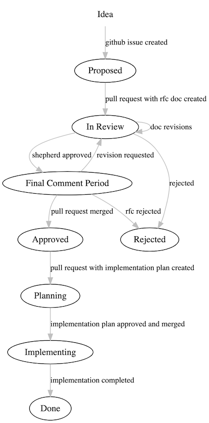

# AWS CDK RFCs

This repo is a place to propose and track major upcoming changes to [AWS CDK], [jsii], and
other related projects. It also is a great place to learn about the current and
future state of the libraries and to discover projects for contribution.

[AWS CDK]: https://github.com/aws/aws-cdk
[jsii]: https://github.com/aws/jsii

**Jump to**: [What is an RFC?](#what-is-an-rfc) |
[When to submit?](#when-to-submit-an-rfc) |
[RFC Process](#rfc-process) |
[RFC Life Cycle](#the-rfc-life-cycle)

<!--BEGIN_TABLE-->
\#|Title|Owner|Status
---|-----|-----|------
[71](https://github.com/aws/aws-cdk-rfcs/issues/71)|[Deployment Triggers](https://github.com/aws/aws-cdk-rfcs/issues/71)|[@eladb](https://github.com/eladb)|👷 implementing
[79](https://github.com/aws/aws-cdk-rfcs/issues/79)|[CDK v2.0](https://github.com/aws/aws-cdk-rfcs/blob/master/text/0079-cdk-2.0.md)|[@nija-at](https://github.com/nija-at)|👷 implementing
[204](https://github.com/aws/aws-cdk-rfcs/issues/204)|[JSII Go Support](https://github.com/aws/aws-cdk-rfcs/blob/master/text/204-golang-bindings.md)|[@MrArnoldPalmer](https://github.com/MrArnoldPalmer)|👷 implementing
[249](https://github.com/aws/aws-cdk-rfcs/issues/249)|[Experimental Code in CDK v2](https://github.com/aws/aws-cdk-rfcs/blob/master/text/0249-v2-experiments.md)|[@ericzbeard](https://github.com/ericzbeard)|👷 implementing
[253](https://github.com/aws/aws-cdk-rfcs/issues/253)|[CDK Metadata v2](https://github.com/aws/aws-cdk-rfcs/blob/master/text/0253-cdk-metadata-v2.md)||👷 implementing
[324](https://github.com/aws/aws-cdk-rfcs/issues/324)|[Construct Hub](https://github.com/aws/aws-cdk-rfcs/issues/324)|[@RomainMuller](https://github.com/RomainMuller)|👷 implementing
[328](https://github.com/aws/aws-cdk-rfcs/issues/328)|[polyglot assert library](https://github.com/aws/aws-cdk-rfcs/blob/master/text/0328-polyglot-assert.md)|[@nija-at](https://github.com/nija-at)|👷 implementing
[193](https://github.com/aws/aws-cdk-rfcs/issues/193)|[Fixing of type unions](https://github.com/aws/aws-cdk-rfcs/pull/194)|[@RomainMuller](https://github.com/RomainMuller)|⏰ final comments
[8](https://github.com/aws/aws-cdk-rfcs/issues/8)|[Project Structure Guidelines](https://github.com/aws/aws-cdk-rfcs/issues/8)|[@rix0rrr](https://github.com/rix0rrr)|✍️ review
[18](https://github.com/aws/aws-cdk-rfcs/issues/18)|[Open Context Providers](https://github.com/aws/aws-cdk-rfcs/pull/167)|[@ddneilson](https://github.com/ddneilson)|✍️ review
[77](https://github.com/aws/aws-cdk-rfcs/issues/77)|[CloudFormation Registry Support](https://github.com/aws/aws-cdk-rfcs/pull/266)||✍️ review
[175](https://github.com/aws/aws-cdk-rfcs/issues/175)|[AppSync Mapping Template Object Model](https://github.com/aws/aws-cdk-rfcs/pull/177)|[@MrArnoldPalmer](https://github.com/MrArnoldPalmer)|✍️ review
[317](https://github.com/aws/aws-cdk-rfcs/issues/317)|[CDK third-party dependencies management](https://github.com/aws/aws-cdk-rfcs/issues/317)|[@skinny85](https://github.com/skinny85)|✍️ review
[1](https://github.com/aws/aws-cdk-rfcs/issues/1)|[CDK Watch](https://github.com/aws/aws-cdk-rfcs/issues/1)||💡 proposed
[2](https://github.com/aws/aws-cdk-rfcs/issues/2)|[Support for CloudFormation Resource Imports](https://github.com/aws/aws-cdk-rfcs/issues/2)||💡 proposed
[4](https://github.com/aws/aws-cdk-rfcs/issues/4)|[CDK Testing Toolkit](https://github.com/aws/aws-cdk-rfcs/issues/4)|[@nija-at](https://github.com/nija-at)|💡 proposed
[5](https://github.com/aws/aws-cdk-rfcs/issues/5)|[Security-restricted environments](https://github.com/aws/aws-cdk-rfcs/issues/5)||💡 proposed
[9](https://github.com/aws/aws-cdk-rfcs/issues/9)|[Master developer guide sources in main repo](https://github.com/aws/aws-cdk-rfcs/issues/9)||💡 proposed
[10](https://github.com/aws/aws-cdk-rfcs/issues/10)|[New workshop modules](https://github.com/aws/aws-cdk-rfcs/issues/10)||💡 proposed
[13](https://github.com/aws/aws-cdk-rfcs/issues/13)|[Improvements to Reference docs](https://github.com/aws/aws-cdk-rfcs/issues/13)||💡 proposed
[14](https://github.com/aws/aws-cdk-rfcs/issues/14)|[Toolchain 2.0](https://github.com/aws/aws-cdk-rfcs/issues/14)|[@shivlaks](https://github.com/shivlaks)|💡 proposed
[15](https://github.com/aws/aws-cdk-rfcs/issues/15)|[Scaffolding](https://github.com/aws/aws-cdk-rfcs/issues/15)||💡 proposed
[17](https://github.com/aws/aws-cdk-rfcs/issues/17)|[CLI support for multiple-environments](https://github.com/aws/aws-cdk-rfcs/issues/17)||💡 proposed
[19](https://github.com/aws/aws-cdk-rfcs/issues/19)|[Introspection API](https://github.com/aws/aws-cdk-rfcs/issues/19)||💡 proposed
[20](https://github.com/aws/aws-cdk-rfcs/issues/20)|[Security posture summary](https://github.com/aws/aws-cdk-rfcs/issues/20)||💡 proposed
[21](https://github.com/aws/aws-cdk-rfcs/issues/21)|[CDK Explorer Roadmap](https://github.com/aws/aws-cdk-rfcs/issues/21)||💡 proposed
[22](https://github.com/aws/aws-cdk-rfcs/issues/22)|[Cost calculator](https://github.com/aws/aws-cdk-rfcs/issues/22)||💡 proposed
[23](https://github.com/aws/aws-cdk-rfcs/issues/23)|[Stateful resource support](https://github.com/aws/aws-cdk-rfcs/issues/23)||💡 proposed
[24](https://github.com/aws/aws-cdk-rfcs/issues/24)|[Resource imports](https://github.com/aws/aws-cdk-rfcs/issues/24)||💡 proposed
[25](https://github.com/aws/aws-cdk-rfcs/issues/25)|[Defaults & configuration policy](https://github.com/aws/aws-cdk-rfcs/issues/25)||💡 proposed
[26](https://github.com/aws/aws-cdk-rfcs/issues/26)|[Monitoring packs](https://github.com/aws/aws-cdk-rfcs/issues/26)||💡 proposed
[27](https://github.com/aws/aws-cdk-rfcs/issues/27)|[200 resource limit tools & guidance](https://github.com/aws/aws-cdk-rfcs/issues/27)||💡 proposed
[30](https://github.com/aws/aws-cdk-rfcs/issues/30)|[Improve synthesized template output](https://github.com/aws/aws-cdk-rfcs/issues/30)||💡 proposed
[31](https://github.com/aws/aws-cdk-rfcs/issues/31)|[Integration tests](https://github.com/aws/aws-cdk-rfcs/issues/31)||💡 proposed
[32](https://github.com/aws/aws-cdk-rfcs/issues/32)|[App-centric operational experience](https://github.com/aws/aws-cdk-rfcs/issues/32)||💡 proposed
[34](https://github.com/aws/aws-cdk-rfcs/issues/34)|[Third-party construct ecosystem](https://github.com/aws/aws-cdk-rfcs/issues/34)||💡 proposed
[39](https://github.com/aws/aws-cdk-rfcs/issues/39)|[Release public artifacts (lambda layers for custom resources, docker images)](https://github.com/aws/aws-cdk-rfcs/issues/39)||💡 proposed
[40](https://github.com/aws/aws-cdk-rfcs/issues/40)|[Stack traces across language boundaries](https://github.com/aws/aws-cdk-rfcs/issues/40)||💡 proposed
[48](https://github.com/aws/aws-cdk-rfcs/issues/48)|[Faster builds](https://github.com/aws/aws-cdk-rfcs/issues/48)||💡 proposed
[51](https://github.com/aws/aws-cdk-rfcs/issues/51)|[Standardize security groups](https://github.com/aws/aws-cdk-rfcs/issues/51)||💡 proposed
[52](https://github.com/aws/aws-cdk-rfcs/issues/52)|[Support resource import](https://github.com/aws/aws-cdk-rfcs/issues/52)||💡 proposed
[58](https://github.com/aws/aws-cdk-rfcs/issues/58)|[Improved ergonomics for stack default environment](https://github.com/aws/aws-cdk-rfcs/issues/58)||💡 proposed
[63](https://github.com/aws/aws-cdk-rfcs/issues/63)|[CDK in Secure Environments](https://github.com/aws/aws-cdk-rfcs/issues/63)||💡 proposed
[64](https://github.com/aws/aws-cdk-rfcs/issues/64)|[Garbage Collection for Assets](https://github.com/aws/aws-cdk-rfcs/issues/64)||💡 proposed
[65](https://github.com/aws/aws-cdk-rfcs/issues/65)|[CDK Code Generation from AWS Console](https://github.com/aws/aws-cdk-rfcs/issues/65)||💡 proposed
[66](https://github.com/aws/aws-cdk-rfcs/issues/66)|[StackSets Support](https://github.com/aws/aws-cdk-rfcs/issues/66)||💡 proposed
[67](https://github.com/aws/aws-cdk-rfcs/issues/67)|[Monitoring Packs](https://github.com/aws/aws-cdk-rfcs/issues/67)||💡 proposed
[69](https://github.com/aws/aws-cdk-rfcs/issues/69)|[One-off "job" Stacks ("auto destruct")](https://github.com/aws/aws-cdk-rfcs/issues/69)||💡 proposed
[70](https://github.com/aws/aws-cdk-rfcs/issues/70)|[Cost Estimation Tools](https://github.com/aws/aws-cdk-rfcs/issues/70)||💡 proposed
[72](https://github.com/aws/aws-cdk-rfcs/issues/72)|[Stack Policy](https://github.com/aws/aws-cdk-rfcs/issues/72)||💡 proposed
[73](https://github.com/aws/aws-cdk-rfcs/issues/73)|[AWS Resource Model](https://github.com/aws/aws-cdk-rfcs/issues/73)||💡 proposed
[74](https://github.com/aws/aws-cdk-rfcs/issues/74)|[Common API for Resources with Web Addresses](https://github.com/aws/aws-cdk-rfcs/issues/74)||💡 proposed
[78](https://github.com/aws/aws-cdk-rfcs/issues/78)|[Feature proposal: Workspaces](https://github.com/aws/aws-cdk-rfcs/issues/78)||💡 proposed
[81](https://github.com/aws/aws-cdk-rfcs/issues/81)|[AWS Landing Zone CDK pattern request](https://github.com/aws/aws-cdk-rfcs/issues/81)||💡 proposed
[82](https://github.com/aws/aws-cdk-rfcs/issues/82)|[Weak references](https://github.com/aws/aws-cdk-rfcs/issues/82)||💡 proposed
[83](https://github.com/aws/aws-cdk-rfcs/issues/83)|[Global Name Prefix](https://github.com/aws/aws-cdk-rfcs/issues/83)||💡 proposed
[86](https://github.com/aws/aws-cdk-rfcs/issues/86)|[AWS Account Alias Resource](https://github.com/aws/aws-cdk-rfcs/issues/86)||💡 proposed
[116](https://github.com/aws/aws-cdk-rfcs/issues/116)|[Easier identification of experimental modules](https://github.com/aws/aws-cdk-rfcs/issues/116)|[@rix0rrr](https://github.com/rix0rrr)|💡 proposed
[127](https://github.com/aws/aws-cdk-rfcs/issues/127)|[CDK to directly reference/import/update an existing stack](https://github.com/aws/aws-cdk-rfcs/issues/127)||💡 proposed
[139](https://github.com/aws/aws-cdk-rfcs/issues/139)|["fromLookup" for additional resources](https://github.com/aws/aws-cdk-rfcs/issues/139)||💡 proposed
[158](https://github.com/aws/aws-cdk-rfcs/issues/158)|[Implement Custom Resources in the AWS Construct Library as CFN Registry Resource Types](https://github.com/aws/aws-cdk-rfcs/pull/170)||💡 proposed
[159](https://github.com/aws/aws-cdk-rfcs/issues/159)|[Cross-App Resource Sharing](https://github.com/aws/aws-cdk-rfcs/issues/159)||💡 proposed
[161](https://github.com/aws/aws-cdk-rfcs/issues/161)|[Cross-Region/Account References](https://github.com/aws/aws-cdk-rfcs/issues/161)||💡 proposed
[162](https://github.com/aws/aws-cdk-rfcs/issues/162)|[CDK Refactoring Tools](https://github.com/aws/aws-cdk-rfcs/issues/162)||💡 proposed
[180](https://github.com/aws/aws-cdk-rfcs/issues/180)|[CustomResources: Allow usage across accounts](https://github.com/aws/aws-cdk-rfcs/issues/180)||💡 proposed
[201](https://github.com/aws/aws-cdk-rfcs/issues/201)|[Construct scope relocation](https://github.com/aws/aws-cdk-rfcs/issues/201)||💡 proposed
[217](https://github.com/aws/aws-cdk-rfcs/issues/217)|[Alternative Infrastructure Providers](https://github.com/aws/aws-cdk-rfcs/issues/217)|[@ccfife](https://github.com/ccfife)|💡 proposed
[219](https://github.com/aws/aws-cdk-rfcs/issues/219)|[ECS Patterns Service Builder](https://github.com/aws/aws-cdk-rfcs/issues/219)||💡 proposed
[223](https://github.com/aws/aws-cdk-rfcs/issues/223)|[Improvements to Lambda Development Experience](https://github.com/aws/aws-cdk-rfcs/issues/223)||💡 proposed
[228](https://github.com/aws/aws-cdk-rfcs/issues/228)|[CDK CLI Triggers](https://github.com/aws/aws-cdk-rfcs/issues/228)||💡 proposed
[229](https://github.com/aws/aws-cdk-rfcs/issues/229)|[Construct library pattern for metrics](https://github.com/aws/aws-cdk-rfcs/issues/229)||💡 proposed
[230](https://github.com/aws/aws-cdk-rfcs/issues/230)|[Construct library pattern for grants](https://github.com/aws/aws-cdk-rfcs/issues/230)||💡 proposed
[231](https://github.com/aws/aws-cdk-rfcs/issues/231)|[Construct library pattern for resources that use a VPC](https://github.com/aws/aws-cdk-rfcs/issues/231)||💡 proposed
[232](https://github.com/aws/aws-cdk-rfcs/issues/232)|[Construct library pattern for resources that need IAM roles](https://github.com/aws/aws-cdk-rfcs/issues/232)||💡 proposed
[242](https://github.com/aws/aws-cdk-rfcs/issues/242)|[Bootstrap stacks as CDK apps](https://github.com/aws/aws-cdk-rfcs/issues/242)||💡 proposed
[244](https://github.com/aws/aws-cdk-rfcs/issues/244)|[Migration path for EKS Developer Preview](https://github.com/aws/aws-cdk-rfcs/pull/245)||💡 proposed
[247](https://github.com/aws/aws-cdk-rfcs/issues/247)|[CDK Common Stored Data Type Model](https://github.com/aws/aws-cdk-rfcs/issues/247)||💡 proposed
[248](https://github.com/aws/aws-cdk-rfcs/issues/248)|[Standardized context key for "cheap mode"](https://github.com/aws/aws-cdk-rfcs/issues/248)||💡 proposed
[256](https://github.com/aws/aws-cdk-rfcs/issues/256)|[ReactCDK: Add JSX/TSX Support](https://github.com/aws/aws-cdk-rfcs/pull/258)||💡 proposed
[272](https://github.com/aws/aws-cdk-rfcs/issues/272)|[CI/CD to Cloudfront Deploy](https://github.com/aws/aws-cdk-rfcs/issues/272)||💡 proposed
[275](https://github.com/aws/aws-cdk-rfcs/issues/275)|[route53-patterns for cross account DNS delegation](https://github.com/aws/aws-cdk-rfcs/issues/275)||💡 proposed
[277](https://github.com/aws/aws-cdk-rfcs/issues/277)|[cdk logs](https://github.com/aws/aws-cdk-rfcs/issues/277)||💡 proposed
[282](https://github.com/aws/aws-cdk-rfcs/issues/282)|[CDK Pipelines security posture change approvals](https://github.com/aws/aws-cdk-rfcs/issues/282)||💡 proposed
[287](https://github.com/aws/aws-cdk-rfcs/issues/287)|[Deprecated API Warnings](https://github.com/aws/aws-cdk-rfcs/blob/master/text/287-cli-deprecation-warnings.md)|[@skinny85](https://github.com/skinny85)|💡 proposed
[294](https://github.com/aws/aws-cdk-rfcs/issues/294)|[Policy Definition and Enforcement](https://github.com/aws/aws-cdk-rfcs/issues/294)||💡 proposed
[300](https://github.com/aws/aws-cdk-rfcs/issues/300)|[Programmatic Access of CDK CLI Capabilities](https://github.com/aws/aws-cdk-rfcs/issues/300)||💡 proposed
[305](https://github.com/aws/aws-cdk-rfcs/issues/305)|[support code signing of assets](https://github.com/aws/aws-cdk-rfcs/issues/305)||💡 proposed
[308](https://github.com/aws/aws-cdk-rfcs/issues/308)|[CLI displays advisories](https://github.com/aws/aws-cdk-rfcs/issues/308)||💡 proposed
[309](https://github.com/aws/aws-cdk-rfcs/issues/309)|[Parameter Store for cross stack references](https://github.com/aws/aws-cdk-rfcs/issues/309)||💡 proposed
[313](https://github.com/aws/aws-cdk-rfcs/issues/313)|[Questions on the Go Bindings RFC](https://github.com/aws/aws-cdk-rfcs/issues/313)||💡 proposed
[322](https://github.com/aws/aws-cdk-rfcs/issues/322)|[CDK Pipelines Updated API](https://github.com/aws/aws-cdk-rfcs/issues/322)||💡 proposed
[332](https://github.com/aws/aws-cdk-rfcs/issues/332)|[Self Managed Stack Set Deployment Support](https://github.com/aws/aws-cdk-rfcs/issues/332)||💡 proposed
[6](https://github.com/aws/aws-cdk-rfcs/issues/6)|[Monolithic Packaging](https://github.com/aws/aws-cdk-rfcs/blob/master/text/0006-monolothic-packaging.md)|[@RomainMuller](https://github.com/RomainMuller)|✅ done
[7](https://github.com/aws/aws-cdk-rfcs/issues/7)|[Lambda Bundles](https://github.com/aws/aws-cdk-rfcs/issues/7)||✅ done
[16](https://github.com/aws/aws-cdk-rfcs/issues/16)|[RFC Process](https://github.com/aws/aws-cdk-rfcs/pull/53)|[@MrArnoldPalmer](https://github.com/MrArnoldPalmer)|✅ done
[35](https://github.com/aws/aws-cdk-rfcs/issues/35)|[Publish construct library guidelines](https://github.com/aws/aws-cdk-rfcs/issues/35)||✅ done
[36](https://github.com/aws/aws-cdk-rfcs/issues/36)|[Constructs Programming Model](https://github.com/aws/aws-cdk-rfcs/issues/36)||✅ done
[37](https://github.com/aws/aws-cdk-rfcs/issues/37)|[Release from a "release" branch](https://github.com/aws/aws-cdk-rfcs/issues/37)|[@MrArnoldPalmer](https://github.com/MrArnoldPalmer)|✅ done
[49](https://github.com/aws/aws-cdk-rfcs/issues/49)|[CI/CD for CDK apps](https://github.com/aws/aws-cdk-rfcs/blob/master/text/0049-continuous-delivery.md)|[@rix0rrr](https://github.com/rix0rrr)|✅ done
[55](https://github.com/aws/aws-cdk-rfcs/issues/55)|[Feature Flags](https://github.com/aws/aws-cdk-rfcs/blob/master/text/0055-feature-flags.md)||✅ done
[92](https://github.com/aws/aws-cdk-rfcs/issues/92)|[CI/CD Asset Publishing](https://github.com/aws/aws-cdk-rfcs/blob/master/text/0092-asset-publishing.md)|[@rix0rrr](https://github.com/rix0rrr)|✅ done
[95](https://github.com/aws/aws-cdk-rfcs/issues/95)|[Cognito Construct Library](https://github.com/aws/aws-cdk-rfcs/blob/master/text/0095-cognito-construct-library)|[@nija-at](https://github.com/nija-at)|✅ done
[107](https://github.com/aws/aws-cdk-rfcs/issues/107)|[Publish a Construct Library Module Lifecycle document](https://github.com/aws/aws-cdk-rfcs/blob/master/text/0107-construct-library-module-lifecycle.md)|[@ccfife](https://github.com/ccfife)|✅ done
[110](https://github.com/aws/aws-cdk-rfcs/issues/110)|[CLI Compatibility Strategy](https://github.com/aws/aws-cdk-rfcs/blob/master/text/00110-cli-framework-compatibility-strategy.md)|[@iliapolo](https://github.com/iliapolo)|✅ done
[171](https://github.com/aws/aws-cdk-rfcs/issues/171)|[CloudFront Module Redesign](https://github.com/aws/aws-cdk-rfcs/blob/master/text/0171-cloudfront-redesign.md)|[@njlynch](https://github.com/njlynch)|✅ done
[192](https://github.com/aws/aws-cdk-rfcs/issues/192)|[Removal of the "constructs" compatibility layer (v2.0)](https://github.com/aws/aws-cdk-rfcs/blob/master/text/0192-remove-constructs-compat.md)|[@eladb](https://github.com/eladb)|✅ done
[60](https://github.com/aws/aws-cdk-rfcs/issues/60)|[Bazel Build System](https://github.com/aws/aws-cdk-rfcs/pull/61)||👎 rejected
[164](https://github.com/aws/aws-cdk-rfcs/issues/164)|[Construct Library Segments](https://github.com/aws/aws-cdk-rfcs/pull/169)|[@nija-at](https://github.com/nija-at)|👎 rejected
<!--END_TABLE-->

## What is an RFC?

An RFC is a document that proposes a change to one of the projects led by the
CDK team at AWS. *Request for Comments* means a request for discussion and
oversight about the future of the project from maintainers, contributors and
users.

**When to submit an RFC?** Anyone can submit an RFC for *any* change, big or
small, if they wish to obtain early feedback before they dive into
implementation. In some cases, especially for major features, the core team will
require that an RFC will be submitted. Quite often, even changes that seem
obvious and simple can be significantly improved once a wider group of
interested people have a chance to weigh in.

> If you're not sure whether your change requires an RFC, feel free to create an
issue and ask.

## RFC Process

To kick off an RFC process, simply create a [new tracking issue] and follow the
instructions in the template. The issue includes a checklist of the various
stages an RFC goes through.

[new tracking issue]: https://github.com/aws/aws-cdk-rfcs/issues/new?assignees=&labels=management%2Ftracking%2C+status%2Fproposed&template=tracking-issue.md&title=proposal+title

This section describes each stage in detail, so you can refer to it for
guidance.

### 1. Create a tracking issue

Each RFC has a GitHub issue that tracks it from start to finish. The issue is
the hub for conversations, community signal (+1s) and the issue number is used
as the unique identifier of this RFC.

> Before creating a tracking issue, please search for similar or related ideas in
the RFC table above or in the issue list of this repo. If there is a relevant
RFC, collaborate on that existing RFC, based on its current stage.

Our [tracking issue template] includes a checklist of all the steps an RFC goes
through and it's the driver's responsibility to update the checklist and assign
the correct label to on the RFC throughout the process.

[tracking issue template]: https://github.com/aws/aws-cdk-rfcs/blob/master/.github/ISSUE_TEMPLATE/tracking-issue.md

When the issue is created, it is required to fill in the following information:

1. **Title**: the name of the feature or change - think changelog entry.
2. **Description**: a _short_ description of feature, as if it was already implemented.
3. **Proposed by**: fill in the GitHub alias of the person who proposed the idea
   under "Proposed by".

### 2. Identify roles and responsibilities

Each RFC has a __driver__, __approver(s)__ and __stakeholders__.

The __driver__ is the person responsible to drive this RFC to completion. This
does __not__ mean that the driver must be the person actually doing all the
work, but it is the person responsible to get the RFC through the finish line.

__Approvers__ are the people that have the authority to approve the RFC and any
subsequent changes to it. Approvers have the final word if we cannot reach
consensus.

__Stakeholders__ are people (internal/external) who may be impacted by this RFC
or work on similar domains or projects. The goal is to make sure that
stakeholders have an opportunity to influence the direction of the RFC in
various stages of the process.

The driver is responsible to update the **Roles** table in the tracking issue.

### 3. Organize a kick-off meeting

Before diving into writing the RFC, it is highly recommended to organize a
kick-off meeting that includes the driver, approver(s) and stakeholders. The
goal of the meeting is to discuss the feature, its scope and general direction
for implementation.

Our experience shows that such a meeting can save a lot of time and energy.

Use the tracking issue to record any ideas and decisions from the kick-off
meeting and update the issue checklist to indicate that the kick-off meeting has
happened,

### 4. Write RFC document and implement prototype

The next step is to write the first revision of the RFC document itself.

**Document**: Use the file [0000-template.md](./0000-template.md) as a template
and put your new RFC under `text/NNNN-name.md` (where `NNNN` is your tracking
issue number).

Follow the template. It includes useful guidance and tips on how to write a good RFC.

**Prototype**: in many cases, it is useful to develop a prototype or even start
coding the actual implementation while you are writing the RFC document. Take
into account that you may need to throw your code away or refactor it
substantially, but our experience shows that good RFCs are the ones who dive
into the details. A prototype is great way to make sure your design "holds
water".

Submit the RFC document as a pull request in this repo and start collecting
feedback.

### 5. Invite community to review

The whole point of the RFC is to get feedback ("request for comments"). Once you
have an initial version submitted as a pull request, it is time to reach out to
the community and any relevant stakeholders and solicit their feedback.

Use the [cdk.dev](https://cdk.dev) Slack workspace, Twitter and any other
relevant forum to publish your RFC and ask the community to provide their
feedback.

### 6. Iterate on the RFC document

This is where the fun begins. Once you start receiving feedback on your pull request,
iterate on your document. Take time to read the comments, understand where people are coming
from, respond politely and iterate.

A few tips:

- If you decide to resolve a comment without addressing it, take the time to explain.
- Try to understand where people are coming from. If a comment seems off, ask folks to elaborate and
  describe their use case or provide concrete examples.
- Work with your approver(s): if there are disagreements, @mention them in a comment and ask them
  to provide their opinion.
- Be patient: it sometimes takes time for an RFC to converge. Our experience shows that some ideas
  need to "bake" and solutions oftentimes emerge via a healthy debate. We've had RFCs that took
  months to resolve.
- Not everything must be resolved in the first revision. It is okay to leave
  some things to resolve later. Make sure to capture them clearly and have an
  agreement about that. We oftentimes update an RFC doc a few times during the
  implementation.

### 7. Final Comments Period

At some point, you've reached consensus about most issues that were brought up
during the review period. In consultation with the approvers, a driver can
announce that the RFC enters "final comments period", which means that within a
~week, if no major concerns are raised, the RFC will be approved and merged.

Add a comment on the RFC pull request and tracking issue that the RFC entered
this stage so that all relevant stakeholders will be notified.

### 8. Obtain final approval

Once the final comments period is over, and the author has made final edits, the
RFC can be approved by the approvers and merged into the repository.

NOTE: only RFCs that were approved by approvers should be merged.

### 9. Implementation

For large changes, we highly recommend creating an implementation plan which
lists all the tasks required. In many cases, large implementation  should be
broken down and released via multiple iterations. Devising a concrete plan to
break down the break can be very helpful.

The implementation plan should be submitted through a PR that adds an addendum
to the RFC document and seeks the approval of any relevant stakeholders.

Throughout this process, update the tracking issue:

- Add the alias of the "implementation lead"
- Execution plan submitted (label: `status/planning`)
- Plan approved and merged (label: `status/implementing`)
- Implementation complete (label: `status/done`)

## State Diagram

The following state diagram describes the RFC process:

<!--
digraph states {
    node [shape=ellipse];
    edge [color=gray, fontsize=12]
    
    idea [label = "Idea", shape = plaintext]
    proposed [label = "Proposed"];
    review [label = "In Review"];
    fcp [label = "Final Comment Period"];
    approved [label = "Approved"];
    plannning [label = "Planning"];
    implementing [label = "Implementing"];
    done [label = "Done"];
    rejected [label = "Rejected"];
    
    idea -> proposed [label = "github issue created"]
    proposed -> review [label = "pull request with rfc doc created"];
    review -> review [label = "doc revisions"];
    review -> fcp [label = "shepherd approved"];
    review -> rejected [label = "rejected"];
    fcp -> review [label = "revision requested"];
    fcp -> approved [label = "pull request approved and merged"];
    fcp -> rejected [label = "rfc rejected"];
    approved -> plannning [label = "pull request with implementation plan created"];
    plannning -> implementing [label = "rfc with implementation plan approved and merged"];
    implementing -> done [label = "implementation completed"];
}  
-->

1. **Proposed** - A tracking issue has been created with a basic outline of the
   proposal.
2. **Review** - An RFC document has been written with a detailed design and a PR is
   under review. At this point the PR will be assigned a **shepherd** from the core
   team.
3. **Final Comment Period** - The shepherd has approved the RFC PR, and announces
   that the RFC enters a period for final comments before it will be approved (~1wk).
   At this stage, if major issues are raised, the RFC may return to **Review**.
4. **Approved** - The RFC PR is approved and merged to `master`, and the RFC is now
   ready to be implemented.
5. **Planning** - A PR is created with the **Implementation Plan** section of the RFC.
6. **Implementing** - Implemetation plan is approved and merged and the RFC is actively
   being implemented.
7. **Done** - Implementation is complete and merged across appropriate
   repositories.
8. **Rejected** - During the review period, the RFC may be rejected and then it will
   be marked as such.

---

AWS CDK's RFC process owes its inspiration to the [Yarn RFC process], [Rust
RFC process], [React RFC process], and [Ember RFC process]

[yarn rfc process]: https://github.com/yarnpkg/rfcs
[rust rfc process]: https://github.com/rust-lang/rfcs
[react rfc process]: https://github.com/reactjs/rfcs
[ember rfc process]: https://github.com/emberjs/rfcs
