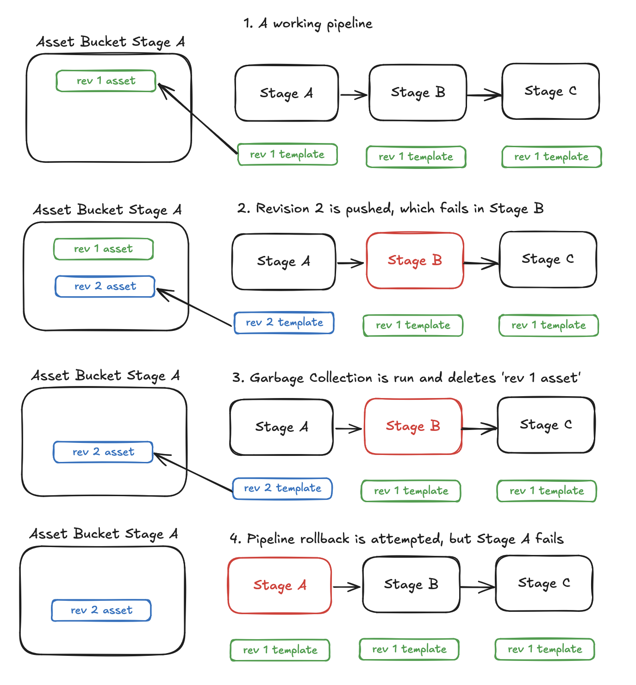
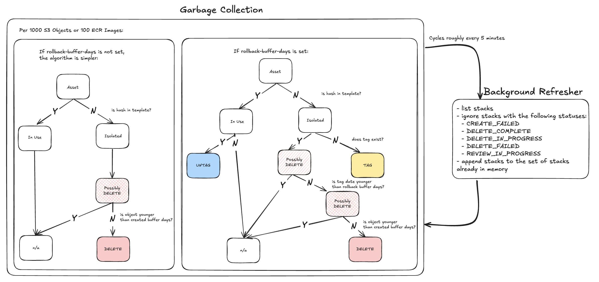

# Garbage Collection for Assets

* **Original Author(s):**: @eladb, @kaizencc
* **Tracking Issue**: #64
* **API Bar Raiser**: @rix0rrr

The asset garbage collection CLI will identify and/or delete unused CDK assets,
resulting in smaller bucket/repo size and less cost for customers.

## Working Backwards

**CHANGELOG**:

- feat(cli): garbage collect s3 assets (under --unstable flag)
- feat(cli): garbage collect ecr assets (under --unstable flag)

**Help**:

```shell
➜ cdk gc --help
cdk gc [ENVIRONMENT...]

Finds and deletes all unused S3 and ECR assets in the ENVIRONMENT

Options:
  --type=[s3|ecr|all]                       filters for type of asset
  --action=[print|tag|delete-tagged|full]   type of action to perform on unused assets
  --rollback-buffer-days=number             number of days an asset should be isolated before deletion
  --created-buffer-days=number              number of days old an asset must be before its elligible for deletion
  --bootstrap-stack-name=string             name of a custom bootstrap stack if not CDK Toolkit
  --confirm=boolean                         confirm with user before deleting assets

Examples:
  cdk gc
  cdk gc aws://ACCOUNT/REGION
  cdk gc --type=s3 --action=delete-tagged
```

**README:**

> [!CAUTION]
> CDK Garbage Collection is under development and therefore must be opted in via the `--unstable` flag: `cdk gc --unstable=gc`.

`cdk gc` garbage collects unused assets from your bootstrap bucket via the following mechanism:

- for each object in the bootstrap S3 Bucket, check to see if it is referenced in any existing CloudFormation templates
- if not, it is treated as unused and gc will either tag it or delete it, depending on your configuration.

The high-level mechanism works identically for unused assets in bootstrapped ECR Repositories.

The most basic usage looks like this:

```console
cdk gc --unstable=gc
```

This will garbage collect all unused assets in all environments of the existing CDK App.

To specify one type of asset, use the `type` option (options are `all`, `s3`, `ecr`):

```console
cdk gc --unstable=gc --type=s3
```

Otherwise `cdk gc` defaults to collecting assets in both the bootstrapped S3 Bucket and ECR Repository.

`cdk gc` will garbage collect S3 and ECR assets from the current bootstrapped environment(s) and immediately
delete them. Note that, since the default bootstrap S3 Bucket is versioned, object deletion will be handled by
the lifecycle policy on the bucket.

Before we begin to delete your assets, you will be prompted:

```console
cdk gc --unstable=gc

Found X objects to delete based off of the following criteria:
- objects have been isolated for > 0 days
- objects were created > 1 days ago

Delete this batch (yes/no/delete-all)?
```

Since it's quite possible that the bootstrap bucket has many objects, we work in batches of 1000 objects or 100 images.
To skip the prompt either reply with `delete-all`, or use the `--confirm=false` option.

```console
cdk gc --unstable=gc --confirm=false
```

If you are concerned about deleting assets too aggressively, there are multiple levers you can configure:

- rollback-buffer-days: this is the amount of days an asset has to be marked as isolated before it is elligible for deletion.
- created-buffer-days: this is the amount of days an asset must live before it is elligible for deletion.

When using `rollback-buffer-days`, instead of deleting unused objects, `cdk gc` will tag them with
today's date instead. It will also check if any objects have been tagged by previous runs of `cdk gc`
and delete them if they have been tagged for longer than the buffer days.

When using `created-buffer-days`, we simply filter out any assets that have not persisted that number
of days.

```console
cdk gc --unstable=gc --rollback-buffer-days=30 --created-buffer-days=1
```

You can also configure the scope that `cdk gc` performs via the `--action` option. By default, all actions
are performed, but you can specify `print`, `tag`, or `delete-tagged`.

- `print` performs no changes to your AWS account, but finds and prints the number of unused assets.
- `tag` tags any newly unused assets, but does not delete any unused assets.
- `delete-tagged` deletes assets that have been tagged for longer than the buffer days, but does not tag newly unused assets.

```console
cdk gc --unstable=gc --action=delete-tagged --rollback-buffer-days=30
```

This will delete assets that have been unused for >30 days, but will not tag additional assets.

### Theoretical Race Condition with `REVIEW_IN_PROGRESS` stacks

When gathering stack templates, we are currently ignoring `REVIEW_IN_PROGRESS` stacks as no template
is available during the time the stack is in that state. However, stacks in `REVIEW_IN_PROGRESS` have already
passed through the asset uploading step, where it either uploads new assets or ensures that the asset exists.
Therefore it is possible the assets it references are marked as isolated and garbage collected before the stack
template is available.

Our recommendation is to not deploy stacks and run garbage collection at the same time. If that is unavoidable,
setting `--created-buffer-days` will help as garbage collection will avoid deleting assets that are recently
created. Finally, if you do result in a failed deployment, the mitigation is to redeploy, as the asset upload step
will be able to reupload the missing asset.

In practice, this race condition is only for a specific edge case and unlikely to happen but please open an
issue if you think that this has happened to your stack.

---

#

Ticking the box below indicates that the public API of this RFC has been
signed-off by the API bar raiser (the `api-approved` label was applied to the
RFC pull request):

```
[ ] Signed-off by API Bar Raiser @rix0rrr
```

## Public FAQ

### What are we launching today?

The `cdk gc` command features, with support for garbage collection of unused S3 and ECR
assets.

### Why should I use this feature?

Currently unused assets are left in the S3 bucket or ECR repository and contribute
additional cost for customers. This feature provides a swift way to identify and delete
unutilized assets.

### How does the command identify unused assets?

`cdk gc` will look at all the deployed stacks in the environment and store the
assets that are being referenced by these stacks. All assets that are not reached via
tracing are determined to be unused.

#### A note on pipeline rollbacks and the `--rollback-buffer-days` option

In some pipeline rollback scenarios, the default `cdk gc` options may be overzealous in
deleting assets. A CI/CD system that offers indeterminate rollbacks without redeploying
are expecting that previously deployed assets still exist. If `cdk gc` is run between
the failed deployment and the rollback, the asset will be garbage collected. To mitigate
this, we recommend the following setting: `--rollback-buffer-days=30`. This will ensure
that all assets spend 30 days tagged as "unused" _before_ they are deleted, and should
guard against even the most pessimistic of rollback scenarios.



## Internal FAQ

> The goal of this section is to help decide if this RFC should be implemented.
> It should include answers to questions that the team is likely ask. Contrary
> to the rest of the RFC, answers should be written "from the present" and
> likely discuss design approach, implementation plans, alternative considered
> and other considerations that will help decide if this RFC should be
> implemented.

### Why are we doing this?

As customers continue to adopt the CDK and grow their CDK applications over time, their
asset buckets/repositories grow as well. At least one customer has
[reported](<https://github.com/aws/aws-cdk-rfcs/issues/64#issuecomment-897548306>) 0.5TB of
assets in their staging bucket. Most of these assets are unused and can be safely removed.

### Why should we _not_ do this?

There is risk of removing assets that are in use, providing additional pain to the
customer. See [this](<https://github.com/aws/aws-cdk-rfcs/issues/64#issuecomment-833758638>)
github comment.

### What is the technical solution (design) of this feature?



At a high level, garbage collection consists of two parallel processes - refreshing CFN stack templates
in the background and garbage collecting objects/images in the foreground. CFN stack templates are queried
every ~5 minutes and stored in memory. Then we go through the bootstrapped bucket/repository and check if
the hash in the object's key exists in _any_ template.

If `--rollback-buffer-days` is set, we tag the object as isolated, otherwise we delete it immediately.
Also depending on if `--rollback-buffer-days` is set, we check if any isolated objects have previously
been marked as isolated and are ready to be deleted, and if any in-use assets are erroneously marked
as isolated that should be unmarked.

> Why are we storing the entire template in memory and not just the asset hashes?

We don't expect that the bottleneck for `cdk gc` is going to be memory storage but rather
the (potentially) large number of AWS API calls. Storing hashes alone opens up the possibility
of missing an asset hash an inadvertently deleting something in-use.

> What happens if we run `cdk deploy` (or `cdk destroy`) while `cdk gc` is in progress?

We mitigate this issue with the following redundancies:

- we refresh the in-memory state of CloudFormation Stacks periodically to catch any new or updated stacks
- as a baseline, we do not delete any assets that are created after `cdk gc` is started (and this can
be increased via the `--created-buffer-days` option)

> Are there any race conditions between the refresher and garbage collection?
Yes, a small one. Stacks in `REVIEW_IN_PROGRESS` do not yet have a template to query, but these stacks
have already gone through asset uploading. There is a theoretical situation where a previously isolated
asset is referenced by a `REVIEW_IN_PROGRESS` stack, and since we are unaware that that is happening,
we may delete the asset in the meantime. In practice though, I am not expecting this to be a frequent
scenario.

### Is this a breaking change?

No.

### What alternative solutions did you consider?

Eventually, a zero-touch solution where garbage collection makes scheduled runs in the
background is what users would want. However, `cdk gc` would be the building block for the
automated garbage collection, so it makes sense to start with a CLI experience and iterate
from there. After `cdk gc` stabilizes, we can vend a construct that runs periodically and
at some point add this to the bootstrapping stack.

### What are the drawbacks of this solution?

The main drawback is that we will own a CLI command capable of deleting assets in customer
accounts. They will rely on the correctness of the command to ensure that we are not deleting
in-use assets and crashing live applications.

### What is the high-level project plan?

`cdk gc` will trace all assets referenced by deployed stacks in the environment and delete
the assets that were not reached. As for how to implement this trace, I have not yet
settled on a plan. The command will focus on garbage collecting v2 assets, where there is a
separate S3 bucket and ECR repository in each boostrapped account. Preliminary thoughts are
that we can either search for a string pattern that represents an asset location or utilize
stack metadata that indicates which assets are being used.

### Are there any open issues that need to be addressed later?

No
