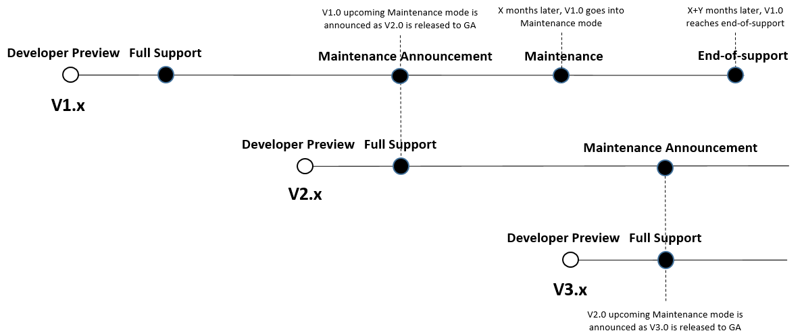

<!-- replace the blockquoted sections with your content -->

# Summary

This RFC details the strategy for building and releasing v2 of the AWS CDK, in addition to changes to tooling required
to support this strategy. For details on the specific features themselves, refer to the corresponding RFCs.

# Motivation

Since the CDK was announced as "generally available", the team has tried to limit breaking changes for users. However, a
handful of features have emerged that the core team believes will make the CDK significantly simpler to use. These
changes require a v2 release to signal to users that code changes may be required for adoption.

The main change of note is to consolidate all of the aws service construct libraries into a single package. The
motivation for this change is detailed in [the corresponding RFC](https://github.com/aws/aws-cdk-rfcs/issues/6).

The core motivation of this proposal is to detail the plan required to release this change while continuing to support
users referencing the v1 modules. In short, we want to make sure users have plenty of time to transition their code to
using the new module structure and make that transition as easy as possible.

# Scope

Since this is the first major version release since we announced General Availability of the AWS CDK, we will pay close
attention to which changes are scoped in for this release. The main criteria used to determine whether a change is
suitable for inclusion are:

- the change _requires_ breaking existing customers of the changed API or feature
  - a migration should be possible without incurring replacement of existing resources
- the change addresses a well documented customer pain point
- the change has had the due diligence done:
  - implications of the change are well documented
  - an implementation strategy is documented

## Changes considered for v2 inclusion

- The following changes will be included, or are candidates for inclusion:

  | Decision | RFC / Issue | Description                                                                         |
  | -------- | ----------- | ----------------------------------------------------------------------------------- |
  | ✅ In    |             | Remove `@deprecated` APIs from the previous major version                           |
  | ✅ In    | [RFC-55]    | Reset all feature flags from the previous major version                             |
  | ✅ In    | [RFC-6]     | Combine all AWS Construct Libraries into a single package                           |
  | ✅ In    | [RFC-192]   | Remove the _constructs compatibility layer_ in favor of using `constructs` directly |

* The following changes were scoped out because a solution is likely to be achievable without breaking existing
  customers:

  | Decision | RFC / Issue | Description                                                                |
  | -------- | ----------- | -------------------------------------------------------------------------- |
  | 🚫 Out   | [#39]       | Distribute lambda code for bundled custom resources via a public S3 bucket |
  | 🚫 Out   | [RFC-77]    | Generate CloudFormation Resources from the CloudFormation Registry schemas |
  | 🚫 Out   | [RFC-193]   | Fix API for TypeScript type unions when used in statically typed languages |
  | 🚫 Out   | [#116]      | Easier identification of `@experimental` modules and APIs                  |

* The following changes were scoped out because they can be achieved by introducing a new, fixed API, while deprecating
  the current one. If done _before_ v2 is released, this effectively means `v2` will only retain the new and improved
  API:

  | Decision | RFC / Issue    | Description                                                                           |
  | -------- | -------------- | ------------------------------------------------------------------------------------- |
  | 🚫 Out   | [aws-cdk#3930] | Remove custom-resource based implementation of the Fargate event target               |
  | 🚫 Out   | [aws-cdk#6966] | Decouple lambda's `AliasOptions` and `VersionOptions` from `EventInvokeConfigOptions` |
  | 🚫 Out   | _N/A_          | Remove support for Docker assets with parameters                                      |

* The following changes were excluded because they would likely make migration of existing applications from v1 to v2
  impossible, as they would likely lead to widespread replacement of existing resources (typically, because a new
  logical ID would be assigned to those):

  | Decision | RFC / Issue    | Description                                                           |
  | -------- | -------------- | --------------------------------------------------------------------- |
  | 🚫 Out   | [aws-cdk#1687] | Un-mangle logical IDs generated for high-level (a.k.a. L2) constructs |
  | 🚫 Out   | [aws-cdk#6421] | Change logical ID attribution to avoid potential collisions           |

* The following changes were excluded because the problem statement is too ambiguous or the solution not clear enough at
  this point:

  | Decision | RFC / Issue    | Description                                                                   |
  | -------- | -------------- | ----------------------------------------------------------------------------- |
  | 🚫 Out   | [aws-cdk#3203] | Rename parameters, properties and methods that are awkward in other languages |

[rfc-6]: ./0006-monolothic-packaging.md
[rfc-55]: ./0055-feature-flags.md
[rfc-77]: https://github.com/aws/aws-cdk-rfcs/issues/77
[rfc-192]: https://github.com/aws/aws-cdk-rfcs/issues/192
[rfc-193]: https://github.com/aws/aws-cdk-rfcs/issues/193
[#39]: https://github.com/aws/aws-cdk-rfcs/issues/39
[#116]: https://github.com/aws/aws-cdk-rfcs/issues/116
[aws-cdk#1687]: https://github.com/aws/aws-cdk/issues/1687
[aws-cdk#3203]: https://github.com/aws/aws-cdk/issues/3203
[aws-cdk#3930]: https://github.com/aws/aws-cdk/issues/3930
[aws-cdk#6421]: https://github.com/aws/aws-cdk/issues/6421
[aws-cdk#6966]: https://github.com/aws/aws-cdk/issues/6966

# Detailed Design

## Overview

The development and release of v2 will be done in several key steps, detailed in the following sections:

1. [Preliminary work in v1](#preliminary-work-in-v1)
1. [Create a v2 development branch by forking v1](#forking-v2-out-of-v1)
1. [Make the necessary code changes to implement all features scoped in for v2](#feature-implementation)
1. [Prepare documentation updates](#documentation-updates)
1. [Announce availability of an _experimental_ pre-releases to the usual package registries](#prerelease-announcement)
1. [Perform miscelaneous construct library maintenance tasks](#construct-library-maintenance-tasks)
1. [Announce developer preview and document v1 maintenance plan](#developer-preview)
1. [Listen to customer feedback and adjust as needed](#feedback-phase)
1. [Announce General Availability](#general-availability)
1. [Clean up dead code](#clean-up)
1. [Monitor adoption of the new version](#monitoring-adoption)
1. [Deprecation of v1](#deprecation-of-v1)

## Preliminary work in v1

In order to minimize the divergence between the `v1` and `v2` codebases, all the work that can be performed directly in
v1 will be front-loaded. This includes all work that can be prepared without breaking existing customers of CDK v1:

- Proactively deprecating APIs that need to be cleaned up in the v2 release, and introducing new replacement APIs (the
  removal of deprecated memebers would thus leave only the new API in v2)
- Work identified in [RFC-192] to be done directly in v1, ahead of the actual removal of the _constructs compatibility
  layer_ in v2
  - [Project board](https://github.com/aws/aws-cdk/projects/9)
- Making the default state of _feature flags_ version-aware (i.e: the default is "off" in `v1`, and "on" in `v2`)

## Forking v2 out of v1

The forking point will be achieved by cutting a new `v2` branch from the current tip of the `master` branch, where the
following changes will be made right away:

1. the repository-wide `version` configuration will be updated to `2.0.0-alpha` (the pre-release identifier could be
   different)
1. all packages in the `@aws-cdk` scope included in the monolithic library bundle (see [Annex 1](#annex-1)) will be
   marked `"private": true` in their respective `package.json` file
1. the `monocdk-experiment` package will be renamed to `aws-cdk-lib`

A continuous integration pipeline will be configured on this new branch, so that pull requests can be automatically
validated. Releases will be automatically published, however using the `next` NPM distribution tag instead of `latest`.

> Other package managers we target (NuGet, Maven Central, PyPI) do not have a feature similar to NPM distribution tags.
> In those, the version number is the only mechanism to signal pre-releases. To this effect, the version numbers used
> must adhere to the correct local convension (which can be achieved using the existing version suffix features of
> `jsii-pacmak`):
>
> - **NuGet** [honors prerelease identifiers][nuget-versioning] in a way that is compatible with [Semantic Versioning].
>   Using the same version number as the NPM package will result in the correct behavior. The standard behavior of
>   `nuget` is to resolve to the _latest stable release_, while resolving to pre-releases requires the user to use a
>   pre-release identifier in their dependency specifications.
> - **Maven Central** uses the `-SNAPSHOT` suffix to version numbers to denote versions that are in active development.
>   Publishing `SNAPSHOT` involves using a `SNAPSHOT`-specific repository. _Maven Central_ offers a _SNAPSHOT_
>   repository (at `https://oss.sonatype.org/content/repositories/snapshots`), which can be used. In order to install
>   `SNAPSHOT` releases, customers must manually enable the `SNAPSHOT` repository in their configuration.
> - **PyPI** uses a specific set of version suffixes to identify pre-releases (`.dev#` for development releases, `.a#`
>   for alphas, `.b#` for betas, and `.rc#` for release candidates). Modern package installers ignore pre-releases by
>   default.
>
> For **NuGet** and **Maven Central**, the [GitHub Packages] registry could be used as an alternate or additional
> location where customers would consume pre-releases from.

[semantic versioning]: https://semver.org
[nuget-versioning]: https://docs.microsoft.com/en-us/nuget/concepts/package-versioning#pre-release-versions
[github packages]: https://github.com/features/packages

As long as the codebases have not diverged too much, it should be possible to continue forward-porting new developments
on top of the `v2` branch by simply cherry-picking new commits from the `master` branch. Alternatively, it might be
possible to simply periodically merge `master` into `v2`. This task can easily be automated.

A new standard operating procedure (SOP / MCM) will be made to support manually releasing a CDK `v2` release until this
process is fully automated. Additionally, canaries and integration tests need to be prepared to ensure the ongoing
quality of the `v2` release stream.

As the codebases grow further appart, manual work may be required in order to forward-port feature work merged in
`master`. As a consequence we will strive to keep divergences to a minimum for as long as possible. The on-call engineer
will be tasked with reviewing and merging automated pull requests created twice a week (e.g: on _Mondays_ and
_Thursdays_), manually resolving merge conflicts as needed.

## Monolithic Packaging

The AWS Construct Library will be released as a single artifact, instead of a collection of more than 100 libraries. The
`monocdk-experiment` package has the tools necessary to re-package the existing _hypermodular_ libraries into a single
packaging. Re-using that same process will allow keeping the difference between `master` and `v2` as constrained as
possible (reducing the need for manual intervention in forward-porting features). No additional packaging work is needed
once the `v2` branch has been forked from `master`, as the renaming of `monocdk-experiment` to `aws-cdk-lib` and
marking all bundled packages `private` is taken care of at that time.

However, since users will all use a single `aws-cdk-lib` library, the granularity of information collected via the
`AWS::CDK::Metadata` resource (injected by the [version reporting] feature) will be significantly reduced. In order to
retain ability to provide a signal to customers affected by a security or reliability issue (and not to _all_ customers
using the CDK), the mechanism will need to be updated to enable identifying specific subsets of the construct library.
While the exact design of this change is subject to change, one approach is to generate additional code in the
_CloudFormation Resources_ so they self-report usage, allowing the `AWS::CDK::Metadata` to include data as specific as
the resource types being used when synthesizing a stack. The collected data will remain completely transparent and
auditable by users, who will naturally retain the ability to opt out of this feature.

[version reporting]: https://docs.aws.amazon.com/cdk/latest/guide/cli.html#version_reporting

## Feature Implementation

This section provides detailed plans for implementing the features that were scoped in for this new major version.

### Removal of `@deprecated` APIs

The definition of `@deprecated` in the CDK specifies that annotated APIs will be removed in the next major version
release. Consequently, we will systematically remove all `@deprecated` APIs from the codebase upon cutting a new major
version.

Tooling will enforce that no deprecated APIs methods, properties, interfaces or classes will be used within the CDK
repository. This also applies to tests, with an option for individual overrides, in the case of testing the deprecated
APIs themselves.

The `jsii` binary will accept a `--no-deprecated` flag that will skip deprecated APIs from the `.jsii` binary. In
conjunction, deprecated APIs will be stripped off the typescript files as part of producing the monolithic package,
`aws-cdk-lib`, similar to [import rewrites].

When CDK v2.0 become generally available, the source code will be updated to remove all use of `@deprecated`.
This will occur as part of flipping `master` to point to the `v2` branch, with a code freeze of at most 2 days
instituted.
Additionally, the `--no-deprecated` flag and the typescript transform will be dropped, now enabling API deprecations on
CDKv2.

**Why not remove these by hand?** See [alternatives section](#removal-of-deprecated-apis---why-not-remove-these-by-hand).

[import rewrites]: https://github.com/aws/aws-cdk/tree/master/packages/%40monocdk-experiment/rewrite-imports

### Resetting v1 feature flags

When developing new behaviors that are incompatible with previous ones, feature flags were introduced to allow customers
control of when they migrate over to the _new behavior_. However, when a new major version release is issued, the _new
behavior_ ideally becomes the _only behavior_.

In certain cases, users may be unable to migrate over to the _new behavior_ of a feature flag without incurring
replacement of resources. Removing ability to toggle the feature off in a new major version would significantly
complicate upgrading applications to the new major version. Feature flags will be critically evaluated, and in cases
where a migration is impossible or difficult, the default state will be changed from disabled to enabled, but users will
retain the ability to disable as needed.

> Here is a table summarizing existing feature flags, the migration process, and whether they should be removed or only
> have thier default behavior toggled:
>
> | Feature Flag                              | Migration                                            | Decision  |
> | ----------------------------------------- | ---------------------------------------------------- | --------- |
> | `aws-cdk:enableDiffNoFail`                | Adding the `--fail` option reproduces "off" behavior | 🚮 Remove |
> | `@aws-cdk/core:enableStackNameDuplicates` | Update to new file names under `cdk.out`             | 🚮 Remove |
> | `@aws-cdk/core:newStyleStackSynthesis`    | Re-bootstrap environments                            | 🚮 Remove |

In order to reduce the codebase divergence between `master` and `v2` (in order to minimize the amount of manual work
involved in forward-porting features on `v2`), existing feature flags must be made version-aware, such that they are
enabled by default (and impossible to disable if a clean and reasonably simple migration is possible) when the current
version is greater then `2.0.0-0`.

The actual removal of code paths that support the _old behavior_ of feature flags that can no longer be disabled will be
deferred to _after_ the new major version has reached _General Availability_.

## Documentation Updates

Before formally announcing the availability of CDK v2 for early adopters, a documentation source must be availbable to
facilitate use of the new repository. The minimum bar should be availability of an API reference documentation for the
v2 codebase that is usable. This entails the following items:

- Both documentations for `v1` and `v2` must be browseable on the [AWS CDK Reference Documentation] site
- The `v2` documentation site must render the `README.md` document for all _submodules_ together with the API
  documentation, with a presentation that is similar to that of `v1` (so migrating users do not have to learn a
  completely new reference documentation layout)

At the same time, the work to update the [AWS CDK User Guide] should be scoped and planned out. The updates to the User
Guide must also include a migration guide to help developers move from CDK v1 over to v2. Special attention will be
spent in ensuring the v2 release notes contain a clear and accurate summary of breaking changes and how users should
update their applications.

[aws cdk reference documentation]: https://docs.aws.amazon.com/cdk/api/latest/
[aws cdk user guide]: https://docs.aws.amazon.com/cdk/latest/guide/home.html

## Prerelease Announcement

Once sufficient documentation is in place, and the framework-level changes have been implemented and integration tested,
we will be able to start promoting the upcoming new release and point early adopters to experimental builds of CDK v2.
This will allow gathering early feedback on the updated experience.

A prerelease announcement will be published, formally announcing our plan to release AWS CDK v2 in the near future. This
prerelease announcement should at least mention the following elements:

- A provisional list of breaking changes expected to be made to the _AWS Construct Library_ (`aws-cdk-lib`) APIs during
  the [Construct Library Maintenance Tasks](#construct-library-maintenance-tasks) phase
- A finalized proposal for the CDK [v1 maintenance plan](#aws-cdk-maintenance-policy), and a call for developers to
  provide feedback on that
- A minimal migration guide for bravehearts who are inclined to try and migrate their existing (**non-production**)
  applications

## Construct Library Maintenance Tasks

All breaking changes should be handled in the form of a deprecation in CDK v1. In the event a particular change cannot
be achieved in this way, a limited amount of time will be provided when _AWS Construct Library_ owners (as well as third
party contributors) will be allowed to introduce API-breaking changes in the `v2` branch. These should be limited to
items that were identified and documented as part of the [Prerelease Announcement](#prerelease-announcement). Additional
changes can however be introduced if a well documented proposal achieves consensus among the core development team. All
breaking changes (including those planned in the prerelease announcement) will be documented in the release notes for
each subsequent prerelease version, per the standard process.

## Developer Preview

At the end of the [Construct Library Maintenance Tasks](#construct-library-maintenance-tasks) window, a moratorium on
breaking changes in v2 will be declared, as the codebase is thoroughly tested and vetted. At the end of the vetting
period, and once known issues have been addressed, CDK v2 can be declared _Developer Preview_.

Once the _Developer Preview_ has been declared, breaking changes will only be allowed if they are motivated by
overwhelming customer feedback or the absence of alternate solutions to fix a well-documented pain point introduced by
v2 changes.

## Feedback Phase

During _Developer Preview_, we will keep listening to customer feedback and address bugs as they are discovered. The CDK
[version reporting] dataset will be used to track adoption of the new version. We will encourage customers to provide
feedback on the upcoming new release using a pinned GitHub issue, and possibly other means.

[version reporting]: https://docs.aws.amazon.com/cdk/latest/guide/tools.html

## General Availability

After the _Developer Preview_ has been sufficiently vetted, a timeline for _General Availability_ will be agreed upon by
maintainers. The _General Availability_ checkist includes the following items:

- [ ] Documentation
  - [ ] API Reference Documentation
  - [ ] User Guide
  - [ ] Migration Guide
  - [ ] Final maintenance plan for v1
- [ ] Quality Assurance
  - [ ] Complete suite of integration tests
  - [ ] Examples built and tested against v2
- [ ] No v1 feature is missing from v2 (unless it was deprecated in v1)

Once the criteria have been satisfied, the high-level procedure for officially releasing CDK v2 is:

1. Create a new `v1` branch from the `master` branch
   1. Configure GitHub branch protection on `v1` as appropriate
   1. Deploy CI/CD infrastructure on top of `v1`
1. Make `v2` the new `master` branch:
   1. Force-push `v2` on `master`
   1. Delete `v2` and all related CI/CD infrastructure
1. Perform a _normal_ release
1. Ceremoniously annouce CDK v2 is _Generally Available_, and repeat the v1 maintenance plan

## Clean Up

Now that the new major version has been declared _Generally Available_, the previous major (`v1`) has entered
_maintenance_ mode. Forward porting is no longer exercised: instead, bug fixes on `master` will be back-ported to `v1`
when necessary. This means `master` can diverge more significantly from `v1` than in earler stages of the process.

The definition of `v1` feature flags and the code paths supporthing the _old behavior_ of those can be deleted (they
were previously simply _neutralized_ in `v2` so that they could no longer be disabled there).

## Monitoring Adoption

We will keep an eye on adoption of CDK v2 thanks to the [version reporting] dataset. Should adoption pick up too slowly,
actions will be taken to understand the causes for slow adoption and identify opportunities to provide additional
tooling to remove roadblocks and facilitate migration.

[version reporting]: https://docs.aws.amazon.com/cdk/latest/guide/tools.html

## Deprecation of v1

Based on the [maintenance policy](#aws-cdk-maintenance-policy), new feature development is to stop on CDK v1, and only
critical bugs and security issues will be addressed in the `v1` release line.

New GitHub labels will be added to differentiate bugs reported against `v1` from those reported against `v2`. Bugs
reported against `v1` will be closed with a standard message during triaging unless they are identified as critical or
security-impacting (meaning they qualify for `P0` handling).

A similar provision applies to pull-requests, as they will only be accepted in the `v1` branch if they are non-breaking
and fall into one of the following categories:

- features dedicated to facilitating migration from `v1` to `v2`
  - e.g: outputting synth-time warnings when @deprecated APIs are used to facilitate discovery
- features back-ported from `v2`
- bug fixes (where relevant, the author is expected to submit the `v2` fix at the same time)

Community pull requests against the `v1` branch may be processed with lower priority than those against `v2`, as the
community is encouraged to shift their efforts towards the latest major version.

# AWS CDK Maintenance Policy

Customers of the CDK must be able to rely on the perenity of major version releases. On the other hand, maintaining
multiple major versions at the same time can be challenging, especially if feature work is expected ot happen on both
branches. Our goal is to minimize the cost of maintaining multiple major versions at the same time, while enabling
customers to migrate to a new major version release at their own pace.

To this effect, we define the following life-cycle stages for libraries and tools (later on referenced generically as
_software_) that are part of the CDK ecosystem:

- **Developer Preview**: During this phase, software is not supported, should not be used in production environments,
  and are meant for early access and feedback purposes only. It is possible for future releases to introduce breaking
  changes. Once AWS identifies a release to be a stable product, it may mark it as a _Release Candidate_. _Release
  Candidates_ are ready for _General Availability_ unless significant bugs emerge, and will receive full AWS support.
- **Full Support**: During this phase, software is fully supported. AWS will provide regular releases that include new
  features, support for new services, API updates for existing services, as well as bug and security fixes.
- **Maintenance Announcement**: AWS will make a public announcement at least 6 months before software enters the
  **Maintenance** phase. During this period, software will continue to be fully supported. Typically, this announcement
  happens at the same time as the next major version is introduced.
- **Maintenance**: During this phase, AWS limits releases to address critical bug fixes and security issues only.
  Software will no longer receive API updates for new or existing services, or be updated to support new regions. The
  **Maintenance** phase has a default duration of 12 months, unless otherwise specified as part of the **Maintenance
  Announcement**.
- **End-of-Support**: This phase starts at the scheduled end of the **Maintenance** phase. Software that has reached
  **End-of-Support** will no longer receive updates or new releases. Previously published releases will continue to be
  available via public package managers and the code will remain accessible on GitHub. The GitHub repository may be
  archived. Use of software that has reached **End-of-Support** is done at the user's discretion. We recommend users
  upgrade to the latest major version (the release in **Full Support** phase).

Here is a visual illystration of the major version life-cycle (timelines are purely illustrative):

# Rationale and Alternatives

## Rationale

The main motivation for moving forward with a v2 release now is the desire to start moving towards the single module
structure. The current multi module structure is known to cause a lot of confusion for users. For more details on why
aws-cdk is moving to a single package, see the [MonoCDK RFC](https://github.com/aws/aws-cdk-rfcs/issues/6).

This belief that releasing a single package will make user's lives easier is countered by a strong desire to limit the
exposure of users to breaking changes. Though the aws-cdk is relatively young, one of the core tenants of the project is
stability. Major version upgrades are an important part of building and maintaining libraries. However, limiting the
cost of breaking changes included in major releases is important. It isn't in the interest of the project to drop a new
major version, immediately stop supporting the previous version, and leave the onus on the user to "catch up".

Therefore, a major part of the motivation to perform this work is to establish a framework for releasing new major
versions of the cdk in a controlled and standardized way. Establishing standards and tools to automatically handle
deprecations, feature flag resets, and pre-release versioning will allow the core team and contributors to leverage
these to better control breakage. The path to introduce a breaking change is then a lot more clear.

First we ask, "can this be implemented behind a feature flag"? If so, that's usually the answer. Build tooling tells us
when feature flags can be removed and warns users when it has happened. Migration path to new behavior has to be
considered and should be documented clearly at the time the flag is created. This goes in the migration guide of the
next major version.

If it can't be implemented behind a feature flag, we ask "can a new code path be defined and the old one deprecated?".
Once again, migration path is considered and documented and it goes into the next major version migration guide.

If the migration path is too painful in either situation, can it be reduced somehow? Can it be automated? etc...

The desire to move forward with the change in packaging strategy has brought the need for these tools and procedures to
the forefront.

## Alternatives

The most notable alternative to releasing a new major version, is basically to not. This could be done a couple of ways.

The first is not moving forward with the packaging change at all. For the argument against that, see the
[MonoCDK RFC](https://github.com/aws/aws-cdk-rfcs/issues/6).

The second is to simply release the new module, `aws-cdk-lib` locked to the same `1.x.x` version that the other modules
are currently locked to. In fact, that is the first stage of the release process, its just under the name
`monocdk-experiment`. This was a low cost way for the dev team, contributors, and users to experiment with the new
structure before investing too much towards it.

Regardless, the point of using this change to push towards a v2 release, is that the single package structure is "the
new cdk". Meaning, the long term plan is to only release the `aws-cdk-lib` package and no longer publish the other
`@aws-cdk/` namespaced ones. The [MonoCDK RFC](https://github.com/aws/aws-cdk-rfcs/issues/6) has more info on the
problems currently experienced by users caused by the current packaging strategy and these problems will always exist
unless we stop supporting the `@aws-cdk/` packages.

Since we want to eventually supplant the current module structure with the new one, semver says we have to do it with
the release of a major version.

## Removal of @deprecated APIs - Why not remove these by hand?

An alternative that was considered is to remove these by hand in the `v2` branch. As of Aug 24, 2020, there are ~250
deprecated properties, methods and classes combined, distributed across ~80 files.

While most of these would be properties and simple public APIs being deprecated, they also include larger sections
such as entire classes. The main challenge with this approach are the merge conflicts that will arise when merging
changes from the `master` branch onto the `v2` branch.

Simple changes to files that contain a few deprecated APIs will pose no difficulty in `git` resolving these conflicts.
However, any changes to the implementation of a deprecated API, file refactor or any other major changes will require
non-trivial human intervention. It is unclear who owns the resolution of these conflicts, at what point they will be
resolved (i.e., during PR, during forward merge, during pipeline approval).

We expect the forked state of the system (i.e., two active branches) to exist for several months as we work through the
changes to have 'CDK 2.0' generally available. As we get closer to 'CDK v2.0', we must expect the list of major changes
to this major release to expand. This may manifest as major or significant changes to the code and its structure.
We must also expect an increased rate of deprecated APIs across the CDK as the reality of CDKv2 gets closer, with the
team looking to use this opportunity to implement major changes.

The continuous overhead of conflict resolution or a ban on large refactors or changes is an unreasonable expectation on
the team for such an extended period of time.

# Adoption Strategy

All users will perform the following to adopt CDK v2

1. Update Dependencies - Changing from referencing the old `@aws-cdk/` packages to the new `aws-cdk-lib` package in the
   corresponding target language's package manifest (`package.json`, `.csproj`, `pom.xml`, `setup.py`, etc...).
1. Update Imports - Since the current module structure is being changed in certain languages, import statements in
   user's code will need to change accordingly:
   - In TypeScript, this can be automated by a tool such as `@monocdk-experiment/import-rewriter`
   - In Python, manual replacement of import statements migth be necessary
   - In .NET languages (C#, F#, ...) and Java, the namespace structure from CDK v1 will be retained, removing the need
     for any code change
1. Adjust code to the removal of the constructs compatibility layer, which is documented in [RFC-192]

Users will naturally have to make additional changes when upgrading if they are relying on deprecated APIs or _old
behaviors_ from feature flags that are being removed. A [migration guide](#migration-guide) will be written with details
about each individual feature flag and deprecated API that users may need to handle differently when upgrading.

# Future Possibilities

As our first major version post v1, this sets the tone for others going forward. The v2 release is looking to be
relatively painless for users to adopt. The most prevalent code change required, if any at all, should be automatable.
The challenge for the future is to maintain that experience whenever possible, and wherever it isn't, give users plenty
of time and warning to change their code and provide details about a reasonable path to do so without interruptions to
their existing cloud resources.

# Execution Plan

See GitHub Project Board: [aws/aws-cdk@10](https://github.com/aws/aws-cdk/projects/10)

Changes needed in auxiliary projects:

- **jsii** - Improved prerelease support in _jsii_ (and jsii-pacmak)
  - Allowing per-language tuning of prerelease versions (Python uses some suffixes, Java uses -SNAPSHOT, NuGet & NPM use
    semver prerelease labels)
- **jsii** - Support for submodule-level README.md for the documentation site
- **jsii** - Support for multiple versions on a single docsite
- **DelivLib** - Support for prerelease publishing
  - Publish NPM packages to a different dist-tag than latest
  - Publish Java to SNAPSHOT repositories instead of the regular repository
- **DelivLib** - Support for automated forward-porting
- **DelivLib** - Automated daily releases

---

# Annexes

## Annex 1

Packages that are included in the monolithic library bundle (`monocdk-experiment` to become `aws-cdk-lib`) are the
following:

- All non-deprecated packages whith a name starting with `@aws-cdk/aws-` or `@aws-cdk/alexa-`:
  - `@aws-cdk/alexa-ask`
  - `@aws-cdk/aws-accessanalyzer`
  - `@aws-cdk/aws-acmpca`
  - `@aws-cdk/aws-amazonmq`
  - `@aws-cdk/aws-amplify`
  - `@aws-cdk/aws-apigateway`
  - `@aws-cdk/aws-apigatewayv2`
  - `@aws-cdk/aws-appconfig`
  - `@aws-cdk/aws-applicationautoscaling`
  - `@aws-cdk/aws-appmesh`
  - `@aws-cdk/aws-appstream`
  - `@aws-cdk/aws-appsync`
  - `@aws-cdk/aws-athena`
  - `@aws-cdk/aws-autoscaling-common`
  - `@aws-cdk/aws-autoscaling-hooktargets`
  - `@aws-cdk/aws-autoscaling`
  - `@aws-cdk/aws-autoscalingplans`
  - `@aws-cdk/aws-backup`
  - `@aws-cdk/aws-batch`
  - `@aws-cdk/aws-budgets`
  - `@aws-cdk/aws-cassandra`
  - `@aws-cdk/aws-ce`
  - `@aws-cdk/aws-certificatemanager`
  - `@aws-cdk/aws-chatbot`
  - `@aws-cdk/aws-cloud9`
  - `@aws-cdk/aws-cloudformation`
  - `@aws-cdk/aws-cloudfront`
  - `@aws-cdk/aws-cloudfront-origins`
  - `@aws-cdk/aws-cloudtrail`
  - `@aws-cdk/aws-cloudwatch-actions`
  - `@aws-cdk/aws-cloudwatch`
  - `@aws-cdk/aws-codebuild`
  - `@aws-cdk/aws-codecommit`
  - `@aws-cdk/aws-codedeploy`
  - `@aws-cdk/aws-codeguruprofiler`
  - `@aws-cdk/aws-codepipeline-actions`
  - `@aws-cdk/aws-codepipeline`
  - `@aws-cdk/aws-codestar`
  - `@aws-cdk/aws-codestarconnections`
  - `@aws-cdk/aws-codestarnotifications`
  - `@aws-cdk/aws-cognito`
  - `@aws-cdk/aws-config`
  - `@aws-cdk/aws-datapipeline`
  - `@aws-cdk/aws-dax`
  - `@aws-cdk/aws-detective`
  - `@aws-cdk/aws-directoryservice`
  - `@aws-cdk/aws-dlm`
  - `@aws-cdk/aws-dms`
  - `@aws-cdk/aws-docdb`
  - `@aws-cdk/aws-dynamodb`
  - `@aws-cdk/aws-ec2`
  - `@aws-cdk/aws-ecr-assets`
  - `@aws-cdk/aws-ecr`
  - `@aws-cdk/aws-ecs-patterns`
  - `@aws-cdk/aws-ecs`
  - `@aws-cdk/aws-efs`
  - `@aws-cdk/aws-eks-legacy`
  - `@aws-cdk/aws-eks`
  - `@aws-cdk/aws-elasticache`
  - `@aws-cdk/aws-elasticbeanstalk`
  - `@aws-cdk/aws-elasticloadbalancing`
  - `@aws-cdk/aws-elasticloadbalancingv2-actions`
  - `@aws-cdk/aws-elasticloadbalancingv2-targets`
  - `@aws-cdk/aws-elasticloadbalancingv2`
  - `@aws-cdk/aws-elasticsearch`
  - `@aws-cdk/aws-emr`
  - `@aws-cdk/aws-events-targets`
  - `@aws-cdk/aws-events`
  - `@aws-cdk/aws-eventschemas`
  - `@aws-cdk/aws-fms`
  - `@aws-cdk/aws-fsx`
  - `@aws-cdk/aws-gamelift`
  - `@aws-cdk/aws-globalaccelerator`
  - `@aws-cdk/aws-glue`
  - `@aws-cdk/aws-greengrass`
  - `@aws-cdk/aws-guardduty`
  - `@aws-cdk/aws-iam`
  - `@aws-cdk/aws-imagebuilder`
  - `@aws-cdk/aws-inspector`
  - `@aws-cdk/aws-iot`
  - `@aws-cdk/aws-iot1click`
  - `@aws-cdk/aws-iotanalytics`
  - `@aws-cdk/aws-iotevents`
  - `@aws-cdk/aws-iotthingsgraph`
  - `@aws-cdk/aws-kinesis`
  - `@aws-cdk/aws-kinesisanalytics`
  - `@aws-cdk/aws-kinesisfirehose`
  - `@aws-cdk/aws-kms`
  - `@aws-cdk/aws-lakeformation`
  - `@aws-cdk/aws-lambda-destinations`
  - `@aws-cdk/aws-lambda-event-sources`
  - `@aws-cdk/aws-lambda-nodejs`
  - `@aws-cdk/aws-lambda`
  - `@aws-cdk/aws-logs-destinations`
  - `@aws-cdk/aws-logs`
  - `@aws-cdk/aws-macie`
  - `@aws-cdk/aws-managedblockchain`
  - `@aws-cdk/aws-mediaconvert`
  - `@aws-cdk/aws-medialive`
  - `@aws-cdk/aws-mediastore`
  - `@aws-cdk/aws-msk`
  - `@aws-cdk/aws-neptune`
  - `@aws-cdk/aws-networkmanager`
  - `@aws-cdk/aws-opsworks`
  - `@aws-cdk/aws-opsworkscm`
  - `@aws-cdk/aws-pinpoint`
  - `@aws-cdk/aws-pinpointemail`
  - `@aws-cdk/aws-qldb`
  - `@aws-cdk/aws-ram`
  - `@aws-cdk/aws-rds`
  - `@aws-cdk/aws-redshift`
  - `@aws-cdk/aws-resourcegroups`
  - `@aws-cdk/aws-robomaker`
  - `@aws-cdk/aws-route53-patterns`
  - `@aws-cdk/aws-route53-targets`
  - `@aws-cdk/aws-route53`
  - `@aws-cdk/aws-route53resolver`
  - `@aws-cdk/aws-s3-assets`
  - `@aws-cdk/aws-s3-deployment`
  - `@aws-cdk/aws-s3-notifications`
  - `@aws-cdk/aws-s3`
  - `@aws-cdk/aws-sagemaker`
  - `@aws-cdk/aws-sam`
  - `@aws-cdk/aws-sdb`
  - `@aws-cdk/aws-secretsmanager`
  - `@aws-cdk/aws-securityhub`
  - `@aws-cdk/aws-servicecatalog`
  - `@aws-cdk/aws-servicediscovery`
  - `@aws-cdk/aws-ses-actions`
  - `@aws-cdk/aws-ses`
  - `@aws-cdk/aws-sns-subscriptions`
  - `@aws-cdk/aws-sns`
  - `@aws-cdk/aws-sqs`
  - `@aws-cdk/aws-ssm`
  - `@aws-cdk/aws-stepfunctions-tasks`
  - `@aws-cdk/aws-stepfunctions`
  - `@aws-cdk/aws-synthetics`
  - `@aws-cdk/aws-transfer`
  - `@aws-cdk/aws-waf`
  - `@aws-cdk/aws-wafregional`
  - `@aws-cdk/aws-wafv2`
  - `@aws-cdk/aws-workspaces`
- `@aws-cdk/assets`
- `@aws-cdk/cloud-assembly-schema`
- `@aws-cdk/cloudformation-include`
- `@aws-cdk/custom-resource`
- `@aws-cdk/cx-api`
- `@aws-cdk/pipelines`
- `@aws-cdk/region-info`
