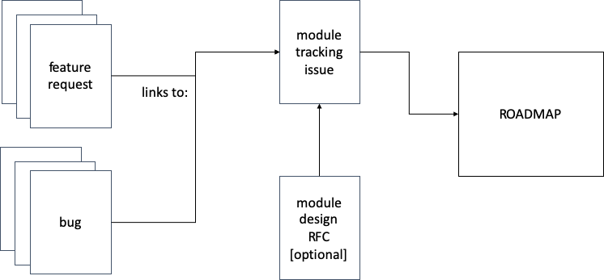

# AWS Construct Library Module Lifecycle

## Summary

The purpose of this document is to outline the process used to prioritize and mature modules in the AWS-CDK Construct
Library. It outlines how we graduate modules from CloudFormation-only resources to modules that contain high-level
resource abstractions and stabilize them for GA release.

## Motivation

We want to be transparent about the processes the AWS CDK team use, and seek community input to make them better. To
that end this living document will be published on the AWS CDK GitHub repo Wiki, and linked to from the repo's main
README and the public roadmap README.

## Stages of an AWS-CDK Construct Library Module

The sections below outline the development stages for modules in the AWS-CDK Construct Library and the criteria to
graduate the module to the next level of maturity. There are 4 stages of development for an AWS-CDK Construct Library
module:

- Stage 0 - CFN Resources
- Stage 1 - Experimental
- Stage 2 - Developer Preview
- Stage 3 - GA

## Stage 0 - CFN Resources

All construct library modules start in stage 0 when they are auto-generated from the CloudFormation resource
specification. The goal of stage 0 is to make new CloudFormation resources/properties available to CDK customers as soon
as possible, and create tracking artifacts that allow us to capture the data required to make prioritization decisions
to add L2 resources in the future.

- **Entry activities:**
  - **Automatically publish package** - A package for the module is autogenerated and published in the aws-cdk GitHub
    repo

  - **Automatically publish README** - The module has a rudimentary README doc that (this is an automated activity):
    - links to the relevant CloudFormation docs
    - includes the basic import statement

  - **Create GitHub tracking issue** - Create a GitHub tracking issue for the module. The primary role of the tracking
    issue is to:
    - provide an artifact that represents an entire AWS service that customers can +1 to help us prioritize, and
    - provide a single artifact to place on the public roadmap to indicate work in progress.

  - **Validate API reference** - Validate the module is listed in the AWS Construct Library API reference and is
    rendered correctly

- **Ongoing activities:**
  - **Observe** - Watch KPIs to prioritize the construct library module's graduation:
    - pull requests that add the first high-level constructs are the strongest signal to graduate a construct library
      module from stage 0 to stage 1 (experimental) and are prioritized first (this is a manual activity)
    - customer "+1s" on a construct library module's tracking issue exceeding 100 positive reactions, are prioritized
      next
    - construct library modules that accumulate 10+ feature requests, are prioritized next
- **Exit Criteria** - AWS-CDK Construct Library modules move to stage 1:
  - when the first community PR for a module is merged, OR
  - when selected by the CDK team using the [prioritization framework](#Construct-prioritization-framework)

## Stage 1 - Experimental

The goal of the experimental stage is to iterate on the design and functionality of a construct library module with the
freedom, and understanding of customers, to make breaking changes when desirable or necessary. During this stage the
primary use cases and the set of L2 constructs required to enable them are incrementally identified, implemented, and
validated.

While experimenting on the module API design and implementation, we will be as transparent as possible with customers
about the work in progress. To achieve this we will use the module’s GitHub tracking issue to document use cases and
construct design as they are developed in each iteration. Not all communication is required to occur in the tracking
issue itself. For large and/or complex changes, we will author a Request for Comments (RFC) that outlines our design and
publish it on the roadmap for feedback. We will also use pull requests to conduct construct reviews. In all cases,
relevant RFCs, PRs, bugs, and feature requests that are in scope are linked in the module’s tracking issue for
visibility. See [Appendix A](#Appendix-A:-GitHub-Artifacts) for an illustration of how these GitHub artifacts are used
and related to each other.

- **Entry activities:**

  - **Identify key stakeholders** - Opportunistically recruit stakeholders outside the CDK team to participate in API
    reviews and usability studies. Potential stakeholders include:
    - service's product manager,
    - service's developer advocates (if any),
    - service's software development engineer(s) (designated by service's leadership,
    - solutions architects who specialize in service (sourced via [Technical Field
      Communities](https://w.amazon.com/bin/view/AWS/Teams/TFC)),
    - AWS Developer Tools developer advocates

  - **Update GitHub tracking issue** - List the primary use cases for the service and the constructs required to satisfy
    them. This is an iterative process, so the full set of use cases and constructs are not expected to be defined at
    the start of this stage.

    - Defining the service's "getting started" scenario in CDK code is an ideal first use case to enable

  - **Author RFCs [optional]** - Request for comment documents are created for large / complex designs that require
    explanation and robust discussion. RFCs are stored in a separate [GitHub repo](https://github.com/aws/aws-cdk-rfcs),
    and the module's tracking issue will include links to relevant RFCs.

  - **Update Roadmap** - Publicly indicate the module is work in progress
    - if an RFC is written, place the module’s tracking issue on the CDK roadmap in the “Researching” column to indicate
      we need customer feedback on the module’s design. When the RFC process is complete, move the tracking issue to the
      "Working on it" column
    - otherwise, place the module’s tracking issue on the CDK roadmap in the “Working on it“ column

  - **Update Module Stability Label** - In the module's `package.json`, set "Stability": "Experimental" to indicate the
    high-level constructs are under active development and subject to breaking changes.

- **Ongoing activities:**
  - **Submit Pull Requests** - Pull requests implementing the constructs are submitted, the API design reviewed (by
    module owner), and merged

  - **Documentation** - Update module’s README with explanations and code snippets that illustrate how to use new
    constructs as they are developed

  - **Observe** - Monitor GitHub issues filed against the experimental module and module utilization metrics
    - feature requests and bugs filed against the experimental module are triaged, and those that we decide to include
      in the module are linked in the tracking issue to indicate they are in scope. All P0 issues are fixed immediately,
      P1 issues are in scope for GA release, and P2 issues are deferred until we accumulate enough feedback to change
      its priority.

  - **Repeat** - These activities are repeated until the module owner decides the module is feature complete and the API
    is ergonomic. At the end of the experimental stage, the construct library module’s GitHub tracking issue will have a
    description of the service, a list of targeted use cases, and a list of high-level constructs required to satisfy
    the use cases.

- **Exit Criteria**:
  - **Major Use Cases Addressed** - During each iteration in the experimental phase, a module's Github tracking issue will
    accumulate a checklist of major use cases. Every quarter, as part of the construct library module prioritization,
    owners look at the checklists for their module and if most/all of them are checked off, it is considered as a
    developer preview candidate.

    > **Note**: This does not imply 100% AWS service feature coverage, instead, it means the module owner
    > thinks we’ve implemented the minimum features required for a delightful developer experience for modeling the
    > service infrastructure as code.

  - **Successful API review** - Conduct an API review/developer experience demo and invite relevant stakeholders
    - use module's README as the API review guide
    - address any concerns about API ergonomics
    - review all AWS Lint exceptions to ensure they are acceptable for dev preview
    - ensure at least 90% unit test coverage for all implemented L2 constructs
    - if the API/DevEx is rejected, make a list of necessary remediation tasks and update the module's tracking issue

## Stage 2 - Developer Preview

The goal of developer preview is to deliver a release candidate with a stable API to conduct user acceptance testing and
accumulate sufficient usage to declare a module is ready for general availability. We will only make breaking changes to
developer preview modules when required to address unforeseen customer use cases or issues. Since the potential for
breaking changes still remains while in Developer Preview, the package name will keep the“experimental” stability during
this stage.

- **Entry activities**:
  - **Update Roadmap** - Move to the CDK public roadmap “Developer Preview” column to indicate we need customer feedback
    on the module’s implementation

- **Ongoing activities:**
  - **Observe** - Monitor GitHub issues filed against the developer preview module and module utilization metrics
    - feature requests and bugs filed against the developer preview module are triaged, and those that we decide to
      include in the module are linked in the tracking issue to indicate they are in scope. All P0 issues are fixed
      immediately, P1 issues are in scope for GA release, and P2 issues are deferred until we accumulate enough feedback
      to change its priority.

  - **Quality Assurance** - Fix all P0 bugs as they are discovered and review all P1 bugs, making a clearly communicated
    fix/defer decision for each one

- **Exit Criteria**:
  - **Bake time** - Modules will spend at least 3 months in developer preview to accumulate sufficient usage data to
    gain confidence in the API’s ergonomics and customer acceptance

  - **Usage** - Module utilization in 2,000 or more stacks is considered sufficient usage. We will evaluate the language
    distribution of module use to determine if we need to target specific underrepresented programming language
    communities for feedback

  - **No P0 bugs** - No new P0 bugs in the past 4 weeks

  - **Successful API/Docs review** - Conduct the final API review/developer experience demo and invite relevant
    stakeholders
    - review all AWS Lint exceptions and have a high bar for keeping them at GA
    - review and sign-off module’s README by tech writer
    - review and sign-off module's API by module owner
    - if the API/DevEx is rejected, make a list of necessary remediation tasks and update the module's tracking issue

## Stage 3 - GA

The module is generally available with a backwards compatible guarantee across minor versions.

- **Entry activities**:

  - **Update Roadmap** - Move to the CDK roadmap “shipped” column

  - **Update Module Stability Label** - In the module's `package.json`, set "Stability": "Stable" to indicate the
    high-level constructs are production ready and adhere to the [SemVer specification](https://semver.org/).

  - **Communicate availability** -
    - notifications via Gitter and Twitter
    - comment on the GitHub tracking issue
    - release notes call out new GA modules
    - write a blog post about how to use the module [optional but highly desired]

- **Ongoing activities:**
  - **Observe** - monitor module utilization and GitHub issues filed against the stable module

## Construct prioritization tenets

We use the following tenets to prioritize which AWS-CDK Construct Library modules to work on next:

- _"Favor community contributions above all"_ - customers who take the time to contribute code to the AWS CDK get
  preferential treatment above all else
- _“Don’t experiment on too much at once”_ - no more than 20% of the AWS Construct Library will be experimental at any
  given time. For reference, on 1/1/2020, the construct library module breakdown = 32% (39/123) Stable, 18% (22/123)
  Experimental, 50% (62/123) CFN-only.
- _“Focus on what customers ask for”_ - prioritize modules based on number of feature requests and +1’s on GitHub.
- _“Finish what we’ve started”_ - prioritize modules that already have L2 constructs but are still experimental.
- _“Do the most difficult work first”_ - prioritize modules that have a large and/or complex API surface area that we
  know will take significant effort. [Appendix B](#appendix-b:-module-complexity-t-shirt-sizes) proposes “T-shirt”sizes
  for each module in the construct library to identify work that falls into this category, and module owners are
  responsible for estimate this effort.
- _“Strategic alignment”_ - prioritize based on AWS / department / team goals. We will use our weekly, monthly, and
  quarterly planning meetings to identify modules that meet this criteria. For example, in 2019, there was a Developer
  Tools strategic initiative to enable containerized and serverless application workloads which informed our decisions
  on what construct library modules to prioritize for CDKs GA launch.
- _“Focus on what customers are actually using”_ - prioritize constructs that only have CFN resources, but are highly
  utilized (according to analytics data). A highly used, CFN-only construct library modules might indicate that the
  low-level resources are sufficient for customer’s primary use cases, and high-level abstractions are not necessary.

## Appendix A: GitHub artifacts

This diagram illustrates the different GitHub artifacts and their relationships.

- **Module Tracking Issue** - Module tracking issues represent an entire AWS service and summarize the planned scope of
  work for a specific construct library module. This is the issue we want customers to +1 to help us prioritize work on
  modules that are currently CFN-only, and is the issue we will place on the public roadmap to communicate work in
  progress.
- **Module Design RFC [optional]** - Request for comment documents will be created for large / complex designs that
  require explanation and robust discussion. RFCs are stored in a separate GitHub repo, and the top-level tracking issue
  should include link to the RFC.
- **Feature Requests** - We have a backlog of feature requests tagged for each module. When we decide to include a
  customer feature request in the scope of work, links to these issues are added to the module’s tracking issue.
  Customers can +1 and comment on individual feature requests, just like they can +1 and comment on the top-level
  tracking issue. _Note_: it is not a requirement to address all feature requests when maturing a construct library.
- **Bugs** - Similar to feature requests, we have a backlog of P1 and P2 bugs tagged for each module. When we decide to
  fix specific, known bugs as part of maturing a construct, links to these issues are added to the module’s tracking
  issue.
  > **Note**: It is not a requirement to address all P1 or P2 bugs when maturing a construct library.

## Appendix B: Module complexity T-shirt sizes

One of our tenets is to prioritize work on large/complex modules to ensure we make progress on high-level abstractions
for services that we cannot complete in a single quarter. Measured in the amount of time required to graduate a module
from CFN-only to a Developer Preview release candidate, the proposed sizing scale is:

- **Small**: 1 month or less
- **Medium**: 2-3 months
- **Large**: 3-5 months
- **X-large**: 6 months or more

## Appendix C: Action Items

- [ ] automate the creation of new tracking issues when new CFN-only modules are autogenerated
- [ ] create an example tracking issue for reference
- [ ] update `package.json` for all CFN-only modules to 'stable'
- [ ] update `package.json` for all modules in 'developer preview'
- [ ] add an AWS Lint rule that checks the `package.json` maturity tag
- [ ] determine the final, easy to find, location for this document
- [ ] update AWS CDK README to include a link to this document
