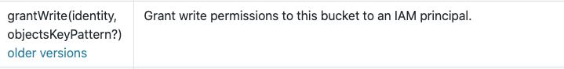

# Summary

When CDK version `2.0` is released to General Availability (GA), the single
monolithic Construct Library package we vend will no longer allow breaking
changes in its main modules. Unstable modules, which include both modules that
are Experimental, and in Developer Preview, will be vended separately. Users
will not experience breaking changes in minor releases of the CDK unless they
explicitly opt-in to using unstable APIs.

# Motivation

CDK releases contain a combination of stable and unstable features, which has
proven to be a pain point for customers. The AWS CDK packages are released
frequently -- at least once per week, sometimes more -- and each release
increments the minor version number (e.g. `1.59.0` to `1.60.0`). In the planned
`2.0` release of CDK, the main focus of the major version upgrade is to stop
packaging modules separately and to include them all in one package called
`aws-cdk-lib`. This will solve a number of problems related to peer dependencies
that make it harder to vend third-party libraries based on the CDK, but it does
not address the backwards compatibility problem caused by minor releases
containing breaking changes to unstable APIs.

The CDK uses an exception to semantic versioning by labeling certain APIs (and
entire modules) as unstable, to allow us to make breaking changes to those APIs
in minor version upgrades. There is precedent for this in other open source
projects, but for CDK users, it has been a constant source of pain and
frustration. Users who do not carefully read and understand the documentation
simply install packages, copy sample code, make a few tweaks and put the code
into production. When they later upgrade to a new version, they are surprised to
find that their code no longer works. The perception of instability has driven
some users away, or caused them to limit their usage of CDK to the fundamental
L1 constructs, which do not provide them with the benefits of higher-level
abstractions.

This RFC proposes that we stop releasing breaking changes in the main package we
vend. A user that installs `aws-cdk-lib` using NPM or `pip` or any other package
manager should be confident there will be no breaking changes in the `2.x` line
of releases for its lifetime.

# Goals

These are the goals of this RFC, in order from most to least important:

## 1. Using CDK APIs that don't guarantee backwards-compatibility should require clear, explicit opt-in

It should be absolutely obvious to a CDK customer when they are opting in to
using an API that might have backwards-incompatible changes in the future. From
experience, we have determined that including that information in the `ReadMe`
file of a module, or in the inline code documentation available in an
editor/IDE, does not meet the criteria of "absolutely obvious".

If a customer is not aware of the stable vs unstable distinction, that means
they're using _only_ stable APIs, and that they will not be broken with minor
version CDK releases.

## 2. We want to foster a vibrant ecosystem of third-party CDK packages

In our estimation, the CDK cannot be successful without growing an expansive
collection of third-party packages that provide reusable Constructs on various
levels of abstraction. Changing to vending the Construct Library as a monolithic
package is one part of making that possible; we should make sure our approach to
unstable code also takes this into account.

## 3. The CDK team can still perform API experiments

We believe that one of the reasons for CDK's success is the ability to release
functionality quickly into the hands of customers, to get their feedback. The
ability to release experiments is crucial for that speed; if every single
released API decision carried with it the absolute burden of being 100%
backwards compatible, that would slow the pace of CDK innovation considerably
(especially third-party contributions), and would lengthen the feedback loop
from our customers on the quality of the proposed APIs.

For those reasons, we consider it essential for the CDK team to retain the
capability to perform experiments with our APIs (of course, only those that are
clearly marked as such).

## 4. Using experimental modules should be easy

Our development methodology is highly dependent on feedback from the community
before finalizing APIs. To encourage users to use and provide feedback on
experimental APIs, we should make them easy to use.

# Proposed changes

To achieve the goals of this RFC, we propose the following changes:

## 1. No more breaking changes in the main mono-CDK modules

Because of a combination of how `aws-cdk-lib` will be depended on by third-party
libraries (through peer dependencies), and the goals of this RFC, it will no
longer be possible to make breaking changes to code inside `aws-cdk-lib`'s main
modules.

(See Appendix A below for a detailed explanation why that is)

We will still retain the ability to mark APIs as `@experimental` in
`aws-cdk-lib` main modules, but the meaning of that marker will change
considerably compared to `1.x`. It will be an indication to customers that this
API is still in the process of being baked, and it might be a bad idea
(especially for more conservative customers) to use it in production yet.
However, an API marked `@experimental` cannot ever be changed in a
backwards-incompatible way; it can be marked `@deprecated`, but it will not be
removed until the next major version of the CDK.

We will need to change the backwards-compatibility validations in our build
scripts to make sure they cover `@experimental` APIs as well.

## 2. Separate "breakable" code from mono-CDK main modules

As a consequence of the above point, we need to move all code that doesn't
guarantee backwards-compatibility out of the mono-CDK main modules.

There a few possible options where this "breakable" code can be moved. They all
have their advantages and disadvantages.

**Note #1**: I purposefully don't mention the issue of how should this decision
affect the number of Git repositories the CDK project uses. I consider that an
orthogonal concern to this one, and more of an implementation detail. The number
of Git repositories is also a two-way door, unlike the package structure
decision, which I believe cannot be changed without bumping the major version of
CDK.

**Note #2**: the options are numbered after the historical order in which they
were proposed, not in the order they appear in the document. Check out Appendix
C for the options with the missing numbers -- they were considered, but
discarded by the team as not viable.

### Option 2: separate single unstable package

Instead of vending the unstable modules together with the stable ones, we can
vend a second mono-CDK, `aws-cdk-lib-experiments` (actual name can be changed
before release of course). A customer will have to explicitly depend on
`aws-cdk-lib-experiments`, which will be released in version `0.x` to make it
even more obvious that this is unstable code. `aws-cdk-lib-experiments` would
have a caret peer dependency on `aws-cdk-lib`.

Example using stable and unstable Cognito APIs:

```ts
import * as cognito from 'aws-cdk-lib/aws-cognito';
import * as cognito_preview from 'aws-cdk-lib-experiments/aws-cognito';

const idp = new cognito_preview.UserPoolIdentityProviderOidc(this, 'OIDC', { ... });
const supported = [cognito.UserPoolClientIdentityProvider.custom("MyProviderName")];
const userPoolClient = new cognito.UserPoolClient(...);
```

Advantages:

1. Very explicit (customer has to add a dependency on a package with
   "experiments" in the name and version `0.x`).
2. It's possible for unstable modules to depend on other unstable modules (see
   Appendix B for data on how necessary that is for the CDK currently).

Disadvantages:

1. It's not possible for stable modules to depend on unstable ones (see Appendix
   B for data on how necessary that is for the CDK currently). This has serious
   side implications:

   - All unstable modules that have stable dependents today will have to be
     graduated before `v2.0` is released.
   - Before a module is graduated, all of its dependencies need to be graduated.
   - It will not be possible to add new dependencies on unstable modules to
     stable modules in the future (for example, that's a common need for
     StepFunction Tasks).

2. Graduating a module to stable will be a breaking change for customers. We can
   mitigate this downside by keeping the old unstable module around, but that
   leads to duplicated classes.

### Option 3: separate multiple unstable packages

In this option, each experimental library will be vended as a separate package.
Each would have the name "experiments" in it (possible naming convention:
`@aws-cdk-lib-experiments/aws-<service>`), and would be released in version
`0.x` to make it absolutely obvious this is unstable code. Each package would
declare a caret peer dependency on `aws-cdk-lib`.

Example using stable and unstable Cognito APIs:

```ts
import * as cognito from 'aws-cdk-lib/aws-cognito';
import * as cognito_preview from '@aws-cdk-lib-experiments/aws-cognito';

const idp = new cognito_preview.UserPoolIdentityProviderOidc(this, 'OIDC', { ... });
const supported = [cognito.UserPoolClientIdentityProvider.custom("MyProviderName")];
const userPoolClient = new cognito.UserPoolClient(...);
```

Advantages:

1. Very explicit (customer has to add a dependency on a package with
   "experiments" in the name and version `0.x`).
2. This is closest to the third-party CDK package experience our customers will
   have.

Disadvantages:

1. It's not possible for stable modules to depend on unstable ones (see Appendix
   B for data on how necessary that is for the CDK currently), with the same
   implications as above.
2. It's not possible for unstable modules to depend on other unstable modules
   (see Appendix B for data on how necessary that is for the CDK currently), as
   doing that brings us back to the dependency hell that mono-CDK was designed
   to solve.
3. Graduating a module to stable will be a breaking change for customers. We can
   mitigate this downside by keeping the old unstable package around, but that
   leads to duplicated classes.

### Option 5: superset/subset releases

Instead of _splitting_ the stable and experimental APIs into two different
packages, we release two builds of the same source code, where the
_experimental_ build is a superset of the _stable_ build.

This can be done automatically, by using jsii to strip out experimental APIs
from the **public interface** of the stable release. The implementation (`.js`
files) will be the same in both releases, so stable APIs in `aws-cdk-lib` can
safely use experimental APIs internally (though not in their public API
surfaces).

#### How does stripping APIs from the public work?

| TypeScript            | JavaScript | Java, Python, C#, Go            |
| --------------------- | ---------- | ------------------------------- |
| Stripped from `.d.ts` | N/A        | No bindings generated by `jsii` |

In TypeScript, the compiler will prevent usage of APIs that are not advertised
in the `.d.ts` files. Users will be able to bypass this guarantee by using
`as any` though.

For JavaScript, an IDE will (hopefully¹) not autocomplete APIs missing from the
`.d.ts` files; otherwise nothing prevents users from calling them. On the other
hand, JavaScript devs are by definition required to read the docs, so they can't
miss the _experimental_ banners displayed there.

For jsii client languages, the bindings for experimental APIs will simply not
exist so there's no way to work around that (though we'll have to check whether
for example Python makes it possible to pass struct values that aren't in the
declared API surface).

¹) A _smart enough_ IDE could discover those APIs by parsing the JavaScript
directly, or by doing dynamic execution and runtime inspection of objects. This
was already being done before TypeScript existed, I did not survey the current
landscape of IDEs to figure out which ones use what techniques to provide
autocomplete for users.

#### What about experimental struct properties

We also commonly use `@experimental` to indicate experimental struct properties
for `Props` types.

There will be code that users can write that will pass a props object that
technically contains non-advertised, experimental properties. Without additional
runtime support the object constructor will happily interpret the presence of
those properties and make decisions based off of them.

An example in TypeScript:

```ts
// Construct
interface StableConstructProps {
  readonly stableProp: string;

  /** @experimental */
  readonly experimentalProp: string;
}

class StableConstruct {
  constructor(scope: Construct, id: string, props: StableConstructProps) {
    super(scope, id);
    if (props.experimentalProp) {
      console.log('Experimental features activated!');
    }
  }
}

//----------------------------------------------------------------------
// THE FOLLOWING CLIENT CODE IS USING THE STABLE BUILD
//
// As far as this client code is aware, StableConstructProps looks like this:
//
//     interface StableConstructProps {
//        readonly stableProp: string;
//     }

const props = {
  stableProp: 'foo',
  experimentalProp: 'bar',
};

// Even though we're using "stable mode", the following code still
// prints 'Experimental features activated!'.
//
// The call below is allowed because 'typeof props' is a superset of StableConstructProps.
new StableConstruct(this, 'Id', props);

// In contrast the call below would NOT be allowed:
new StableConstruct(this, 'Id', {
  stableProp: 'foo',
  experimentalProp: 'bar',
});
```

We would need runtime support
(`if (props.experimentalProp && IN_EXPERIMENTAL_MODE) { ... }`) to detect and
prevent this, or accept it.

The example above is for TypeScript; it obviously also holds for JavaScript, and
_might_ hold for jsii languages in certain cases.

#### Vending

There are a number of different ways we can choose to distinguish the two
builds. See Appendix D for an evaluation of all the possibilities.

- Distinguish by package name
  - Can't be used in **pip**: there's no way to have an app that uses the
    experimental library work with a library that uses the stable library (no
    way to prevent the transitive dependency package with a different name from
    being installed).
- Distinguish by prerelease tag
  - **NuGet**: requires that experimental version semver-sorts _after_ the
    matching stable version, otherwise it errors out and fails the restore
    operation.
  - **npm**: will always complain when trying to satisfy a stable requirement
    with an experimental version, regardless of how it sorts.
  - **Maven**: does not recognize prerelease tags. This means that _apps_ can't
    have an open-ended version range since they might accidentally pick up
    experimental versions (a Maven range of `[1.60.0, 2.0.0)` _will_ match
    `1.61.0-experimental`). This might not be a problem as this is rarely done
    in practice (since Maven doesn't have a lock file, the `pom` itself serves
    as the lock file).
- Distinguish by major version
  - Very similar to prerelease tags, except we don't depend on Package Manager's
    support for prerelease tags; all PMs support major versions.

Even though there are downsides, the prerelease tag is the least bad of the
alternatives and the one that's (probably) easiest to explain.

We have to work around the version ordering problem though, by making sure the
experimental version sorts after the stable version. We can either use the minor
or the patch version:

```shell
# Experimental uses minor bump
1.60.0 < 1.61.0-experimental

# Experimental uses (fake) patch bump
1.60.0 < 1.60.100-experimental
```

#### Summary

Advantages:

1. It's possible for stable modules to depend on unstable ones (see Appendix B
   for data on how necessary that is for the CDK currently).
2. Stabilizing code will not be a breaking change for customers.
3. Stabilizing code will be a simple operation for CDK developers (remove an
   annotation).
4. No additional management overhead of multiple packages.
5. It's possible for unstable modules to depend on other unstable modules.

Disadvantages:

1. Stable/experimental versioning scheme is not based on any well-known industry
   standard, we're going to have to clearly explain it to people.
2. Requires changes to jsii
3. Requires changes to the docs to make switching between editions possible
4. Protection not offered for JavaScript users, can be bypassed in TypeScript;
   although something is to be said for it being the same with `private` fields
   today.
5. Does not satisfy
   [goal 4 - Using experimental modules should be easy](#4-using-experimental-modules-should-be-easy).
   Customers that wants to use a single experimental API must pay the cost of
   using a different version of the **entire** `aws-cdk-lib`. This is a non
   trivial cost due to the following:
   - Migrating to either a new major version, or a prerelease version, is a
     process that usually includes accepting lot of breaking changes. While this
     may not be the case for `aws-cdk-lib`, users wil be still hesitant as it is
     the standard meaning of such migration.
   - Users which uses the experimental version might use experimental APIs they
     didn't intend to, similar to the experimental experience in v1.

#### POC results

> _Option 5 should be move to the appendices section, it is added here for the
> purpose of minimizing the diff in the review process. It will be moved once
> the RFC is finalized._

Option 5 was rejected since there is no way to model the relationship between
the "experimental" version and the "stable" version through semantic versioning.

##### Prerelease qualifiers

According to the semver [specification](https://semver.org/#spec-item-11), a
precedence between versions is calculated **only** if the **major**, **minor**
and **patch** are equal. This means that there is no way for a constructs
library to declare a range of supported versions which include an experimental
version. Sticking to the above example, a CDK construct library declaring a peer
dependency on version `^1.60.0` of `aws-cdk-lib`, can not be used in a CDK
application that declares a dependency on `aws-cdk-lib` version
`1.61.0-experimental`. This is because the patch part in `1.60.0` and
`1.61.0-experimental` is not equal, which means `1.61.0-experimental` does not
satisfy `^1.60.0`. In npm versions prior to npm-v7, if `peerDependencies`
requirements are not met, executing `npm install` would only issue a warning. In
npm-v7, which automatically tries to install `peerDependencies`, executing
`npm install` will throw an error.

To illustrate the user experience with npm-v7. The below is the output of
executing `npm install` in a CDK application (`my-cdk-application`), which
declares a dependency on a `aws-cdk-lib` version `1.61.0-experimental`, and on a
CDK library (`my-construct-lib`) which itself declares a peer dependency on
`aws-cdk-lib` version `^1.60.0`:

```
npm ERR! code ERESOLVE
npm ERR! ERESOLVE unable to resolve dependency tree
npm ERR!
npm ERR! While resolving: my-cdk-application@1.0.0
npm ERR! Found: aws-cdk-lib@1.61.0-experimental
npm ERR! node_modules/aws-cdk-lib
npm ERR!   aws-cdk-lib"@1.61.0-experimental" from the root project
npm ERR!
npm ERR! Could not resolve dependency:
npm ERR! peer aws-cdk-li@"^1.60.0" from my-construct-lib@1.6.0
npm ERR! node_modules/my-construct-lib
npm ERR!   my-construct-lib@"1.6.0" from the root project
npm ERR!
npm ERR! Fix the upstream dependency conflict, or retry
npm ERR! this command with --force, or --legacy-peer-deps
npm ERR! to accept an incorrect (and potentially broken) dependency resolution.
npm ERR!
```

Users can work around this by executing `npm install --force` which means that
npm will not check for version compatibility at all, and therefore not an
acceptable solution.

##### Separate major versions

This was rejected due to similar reasons as listed in the disadvantages of
[Option 4: separate V3 that's all unstable](#option-4-separate-v3-thats-all-unstable).

### Option 6: API Previews

AWS CDK v2 release notes:

> Starting with version 2.0.0 of the AWS CDK, all modules and members will
> become stable. This means that from this release, we are committed to never
> introduce breaking changes in a non-major bump.
>
> One of the most common feedback we hear from customers is that they love how
> fast new features are added to the AWS CDK, we love it to. In v1, the
> mechanism that allowed us to add new features quickly was marking them as
> "experimental". Experimental features were not subject to semantic versioning,
> and we allowed breaking changes to be introduced in these APIs. This is the
> other most common feedback we hear from customers - breaking changes are not
> ok.
>
> #### Introducing API Previews
>
> To make sure we can keep adding features fast, while keeping our commitment to
> not release breaking changes, we are introducing a new model - API Previews.
> APIs that we want to get in front of developers early, and are not yet
> finalized, will be added to the AWS CDK with a specific suffix: `PreX`. APIs
> with the preview suffix will never be removed, instead they will be deprecated
> and replaced by either the stable version (without the suffix), or by a newer
> preview version. For example, assume we add the method
> `grantAwesomePowerPre1`:
>
> ```ts
> /**
>  * This methods grants awesome powers
>  */
> grantAwesomePowerPre1();
> ```
>
> Times goes by, we get feedback that this method will actually be much better
> if it accept a `Principal`. Since adding a required property is a breaking
> change, we will add `grantAwesomePowerPre2()` and deprecate
> `grantAwesomePowerPre1`:
>
> ```ts
> /**
> * This methods grants awesome powers to the given principal
> *
> * @param grantee The principal to grant powers to
> */
> grantAwesomePowerPre2(grantee: iam.IGrantable)
>
> /**
> * This methods grants awesome powers
> * @deprecated use grantAwesomePowerPre2
> */
> grantAwesomePowerPre1()
> ```
>
> When we decide its time to graduate the API, the latest preview version will
> be deprecated and the final version - `grantAwesomePower` will be added.

### Documentation

How will different versions of an API be reflected in the AWS CDK
documentations? One option is to only show the latest version of the API, and
remove all deprecated versions. While this might reduce potential clutter in the
docs, it might be frustrating for users who encounter an older version of an
experimental API. A compromise can be to collapse all older version of an API,
making them still accessible but somewhat hidden:



### Naming scheme alternatives

A good naming scheme for marking API previews should:

1. Express the non-final nature.
2. Allow expressing order between preview versions of the same API, e.g
   `grantWritePre2` is newer than `grantWritePre1`.

#### Prefix vs. Suffix

For the sake of clarity, assume we want to add a `grantWrite` method ot the
`Bucket` type:

**Prefix advantages:**

1. Might be more clear that the API is in preview. All preview APIs are grouped
   together in autocomplete suggestions.
2. When the final API is added, the autocomplete experience will be less
   confusing. `grantWrite` will be visually separated than `pre1GrantWrite` and
   `pre2GrantWrite`.

**Suffix advantages:**

1. Discoverability. When using the `Bucket` type in code, a user looking for a
   way to "grant" permission on the `Bucket`, is likely to type "grant" in the
   IDE and look in the suggestion displayed by the autocomplete. A method that
   starts with `grant` will be listed before a method that ends with it.
   However, most IDEs will list methods that contains "grant" in any part will
   be listed by autocomplete when a user types "grant".

#### Alternatives

Using `1` for visibility:

- Rc1: for release candidate.
- Alpha1.

**How will it look in all supported languages:**

> _to be completed once a naming scheme is decided_

| scheme | TS  | Java | Python | .Net | Go  |
| ------ | --- | ---- | ------ | ---- | --- |
| PreV1  |     |      |        |      |     |

### Discussion

Advantages:

- Experimental APIs can be used without declaring a fixed version on
  `aws-cdk-lib`.
- Since old versions of an API will only be deprecated and not removed, if
  needed, we will be able to push critical updates to these versions as well.
  For example, if we discover that `grantWrite` grants overly permissive
  permissions, and the same occur in all of its experimental (deprecated)
  predecessors, we will be able to push the fix to them as well. This will allow
  us to get the fix to more customers in case of a critical fix.
- All APIs will be in `aws-cdk-lib`, preventing dependencies hell.
- Libraries will be able to use experimental APIs without locking their
  consumers to a specific version of `aws-cdk-lib` (or any other module we
  vend).
- Same solution across all languages.
- Allows finer granularity for opting-in to experimental APIs. Users who wants
  to use a specific experimental API do not have to use either an experimental
  version line, or an experimental module.

Disadvantages:

- User does not have a clear motivation to upgrade to a newer version.
- Low adoption. Users might be worried to use an API with an experimental name,
  assuming that experimental means "will break".
- Cluttering the code base. Although most IDEs will mark deprecated properties
  with a ~~strikethrough~~, they will still be listed by autocomplete.
- Will force some pretty long and ugly names on our APIs. Many experimental APIs
  will result in a less aesthetic user code.
- Graduating a module will require a lot of code changes from our users to
  remove the prefix/suffix.
- A lot of deprecated code in aws-cdk-lib, possibly blowing up `aws-cdk-lib`.
  This might not be a real concern as we can reuse a lot the code between
  different version of an API.

**How can we encourage users to upgrade to a newer version?**

When a new minor version introduces a breaking change to an API, users have a
clear motivation to upgrade to the new version of the API - they must do so in
order to upgrade to a newer version of the AWS CDK. If the API is only
deprecated, users have no motivation to upgrade to a newer version of the API,
even worse, they might not be aware that a newer version exists. One way to
encourage users to upgrade to a newer version of an API, is to supply tools that
will inform users. For example, we can add a capability to the `cdk doctor`
command that will notify users that their CDK application is using deprecated
experimental APIs.

Executing `cdk doctor` will print:

```bash
neta@dev/my-cdk-application$ cdk doctor

Newer versions of APIs previews your application is using are available. You should consider upgrading.
To see which previews APIs can be upgraded, execute `cdk --show-deprecated-api-usage`
```

**If there are no breaking changes, are the APIs really experimental?**

Given that preview APIs are safe to use, and no breaking changes will be
introduced to them, we might consider not referring to them in any special way,
and if needed, simply add a version to the API name. The first version of
`grantWrite` will be named `grantWrite`, the second version will be named
`grantWriteV1` and so on. While a preview API will not break, we should still
use a naming scheme that convey its non-final nature for the following reasons:

1. **Real-estate**: `grantWrite` is a much better name than `grantWritePre3` for
   the final API.
2. **Encourage feedback**: Declaring an API as "in preview" encourage the
   community to supply feedback.
3. **Setting the right expectations**: When an API in preview users are aware
   that this is not the final version of the API, and its deprecation is
   expected.

### API Previews Specifications

## 3. Extra unstable precautions

This chapter discusses additional precautions we can choose to implement to
re-inforce goal #1 above. These are orthogonal to the decision on how to divide
the stable and unstable modules (meaning, we could implement any of these with
each of the options above).

These could be added to either `@experimental` APIs in stable modules, to all
APIs in unstable modules, or both.

### Require a feature flag for unstable code

In this variant, we would add a runtime check into all unstable APIs that
immediately fails with an exception if the following context is missing:

```json
{
  "context": {
    "@aws-cdk:allowExperimentalFeatures": true
  }
}
```

Note that `cdk init` will create a project with this context value set to
`false`.

To avoid the manual and error-prone process of adding this check to every single
unstable API, we will need to modify JSII so that it recognizes the
`@experimental` decorator, and adds this check during compilation.

Advantages:

- Changing the context flag will be an explicit opt in from the customer to
  agree to use unstable APIs.

Disadvantages:

- This will force setting the flag also for transitive experimental code (for
  example, when an unstable API is used as an implementation detail of a
  construct, but not in its public interface), which might be confusing.
- Since there is a single flag for all unstable code, setting it once might hide
  other instances of using unstable code, working against stated goal #1.
- Requires changes in JSII.

### Force a naming convention for unstable code

We can modify `awslint` to force a certain naming convention for unstable code,
for example to add a specific prefix or suffix to all unstable APIs.

Advantages:

- Should fulfill goal #1 - it will be impossible to use an unstable API by
  accident.
- Does not require changes in JSII, only in `awslint`.

Disadvantages:

- Will force some pretty long and ugly names on our APIs.
- Graduating a module will require a lot of code changes from our customers to
  remove the prefix/suffix.

# Appendix A - why can't we break backwards compatibility in the code of mono-CDK main modules?

This section explains why it will not be possible to break backwards
compatibility of any API inside the stable modules of mono-CDK.

Imagine we could break backwards compatibility in the code of the `aws-cdk-lib`
main modules. The following scenario would then be possible:

Let's say we have a third-party library, `my-library`, that vends `MyConstruct`.
It's considered stable by its author. However, inside the implementation of
`MyConstruct`, it uses an experimental construct, `SomeExperiment`, from
mono-CDK's S3 module. It's just an implementation detail, though; it's not
reflected in the API of `MyConstruct`.

`my-library` is released in version `2.0.0`, and it has a peer dependency on
`aws-cdk-lib` version `2.10.0` (with a caret, so `"aws-cdk-lib": "^2.10.0"`).

Some time passes, enough that `aws-cdk-lib` is now in version `2.20.0`. A CDK
customer wants to use `my-library` together with the newest and shiniest
`aws-cdk-lib`,`2.20.0`, as they need some recently released features. However,
incidentally, in version `2.15.0` of `aws-cdk-lib`, `SomeExperiment` was broken
-- which is fine, it's an experimental API. Suddenly, the combination of
`my-library` `2.0.0` and `aws-cdk-lib` `2.20.0` will fail for the customer at
runtime, and there's basically no way for them to unblock themselves other than
pinning to version `2.14.0` of `aws-cdk-lib`, which was exactly the problem
mono-CDK was designed to prevent in the first place.

# Appendix B - modules depending on unstable modules

This section contains the snapshot of the interesting dependencies between
Construct Library modules as of writing this document.

## Stable modules depending on unstable modules

```
⚠️  Stable module '@aws-cdk/aws-applicationautoscaling' depends on unstable module '@aws-cdk/aws-autoscaling-common'
⚠️  Stable module '@aws-cdk/aws-autoscaling' depends on unstable module '@aws-cdk/aws-autoscaling-common'
⚠️  Stable module '@aws-cdk/aws-elasticloadbalancingv2-actions' depends on unstable module '@aws-cdk/aws-cognito'
⚠️  Stable module '@aws-cdk/aws-events-targets' depends on unstable module '@aws-cdk/aws-batch'
⚠️  Stable module '@aws-cdk/aws-lambda' depends on unstable module '@aws-cdk/aws-efs'
⚠️  Stable module '@aws-cdk/aws-route53-patterns' depends on unstable module '@aws-cdk/aws-cloudfront'
⚠️  Stable module '@aws-cdk/aws-route53-targets' depends on unstable module '@aws-cdk/aws-cloudfront'
⚠️  Stable module '@aws-cdk/aws-route53-targets' depends on unstable module '@aws-cdk/aws-cognito'
⚠️  Stable module '@aws-cdk/aws-stepfunctions-tasks' depends on unstable module '@aws-cdk/aws-batch'
⚠️  Stable module '@aws-cdk/aws-stepfunctions-tasks' depends on unstable module '@aws-cdk/aws-glue'
```

## Unstable modules depending on other unstable modules

```
ℹ️️  Unstable module '@aws-cdk/aws-appsync' depends on unstable module '@aws-cdk/aws-cognito'
ℹ️️  Unstable module '@aws-cdk/aws-backup' depends on unstable module '@aws-cdk/aws-efs'
ℹ️️  Unstable module '@aws-cdk/aws-backup' depends on unstable module '@aws-cdk/aws-rds'
ℹ️️  Unstable module '@aws-cdk/aws-cloudfront-origins' depends on unstable module '@aws-cdk/aws-cloudfront'
ℹ️️  Unstable module '@aws-cdk/aws-docdb' depends on unstable module '@aws-cdk/aws-efs'
ℹ️️  Unstable module '@aws-cdk/aws-s3-deployment' depends on unstable module '@aws-cdk/aws-cloudfront'
ℹ️️  Unstable module '@aws-cdk/aws-ses-actions' depends on unstable module '@aws-cdk/aws-ses'
```

# Appendix C - discarded solutions to problem #2

These potential solutions to problem #2 were discarded by the team as not
viable.

## Option 1: separate submodules of `aws-cdk-lib`

In this option, we would use the namespacing features of each language to vend a
separate namespace for the experimental APIs. The customer would have to
explicitly opt-in by using a language-level import of a namespace with
"experimental" in the name.

Example using stable and unstable Cognito APIs:

```ts
import * as cognito from 'aws-cdk-lib/aws-cognito';
import * as cognito_preview from 'aws-cdk-lib/experimental/aws-cognito';

const idp = new cognito_preview.UserPoolIdentityProviderOidc(this, 'OIDC', { ... });
const supported = [cognito.UserPoolClientIdentityProvider.custom("MyProviderName")];
const userPoolClient = new cognito.UserPoolClient(...);
```

Advantages:

1. It's possible for stable module to depend on unstable ones (see Appendix B
   for data on how necessary that is for the CDK currently)
2. It's possible for unstable modules to depend on other unstable modules (see
   Appendix B for data on how necessary that is for the CDK currently).

Disadvantages:

1. Might be considered less explicit, as a customer never says they want to
   depend on a package containing unstable APIs, or with `0.x` for the version.
2. If a third-party package depends on an unstable API in a non-obvious way (for
   example, only in the implementation of a construct, not in its public API),
   that might break for customers when upgrading to a version of `aws-cdk-lib`
   that has broken that functionality compared to the `aws-cdk-lib` version the
   third-party construct is built against (basically, the same scenario from
   above that explains why we can no longer have unstable code in stable
   mono-CDK modules). None of the options solve the problem of allowing
   third-party libraries to safely depend on unstable Construct Library code;
   however, the fact that all unstable code in this variant is shipped in
   `aws-cdk-lib` makes this particular problem more likely to manifest itself.
3. Graduating a module to stable will be a breaking change for customers. We can
   mitigate this downside by keeping the old unstable module around, but that
   leads to duplicated classes in the same package.

**Verdict**: discarded because disadvantage #2 was considered a show-stopper.

## Option 4: separate V3 that's all unstable

In this option, we will fork the CDK codebase and maintain 2 long-lived
branches: one for version `2.x`, which will be all stable, and one for version
`3.x`, which will be all unstable.

Example using stable and unstable Cognito APIs: (assuming the dependency on
`"aws-cdk-lib"` is in version `"3.x.y"`):

```ts
import * as cognito from 'aws-cdk-lib/aws-cognito';

const idp = new cognito.UserPoolIdentityProviderOidc(this, 'OIDC', { ... });
const supported = [cognito.UserPoolClientIdentityProvider.custom("MyProviderName")];
const userPoolClient = new cognito.UserPoolClient(...);
```

Advantages:

1. It's possible for unstable modules to depend on other unstable modules (see
   Appendix B for data on how necessary that is for the CDK currently).

Disadvantages:

1. It's not possible for stable modules to depend on unstable ones (with the
   same implications as above).
2. Does not make it obvious to customers that this is unstable (`3.x` is
   considered stable in semantic versioning).
3. We are going from "some code is stable, some is unstable" to "all of this is
   unstable", which seems to be against the customer feedback we're hearing
   that's the motivation for this RFC.
4. Two long-lived Git branches will mean constant merge-hell between the two,
   and since `3.x` has free rein to change anything, there will be a guarantee
   of constant conflicts between the two.
5. Fragments the mono-CDK third-party library community into two.
6. Very confusing when we want to release the next major version of the CDK (I
   guess we go straight to `4.x`...?).
7. The fact that all code in `3.x` is unstable means peer dependencies don't
   work (see above for why).
8. Graduating a module to stable will be a breaking change for customers. We can
   mitigate this downside by keeping the old unstable package around, but that
   leads to duplicated classes between the 2 versions.

**Verdict**: discarded as a worse version of option #5.

# Appendix D - Alternatives for identifying stable/experimental builds

We have the following options to pick from:

- Different package names (`aws-cdk-lib` vs `aws-cdk-lib-experimental`).
- Pre-release version tag
- Different major versions

We need to evaluate all of these, for each package manager, on the following
criteria:

- Can applications depend on an upwards unbounded range of _stable_ builds?
  (important)
- Can an application using the _experimental_ build use a library using the
  _stable_ build? (important)
  - Without the package manager complaining (preferably)
- Can a library declare a tool-checked dependency on a specific _experimental_
  version? (preferably)

We have ruled out the requirement that an application using _stable_ may
transparently use a library using _experimental_. We will disallow this as it's
not feasible. We're trying to achieve the following compatibility matrix:

| .                | Stable App        | Experimental App         |
| ---------------- | ----------------- | ------------------------ |
| Stable Lib       | floating versions | lib floating, app pinned |
| Experimental Lib | -                 | pinned versions          |

> NOTE: in the following sections, I'll be using the terms "stable app",
> "experimental app", "stable lib" and "experimental lib" as stand-ins for the
> more accurate but much longer "app that depends on stable CDK", "app that
> depends on experimental CDK", etc.

## Different package names

We would vend two different package names, for example:

- `aws-cdk-lib`
- `aws-cdk-lib-experimental`

The tl;dr of this section is as follows. Read below for details.

| .     | Stable apps | Experimental app uses Stable lib | ...without complaints | Lib advertises Experimental |
| ----- | ----------- | -------------------------------- | --------------------- | --------------------------- |
| NPM   | yes         | with package aliases             | yes                   | no                          |
| Maven | yes         | with excluded dependencies       | yes                   | yes                         |
| pip   | yes         | no                               | -                     | no                          |
| NuGet | yes         | no                               | no                    | yes                         |
| Go    | ?           | ?                                |                       | ?                           |

### NPM\*

In NPM-based languages (JavaScript and TypeScript), the package name appears in
source code (in the `require()` statement). If we changed the library name, we
wouldn't be able to use a library that uses stable code (it would contain
`require('aws-cdk-lib')`) in an application that uses experimental code:

```js
//------------- LIBRARY THAT USES STABLE ---------------
// package.json
{
  "peerDependencies": {
    "aws-cdk-lib": "^1.60.0"
  }
}

// index.ts
import * as cdk from 'aws-cdk-lib';  // <- locally perfectly sane

//------------- APPLICATION THAT USES EXPERIMENTAL AND THIS LIB ---------------
// package.json
{
  "devDependencies": {
    "lib-that-uses-stable": "^1.2.3",
    "aws-cdk-lib-experimental": "1.60.0"
  }
}

// app.ts
import * as cdk from 'aws-cdk-lib-experimental'; // <- locally perfectly sane
```

Well oops. Turns out we can't have a library that depends on `aws-cdk-lib` in an
application that uses `aws-cdk-lib-experimental`; NPM will complain about the
missing `peerDependency`, and the `require('aws-cdk-lib')` call will just fail
at runtime.

NPM 6.9.0 (released May 2019) introduces a feature that helps with this:
[package aliases](https://github.com/npm/rfcs/blob/latest/implemented/0001-package-aliases.md)
which allows installing a package under a different name, so we could install
`aws-cdk-lib-experimental` under the name `aws-cdk-lib`. The application
`package.json` will now look like this:

```js
//------------- APPLICATION THAT USES EXPERIMENTAL AND STABLE LIB ---------------
// package.json
{
  "devDependencies": {
    "lib-that-uses-stable": "^1.2.3",
    "aws-cdk-lib": "npm:aws-cdk-lib-experiments@1.60.0",
  }
}

// app.ts
import * as cdk from 'aws-cdk-lib';
```

So that's cool.

What would a construct library that depends on an experimental build look like,
and could we use that in the same application?

An experimental library would declare this:

```json
{
  "peerDependencies": {
    "aws-cdk-lib": "1.60.0"
    // Note: ideally you'd like to express "aws-cdk-lib-experiments": "1.60.0" here, but
    // if you do that "npm ls" will complain about an unmet peer dependency
  },
  "devDependencies": {
    "aws-cdk-lib": "npm:aws-cdk-lib-experiments@1.60.0"
  }
}
```

This will all work as intended and put code in the right places.

However, we lose the tool-checked dependency on experimental: from NPM's point
of view the library depends on _stable_ CDK (whereas we want it to declare that
it depends on _experimental_ CDK). It's only notes in the README that can inform
the consumer otherwise.

### Maven

No need to change the sources when using a stable library with an experimental
app, as the namespaces and class names will be the same.

Using a stable library in an experimental app can be done in two ways:

- The library uses the `provided` dependency flavor (similar to
  `peerDependencies` in NPM). Requires the app to bring the right version of
  CDK.
- The app that wants to use the _experimental_ build uses dependency exclusions
  to remove the dependency on the _stable_ build (looks like this is necessary
  for every stable library individually)

[Reference](https://maven.apache.org/guides/introduction/introduction-to-optional-and-excludes-dependencies.html#)

### pip

No need to change the sources when using a stable library with an experimental
app, as the namespaces and class names will be the same.

`pip` transitively fetches from the library's `setup.py`, and there's no way to
override that.

Our only option around that is to have stable libraries not declare any CDK
dependency in `setup.py`, but then we also lose the ability for libraries to
specify their dependency version, which is not really acceptable.

Effectively, this seems to be a no-go.

### .NET Core/NuGet

No need to change the sources when using a stable library with an experimental
app, as the namespaces and class names will be the same.

...pending responses from .NET SDK team...

### Go

???

## Prerelease tags

We would vend the experimental build under a prerelease tag, for example:

- `1.60.0`
- `1.60.0-experimental`

Because of semver ordering, if we use the numbering above then the
`experimental` version will sort _before_ the stable version, which may lead to
problems because a library's dependency requirement of `^1.60.0` would _not_ be
satisfied by a version numbered `1.60.0-experimental`.

We could get rid of some of the ordering and warning problems by making sure the
experimental version semver-orders _after_ the stable version by making sure we
bump some number:

- `aws-cdk-lib@1.60.100-experimental`
- `aws-cdk-lib@1.61.0-experimental`

| .     | Stable apps        | Experimental app uses Stable lib | ...without complaints       | Lib advertises Experimental |
| ----- | ------------------ | -------------------------------- | --------------------------- | --------------------------- |
| NPM   | yes                | yes                              | no                          | yes                         |
| Maven | no but that's okay | yes                              | yes                         | yes                         |
| pip   | yes                | yes                              | if experimental sorts later | yes                         |
| NuGet | yes                | if experimental sorts later      | yes                         | yes                         |
| Go    | ?                  | ?                                | ?                           | ?                           |

### NPM

Can apps use stable ranges: yes, `^1.60.0` will not auto-pick
`1.61.1-experimental` for downloading.

Experimental app uses stable lib: can be done, the lib only uses a
`peerDependency`.

However, if the `peerDependency` of a library is stable (`^1.60.0`) and we're
trying to satisfy it with an experimental version, `npm ls` will complain
_regardless_ of where the experimental version sorts with respect to the stable
version.

It will _work_, but npm will _complain_.

### Maven

Stable ranges: no, `[1.60.0,)` _will_ include `1.61.1-experimental`. However,
this might not be an issue as `pom.xml` typically serves as the lock file and
people will not build applications with open-ended ranges in the pom file.

If we _wanted_ to, we could vend as `1.60.0-experimental-SNAPSHOT`; snapshot
versions will not match a range unless specifically requested. However,
`SNAPSHOT` versions are not intended for this, they are intended to indicate
mutability and bypass caches: every configurable time period (by default, every
day but can be every build, and snapshots can also be disabled altogether) the
`SNAPSHOT` version will be fetchd again, as it is assumed to be mutable.

Maven uses a "closest to root wins" dependency model, so the application can
substitute an experimental version in place of the declared stable
compatibility.

It will not complain about incompatible versions unless you really _really_ ask
for diagnostics (and even then it's hard to get it to show an error).

### pip

Stable ranges: yes, `>=1.60.0` will not match version `1.60.1-experimental`
[ref](https://pip.pypa.io/en/stable/reference/pip_install/#pre-release-versions)

Experimental app uses stable lib: `pip` allows overriding transitive
dependencies using `requirements.txt`.

It will complain if the experimental version sorts before the stable version,
but will NOT complain if the experimental version sorts after the stable
version. Everything still gets installed, even if it complains.

Example of a complaint (using a different package):

```text
awscli 1.18.158 has requirement s3transfer<0.4.0,>=0.3.0, but you'll have s3transfer 0.2.0 which is incompatible.
```

(Note: when trying the PyPI testing server, the version number schema I had in
mind: `X.Y.Z-experimental` is not accepted, nor is `X.Y-experimental` or
`X.Yexp`. Ultimately I had to go for `1.60rc1`.)

### NuGet

PJ Pittle from the .NET team has confirmed for us that NuGet will complain and
**error out** if we use:

- Library depends on CDK `>= 1.60.0`
- App uses CDK `1.60.0-experimental`

(Because of semver ordering.)

The only solution seems to be to make sure that the experimental version sorts
after the stable version.

## Different major versions

We would vend the experimental build under a prerelease tag, for example:

- `aws-cdk-lib@2.60.0`
- `aws-cdk-lib@3.60.0` (odd ranges are experimental)

Or:

- `aws-cdk-lib@2.60.0`
- `aws-cdk-lib@102.60.0` (100+ versions are experimental)

| .     | Stable apps | Experimental app uses Stable lib | ...without complaints | Lib advertises Experimental |
| ----- | ----------- | -------------------------------- | --------------------- | --------------------------- |
| NPM   | yes         | yes                              | yes                   | yes                         |
| Maven | yes         | yes                              | yes                   | yes                         |
| pip   | yes         | no                               | -                     | yes                         |
| NuGet | yes         | yes                              | ?                     | yes                         |
| Go    | ?           | ?                                | ?                     | ?                           |

### NPM

Mostly like pre-release tags, except libraries using stable can explicitly
declare they're usable with both stable and experimental ranges by using
multiple `peerDependency` ranges:

```json
{
  "peerDependencies": {
    "aws-cdk-lib": "^2.60.0 ^102.60.0"
  }
}
```

This would suppress the warning you would otherwise get for a non-compatible
version.

### Maven

Like pre-release tags, except we don't get the mixing in of pre-release versions
with regular versions.

### pip

Like pre-release tags.

### NuGet

Like pre-release tags.

### Go

?
