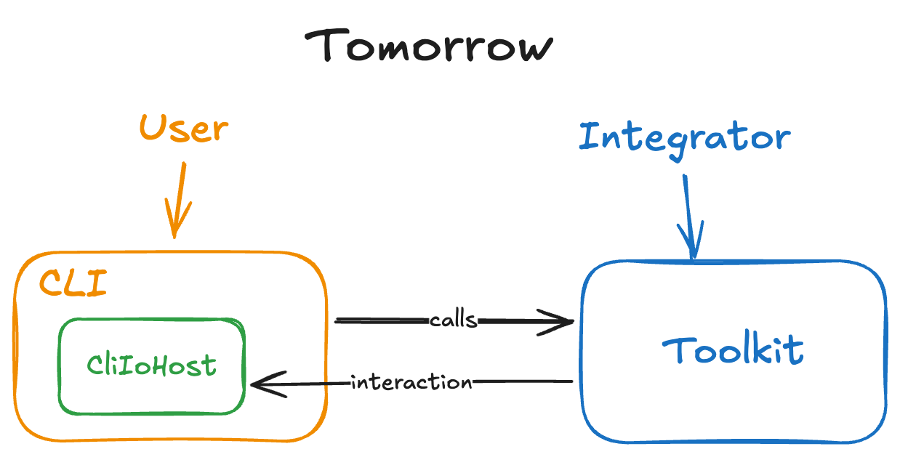
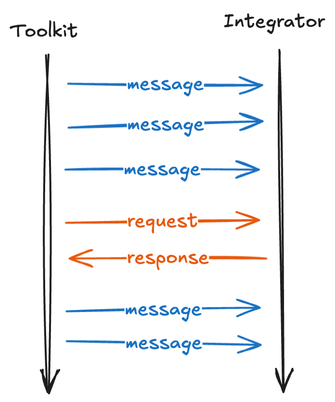
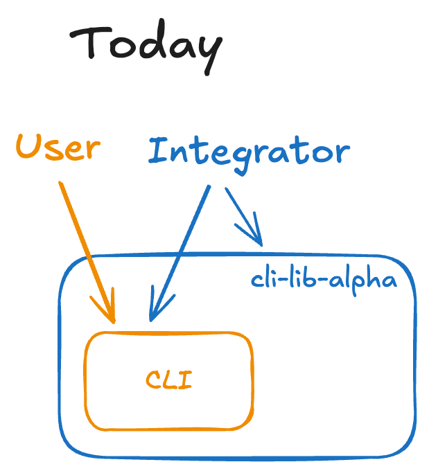
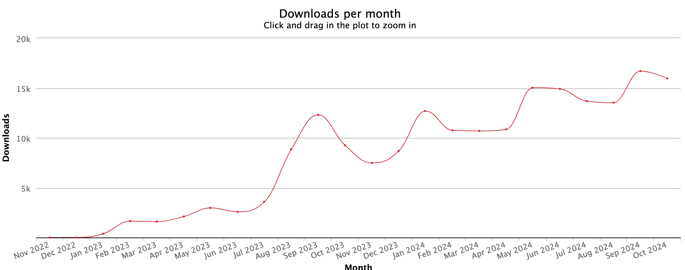

# Programmatic Toolkit

* **Original Author(s):**: @mrgrain
* **Tracking Issue**: #300
* **API Bar Raiser**: @rix0rrr

The [Programmatic Toolkit] allows integrators to build lifecycle management solutions for CDK applications.
It provides them with full control over all output and allows to interweave actions with custom steps.

## Working Backwards

### README

[Programmatic Toolkit] is a library to run CDK actions programmatically.
The package provides implementations for the following actions:

- `bootstrap`
- `list`
- `synth`
- `deploy`
- ...

#### Self-contained example

```ts
// Create a [Programmatic Toolkit]
await using cdk = new Toolkit({
  ioHost: new CloudWatchLogsIoHost('my-log-stream'), // write all output to CW logs
  // awsSdkProvider: new DefaultAwsSdk(), // optional
});

// Define the CloudExecutable
const cx = CloudExecutable.fromCloudAssemblyProducer(async (context) => {
  const app = new cdk.App({ context });
  const stack = new cdk.Stack(app);
  return app.synth();
});

// Synth and store a cached CloudExecutable, this won't run synth again
const cxCache = await cdk.synth(cx);

// Deploy our pre-synth'ed app
const deployment = await cdk.deploy(cxCache, { stacks: ['MyTestStack'] });

// Returns a list of ARNs of the deployment
return deployment.listResources().filter(r => r.arn);
```

#### Toolkit setup

A default toolkit can be setup with no additional configuration:

```ts
const cdk = new Toolkit()
```

You can customize the functionality of the toolkit.
The main options are provided through `ioHost` and `awsSdkProvider`.

```ts
const cdk = new Toolkit({
  ioHost: new MyIoHost(),
  awsSdkProvider: new MyAwsSdkProvider(),
})
```

#### Messages and Requests

The toolkit emits *messages* and *requests* to structure interactions.
A *request* is a *message* that requires the receiver to respond, otherwise the toolkit will continue with a default response.

For every emitted message, the toolkit calls the `notify` or `requestResponse` method of an `IoHost` (more on this below).
Every call is `await`ed for its completion, allowing to receiver to perform asynchronous operations like HTTP calls.
It's okay for the receiver not do anything with the input and return immediately.
The type definition of messages and requests is as follows:

```ts
interface IoMessage<T> {
  time: string;
  level: 'error' | 'warn' | 'info' | 'debug';
  action: 'synth' | 'list' | 'deploy' ... ;
  code: string;
  message: string;
  data?: T;
}

interface IoRequest<T, U> extends IoMessage<T> {
  defaultResponse: U;
}
```

##### Changes and Breaking Changes to messages and requests

Messages and requests play an important role in structuring interactions with the Toolkit.
Because messages will be emitted in many places, they will change frequently.
An integrator needs to take great care when handling messages and basing implementation on them.
A list of all messages and requests is available at [TODO: link to auto-generated list of messages].

For a given message code, the following changes are considered breaking:

- a backwards incompatible change to type definition of message data,
  e.g. changing the type of a property from `string` to a `boolean` or removing a non-optional property
- removing data from a message that previously had data attached
- removal of a message or request
- changing the type from request to message

For the avoidance of doubt, the following changes are explicitly **not** considered breaking:

- a change to the message text
- a change to the log level
- a change to the default response of a request
- a change to the order messages and requests are emitted in
- the addition of new messages and requests
- a change to the data possibly attached to the message as long as it adheres to the same type
- adding data to a message that previously had no data
- a backwards compatible change to the type definition of message data, e.g. adding a new property to an interface

#### IoHost

Message receivers need to implement the `IIoHost` interface.
The `IoHost` is responsible for handling all logging and interactions:

```ts
interface IIoHost {
  /**
   * Notifies the host of a message.
   * The caller waits until the notification completes.
   */
  async notify(msg: IoMessage<T>);
  
  /**
   * Notifies the host of a message that requires a response.
   * 
   * If the host does not return a response the suggested
   * default response from the input message will be used.
   */
  async requestResponse(msg: IoRequest<T,U>): U | undefined;
}
```

For every message, the toolkit calls `notify` or `requestResponse` is called respectively.

The a generic `IoEmitter` is available to provide a familiar event emitter interface.
This implementation will do nothing for messages and requests that don't have a registered listener, i.e. the default response will be used as required.

```ts
const io = new IoEmitter();
io.on('deploy', async (msg: IoMessage) => { /* do something */ });
io.once('deploy:confirm-security', async (msg: IoRequest<boolean>): boolean => {
  // reject the deployment
  return false;
})
```

The `CommandLineIoHost` is available, implementing all the interaction behavior for the AWS CDK CLI [TODO: this might end up in a separate package]:

```ts
const io = new CdkCliHost({
  isInteractive: true
})
```

##### SdkProvider

  [Alternative: Make this `CredentialsProvider` or `SdkConfigProvider` instead]

The `AwsSdkProvider` defines how the toolkit interacts with AWS services.
A default provider is available.
You can provide a custom class implementing the `IAwsSdkProvider` interface.
A standard `SdkProviderForCdk` is available that includes all features of the AWS CDK CLI [TODO: this might end up in a separate package].

#### Cloud Executables

A Cloud Executable is the primitive that defines a deployable AWS CDK application.
AWS CDK apps might need to be synthesized multiple times with additional context values before they are ready.
This concept is what the Cloud Executable represents.

The most flexible way to obtain a Cloud Executable is from a function returning a `CloudAssembly`.
Providing a function allows your implementation to integrate with the [Programmatic Toolkit]'s multi-pass requirement.
The function will be called one or more times with the known context values of the current iteration.
It must then use these values to synthesize and return a `CloudAssembly`.
For all features (e.g. lookups) to work correctly, the `App()` must be instantiated with the received context values.
Since it is not possible to update the context of an app, it must be created inside the function scope.

A basic implementation would look like this:

```ts
const cx: ICloudExecutable = CloudExecutable.fromCloudAssemblyProducer(
  async (context: Record<string, any>): cxapi.CloudAssembly => {
    const app = new cdk.App({ context });
    const stack = new cdk.Stack(app);
    return app.synth();
  }
);
```

Existing applications, can also be used by simply passing an AWS CDK app directory (containing a `cdk.json` file):

```ts
const cx: ICloudExecutable = CloudExecutable.fromCdkApp("/path/to/cdk/app");
```

Alternatively the `cdk.out` directory from a previous synth can be used as well:

```ts
const cx: ICloudExecutable = CloudExecutable.fromCdkOut("/path/to/cdk.out");
```

#### Actions - synth

The `synth` action takes a Cloud Executable and synthesizes it in to a `CloudAssembly`.

```ts
const cx: ICloudExecutable =  await cdk.synth(cx, { stacks: ['MyTestStack'] });
```

It returns a Cloud Executable that is cached on disk and can be used as input for other actions.

#### Actions - bootstrap

The `bootstrap` action takes in a list of environments and bootstraps each environment with the provided configuration:

```ts
const envs: string[] = cx.environments();
await cdk.bootstrap(envs, { trust: ['000000000000', '111111111111'] });
```

It returns a list of stack deployments.

#### Errors

All errors are thrown as exceptions and the integrator must be prepared to handle them.
Expected errors are structured data and extend the `IoMessage` interface.

```ts
interface ToolkitError extends IoMessage {
  source: 'toolkit' | 'user';
  type: 'authentication' | 'cloudformation' | 'validation' ...;
  fqn?: string;
}
```

The toolkit might throw other exceptions.
These are bugs and you should report them by [raising an issue](https://github.com/aws/aws-cdk/issues/new?assignees=&labels=bug%2Cneeds-triage&projects=&template=bug-report.yml&title=%28toolkit%29%3A+Untyped+Exception+%28short+description%29).
To assist integrators with detecting the type of error, the following helper methods are available.
Even though errors are typed, you should not rely on `instanceof` checks because it can behave unexpectedly when working with multiple copies of the same package. [TODO: insert reference link]

```ts
try {
  await cdk.deploy(...);
} catch (e: unknown) {
  if (ToolkitError.isToolkitError(error)) {
    // handle toolkit errors
  } else if (ToolkitError.isUserError(e)) {
    // handle user code errors
  }
  
  if (ToolkitError.isCdkError(e)) {
    // handle any cdk errors
  }
}
```

##### Recoverable Errors [TODO: Naming. All errors in JS are recoverable. Ruby calls this rescue/retry]

  [Alternative: Do not do this at all]
  [Alternative: Formalize a retry budget]

While most errors are terminal, it's possible to recover from some.
For example if an authentication token is expired, an integrator may prompt the user to re-authenticate via a browser login, before continuing with the action.
With recoverable errors, the integrator can return to normal program flow after an issue has been addressed.

In the [Programmatic Toolkit], recoverable errors are implemented as a special type of request.
By default, errors are not attempted to recover.

```ts
interface RecoverableError extends IoRequest<T, U> {
  level: 'error';
  defaultResponse: {
    retry: boolean; // indicates if the block should retried
    // ... other response values
  };
  data: {
    isRecoverable: true;
    attempt: number; // the number of the current attempt, starting with 1
  }
}
```

When `IoHost.requestResponse()` is called with a recoverable error, the integrator may choose to return `retry: true` to indicate the block should be retried.
A single retry is allowed, if the block fails again with the same error it will be raised as an exception.
Retries are not guaranteed and integrators must handle the case where a requested retry is not executed.
Recoverable errors are rare as they require special programming and not always possible.

##### Synth-time Errors

There is a subtle semantic difference between errors that originate from the [Programmatic Toolkit] and from a Cloud Executable, i.e. from a user's app:
Errors from the [Programmatic Toolkit] are typically misconfigurations and maybe fixable by an integrator,
while errors from a Cloud Executable are usually code problems and only fixable by the user.

The [Programmatic Toolkit] emits all synth-time errors as recoverable errors.
When implementing a custom Cloud Executable in code, you may prefer to handle synth-time errors directly in code:

  [Alternative: Don't allow retries on user code]
  [Alternative: Implement retries as regular requests]

```ts
class MyCloudExecutable implements ICloudExecutable {
  async exec(context: Record<string, any>): cxapi.CloudAssembly {
    try {
      const app = new cdk.App({ context });
      const stack = new cdk.Stack(app);
      return app.synth();
    } catch(e: unknown) {
      // handle errors here
    }
  }
}
```

#### Dispose

The `Toolkit` class implements an `AsyncDisposable` Resource according to the [Explicit Resource Management](https://github.com/tc39/proposal-explicit-resource-management) feature in ECMAScript.
This means that any resources used by the [Programmatic Toolkit] are automatically cleaned-up.
`AsyncDisposable` guarantees this clean-up even in case of an uncaught exception.

You may also call the `dispose()` method directly.
We recommend to do this inside a `finally` statement to guarantee execution.

```ts
const cdk = new Toolkit();
try {
  cdk.deploy(...);
} finally {
  await cdk.dispose();
}
```

---

Ticking the box below indicates that the public API of this RFC has been
signed-off by the API bar raiser (the `status/api-approved` label was applied to the
RFC pull request):

```
[ ] Signed-off by API Bar Raiser @xxxxx
```

## Public FAQ

### What are we launching today?

We are launching the [Programmatic Toolkit], a new TypeScript package that enables integrators to build custom lifecycle management solutions for CDK applications.
The toolkit provides implementation for all of the CDK's actions like bootstrap, synth or deploy.
It gives integrators full control over all output and allows to interweave actions with custom steps.

We are also launching `@aws-cdk/jsii-toolkit`, a version of the [Programmatic Toolkit] for jsii users.
It offers the same main functionality as the [Programmatic Toolkit], with some customization features limited due to jsii constraints.

### Why should I use this feature? [USE CASES]

#### A. ACME cli tool

ACME develops a custom cli tool to abstract the hard parts of creating REST APIs.
ACME's data scientists are able to place a `app-config.yml` file in a repository.
They then write a FastAPI app compatible with Lambda to serve their models.
Then they run `acme-cli deploy serverless-rest-api --config app-config.yml`.
This is great, because the data scientists don't have to know anything about CloudFormation, the AWS CDK, or other IaC tools, but they can easily deploy apps.

With [Programmatic Toolkit] ACME can automatically handle bootstrapping for its users and it allows ACME to provided targeted output to theirs
Real world examples:

* [Amplify](https://github.com/aws-amplify/amplify-cli) uses CDK apps to enable their users to build cloud-enabled frontend and mobile apps.
  Amplify is wrapping the CDK in a custom CLI and adds additional features like sandbox environments.
* [The Guardian](https://github.com/guardian/cdk) is providing their engineers with a construct library and cli tool to create new projects and migrate from existing CloudFormation YAML based stacks.
* [Pulumi CDK Adapter](https://github.com/pulumi/pulumi-cdk) is enabling Pulumi users to use CDK constructs in their applications.
  The tool uses `cli-lib-alpha` to synthesize user's apps and integrate with other Pulumi tooling.

#### B. Integration testing

Build an app, e.g. a serverless REST API and then run functional tests against it.
That could mean sending several requests to a REST API and watching for expected responses.
On completion the stack is torn down and a report provided to the user.
This can also be used to automatically create test environments from a Pull Request and keep them up-to-date until the change is merged, at which point the environment is destroyed again.

The [Programmatic Toolkit] enables execution of integration test cases as soon as the relevant resources are deployed (as opposed to the whole stack).
It can be run from within a Lambda function and handle complex error scenarios.

Real world examples:

* [integ-runner](https://github.com/aws/aws-cdk/tree/v2.165.0/packages/%40aws-cdk/integ-runner) is orchestrating lifecycle actions on behalf of the users to provide end-to-end integration testing.
  It uses a wrapper library to call the AWS CDK CLI via subshell.
* [@aws-cdk-testing/cli-integ](https://github.com/aws/aws-cdk/blob/main/packages/%40aws-cdk-testing/cli-integ/lib/with-cdk-app.ts) executes complex test scenarios for features like authentication, bootstrapping, garbage collection as well as thrid-party integrations.
  It runs tests in specially prepared environments.
  To script the setup and the test execution, it uses a custom subshell wrapper to execute CLI commands.

#### C. Jupyter Notebooks

Writing a Python Jupyter Notebook that uses complex computations on large datasets.
These computations need to happen in the cloud using EMR.
The EMR cluster and tasks can be defined and deployed from within the Notebook.
API calls are then used to execute the tasks, download results and remove the infrastructure.

Today users are limited to make imperative SDK calls or to provide a separate companion app with additional instructions.
With the [Programmatic Toolkit], CDK apps can be deployed directly from within a Notebook and resources can be referenced directly as the result of CDK actions.

Real world examples:

* [Boto3 with Jupyter Notebook](https://blog.jimmyray.io/boto3-with-jupyter-notebook-721a01eab285)
* [Using Jupyter Notebooks as your cloud IDE for DevOps](https://guyernest.medium.com/using-jupyter-notebooks-as-your-cloud-ide-for-devops-a49c03e5cb3f)

## Internal FAQ

### Why are we doing this?

The [Programmatic Toolkit] unlocks new scenarios for programmatic use of the AWS CDK.
Today integrators can call the AWS CDK CLI via a shell or use `cli-lib-alpha` for programmatic access.
Both approaches limit integrators to inherit the exact behavior of the CLI, including all interaction patterns with the user.
This is an obvious mismatch: Programmatic integrations don't require interaction, unless that's the specific use case an integrator is building.
Additionally the interface `cli-lib-alpha` offers is not optimized for programmatic use, further limiting its usefulness.

The [Programmatic Toolkit] aims to solve these limitations by providing a proper programmatic interface to CDK's functionality,
sallowing integrators to have full control over all output and combine CDK actions with custom steps in their applications.
With this project, we are changing the paradigm.
Programmatic usage will become an equally considered use case, in fact the proposed implementation will require it to be considered first.

### Why should we _not_ do this?

There are requirements that cannot be satisfied with the current available options.
Specifically hooks, control over logging, structured errors and typed returns are not possible.

Implementing the [Programmatic Toolkit] proposal will make it more difficult to add new features to the CLI.
It creates a new level of abstraction, that needs to be considered going forward.
The complexity of these abstractions might discourage community contributions and increase the time to build new features.

We are only aware of a small number of interested integrators,
and these might potentially be satisfied by smaller, more targeted improvements.

### What is the technical solution (design) of this feature?

The [Programmatic Toolkit] is building on the existing design of the `cli-lib-alpha` package.
User apps are defined as a Cloud Executable and can be created in multiple ways like reading existing on-disk CDK apps or adding code directly by implementing an interface.

A new [Programmatic Toolkit] package is introduced to contain the implementation for all actions.
A new [Toolkit] class provides access to the actions and offers control over configuration and certain features.
Specifically **SDK configuration** (`SdkProvider`) [TODO: Maybe just auth] and **interactive controls** (`IoHost`) will become part of the public contract.



To keep the solution maintainable, the codebase will restructured into three main packages:

* `@aws-cdk/toolkit` the main package containing all implementation of actions and public interfaces.
* `aws-cdk` the existing CLI. Contains a wrapper to translate command line input to [Programmatic Toolkit] calls.
  CLI focused implementations of `IoHost`, `SdkProvider` defaults.
* `@aws-cdk/jsii-toolkit` a jsii wrapper for the toolkit, contains jsii compatible version of `IoHost`, `SdkProvider` defaults.

To limit the maintenance burden for the team, we will use a codegen solution where possible for the two wrapper packages.
Detailed design for this is tbd, but can change over time since it's not public facing.
The main idea is that actions and their options will be defined in a central place with deviations for the CLI and jsii packages included as annotations.

#### IoHost

This is the central piece of the proposal.
Based on tenet T5, we are aiming to separate actions from interactions.
This is important because programmatic use is inherently different to interactive use.

A good example for this is `cdk deploy` and the `--rollback` / `--no-rollback` options.
Typically `--no-rollback` is used to increase iteration speed during development and a production deployment would run with `--rollback`.
However there are situations in which a rollback is still preferable.
For example if the stack is in a failed state or if the update contains a replacement which must always be run with rollbacks enabled.
In an interactive CLI it makes sense to prompt the user for their input if these situations are detected, even if the user originally had `--no-rollback` specified.

Now think of a different interactive mode: An app with a UI.
All the same applies as before, but the implementation of the interaction will be different.
And finally we also need to handle this scenario in non interactive environments.
Although this is the easiest because we simply respect the value of the flag.

`IoHost` formalizes how we deal with interaction.
In our code base, we codify where we have decision points that potentially warrant a (different) response from the integrator and in extension the user.



We have an other requirement, that is in a similar space: Full control over all output.
Think different interaction modes (none vs console vs app), but also rewriting the message text messages and re-prioritization w.r.t to log levels.

Both together make up the interface of `IoHost`.
See the readme above for more details.

#### Messages and Requests

The proposed `IoHost` design requires us to commit to a stable set of messages and requests send between [Programmatic Toolkit] and integrator.
A detailed definition of what would constitute a breaking change is included in the readme above.

To support integrations, we will need to publish a list of all messages.
We will use static code analysis to automatically compile and publish this list without adding additional maintenance burden on to the team.

#### SdkProvider

The main purpose of this feature is to expose SDK configuration to an integrator.
We will be providing our default implementation as a drop-in solution for CLI-like environments.
However other possible scenarios like Electron or even web apps will require much different setups.

Authentication is the primary focus of this public contract.
However from our own experience we are aware that authentication can also extend to other parts of SDK configuration.
For example proxies require HTTP transport configuration and default timeouts and retries are also worth considering.

The existing plugin system is a superset of the SDK v3's `AwsCredentialIdentityProvider` type as it introduces a mode (reading or writing).
The public contract will subsume and formalize this.




### Is this a breaking change?

No.

### What alternative solutions did you consider?

> Briefly describe alternative approaches that you considered. If there are
> hairy details, include them in an appendix.

<!-- Event Stream
Only read, and non-blocking. Doesn’t support hooks and wait for me to do this thing.

Synth-time Errors - I/O based
One alternative is to use I/O based protocols, either writing errors to disk in a special format or printing them to stderr in a more structured way.
The pro of this approach is that it would allow support for other jsii languages NFR4,jsii package However, the con is that it requires writing to disk, or parsing from a string which can be error-prone.
This approach was disregarded for its complexity in implementation and added surface area. It is also not strictly required for FR3,Structured errors and could be added as a later extension. -->

### What are the drawbacks of this solution?

#### Increased API surface

The main risk is the larger surface area.
Previously we have only committed to the CLI interface, which is fairly limited by design.
The new API surface covers additional option interfaces, emitted messages and newly introduced primitives such as a `CloudExecutable` or `StackDeployment`.

Our primary mitigation is to constrain our the new APIs to real world end-to-end use cases (see tenet T2).s

#### Separating actions and interaction makes it harder to add features to the CLI

The solution includes a paradigm shift to consider programmatic access first and the CLI second.
This shift is codified by the introduction of a new package that contains all actions and the CLI calling them.
With this, we now have more work to do: Any feature needs to first consider its programmatic usage and then derive the CLI usage from it.

We mitigate this by providing tooling that helps contributors to define different inputs and defaults declaratively and generate (parts of) the code for it.
Additional test tooling will help writing the same test cases onces for different input modes.

#### A lot of refactoring

The proposal requires to move a lot of code around, mostly into new packages.
It also implies refactoring of existing interfaces to match the new API design.
Both of these things are prone to human errors.

Mitigation for this is test coverage and separating out PRs that are purely moving code, from actual changes.

### Why is `CloudFormationDeployments` not include in this proposal?

`CloudFormationDeployments` is a class providing a low-level API to deploy CloudFormation templates.
Based on customer feedback there appear to be two main scenarios where the CloudFormationDeployments is currently used:

* As a workaround for the lack of programmatic access.
* By tools that treat CDK primarily as a template generator and implement their own deployments, to avoid some of CFNs implementation details.

We believe both scenarios will be much better addressed by this proposal.
The CDK *is* the tool to avoid CFN implementation details.
With the proposed [Events] feature, it will be possible for integrators to deeper integrate with the deployment process.

### Why create a new package? Why not use `cli-lib-alpha`?

We are taking the working parts of `cli-lib-alpha` and are building on top of them.
By initially focusing on TypeScript users, we will be able to deliver more, faster.
jsii support in `cli-lib-alpha` does not exist and we plan to deliver a new jsii focused package that actually works.

Beside the above, the old name implies it offers the same functionality as the CLI.
This RFC explains why a CLI and programmatic access are different modes.
A new name will reflect this change better.

### What is the high-level project plan?

The project will be delivered incrementally over multiple months.
We start with core functionalities and the most commonly used actions.
A more detailed project plan will be provided when it is available.

#### Milestone 1 // 8 two-dev-weeks

Covers foundational features and the most commonly used actions.

* Actions: synth, deploy, watch, destroy
* Event system
* structured errors
* new packages
* align configuration
* implement options for cli-lib
* generate options from toolkit interface

#### Milestone 2 // 8 two-dev-weeks

Added support for actions required to cover the complete lifecycle of a CDK app.
Typed returns to increase support for even more complex scenarios.
Use [Programmatic Toolkit] in `integ-runner` and integration tests.

* Actions: bootstrap, list, diff, rollback
* Typed Returns for all current actions
* events for above actions
* integration Tests
* integ-runner

#### Milestone 3 // 4 two-dev-weeks

GA. Added support for operational actions and release of the jsii toolkit.

* Actions: context, metadata, notices, acknowledge, doctor, docs, gc
* Typed Returns for all above actions
* events for above actions
* new jsii package, removal of cli-lib-alpha

#### Milestone 4 // 4 two-dev-weeks

GA. Added support for highly interactive actions.

* Actions: init, migrate, import
* Typed Returns for all above actions
* events for above actions
* Hooks?

### Are there any open issues that need to be addressed later?

None. The project plan above covers all intended functionality.

## Appendix

### A. GitHub issues

* [CLI: Using the CDK programmatically · Issue #15851 · aws/aws-cdk · GitHub](https://github.com/aws/aws-cdk/issues/15851)
* [(aws-cloudformation) Deploy a CDK stack in a Lambda · Issue #15447 · aws/aws-cdk · GitHub](https://github.com/aws/aws-cdk/issues/15447)
* [How to deploy CDK app via Lambda · Issue #2637 · aws/aws-cdk · GitHub](https://github.com/aws/aws-cdk/issues/2637)
* [Programmatically expose the output of CDK list · Issue #8436 · aws/aws-cdk · GitHub](https://github.com/aws/aws-cdk/issues/8436)
* [Can we run synth programmatically? · Issue #1467 · aws/aws-cdk · GitHub](https://github.com/aws/aws-cdk/issues/1467)
* [SST usage of AWS CDK CLI code · Issue #23182 · aws/aws-cdk · GitHub](https://github.com/aws/aws-cdk/issues/23182#issuecomment-1375923880)
* [Programmatic diff inspection · Issue #2637 · aws/aws-cdk · GitHub](https://github.com/aws/aws-cdk/issues/679)
* [jsii support · Issue #1133 · aws/aws-cdk · GitHub](https://github.com/aws/aws-cdk/issues/1133)

### B. Tenets

* **T1: Programmatic lifecycle management is a first-class citizen.**
  We want to build internal tooling and workflows that put programmatic lifecycle management front and center during development.
* **T2: Solutions for real customer use cases, not hypothetical ones.**
  We want to prioritize complete end-to-end features that solve real customer problems.
  The existing surface area is already large enough to catch up on.
  For now, we will not offer lower-level building blocks which often already exist in other tooling.
* **T3: A first-in-class TypeScript experience.**
  All sufficiently complex integrations with the programmatic interface will be build as Node/JavaScript apps.
  For this primary use case we want to offer a delightful experience.
* **T4: Participate in the jsii ecosystem.**
  Whenever it is possible and sensible, we strive to contribute in the jsii ecosystem.
  When we can, our solutions are made available to users of all jsii languages.
* **T5: Separating out the actions from the interactions.**
  A programmatic API should focus on the actions it offers.
  A CLI needs to focus on the interactions with a customer.
  We want to untangle both and then reconnect them through well-defined interfaces.

*Some tenets stand intentional in conflict with each other.
The proposed design aims to resolve these tensions.* Here are some explicit call-outs:

*T3 TypeScript vs T4 jsii ecosystem* - The tension is that participating in the jsii ecosystem usually means that all features must be jsii compatible.
It implies a lo-fi solutions compared to native TypeScript.
Both tenets are aimed at different use cases.
A tool absorbing CDK actions management will realistically be build in TypeScript and should be able to make the full use of it.
A jsii package will benefit the scripting community and use in Notebooks.
There are naturally some TypeScript features that will be impossible to implement for jsii, e.g. Error types or custom SDK providers.

*T2 Real use cases vs T4 jsii ecosystem* - The tension is that there is little evidence that users want a jsii version of this.
Some requests are documented for Python to improve Notebooks support.
But participating in the jsii ecosystem means to always publish for all languages even if there is no explicit ask.

### C. Requirements

The identified functional and non-functional requirements.
Inclusion in this list does not imply the proposal addresses a requirement directly or exactly in the way the requirement describes it.

#### Functional (FR)

| #    | Description                                                                                                                                                                                                                                                                                                                                                                                                                                                                                                                                                                                                                                                                                      |
| ---- | ------------------------------------------------------------------------------------------------------------------------------------------------------------------------------------------------------------------------------------------------------------------------------------------------------------------------------------------------------------------------------------------------------------------------------------------------------------------------------------------------------------------------------------------------------------------------------------------------------------------------------------------------------------------------------------------------ |
| FR1  | Execute the CDK actions synth, deploy, watch & destroy                                                                                                                                                                                                                                                                                                                                                                                                                                                                                                                                                                                                                                           |
|      | Support the most commonly used actions (commands) to manage the deployment of CDK apps on behalf of users.                                                                                                                                                                                                                                                                                                                                                                                                                                                                                                                                                                                       |
| FR2  | All configuration can be provided via API (i.e. do not require cdk.json or cdk.context.json)                                                                                                                                                                                                                                                                                                                                                                                                                                                                                                                                                                                                     |
|      | Integrators managing the CDK lifecycle on behalf of the customer must be able to take care of all configuration options and where needed exposes them to customers through it’s own interface. To support this, all configuration options for the relevant actions must be configurable via the programmatic API. In particular it has been noted that watch patterns are only configurable via a file.                                                                                                                                                                                                                                                                                          |
| FR3  | Structured errors                                                                                                                                                                                                                                                                                                                                                                                                                                                                                                                                                                                                                                                                                |
|      | Integrators will have different needs for error reporting than the CDK. Currently integrators must string-match CDK errors and map them to something else. Instead CDK should emit structured errors identified by well-defined error codes. An integrator should be able to differentiate between CLI errors, and synth-time errors. CLI errors are typically related to misconfiguration which an integrator might want to own. Synth errors can typically be addressed by users by making changes to their CDK app. CDK should emit and handle both types transparently separate from each other. When possible, CDK should maintain JavaScript errors as they are emitted by the user’s app. |
| FR4  | Full control over output (logging)                                                                                                                                                                                                                                                                                                                                                                                                                                                                                                                                                                                                                                                               |
|      | Integrators have full control over any logging output. CDK should emit any logs as structured data, containing at least the log level, a timestamp and the proposed log message. For log events containing structured data, the data should be attached in structured form.                                                                                                                                                                                                                                                                                                                                                                                                                      |
| FR5  | Complete lifecycle management                                                                                                                                                                                                                                                                                                                                                                                                                                                                                                                                                                                                                                                                    |
|      | Cover the complete lifecycle of a CDK app. It will possible to fully automated the regular lifecycle of a CDK app. This extends the list of supported actions with the following: bootstrap, list, diff, rollbackIn particular the diff action must yield an inspectable representation of the stack difference.                                                                                                                                                                                                                                                                                                                                                                                 |
| FR6  | Integration tests & integ-runner                                                                                                                                                                                                                                                                                                                                                                                                                                                                                                                                                                                                                                                                 |
|      | The solution should be sufficient to update existing integration testing solutions like `integ-runner` and integ-tests library to use the new solution.                                                                                                                                                                                                                                                                                                                                                                                                                                                                                                                                          |
| FR7  | Support operational actions                                                                                                                                                                                                                                                                                                                                                                                                                                                                                                                                                                                                                                                                      |
|      | Support for operational actions. While of these are informational, import will unlock additional migration use cases. This extends the list of supported actions with the following: import, context, metadata, notices, acknowledge, doctor, docs, gc                                                                                                                                                                                                                                                                                                                                                                                                                                           |
| FR8  | Support project generation actions                                                                                                                                                                                                                                                                                                                                                                                                                                                                                                                                                                                                                                                               |
|      | Extend support to actions used for project generation. This extends the list of supported commands with the following: init, migrate                                                                                                                                                                                                                                                                                                                                                                                                                                                                                                                                                             |
| FR9  | Typed returns                                                                                                                                                                                                                                                                                                                                                                                                                                                                                                                                                                                                                                                                                    |
|      | Return values of toolkit actions should be meaningful and provide reusable data. E.g. synth returns the created assembly that can be reused in other actions. List returns stacks. Diff returns an inspectable representation of the diff. Deploy returns information on the just deployed stacks. Etc.                                                                                                                                                                                                                                                                                                                                                                                          |
| FR10 | Events                                                                                                                                                                                                                                                                                                                                                                                                                                                                                                                                                                                                                                                                                           |
|      | In extension to logging focused events, the CDK should emit events for API operations including progress and state transitions (e.g. for deployment: synth complete, assets built, assets published, Hotswap/CFN deployment started ...). If available, these events should include additional data like the arn of the stack or a progress percentage. An integrator must be able to execute blocking code on these events. This will allow them to e.g. schedule pre-build scripts before synth starts or to update a service registry after deployment completed.                                                                                                                             |
| FR11 | Event hooks                                                                                                                                                                                                                                                                                                                                                                                                                                                                                                                                                                                                                                                                                      |
|      | As an extension to events, hooks provide the ability to manipulate and return specific data to the regular flow. Hooks will be more limited than events, but could allow to change what stacks are deployed, e.g. always adding a required support stack or changing the CFN template before the upload.                                                                                                                                                                                                                                                                                                                                                                                         |
| FR12 | Custom Authentication configurations                                                                                                                                                                                                                                                                                                                                                                                                                                                                                                                                                                                                                                                             |
|      | Authentication is one of the most complex parts of the CDK. Integrators will want to offer their users a streamlined solution focused on their customer needs. The solution should allow for integrators to provide their own solution. This could be implemented by allowing integrators to define a custom SDK Provider.                                                                                                                                                                                                                                                                                                                                                                       |

#### Non-functional (NFR)

| #    | Description                                                                                                                                                                                                                                                                                                                                                                                                                                                                                                            |
| ---- | ---------------------------------------------------------------------------------------------------------------------------------------------------------------------------------------------------------------------------------------------------------------------------------------------------------------------------------------------------------------------------------------------------------------------------------------------------------------------------------------------------------------------- |
| NFR1 | API stability                                                                                                                                                                                                                                                                                                                                                                                                                                                                                                          |
|      | CDK team must provide a stable API for integrators. We need to define expectations w.r.t. what constitutes breaking changes (e.g. Do changes to events qualify?) and set expectations.                                                                                                                                                                                                                                                                                                                                 |
| NFR2 | Performance                                                                                                                                                                                                                                                                                                                                                                                                                                                                                                            |
|      | A key consideration for integrators team is to improve the end-to-end performance of their user's deployments. Key performance indicator should be the synth action using a minimal example app. The baseline benchmark is the current sub-process call `cdk --app="npx ts-node app.ts`. The synth action is used as a proxy metric for time spend invoking the CDK CLI framework. Other actions (deploy, destroy) are dependent on external systems.Performance should not degrade compared to the baseline.          |
| NFR3 | Execution within single process                                                                                                                                                                                                                                                                                                                                                                                                                                                                                        |
|      | A direct consequence of FR3, FR4 and NFR2. To achieve the desired user-experience w.r.t to error handling, message logs and performance, integrators need to be able to execute the listed actions within a single Node.js process. Currently two sub-processes are required: a) to call the CDK CLI, and b) to call the customers CDK app. Both steps will be able to run within a single process that is also the integrators tool. This requirement only covers JavaScript code and not uncompiled TypeScript code. |
| NFR4 | jsii package                                                                                                                                                                                                                                                                                                                                                                                                                                                                                                           |
|      | To enrich the jsii ecosystem we will strive to make as much functionality as possible available to users in the jsii ecosystem (Python, Java, .NET, Golang). This may however be a reduced feature set compared to our offering for TS integrators.                                                                                                                                                                                                                                                                    |
| NFR5 | Maintain support for plugin users                                                                                                                                                                                                                                                                                                                                                                                                                                                                                      |
|      | The CLI offers support for various types of plugins. This needs to be continued to supported. We are also aware that some users are currently using functionality that was never intended to be used by the general public. This usage is currently tolerated and we may need to provide alternatives.                                                                                                                                                                                                                 |
| NFR6 | Maintainability                                                                                                                                                                                                                                                                                                                                                                                                                                                                                                        |
|      | This new interface must replace or subsume the maintenance burden of the CLI; they cannot diverge. Responsibilities need to be clearly split between components. E.g. if the CLI does anything other than handling console I/O, it’s a problem.                                                                                                                                                                                                                                                                        |

### D. Glossary

**Action** (Toolkit action or lifecycle action)\
Broadly what the current CLI commands are, i.e. bootstrap, synth, list, deploy, destroy, etc.

**Integrator**\
A software system that is integrating with the [Programmatic Toolkit] to execute actions on a CDK app.
Today these systems are calling the CLI, in future they will use the [Programmatic Toolkit].
See also Use Case A.
This is opposed to users that are directly (or indirectly) interacting with the AWS CDK CLI.

**jsii ecosystem**\
Users and integrators that are using a jsii-supported language (Python, Java, .NET, Golang) instead of JavaScript/TypeScript.

### E. Usage of @aws-cdk/cli-lib-alpha


[Source](https://npm-stat.com/charts.html?package=%40aws-cdk%2Fcli-lib-alpha&from=2022-11-01&to=2024-10-2)
