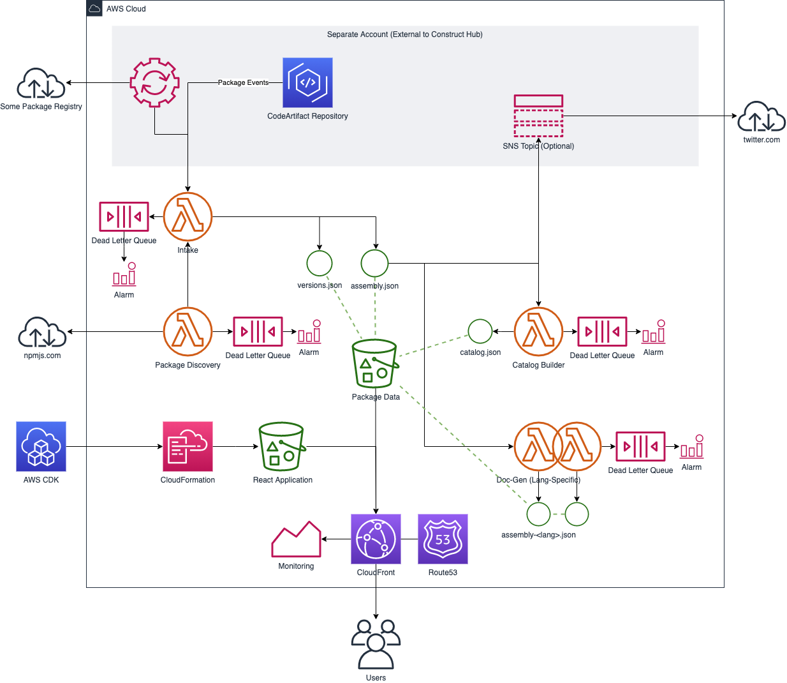

# Construct Hub

A community-driven hub for discovering and sharing construct libraries.

## Working Backwards

### PRESS RELEASE

Today, Amazon Web Services Inc., an Amazon company, announced the Construct Hub,
a service that makes it easy to find constructs (including AWS CDK,
CDK8s, CDKtf, Projen, ...) libraries and provides a centralized documentation
experience for those. Construct Hub automatically indexes custom construct
libraries as soon as they are published, without requiring any additional effort
from the author. The AWS CDK makes it easy for customers to build applications
by raising the level of abstraction of infrastructure components, and Construct
Hub makes it easy to discover, use and share custom-made constructs. To get
started with Construct Hub, visit `${TBD}`.

Construct Hub offers an integrated search experience, allowing customers to
easily find the right construct for their need. The built-in multi-language
documentation helps customers understand what features are available, and learn
how to correctly use the constructs in their chosen programming language.

The Construct Hub itself is developed as an open-source construct: members
of constructs community can freely participate in the development of the
service. Customers with specific needs are also able to deploy a private
instance of the Construct Hub, and integrate it with their package management
solution.

## FAQ

### What are we launching today?

Construct Hub is a new website that makes it easy for developers to discover,
use, and share constructs. The community has already published hundreds of CDK,
CDK8s, CDKtf, projen, ... constructs on the public registries like npmjs.com,
PyPI, Maven Central, and NuGet. However those are distributed repositories,
managed by numerous organizations, and lack centralized search tools sufficient
for developers to easily find the cloud infrastructure patterns they are looking
for, in the programming language they want to use.

Construct Hub automatically indexes all construct libraries published to the
various general purpose package managers, so that developers have a single place
to search for constructs, regardless of preferred programming language or
provisioning engine. Developers will find constructs published by AWS, partners,
and individual developers. Constuct Hub also generates unified documentation for
the constructs in all supported programming languages.

Construct Hub is also available as a deploymable CDK construct library, so
that enterprises and users with specific needs can host a private instance of
the catalog, making interally developed constructs easier for teams to find.
Just like the public instance of Construct Hub scans public repositories for
construct libraries, the private Construct Hub instance can be configured to
scan private repositories like AWS CodeArtifact, JFrog Artifactory, and others.

### Why should I use this feature?

The Construct Hub is a centralized place that helps discover and share
custom-made constructs compatible with the AWS Cloud Development Kit (CDK), CDK
for Kubernetes (CDK8s), CDK for Terraform (CDKtf), and other constructs domains
such as Projen. It shortens the time it takes to ship cloud applications by
allowing developers to discover constructs that address their infrastructure
requirements, and provides a unified cross-language documentation experience to
help developers integrate those constructs into their application.

Customers can also deploy a private instance of Construct Hub to facilitate
sharing infrastructure abstractions published to a private package registry
within the organization.

### Where can I find the Construct Hub?

The public instance of Construct Hub is at: `${TBD}`.

### How do I publish a package to Construct Hub?

Packages published to the public npm registry (npmjs.com) are automatically
indexed by the public instance of Construct Hub as long as they meet the
following prerequisites:

1. Cross-language support has been configured correctly using [jsii]
1. The `cdk` keyword is referenced (in the `keywords` key of `package.json`)

[jsii]: https://aws.github.io/jsii

### Can I opt packages out of the public instance of Construct Hub?

There is currently no self-service way to un-list a package from the Construct
Hub. If you would like your package to be removed from the public instance of
Construct Hub, please file an issue in GitHub. You will be required to prove
ownership of the package(s) you are requesting un-listing for.

### Can I trust all constructs listed on Construct Hub?

Construct Hub does not perform a comprehensive audit of packages it indexes.
You should not trust packages found via the Construct Hub any differently
from packages found via other package search tools or registries, such as
npmjs.com, Maven Central, PyPI, NuGet, etc.

## Specification

### Landing Page

> [Example rendering](#rendering-landing-page)

The landing page for the Construct Hub includes a search bar that allows
developers to search for constructs that solve their use-case using relevant
keywords, and optionally filtering on a specific programming language and
constructs domain (AWS CDK / CDK8s / CDKtf / Projen / ...).

It may also feature a short-list of packages, selected based on popularity or
latest release date.

### Search Results Page

When a search is performed using the search bar in the landing page (or in the
header of all other pages), a list of relevant results is displayed as tiles,
similar to the short-list of packages shown on the landing page.

### Package Detail Page

> [Example rendering](#rendering-package-detail-page)

Clicking on a given package's tile in the landing page or search result page
brings the user to a package detail page that represents the following
information:

- Package name, tags, and description
- Overview of publishing information (author, version, license, etc...)
  - Where possible, links to the source repository, issue tracker, etc... based
    on information registered in the `.jsii` assembly file.
- Install instructions
- Available languages
- Package's documentation
  - Rendered content of the package's `README.md`
  - API reference documentation, in all supported languages (only the version
    for the currently selected language is displayed)

The list of available languages is also a selector: upon clicking a language,
the installation instructions and documentation automatically switch to the
relevant form for the currently selected language.

### Support

The Construct Hub offers ways for customers to engage maintainers about
various problems, including the following (actually routed to GitHub issue
templates):

- A malicious package was identified
- Incorrectly rendered documentation
- Package un-listing request

When a contact request originates from a package detail page, the customer is
guided to the package's issue tracker or public repository if their issue is
with the package itself (and not about it's listing in Construct Hub). The
routing is based on metadata configured on the package itself, through the bug
tracker URL, repository URL, and homepage URL.

## Technical Design

### Overview



### What is the high level implementation plan?

#### Overview

The Construct Hub is a relatively simple static web application. While the
dataset it exposes (all Construct Libraries) may be relatively fast moving,
there is no necessity for newly published packages (or versions thereof) to be
indexed and presented on the application particularly quickly. A consistency
window between a couple of hours and a day is probably acceptable.

A simple data pipeline will ingest package publication events created by a
source-specific adapter (e.g: by polling on the CouchDB instance replica for the
[npmjs.com registry](https://skimdb.npmjs.com/registry)), and produce static
artifacts the website is based off of. This pipeline is in particular
responsible for extracting the `.jsii` assembly file from the npm packages, and
to prefetch all information necessary to back the webiste's search and package
detail pages.

#### Back-End

1. **Package Discovery:** The back-end for Construct Hub starts with a custom
   built event source, which implements the logic necessary to detect new
   packages that are relevant to the Construct Hub, and sends messages to an SQS
   queue for further processing. Notifications have the following attributes:

   Name        | Description
   ------------|----------------------------------------------------------------
   `assembly`  | The `.jsii` assembly included in the package
   `time`      | The timestamp at which the version was created
   `integrity` | An integirity check for the complete record

   In cases where the `assembly` object is too large, it may be staged in S3
   instead of being sent directly as part of the message payload. In such cases,
   the `assembly` field contains an S3 URI instead of a JSON object.

   Construct Hub comes with a built-in integration function that listents to
   changes on the [npmjs.com registry](https://skimdb.npmjs.com/registry)
   database. Operators of private instances are able to interface with other
   package registries (including private ones), such as CodeArtifact
   repositories, etc.

1. **Ingestion:** A Lambda function then picks up messages from the SQS queue
   and prepares the artifacts consumed by the front-end application, stored in a
   dedicated S3 bucket using the following key format:
   `assemblies/${assembly.name}/v${assembly.version}/assembly.json`

   This function validates the contents of the `assembly` to ensure the message
   was well-formed. In case the message is found to be incoherent, it is sent to
   a dead-letter queue and an alarm is triggered.

   It also creates or updates the `assemblies/${assembly.name}/versions.json`
   object, which contains a list of all versions ever indexed for the package,
   matched to the versions' current status (`deprecated`, `latest`, ...):

   Name        | Description
   ------------|----------------------------------------------------------------
   `v${major}` | All versions part of this major version stream, and their status

   [SemVer]: https://semver.org/spec/v2.0.0.html

   In order to ensure consistency of the contents of the `versions.json` object,
   its content will always be generated from the live inventory of objects in S3
   (and not incrementally using the update trigger event), and the last event
   timestamp will be written in an object metadata attribute. The S3 Bucket will
   have object versioning enabled, and once a new version of the `versions.json`
   object has been created, its metadata will be checked against any previous
   versions of the object, and the "current" version will be set to the one with
   the latest event timestamp if needed.

   The operator of private instances can provide an optional SNS topic which
   will be notified once the information for a new package version is ready to
   be browsed.

1. **Doc-Gen:** A series of Lambda functions prepare language-specific assembly
   files for each configured language, with adjusted naming conventions, and
   updated sample code fragments, and proceeds to store those at:
   `assemblies/${assembly.name}/v${assembly.version}/assembly-${lang}.json`.
   This transformation is backed by the `jsii-rosetta` tool, which is part of
   the [jsii project][jsii].

   [jsii]: https://aws.github.io/jsii

1. **Latest Updater:** A Lambda function keeps the `latest.json` object updated
   with the last 20 package versions indexed (according to the `time` field
   reported by the ingestion component).

1. **Catalog Builder:** A Lambda function keeps the `catalog.json` object
   updated with the latest versions of each package's major version lines, which
   backs the websites' search page. The object may be sharded if it becomes too
   large.

#### Front-End

The front-end consists in a simple [React] application hosted in an S3 bucket.
A CloudFront distribution fronts this application, ensuring it is served from
edge locations close to any customer, and binding together the static assets
that compose the application and the data objects maintained by the back-end
pipeline.

1. The landing page asynchronously loads the `latest.json` object to render the
   "latest" tiles, containing the short-list of packages that changed most
   recently.

1. The search feature asynchronously loads the `catalog.json` object, and
   performs client-side filtering to prepare search results.

1. Package detail pages fetch the relevant `assembly.json` object from the
   assembly store, and renders the detail page using information contained
   therein.

   - If a different language (than JavaScript) is selected, the
     `assembly-${lang}.json` object is fetched instead, providing the relevant
     documentation elements. In the event that object is not available yet, a
     message will be displayed instead, instructing the user to try again later.


   URL                                                       | Description
   ----------------------------------------------------------|----------------------------------------------------------
   `<root>/packages[/@<scope>]/<name>`                       | Redirects to the latest known version of `[@scope/]name`
   `<root>/packages[/@<scope>]/<name>/v/<version>`           | The overview of `[@scope/]name` at `version`
   `<root>/packages[/@<scope>]/<name>/v/<version>/docs`      | The documentation (`README.md`) of `[@scope/]name` at `version`
   `<root>/packages[/@<scope>]/<name>/v/<version>/docs/<FQN>`| The documentation for type `FQN` in `[@scope/]name` at `version`

   - When a `<version>` parameter is only a prefix of a SemVer version number,
     the URL redirects to the latest known version in that line (e.g: `/v/1`
     would redirect to `/v/1.2.3`, and `/v/1.1` would redirect to `/v/1.1.9`)
   - A query parameter (e.g: `?lang=go`) may be added to anchor a documentation
     page (under the `/docs` scope) on a particular language.

[react]: https://reactjs.org

The details of URLs to be configrued in CloudFront is available in [appendix
"CloudFront URLs"](#cloudfront-urls).

#### Website Analytics

An analytics solutions will be designed to enable monitoring the success and
use-cases of the platform. A stream of URLs hit by users will be collected,
including search terms used by users. That data will be completely anonymous,
and an opaque identifier will be used to enable approximating "unique visitor"
counts, etc. No cross-site tracking will be performed.

If IP addresses are fed into the analyitics service, these will not be
persisted, but may instead be mapped to a coarse-grained location (e.g:
country).

Legal review will be necessary to determine if the dataset implies compliance
requirements for GDPR, CCPA, and similar consumer privacy regulations.

#### Construct Packaging

The Construct Hub is to be created as a reusable construct, including all
necessary components of the application. The public instance of Construct Hub
will simply be an AWS-Managed instance of that, which feeds from packages
published to the [npm registry](https://npmjs.com).

It will expose a simple API: a `ConstructHub` class will be the main entry point
to the application, with the following configuration properties:

Name           | Description
---------------|--------------------------------------------------------------------------------------------------------
`hostedZone`   | The Route53 Hosted Zone to use for hosting the Construct Hub instance
`pathPrefix`   | The URL prefix for the Construct Hub hosting
`contactUrls`  | An object describing the URLs to use for contacting operators (e.g: GitHub issue templates)
`enableNpmFeed`| Whether the NPM registry integration should be enabled (optional, defaults to enabled)
`updatesTopic` | An SNS topic where new package notifications will be sent (optional, defaults to none)

It exposes the following attributes, to allow integrations to operate correctly:

Name                | Description
--------------------|-------------------------------------------------------------------------------
`ingestionQueueUrl` | The URL of the SQS queue where ingestion messages should be sent
`ingestionRoleArn`  | The IAM role used to process input payloads (and read S3 staged objects)
`ingestionDlqArn`   | The ARN of the ingestion pipeline's dead letter queue

#### Monitoring & Operations

The `ConstructHub` construct will provision a CloudWatch dashboard and a set
of alarms to help have an overview of the system's operational health. As much
as possible those monitoring characteristics should be encoded in the form of
common patterns that can be applied in other contexts than the Construct Hub
(e.g: these could be made into a dedicated constructs library):

- **CloudFront Distribution**:
  - `Sum` of `Requests`: total traffic served by the website
  - `Average` of `TotalErrorRate`: error responses are a bad customer experience
    + Alarm when `> 3%` for `5 minutes`
  - `Average` of `4xxErrorRate`: errors caused by a bad request
    + Alarm when `> 3%` for `5 minutes`
  - `Average` of `5xxErrorRate`: errors caused by a server error
    + Alarm when `> 1%` for `5 minutes`

- **S3 Buckets**:
  - `Maximum` of `BucketSizeBytes`: gives a sense of storage cost
  - `Maximum` of `NumberOfObjects`: gives a sense of storage cost

- **Lambda Functions**:
  - `Sum` of `Invocations`: gives a sense of scale
  - `Sum` of `Errors`: when functions crash during execution, or time out
    + Alarm when `> 1` for `5 minutes`
  - `Sum` of `Throttles`: when functions cannot start due to concurrency limits
    + Alarm when `> 1` for `3 consecutive 5 minutes intervals`
  - `Maximum` of `ConcurrentExecutions` (per-function **and** account-wide):
    gives insight into scaling limits. Alarm indicates a limit increase should
    be requested to AWS Support
    + Alarm when `≥ 80% of account limit` for `6 consecutive 5 minutes intervals`
  - `Maximum`, `p99` and `p90` of `Duration`
    + Alarm when `Maximum` is `≥ 80% of timeout` for
      `3 consecutive 5 minutes intervals`
  - All Lambda functions are paired with a dead-letter queue, such that "poison
    pill" messages are side-lined for investigation
    + Alarm when the queue is non-empty

- **SQS Queues**:
  - `Maximum` of `ApproximateAgeOfOldestMessage`: gives a sense of whether the
    message processing thoughput is adequate or not (and whether a backlog is
    accumulating)
    + Alarm when `> 3600` for `5 minutes`
  - `Maximum` of `ApproximateNumberOfMessagesNotVisible`: gives a sense of how
    many messages are currently "in-flight"
  - `Maximum` of `ApproximateNumberOfMessagesVisible`: gives a sense of how many
    messages are pending processing

All alarms are exposed out of the construct, such that operators are able to
configure customized actions to react to metrics going out-of-band, including
integrations with external (sometimes private) notification software (such as
Pager Duty, etc...).

### Are there any open issues that need to be addressed later?

- When the catalog becomes too large to be convenient to process in-memory on
  the client-side, it may need to be sharded, or the search feature may need to
  be re-done as a dynamic back-end service. A prototype shows that 409 packages
  amount to about `913,86 KiB` of un-compressed JSON-encoded data, which reduces
  to `71.53 KiB` when compressed using the `gzip` algorithm. This means each
  package would consume about `2.23 KiB` of un-compressed data, and results in
  an additional `0.17 KiB` to effectively transfer.

- Generation of per-language documentation may become prohibitively expensive,
  and it may be interesting to only generate language-specific documentation
  once a customer has expressed interest in it.

- Generated documentation will eventually benefit from cross-linking API
  elements across indexed libraries. All the necessary information is present
  (the `assembly.json` object includes a `dependencies` section).

## Appendix

### Rendering: Landing Page

> Note: the actual page design may differ.


### Rendering: Package Detail Page

> Note: the actual page design may differ.


### CloudFront URLs

There are two buckets backing the CloudFront distribution that serves the
Construct Hub:

1. The React application bucket, which we will refer to as `react-bucket` in
   this document,
1. The packages information bucket, which we will refer to as `packages-bucket`
   in this document.

As the application is entirely static, all URLs described in this document only
support the `HEAD`, `GET`, and possibly `OPTIONS` HTTP verbs. All URLs are to be
prefixed with the configured `pathPrefix` value, if one was provided.

URL                 | Description                                                 | Source
--------------------|-------------------------------------------------------------|------------------
`/`                 | The React application's entry point (`index.html`)          | `react-bucket`
`/assets/*`         | Assets that are part of the React application (CSS, JS, ...)| `react-bucket`
`/data/*`           | The data files maintained by the back-end application       | `packages-bucket`

### API Contracts

#### "Package Discovery" Function

The *package discovery* function receives no particular input. It is triggered
by a recurring trigger, external event source (such as a webhook, etc...), and
should be built specifically to bridge this input event to the relevant output
format.

The result of the *package discovery* function is pumping discovered packages
through an SNS topic. Each notification's schema corresponds to the *Ingestion*
function's input.

#### "Ingestion" Function

The input to the *Ingestion* function is a JSON object corresponding to the
following TypeScript interface:

```ts
import { Assembly } from '@jsii/spec';

export interface IngestionInput {
  /**
   * A unique identifier for the origin that notified about this package
   * version. This may be a UUID generated per-origin. This identifier is used
   * by the front-end application to determine appropriate package installation
   * instructions (e.g: supporting private package registries).
   */
  readonly origin: string;

  /**
   * The contents of the .jsii assembly file that has been disocered and is
   * submitted for injestion in the Construct Hub.
   */
  readonly assembly: Assembly;

  /**
   * The timestamp at which the version has been created in the package
   * registry. When the object is in JSON form, this is encoded as an ISO-8601
   * timestamp, preferrably using the UTC time zone.
   */
  readonly time: Date;

  /**
   * A standardized checksum of the `assembly` and `time` fields formatted in
   * some canonical form. The checksum is encoded as a string with the following
   * format: `<algorithm>-<base64-encoded-hash>`.
   *
   * @example "sha384-oqVuAfXRKap7fdgcCY5uykM6+R9GqQ8K/uxy9rx7HNQlGYl1kPzQho1wx4JwY8wC"
   */
  readonly integrity: string;
}
```

The *Ingestion* function produces no output, but creates the `assembly.json`
object, which is a full copy of the `.jsii` assembly object.

#### "Doc-Gen" Function

The *Doc-Gen* function is triggered from S3 object update events.

It produces no particular output, but creates or updates the relevant object
in the S3 Bucket that contains transliterated package information:

```ts
import { Assembly } from '@jsii/spec';

export type TransliteratedAssembly = Assembly;
```

#### "Latest Updater" Function

The *Latest Updater* function is triggered from S3 Object update events.

It produces no particular output, but creates or updates the `latest.json`
object in the S3 Bucket with the following content:

```ts
import { AssemblyTargets } from '@jsii/spec';

export interface LatestPackages {
  /**
   * An array containing the set of the last few packages that were indexed in
   * the Construct Hub.
   */
  readonly packages: readonly PackageInfo[];

  /**
   * The timestamp of the latest update to this object. When the object is in
   * JSON form, this is encoded as an ISO-8601 timestamp, preferrably using the
   * UTC time zone.
   */
  readonly updatedAt: Date;
}

export interface PackageInfo {
  /**
   * The name of the assembly.
   */
  readonly name: string;

  /**
   * The major version of this assembly, according to SemVer.
   */
  readonly majorVersion: number;

  /**
   * The complete SemVer version string for this package, including pre-release
   * identifiers, but excluding additional metadata (everything starting at `+`,
   * if there is any).
   */
  readonly version: string;

  /**
   * The SPDX license identifier for the package's license.
   */
  readonly license: string;

  /**
   * The list of keywords configured on the package.
   */
  readonly keywords: readonly string[];

  /**
   * The author of the package.
   */
  readonly author: {
    readonly name: string;
    readonly email?: string;
    readonly url?: string;
  };

  /**
   * The list of languages configured on the package, and the corresponding
   * configuration.
   */
  readonly languages: AssemblyTargets;

  /**
   * The timestamp at which this version was created.
   */
  readonly time: Date;

  /**
   * The description of the package.
   */
  readonly description?: string;
}
```

#### "Catalog Builder" Function

The *Catalog Builder* function is triggered from S3 object update stream events.

It produces no particular output, but creates or updates the `catalog.json`
object in the S3 Bucket that contains the full package list:

```ts
export interface Catalog {
  /**
   * All packages tracked in this catalog object. The `PackageInfo` structure is
   * identical to that of the `LatestPackages` object.
   */
  readonly packages: readonly PackageInfo[];

  /**
   * The timestamp of the latest update to this object. When the object is in
   * JSON form, this is encoded as an ISO-8601 timestamp, preferrably using the
   * UTC time zone.
   */
  readonly updatedAt: Date;
}
```
