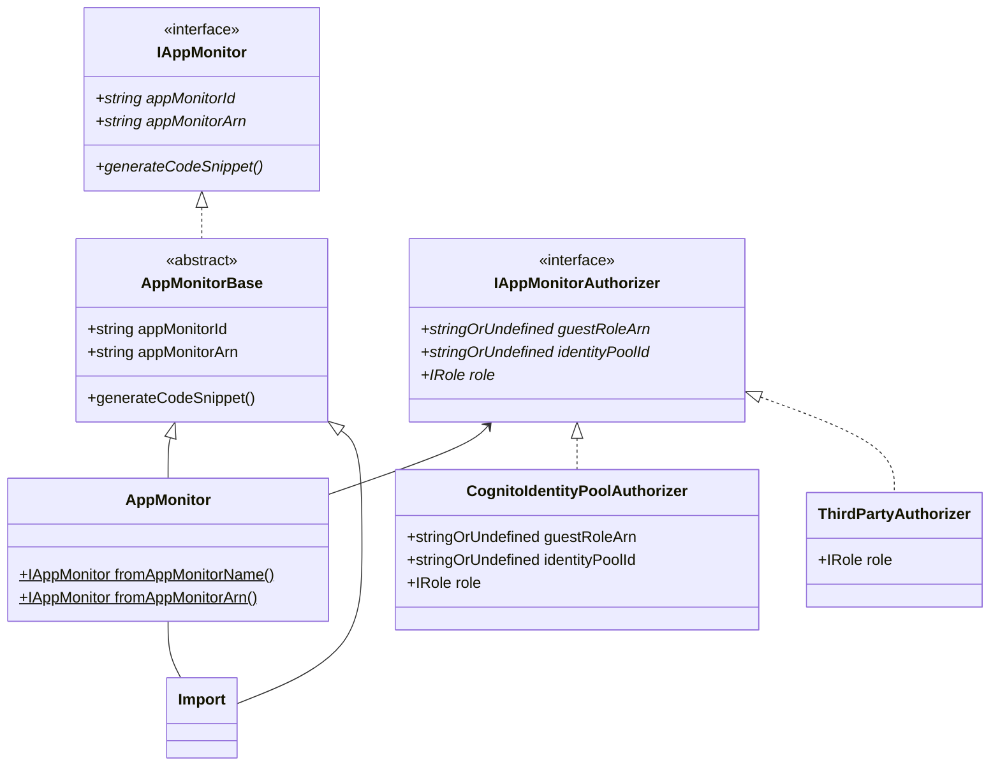
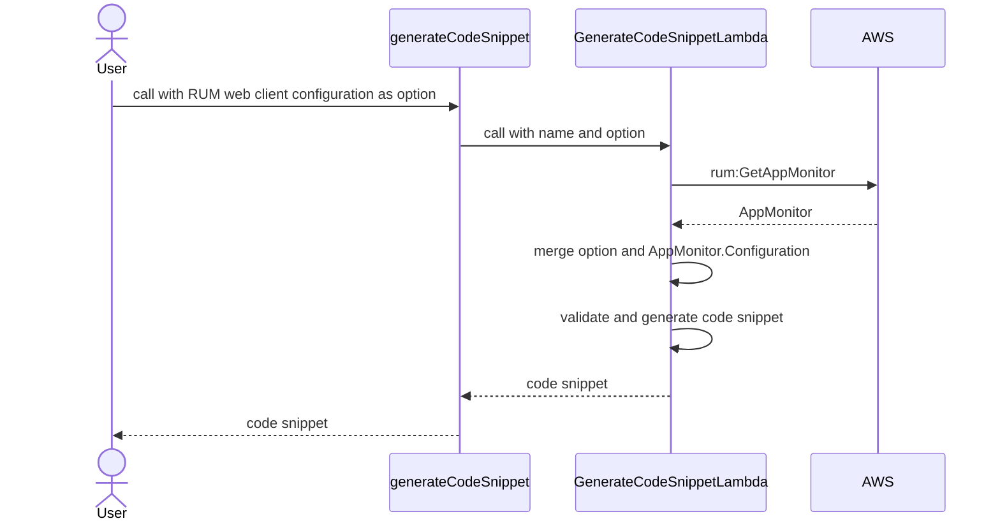

# Amazon CloudWatch RUM L2

* **Original Author(s):**: @WinterYukky
* **Tracking Issue**: #400
* **API Bar Raiser**: @madeline-k

The `aws-rum` construct library allows you to create an Amazon CloudWatch RUM AppMonitor
with just a few lines of code. You can integrate this AppMonitor into your application without manually copy-pasting code snippets from the CloudWatch management console into your application code. This allows users to fully automate deployments use CloudWatch RUM AppMonitor.

## Working Backwards

### CHANGELOG

`feat(rum): AppMonitor L2; Generate code snippet`

### README

---

# Amazon CloudWatch RUM Construct Library

## Table of Contents

- [Introduction](#introduction)
  - [App Monitor](#appmonitor)
  - [Authorizer](#authorizer)
    - [Existing Cognito ID pool](#use-an-existing-amazon-cognito-identity-pool)
    - [Third-party provider](#use-third-party-provider)
  - [Code Snippet](#code-snippet)
    - [RUM web client configuration](#rum-web-client-configuration)
    - [With s3 deployment](#with-s3-deployment)
  - [Importing App Monigor](#importing-app-monitor)

## Introduction

CloudWatch RUM is monitoring tool that can perform real user monitoring to collect
and view client-side data about your web application performance from actual user sessions in near real time.

This module supports the ability for users to create CloudWatch RUM and retrieve code snippets on CloudFormation.

## App Monitor

Define an`AppMonitor` in your stack:

```ts
import * as rum from '@aws-cdk/aws-rum';

const appMonitor = new rum.AppMonitor(this, 'AppMonitor', {
  domain: 'amazon.com',
  appMonitorName: 'my-app-monitor'
});
```

### Authorizer

By default, AppMonitor creates a new Amazon Cognito identity pool and uses it to authenticate the put event.

#### Use an existing Amazon Cognito identity pool

If you want to use an existing Amazon Cognito identity pool, you need to pass a `CognitoIdentityPoolAuthorizer` instance.

```ts
import * as rum from '@aws-cdk/aws-rum';
import * as iam from '@aws-cdk/aws-iam';

declare const myRole: iam.IRole;

const appMonitor = new rum.AppMonitor(this, 'AppMonitor', {
  domain: 'amazon.com',
  appMonitorName: 'my-app-monitor',
  authorizer: new rum.CognitoIdentityPoolAuthorizer({
    identityPoolId: 'my-user-pool-id',
    unauthenticatedRole: myRole,
  }),
});
```

#### Use Third-party provider

You can also use a third party authenticator as in `CognitoIdentityPoolAuthorizer`.

```ts
import * as rum from '@aws-cdk/aws-rum';
import * as iam from '@aws-cdk/aws-iam';

declare const myRole: iam.IRole;

const appMonitor = new rum.AppMonitor(this, 'AppMonitor', {
  domain: 'amazon.com',
  appMonitorName: 'my-app-monitor',
  authorizer: new rum.ThirdPartyAuthorizer({
    role: myRole,
  }),
});
```

### Code Snippet

AppMonitor generates a code snippet that looks like to create on the management console. Note, however,
that unlike the management console, the code snippets do not have `<script>` tags because the CDK expects them to be automatically embedded in the application.

```ts
import * as rum from '@aws-cdk/aws-rum';

const appMonitor = new rum.AppMonitor(this, 'AppMonitor', {
  domain: 'amazon.com',
  appMonitorName: 'my-app-monitor'
});

// (function(n,i,v,r,s,c,x,z){...})
const codeSnippet = appMonitor.generateCodeSnippet('CodeSnippet');
```

#### RUM web client configuration

If you want to use [RUM web client arguments](https://github.com/aws-observability/aws-rum-web/blob/main/docs/cdn_installation.md#arguments)
 (e.g applicationVersion, cookieAttributes), you can pass options to `generateCodeSnippet` argument.

```ts
import * as rum from '@aws-cdk/aws-rum';

const appMonitor = new rum.AppMonitor(this, 'AppMonitor', {
  domain: 'amazon.com',
  appMonitorName: 'my-app-monitor'
});

const codeSnippet = appMonitor.generateCodeSnippet('CodeSnippet', {
  applicationVersion: '1.1.0',
  configuration: {
    pageIdFormat: rum.PageIdFormat.HASH
  }
});
```

#### With s3 deployment

By using S3 Deployment, you can automate embedding the CloudWatch RUM code snippet into your application.
This example is shortest way that deploy site using RUM.

```ts
import * as rum from '@aws-cdk/aws-rum';
import * as s3 from '@aws-cdk/aws-s3';
import * as s3deploy from '@aws-cdk/aws-s3-deployment';

const webSiteBucket = new s3.Bucket(this, 'WebSiteBucket', {
  publicReadAccess: true,
  websiteIndexDocument: 'index.html'
});
const appMonitor = new rum.AppMonitor(this, 'AppMonitor', {
  domain: webSiteBucket.bucketWebsiteDomainName,
  appMonitorName: 'my-app-monitor'
});
const codeSnippet = appMonitor.generateCodeSnippet('CodeSnippet');
const rumJs = s3deploy.Source.data('rum.js', codeSnippet);

const html = s3deploy.Source.data('index.html', `<html>
  <head>
    <script src="/rum.js" async="true"></script>
  </head>
  <body>Hello RUM</body>
</html>`);

new s3deploy.BucketDeployment(this, 'BucketDeployment', {
  sources: [html, rumJs],
  destinationBucket: webSiteBucket
});
```

### Importing App Monitor

AppMonitor construct can import existing app monitor, just like any other L2 construct.

```ts
import * as rum from '@aws-cdk/aws-rum';

const appMonitor = rum.AppMonitor.fromAppMonitorName(this, 'AppMonitor', 'my-app-monitor');
```

or

```ts
import * as rum from '@aws-cdk/aws-rum';

const appMonitor = rum.AppMonitor.fromAppMonitorArn(this, 'AppMonitor', 'arn:aws:rum:some-region:1111111:appmonitor/my-app-monitor');
```

Of course, the imported app monitors can generate code snippets.

```ts
import * as rum from '@aws-cdk/aws-rum';

const appMonitor = rum.AppMonitor.fromAppMonitorName(this, 'AppMonitor', 'my-app-monitor');
const codeSnippet = appMonitor.generateCodeSnippet('CodeSnippet');
```

---

Ticking the box below indicates that the public API of this RFC has been
signed-off by the API bar raiser (the `api-approved` label was applied to the
RFC pull request):

- [ ] Signed-off by API Bar Raiser @madeline-k

## Public FAQ

### What are we launching today?

We are launching a new module (`@aws-cdk/aws-rum`) that contains next 3 main features.

1. Create app monitor easy
2. Importing an existing app monitor
3. Generate code snippet

**"Create app monitor easy"** of 1 is feature that looks like to create app monitor on the management console.
In most simple pattern, you need only domain name and app monitor name to start using app monitor.
**"Importing an existing app monitor"** of 2 is feature that is similar other L2 constructs.
You can import app monitor from outside of the stack by app monitor name or app monitor ARN.
At last, **"Generate code snippet"** of 3 is most important feature that allows you to retrieve code snippets without management console.
You can fully automate deployment app monitor to your application by this feature.

### Why should I use this feature?

RUM AppMonitor L1 construct doesn't provide code snippet and app monitor id, so to embed client code user must access management console or run AWS CLI
for get app monitor id after created app monitor by RUM AppMonitor L1 Construct. This is a bit far from full automation, so you should use this feature.

## Internal FAQ

### Why are we doing this?

Because RUM AppMonitor L1 construct doesn't provide code snippet and app monitor id.
It is certainly possible to use a pre-prepared code script. But what about the following example?

> A team is using git and CI/CD, and this team creates a new environment for every pull requests.
> The team use single code snippet for all environments, so the app monitor was full of noises that from experimental branche environments.
> Next, the team changed to create a new app monitor for every environment. After then,
> the team was troubled by to need access the managenemt console every create a new environments.

Yes, this is my actual experience. I thought we needs this feature for CDK by this experience.

### Why should we _not_ do this?

If we don't implement this feature, we need manualy deployment or to create solution for generate code snippet ourself. They are risky.

Downsides of implementing this feature is to need update of RUM web client type Irregularly.

### What is the technical solution (design) of this feature?

#### Type Definitions

##### `AppMonitor`

```ts
interface IAppMonitor extends IResource {
  readonly appMonitorId: string;
  readonly appMonitorArn: string;
  generateCodeSnippet(id: string, props?: CodeSnippetProps): string;
}

abstract class AppMonitorBase extends Resource implements IAppMonitor {
  readonly appMonitorId: string;
  readonly appMonitorArn: string;
  constructor(scope: Construct, id: string, props: ResourceProps);
  generateCodeSnippet(id: string, props?: CodeSnippetProps): string;
}

enum Telemetry {
  PERFORMANCE = 'performance',
  ERRORS = 'errors',
  HTTP = 'http',
}

interface AppMonitorConfiguration {
  readonly allowCookies?: boolean;
  readonly enableXRay?: boolean;
  readonly excludedPages?: string[];
  readonly favoritePages?: string[];
  readonly includedPages?: string[];
  readonly sessionSampleRate?: number;
  readonly telemetries?: Telemetry[];
}

interface AppMonitorProps {
  readonly domain: string;
  readonly appMonitorName: string;
  readonly authorizer?: IAppMonitorAuthorizer;
  readonly appMonitorConfiguration?: AppMonitorConfiguration;
  readonly persistence?: boolean;
}

class AppMonitor extends AppMonitorBase {
  public static fromAppMonitorName(scope: Construct, id: string, appMonitorName: string): IAppMonitor;
  public static fromAppMonitorArn(scope: Construct, id: string, appMonitorArn: string): IAppMonitor;
  constructor(scope: Construct, id: string, props: AppMonitorProps);
}
```

##### `Authorizer`

```ts
interface IAppMonitorAuthorizer {
  readonly guestRoleArn?: string;
  readonly identityPoolId?: string;
  readonly role: iam.IRole;
}

interface CognitoIdentityPoolAuthorizerProps {
  readonly identityPoolId: string;
  readonly unauthenticatedRole: iam.IRole;
}

class CognitoIdentityPoolAuthorizer implements IAppMonitorAuthorizer {
  public readonly identityPoolId: string | undefined;
  public readonly guestRoleArn: string | undefined;
  public readonly role: iam.IRole;
  constructor(props: CognitoIdentityPoolAuthorizerProps);
}

interface ThirdPartyAuthorizerProps {
  readonly role: iam.IRole;
}

class ThirdPartyAuthorizer implements IAppMonitorAuthorizer {
  public readonly role: iam.IRole;
  constructor(props: ThirdPartyAuthorizerProps);
}
```

##### `CodeSnippetProps` and subtypes

[RUM web client arguments](https://github.com/aws-observability/aws-rum-web/blob/main/docs/cdn_installation.md#arguments) modified for jsii.
This is used to generate advanced code snippets.

```ts
interface CodeSnippetProps {
  readonly namespace?: string
  readonly applicationVersion?: string
  readonly webClientVersion?: string
  readonly configuration?: WebClientConfiguration
}
```

```ts
interface WebClientConfiguration {
  readonly allowCookies?: boolean;
  readonly cookieAttibutes?: CookieAttibute;
  readonly disableAutoPageView?: boolean;
  readonly enableRumClient?: boolean;
  readonly enableXRay?: boolean;
  readonly endpoint?: string;
  readonly guestRoleArn?: string;
  readonly identityPoolId?: string;
  readonly pageIdFormat?: PageIdFormat;
  readonly pagesToInclude?: string[];
  readonly pagesToExclude?: string[];
  readonly recordResourceUrl?: boolean;
  readonly sessionEventLimit?: number;
  readonly sessionSampleRate?: number;
  readonly telemetries?: Telemetries;
}

interface ErrorsTelemetry {
  readonly stackTraceLength?: number;
}

interface HttpTelemetry {
  readonly urlsToInclude?: string[];
  readonly urlsToExclude?: string[];
  readonly stackTraceLength?: number;
  readonly recordAllRequests?: boolean;
  readonly addXRayTraceIdHeader?: boolean;
}

interface InteractionTelemetry {
  readonly events?: any[];
}

interface PerformanceTelemetry {
  readonly eventLimit?: number;
}

interface Telemetries {
  readonly errors?: ErrorsTelemetry;
  readonly http?: HttpTelemetry;
  readonly interaction?: InteractionTelemetry;
  readonly performance?: PerformanceTelemetry;
}

interface CookieAttibute {
  readonly domain?: string;
  readonly path?: string;
  readonly sameSite?: boolean;
  readonly secure?: boolean;
  readonly unique?: boolean;
}

enum PageIdFormat {
  PATH = 'PATH',
  HASH = 'HASH',
  PATH_AND_HASH = 'PATH_AND_HASH',
}
```

#### Class Diagram



### Generate code snippet solution

To avoid XSS, I implement the following mechanism using a custom resource that can validate the actual value.

1. generate advanced code snippet using
 [RUM web client arguments](https://github.com/aws-observability/aws-rum-web/blob/main/docs/cdn_installation.md#arguments) as argument of generateCodeSnippet
2. unspecified configuration defaults to the configuration that can be obtained with rum:GetAppMonitor

This is image.



### Is this a breaking change?

No.

### What alternative solutions did you consider?

It is `generateCodeSnippet` method change to `CodeSnippet` construct. Currently, `AppMonitor` have  `generateCodeSnippet` method in my design,
but code snippet strings are 1:1 to `CustomResource` so this can be expressed as construct. However, I think this is not intuitive so I designed as method.

### What are the drawbacks of this solution?

Drawbacks of this solution is publish JavaScript to users so always contains XSS risk. We must check about XSS risk.

### What is the high-level project plan?

Follow the other L2 constructs.

### Are there any open issues that need to be addressed later?

Yes, It is to import app monitor from another region.

## Appendix

Feel free to add any number of appendices as you see fit. Appendices are
expected to allow readers to dive deeper to certain sections if they like. For
example, you can include an appendix which describes the detailed design of an
algorithm and reference it from the FAQ.
