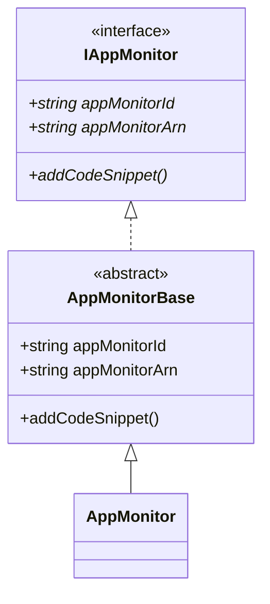
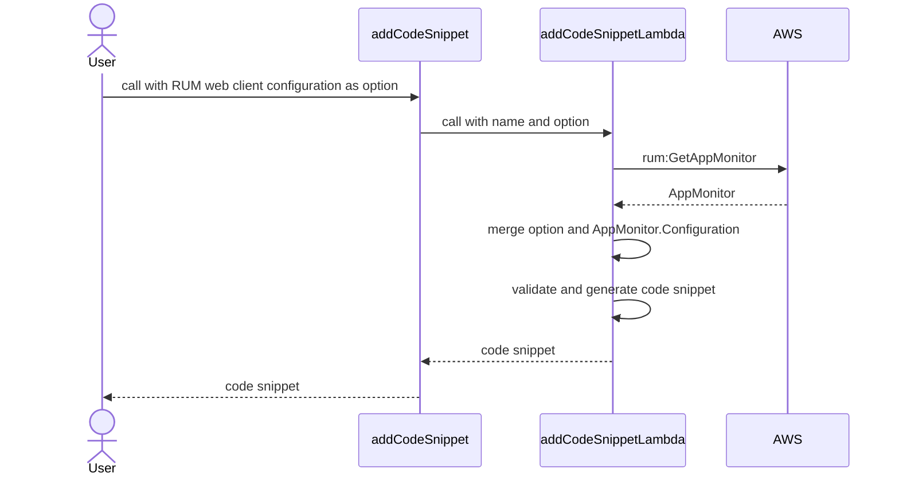

# Amazon CloudWatch RUM L2

* **Original Author(s):**: @WinterYukky
* **Tracking Issue**: #400
* **API Bar Raiser**: @madeline-k

The `aws-rum` construct library allows you to create an Amazon CloudWatch RUM AppMonitor
with just a few lines of code. You can integrate this AppMonitor into your application without manually copy-pasting code snippets from
the CloudWatch management console into your application code. This allows users to fully automate deployments use CloudWatch RUM AppMonitor.

## Working Backwards

### CHANGELOG

`feat(rum): AppMonitor L2; Generate code snippet`

### README

---

# Amazon CloudWatch RUM Construct Library

## Table of Contents

- [Introduction](#introduction)
  - [App Monitor](#appmonitor)
  - [Authorizer](#authorizer)
    - [Create a New Cognito ID pool](#use-an-existing-amazon-cognito-identity-pool)
    - [Existing Cognito ID pool](#use-an-existing-amazon-cognito-identity-pool)
    - [Third-party provider](#use-third-party-provider)
  - [Code Snippet](#code-snippet)

## Introduction

With CloudWatch RUM, you can perform real user monitoring to collect and view client-side data about your web application performance
from actual user sessions in near real time. The data that you can visualize and analyze includes page load times,
client-side errors, and user behavior. When you view this data, you can see it all aggregated together and also see breakdowns
by the browsers and devices that your customers use.

To use RUM, you create an app monitor and provide some information. RUM generates a JavaScript snippet for you to paste into your application.
The snippet pulls in the RUM web client code. The RUM web client captures data from a percentage of your application's user sessions,
which is displayed in a pre-built dashboard. You can specify what percentage of user sessions to gather data from.  
For more information, see [Amazon Amazon CloudWatch User Guide](https://docs.aws.amazon.com/AmazonCloudWatch/latest/monitoring/CloudWatch-RUM.html).

This module supports the ability for users to create CloudWatch RUM and retrieve code snippets.

## App Monitor

Define an `AppMonitor` in your stack:

```ts
const appMonitor = new AppMonitor(this, 'AppMonitor', {
  domain: 'my-website.com'
});
```

### Authorizer

To use CloudWatch RUM, your application must have authorization.

You have three options to set up authorization:

- Let CloudWatch RUM create a new Amazon Cognito identity pool for the application. This method requires the least effort to set up. It's the default option.
The identity pool will contain an unauthenticated identity.
This allows the CloudWatch RUM web client to send data to CloudWatch RUM without authenticating the user of the application.
The Amazon Cognito identity pool has an attached IAM role.
The Amazon Cognito unauthenticated identity allows the web client to assume the IAM role that is authorized to send data to CloudWatch RUM.
- Use an existing Amazon Cognito identity pool. In this case, you must pass the IAM role as well that is attached to the identity pool.
- Use authentication from an existing identity provider that you have already set up.
In this case, you must get credentials from the identity provider and your application must forward these credentials to the RUM web client.

#### Creates a new Amazon Cognito identity pool

By default, AppMonitor creates a new Amazon Cognito identity pool.
This is the simplest option to set up, and if you choose this no further setup steps are required.
You must have administrative permissions to use this option. For more information,
see [IAM policies to use CloudWatch RUM](https://docs.aws.amazon.com/AmazonCloudWatch/latest/monitoring/CloudWatch-RUM-permissions.html).

```ts
const appMonitor = new AppMonitor(this, 'AppMonitor', {
  domain: 'my-website.com'
});
```

#### Use an existing Amazon Cognito identity pool

If you want to use an existing Amazon Cognito identity pool, you need to pass the `identityPool` and the IAM role that is attached to the identity pool.

```ts
import * as identitypool from '@aws-cdk/aws-cognito-identitypool';
import * as iam from '@aws-cdk/aws-iam';

const identityPool = identitypool.IdentityPool.fromIdentityPoolId(this, 'IdentityPool', 'us-east-1:dj2823ryiwuhef937');
const role = iam.Role.fromRoleName(this, 'Role', 'UnauthenticatedRole');

const appMonitor = new AppMonitor(this, 'AppMonitor', {
  domain: 'my-website.com',
  identityPool,
  role
});
```

#### Use Third-party provider

If you want to use third-party authenticator, you can only pass a `role` that associated with your identity pool.

```ts
import * as iam from '@aws-cdk/aws-iam';

declare const role: iam.IRole;

const appMonitor = new AppMonitor(this, 'AppMonitor', {
  domain: 'my-website.com',
  role
});
```

Add the following to your application to have it pass the credentials from your provider to CloudWatch RUM.
Insert the line so that it runs after a user has signed in to your application and the application has received the credentials to use to access AWS.

```ts
cwr('setAwsCredentials', {/* Credentials or CredentialProvider */});
```
<!-- markdownlint-disable line-length  -->
For more information, see [Amazon Amazon CloudWatch User Guide](https://docs.aws.amazon.com/AmazonCloudWatch/latest/monitoring/CloudWatch-RUM-get-started-authorization.html#CloudWatch-RUM-get-started-authorization-thirdparty) for to use Third-party provider.
<!-- markdownlint-enable line-length  -->

### Code Snippet

AppMonitor generates code snippet as you would create them on the management console, except that there are no `<script>` tags.
The reason there is no `<script>` tag in the code snippet is that it is intended to be loaded as a regular JavaScript file from your HTML document.
This allows you to seamlessly embed RUM into your application without having to rewrite your HTML document when deploying.

The code snippet is integrated with [aws-s3-deployment](https://docs.aws.amazon.com/cdk/api/v1/docs/aws-s3-deployment-readme.html),
so you can deploy directly to any S3 bucket using BucketDeployment.

An example of deploying a static website and code snippet to S3 is shown below.

```ts
import * as s3 from '@aws-cdk/aws-s3';
import * as s3deployment from '@aws-cdk/aws-s3-deployment';

declare const myWebSiteBucket: s3.Bucket;
const website = s3deployment.Source.asset(path.join(__dirname, 'my-website'));

const appMonitor = new AppMonitor(this, 'AppMonitor', {
  domain: 'my-website.com'
});

new s3deployment.BucketDeployment(this, 'BucketDeployment', {
  sources: [website, appMonitor.codeSnippet],
  destinationBucket: myWebSiteBucket
});
```

Your website must load the code snippet with the object key (default: `rum.js`).

```html
<html>
  <head>
    <!-- add next line -->
    <script src="/rum.js" async="true"></script>
  </head>
  <body>Hello RUM</body>
</html>
```

If you want to use another name for will generates code snippet, then you can pass the `objectKey` to `addCodeSnippet` argument.

```ts
declare const appMonitor: AppMonitor;

const codeSnippet = appMonitor.addCodeSnippet('CodeSnippet', {
  objectKey: 'my-rum.js'
});
```

#### RUM web client configuration

If you want to use [RUM web client configuration](https://github.com/aws-observability/aws-rum-web/blob/main/docs/cdn_installation.md)
(e.g pageIdFormat), you can pass options to `addCodeSnippet` argument.

```ts
declare const appMonitor: AppMonitor;

const codeSnippet = appMonitor.addCodeSnippet('CodeSnippet', {
  applicationVersion: '1.1.0',
  pageIdFormat: PageIdFormat.HASH,
});
```

---

Ticking the box below indicates that the public API of this RFC has been
signed-off by the API bar raiser (the `api-approved` label was applied to the
RFC pull request):

- [ ] Signed-off by API Bar Raiser @madeline-k

## Public FAQ

### What are we launching today?

We are launching a new module (`@aws-cdk/aws-rum`) that contains next 3 main features.

1. Create app monitor easy
2. Generate code snippet

**"Create app monitor easy"** of 1 is feature that looks like to create app monitor on the management console.
In most simple pattern, you need only domain name and app monitor name to start using app monitor.
And **"Generate code snippet"** of 2 is most important feature that allows you to retrieve code snippets without management console.
You can fully automate deployment app monitor to your application by this feature.

### Why should I use this feature?

RUM AppMonitor L1 construct doesn't provide code snippet and app monitor id, so to embed client code user must access management console or run AWS CLI
for get app monitor id after created app monitor by RUM AppMonitor L1 Construct. This is a bit far from full automation, so you should use this feature.

## Internal FAQ

### Why are we doing this?

Because RUM AppMonitor L1 construct doesn't provide code snippet and app monitor id.
It is certainly possible to use a pre-prepared code script. But what about the following example?

> A team is using git and CI/CD, and this team creates a new environment for every pull requests.
> The team use single code snippet for all environments, so the app monitor was full of noises that from experimental branche environments.
> Next, the team changed to create a new app monitor for every environment. After then,
> the team was troubled by to need access the managenemt console every create a new environments.

Yes, this is my actual experience. I thought we needs this feature for CDK by this experience.

### Why should we _not_ do this?

If we don't implement this feature, we need manualy deployment or to create solution for generate code snippet ourself. They are risky.

Downsides of implementing this feature is to need update of RUM web client type Irregularly.

### What is the technical solution (design) of this feature?

#### Type Definitions

`AppMonitor`

```ts
interface IAppMonitor extends IResource {
  readonly appMonitorId: string;
  readonly appMonitorArn: string;
  readonly codeSnippet: CodeSnippet;
  addCodeSnippet(id: string, props?: CodeSnippetProps): CodeSnippet;
}

abstract class AppMonitorBase extends Resource implements IAppMonitor {
  readonly appMonitorId: string;
  readonly appMonitorArn: string;
  readonly codeSnippet: CodeSnippet;
  constructor(scope: Construct, id: string, props: ResourceProps);
  addCodeSnippet(id: string, props?: CodeSnippetProps): CodeSnippet;
}

class AppMonitor extends AppMonitorBase {
  constructor(scope: Construct, id: string, props: AppMonitorProps);
}

enum Telemetry {
  PERFORMANCE = 'performance',
  ERRORS = 'errors',
  HTTP = 'http',
}

interface AppMonitorProps {
  readonly domain: string;
  readonly appMonitorName?: string;
  readonly identityPool?: identitypool.IIdentityPool;
  readonly role?: iam.IRole;
  readonly persistence?: boolean;
  readonly allowCookies?: boolean;
  readonly enableXRay?: boolean;
  readonly excludedPages?: string[];
  readonly favoritePages?: string[];
  readonly includedPages?: string[];
  readonly sessionSampleRate?: number;
  readonly telemetries?: Telemetry[];
}
```

`CodeSnippet`

```ts
class CodeSnippet implements s3deployment.ISource {
  readonly value: string;
  bind(scope: Construct, context?: s3deployment.DeploymentSourceContext): s3deployment.SourceConfig;
}

interface CodeSnippetProps {
  readonly objectKey?: string;
  readonly namespace?: string
  readonly applicationVersion?: string
  readonly webClientVersion?: string
  readonly cookieAttibuteDomain?: string;
  readonly cookieAttibutePath?: string;
  readonly cookieAttibuteSameSite?: boolean;
  readonly cookieAttibuteSecure?: boolean;
  readonly cookieAttibuteUnique?: boolean;
  readonly disableAutoPageView?: boolean;
  readonly enableRumClient?: boolean;
  readonly endpoint?: string;
  readonly pageIdFormat?: PageIdFormat;
  readonly pagesToInclude?: string[];
  readonly pagesToExclude?: string[];
  readonly recordResourceUrl?: boolean;
  readonly sessionEventLimit?: number;
  readonly telemetries?: ITelemetryConfig[];
}

interface ITelemetryConfig {
  config(): any;
}

class TelemetryConfig {
  static errors(options?: ErrorsOptions): ITelemetryConfig;
  static http(options?: HttpOptions): ITelemetryConfig;
  static performance(options?: PerformanceOptions): ITelemetryConfig;
  static interaction(options?: InteractionOptions): ITelemetryConfig;
}

interface ErrorsOptions {
  readonly stackTraceLength?: number;
}

interface HttpOptions {
  readonly urlsToInclude?: string[];
  readonly urlsToExclude?: string[];
  readonly stackTraceLength?: number;
  readonly recordAllRequests?: boolean;
  readonly addXRayTraceIdHeader?: boolean;
}

interface InteractionOptions {
  readonly events?: any[];
}

interface PerformanceOptions {
  readonly eventLimit?: number;
}

enum PageIdFormat {
  PATH = 'PATH',
  HASH = 'HASH',
  PATH_AND_HASH = 'PATH_AND_HASH',
}
```

#### Class Diagram



### Generate code snippet solution

To avoid XSS, I implement the following mechanism using a custom resource that can validate the actual value.

1. generate advanced code snippet using
 [RUM web client arguments](https://github.com/aws-observability/aws-rum-web/blob/main/docs/cdn_installation.md#arguments) as argument of addCodeSnippet
2. unspecified configuration defaults to the configuration that can be obtained with rum:GetAppMonitor

This is image.



### Is this a breaking change?

No.

### What alternative solutions did you consider?

It is `addCodeSnippet` method change to `CodeSnippet` construct. Currently, `AppMonitor` have  `addCodeSnippet` method in my design,
but code snippet strings are 1:1 to `CustomResource` so this can be expressed as construct. However, I think this is not intuitive so I designed as method.

### What are the drawbacks of this solution?

Drawbacks of this solution is publish JavaScript to users so always contains XSS risk. We must check about XSS risk.

### What is the high-level project plan?

Follow the other L2 constructs.

### Are there any open issues that need to be addressed later?

No

## Appendix

Feel free to add any number of appendices as you see fit. Appendices are
expected to allow readers to dive deeper to certain sections if they like. For
example, you can include an appendix which describes the detailed design of an
algorithm and reference it from the FAQ.
