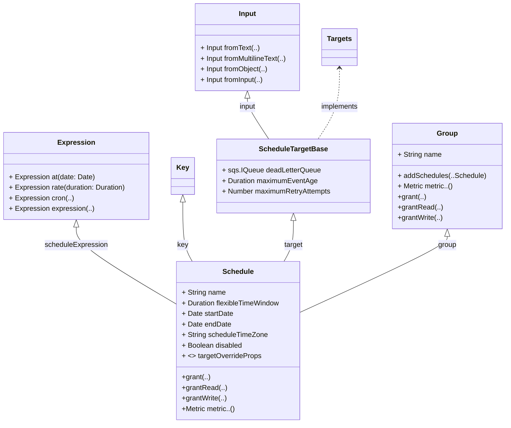
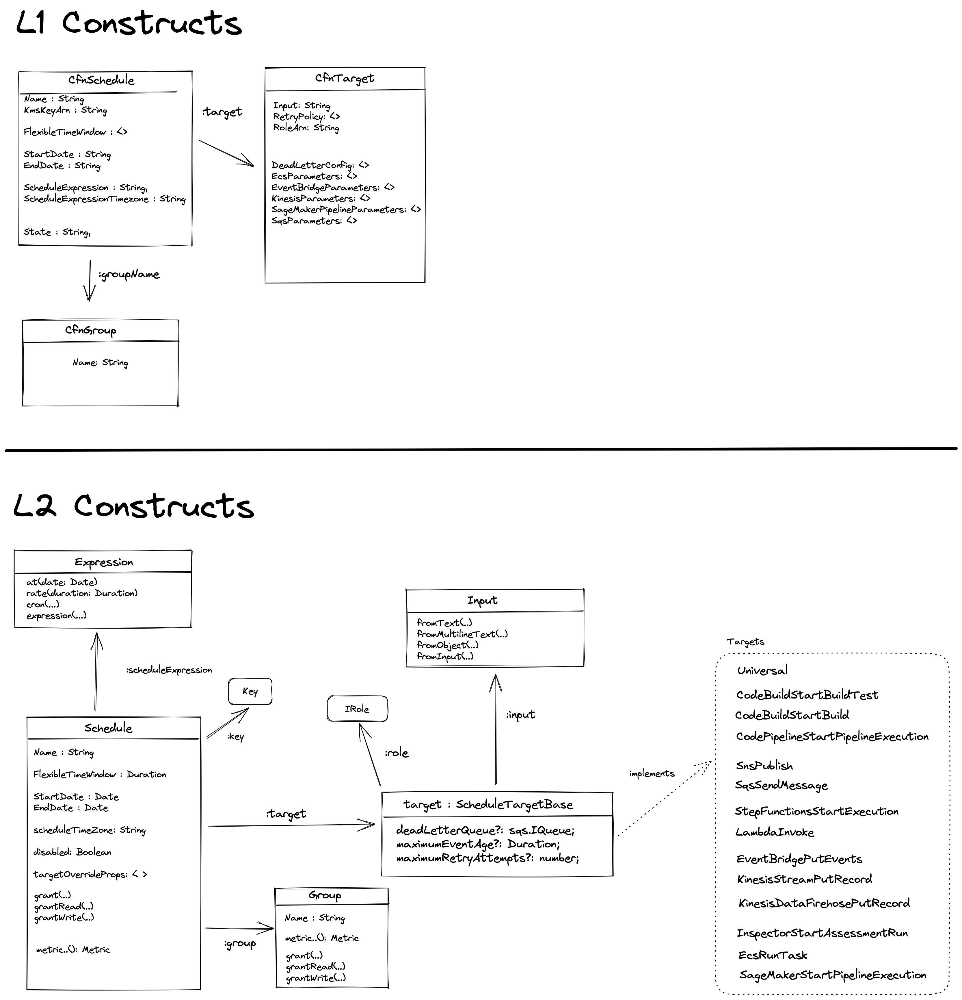

# {RFC_TITLE}

* **Original Author(s):**: @filletofish, @Jacco
* **Tracking Issue**: #https://github.com/aws/aws-cdk-rfcs/issues/473
* **API Bar Raiser**: @kaizencc

> Write one sentence which is a brief description of the feature. It should describe:
> * What is the user pain we are solving?
> * How does it impact users?

Library `aws-events-scheduler` contains L2 CDK constructs for creating, run, and manage scheduled tasks at scale with Amazon Event Bridge Scheduler. 

## Working Backwards

> This section should contain one or more "artifacts from the future", as if the
> feature was already released and we are publishing its CHANGELOG, README,
> CONTRIBUTING.md and optionally a PRESS RELEASE. This is the most important
> section of your RFC. It's a powerful thought exercise which will challenge you
> to truly think about this feature from a user's point of view.
>
> Choose *one or more* of the options below:
>
> * **CHANGELOG**: Write the changelog entry for this feature in conventional
>   form (e.g. `feat(eks): cluster tags`). If this change includes a breaking
>   change, include a `BREAKING CHANGE` clause with information on how to
>   migrate. If migration is complicated, refer to a fictional GitHub issue and
>   add its contents here.
>
> * **README**: If this is a new feature, write the README section which
>   describes this new feature. It should describe the feature and walk users
>   through usage examples and description of the various options and behavior.
>
> * **PRESS RELEASE**: If this is a major feature (~6 months of work), write the
>   press release which announces this feature. The press release is a single
>   page that includes 7 paragraphs: (1) summary, (2) problem, (3) solution, (4)
>   leader quote, (5) user experience, (6) customer testimonial and (7) one
>   sentence call to action.

**CHANGELOG**:

`feat(events-scheduler): Event Bridge Scheduler L2 constructs`

 **README**: 

 See below

 # Amazon EventBridge Scheduler Contruct Library

[Amazon EventBridge Scheduler](https://aws.amazon.com/blogs/compute/introducing-amazon-eventbridge-scheduler/) is a feature from Amazon EventBridge that allows you to create, run, and manage scheduled tasks at scale. With EventBridge Scheduler, you can schedule one-time or recurrently tens of millions of tasks across many AWS services without provisioning or managing underlying infrastructure.

1. **Schedule**: A schedule is the main resource you create, configure, and manage using Amazon EventBridge Scheduler. Every schedule has a schedule expression that determines when, and with what frequency, the schedule runs. EventBridge Scheduler supports three types of schedules: rate, cron, and one-time schedules. When you create a schedule, you configure a target for the schedule to invoke. 
2. **Targets**: A target is an API operation that EventBridge Scheduler calls on your behalf every time your schedule runs.  Targets can include Amazon EC2 instances, AWS Lambda functions, Kinesis streams, Amazon ECS tasks, Step Functions state machines, Amazon SNS topics, Amazon SQS queues, Amazon CloudWatch LogGroups, and built-in targets. A target receives events in JSON format.
3. **Schedule Group**: Scheduling groups help you organize your schedules. Scheduling groups support tags that you can use for cost allocation, access control, and resource organization. When creating a new schedule, you can add it to a scheduling group.

This module is part of the [AWS Cloud Development Kit](https://github.com/aws/aws-cdk) project. It allows you to define Event Bridge Schedules.


## Defining a schedule 

```ts
const target = new targets.LambdaInvoke(props.func, {
    input: ScheduleTargetInput.fromObject({
        "payload": "useful"
    })
});
    
const schedule = new Schedule(this, 'Schedule', {
    schedule: ScheduleExpression.rate(Duration.minutes(10)),
    target,
    description: 'This is a test schedule that invokes lambda function every 10 minutes.',
});
```

### Schedule Expressions

Both rate-based and cron-based schedules are recurring schedules. You configure each recurring schedule type using a schedule expression for the type of schedule you want to configure, and specifying a time zone in which EventBridge Scheduler evaluates the expression.

```ts
const rateBasedSchedule = new Schedule(this, 'Schedule', {
    schedule: ScheduleExpression.rate(Duration.minutes(10)),
    target,
    description: 'This is a test rate-based schedule',
});

const cronBasedSchedule = new Schedule(this, 'Schedule', {
    schedule: ScheduleExpression.cron({ day: '20', month: '11' }),
    target,
    scheduleTimeZone: TimeZone.AMERICA_NEW_YORK,
    description: 'This is a test cron-based schedule in New York timezone',
});
```

A one-time schedule is a schedule that invokes a target only once. You configure a one-time schedule when by specifying the time, date, and time zone in which EventBridge Scheduler evaluates the schedule.

```ts
const oneTimeSchedule = new Schedule(this, 'Schedule', {
    schedule: ScheduleExpression.at(new Date(2022, 10, 20, 19, 20, 23)),
    target,
    scheduleTimeZone: TimeZone.AMERICA_NEW_YORK,
    description: 'This is a one-time schedule in New York timezone',
});
```

### Grouping Schedules

Your AWS account comes with a default scheduler group. If group is not provided a schedule will be created in default group, which you can access in CDK with: 

```ts
const defaultGroup = Group.fromDefaultGroup(this, "DefaultGroup");
```

When creating a new schedule, you can also add the schedule to a custom scheduling group managed by you:

```ts
const group = new Group(this, "Group", {
    groupName: "MyGroup"
});

const target = new targets.LambdaInvoke(props.func, {
    input: ScheduleTargetInput.fromObject({
        "payload": "useful"
    })
});
    
const schedule1 = new Schedule(this, 'Schedule1', {
    schedule: ScheduleExpression.rate(Duration.minutes(10)),
    target
});

const schedule2 = new Schedule(this, 'Schedule2', {
    schedule: ScheduleExpression.rate(Duration.minutes(5)),
    target
});

group.addSchedules(schedule1, schedule2);
```

Groups can be used to organize the schedules logically, access the schedule metrics and manage permissions at group granularity (see below).

## Scheduler Targets

The `@aws-cdk/aws-schedule-targets` (ADD LINK) module includes classes that implement the `IScheduleTarget` interface for various AWS services.

Templated targets are a set of common API operations across a group of core AWS services such as Amazon SQS, Lambda, and Step Functions. The module contains CDK constructs for templated targets. For example, you can use construct `targets.LambdaInvoke` to target Lambda's Invoke API operation by providing a `lambda.IFunction`, or use `targets.SqsSendMessage` with a `sqs.IQueue` to send a message to SQS queue. 


The following templated targets are supported:

1. `targets.CodeBuildStartBuild`: Start an AWS CodeBuild build
1. `targets.CodePipelineStartPipelineExecution`: Start an AWS CodePipeline pipeline execution
1. `targets.StepFunctionsStartExecution`: Trigger an AWS Step Functions state machine
1. `targets.KinesisDataFirehosePutRecord`: Put a record to a Kinesis Firehose
1. `targets.KinesisStreamPutRecord`: Put a record to a Kinesis Stream
1. `targets.InspectorStartAssessmentRun`: Start an AWS Inspector assessment run
1. `targets.EventBridgePutEvents`: Put an event to an AWS Event Bridge Event Bus
1. `targets.EcsTask`: Start a task on an Amazon ECS cluster
1. `targets.SageMakerStartPipelineExecution`: Start Amazon SageMaker pipeline
1. `targets.LambdaInvoke`: Invoke an AWS Lambda function
1. `targets.SqsSendMessage`: Send a message to an Amazon SQS Queue
1. `targets.SnsPublish`: Publish a message into an SNS topic


A universal target is a customizable set of parameters that allow you to invoke a wider set of API operation for many AWS services. 
To create a universal target you need to specify `input`, service name and service action. See [full list of support universal targets](https://docs.aws.amazon.com/scheduler/latest/UserGuide/managing-targets-universal.html#supported-universal-targets).

For example, to create a schedule that will create a SQS queue every hour:

```ts
const input = ScheduleTargetInput.fromObject({
    'QueueName': 'MyQueue'
});

const schedule = new Schedule(this, 'Schedule', {
    schedule: ScheduleExpression.rate(Duration.hours(1)),
    target: new targets.Universal('sqs', 'CreateQueue', { input: input })
});
```

### Input 

Target can be invoked with a custom input. Class `ScheduleTargetInput` supports free form text input and JSON-formatted object input:

```ts
const input = ScheduleTargetInput.fromObject({
    'QueueName': 'MyQueue'
});
```

You can include context attributes in your target payload. EventBridge Scheduler will replace each keyword with its respective value and deliver it to the target. See [full list of supported context attributes](https://docs.aws.amazon.com/scheduler/latest/UserGuide/managing-schedule-context-attributes.html): 

1. `ContextAttribute.scheduleArn()` – The ARN of the schedule.
2. `ContextAttribute.scheduledTime()` – The time you specified for the schedule to invoke its target, for example, 2022-03-22T18:59:43Z.
3. `ContextAttribute.executionId()` – The unique ID that EventBridge Scheduler assigns for each attempted invocation of a target, for example, d32c5kddcf5bb8c3.
4. `ContextAttribute.attemptNumber()` – A counter that identifies the attempt number for the current invocation, for example, 1.

```ts
const text = `Attempt number: ${ContextAttribute.attemptNumber}`;
const input = scheduler.ScheduleTargetInput.fromInput(text);
```


### Specifying IAM role 

An execution role is an IAM role that EventBridge Scheduler assumes in order to interact with other AWS services on your behalf.

The classes for templated schedule targets automatically create an IAM role with all the minimum necessary
permissions to interact with the templated target. If you wish you may specify your own IAM role, then the templated targets 
will grant minimal required permission. For example: for invoking Lambda function target `LambdaInvoke` will grant
execution IAM role permission to `lambda:InvokeFunction`.

```ts
import * as iam from '@aws-cdk/aws-iam';

declare const fn: lambda.Function;

const role = new iam.Role(this, 'Role', {
  assumedBy: new iam.ServicePrincipal('scheduler.amazonaws.com'),
});

const target = new targets.LambdaInvoke({
    input: ScheduleTargetInput.fromObject({ 
        "payload": "useful"
    }),
    role: role
}, fn);
```

For universal targets you must grant the required IAM permissions yourself.

### Cross-account and cross-region targets

Executing cross-account and cross-region targets will not be supported from day 1.

### Specifying Encryption key

EventBridge Scheduler integrates with AWS Key Management Service (AWS KMS) to encrypt and decrypt your data using an AWS KMS key. EventBridge Scheduler supports two types of KMS keys: AWS owned keys, and customer managed keys. 

By default, all events in Scheduler are encrypted with a key that AWS owns and manages. 
If you wish you can also provide a customer managed key to encrypt and decrypt the payload that your schedule delivers 
to its target. Target classes will automatically add AWS KMS Decrypt permission to your schedule's execution role
permissions policy

```ts
import * as kms from '@aws-cdk/aws-kms';

const key = new kms.Key(this, 'Key');

const schedule = new Schedule(this, 'Schedule', {
    schedule: ScheduleExpression.rate(Duration.minutes(10)),
    target,
    key: key,
});
```

See: [Data Protection](https://docs.aws.amazon.com/scheduler/latest/UserGuide/data-protection.html) in
the *Amazon EventBridge Scheduler User Guide*.

## Error-handling 

You configure how your schedule handles failures, when EventBridge Scheduler is unable to deliver an event
successfully to a target, by using two primary mechanisms: a retry policy, and a dead-letter queue (DLQ). 

A retry policy determines the number of times EventBridge Scheduler must retry a failed event, and how long 
to keep an unprocessed event. 

A DLQ is a standard Amazon SQS queue EventBridge Scheduler uses to deliver failed events to, after the retry 
policy has been exhausted. You can use a DLQ to troubleshoot issues with your schedule or its downstream target. 
If you've configured a retry policy for your schedule, EventBridge Scheduler delivers the dead-letter event after
exhausting the maximum number of retries you set in the retry policy.

```ts
const dlq = new Queue(this, "DLQ", {
      queueName: 'MyDLQ',
});

const target = new targets.LambdaInvoke(props.func, {
    deadLetterQueue: dlq,
    maximumEventAge: Duration.minutes(1),
    maximumRetryAttempts: 3
});
```

## Overriding Target Properties 

If you wish to reuse the same target in multiple schedules, you can override target properties 
like `input`, `maximumRetryAttempts` and `maximumEventAge` when creating a Schedule:

```ts
const target = new targets.LambdaInvoke(props.func, {
    input: ScheduleTargetInput.fromObject({
        "payload": "useful"
    }),
});
    
const schedule1 = new Schedule(this, 'Schedule', {
    schedule: ScheduleExpression.cron({ day: '20' }),
    target,
});

const schedule2 = new Schedule(this, 'Schedule2', {
    schedule: ScheduleExpression.cron({ day: '5' }),
    target,
    targetOverrides: {
        input: ScheduleTargetInput.fromText("Overriding Target Input") 
    }
});
```

## Monitoring

You can monitor Amazon EventBridge Scheduler using CloudWatch, which collects raw data 
and processes it into readable, near real-time metrics. EventBridge Scheduler emits 
a set of metrics for all schedules, and an additional set of metrics for schedules that
have an associated dead-letter queue (DLQ). If you configure a DLQ for your schedule, 
EventBridge Scheduler publishes additional metrics when your schedule exhausts its retry policy.

### Metrics for all schedules

Class `Schedule` provides static methods for accessing all schedules metrics with default configuration, 
such as `metricAllErrors` for viewing errors when executing targets. 

```ts 

import * as cloudwatch from '@aws-cdk/aws-cloudwatch';

new Alarm(this, 'SchedulesErrorAlarm', {
  metric: Schedule.metricAllErrors(),
  threshold: 0
});
```

### Metrics for a Group

To view metrics for a specific group you can use methods on class `Group`:

```ts
const group = new Group(this, "Group", {
    groupName: "MyGroup"
});

new Alarm(this, 'MyGroupErrorAlarm', {
  metric: group.metricAllErrors(),
  threshold: 0
});
```

See full list of metrics and their description at [Monitoring Using CloudWatch Metrics](https://docs.aws.amazon.com/scheduler/latest/UserGuide/monitoring-cloudwatch.html) in the *AWS Event Bridge Scheduler User Guide*.


---

Ticking the box below indicates that the public API of this RFC has been
signed-off by the API bar raiser (the `api-approved` label was applied to the
RFC pull request):

```
[x] Signed-off by API Bar Raiser @kaizencc
```

## Public FAQ

> This section should include answers to questions readers will likely ask about
> this release. Similar to the "working backwards", this section should be
> written in a language as if the feature is now released.
>
> The template includes a some common questions, feel free to add any questions
> that might be relevant to this feature or omit questions that you feel are not
> applicable.

### What are we launching today?

> What exactly are we launching? Is this a new feature in an existing module? A
> new module? A whole framework? A change in the CLI?


We are launching a new module (`@aws-cdk/aws-eventbridge-scheduler`) that contains L2
constructs for managing Amazon EventBridge Scheduler schedules and targets.

With EventBridge Scheduler L2 CDK constructs, you can schedule in code one-time or recurrently tens of millions 
of tasks across many AWS services without provisioning or managing underlying infrastructure. 

Out of the box, we are launching with 12 Scheduler Targets for AWS service
destinations (LambdaInvoke, SqsSendMessage, StepFunctionsStartExecution), as well as a Universal Scheduler Target so
that customers can connect to other AWS services. These targets are located in a secondary module (`@aws-cdk/aws-eventbridge-scheduler-targets`).


### Why should I use this feature?

> Describe use cases that are addressed by this feature.

EventBridge Scheduler is a tool that can be used to automate the creation of schedules for various tasks, such as sending reminders for tasks, starting and stopping Amazon EC2 instances, and managing subscription-based services. 
It can be useful for companies of different sizes and types, such as a task management system, a large organization with multiple AWS accounts, and SaaS providers. 
EventBridge Scheduler can help reduce costs, respect time zones, and manage scheduled tasks more efficiently. Using EventBridge Scheduler with CDK Constructs smooths many configuration edges and provides seamless integrations with your existing infrastructure as code.


## Internal FAQ

> The goal of this section is to help decide if this RFC should be implemented.
> It should include answers to questions that the team is likely ask. Contrary
> to the rest of the RFC, answers should be written "from the present" and
> likely discuss design approach, implementation plans, alternative considered
> and other considerations that will help decide if this RFC should be
> implemented.

### Why are we doing this?

> What is the motivation for this change?

The [tracking Github issue for the module](https://github.com/aws/aws-cdk/issues/23394) has
the 19 +1s indicating that customers want L2 CDK Construct support for this service.

Here is how L2 CDK constructs for Event Scheduler can improve your AWS CDK development experience:

1. CDK L2 Constructs can simplify the process of setting up permissions for invoking targets, such as AWS Lambda functions, by automatically configuring required permissions for the targets.
2. Encrypt data by providing pre-configured encryption settings that you can use as part of your AWS infrastructure as code. This can make it easier to ensure that your data is encrypted at rest and in transit, and can help you meet compliance requirements.
3. Add metrics and permissions to your AWS EventBridge schedules. You can use constructs to define CloudWatch alarms that monitor schedule activity, and IAM permissions that control access to schedules. This can make it easier to manage and monitor your schedules, as well as provide more granular control over who can modify them.
4. Constructs provide pre-configured targets for common AWS services, such as Lambda functions and SQS queues, as well as a universal target that can be used to connect to other AWS services. 

### Why should we _not_ do this?

> Is there a way to address this use case with the current product? What are the
> downsides of implementing this feature?


We are not confident that the service API is fully set in stone and implementing an L2 on
top of the current L1 may be setting us up for changes in the future. We are reaching out
to the service team to get their input and plans for the service. 

It’s a large effort (X devs * 1 week) to invest in a module when we have other pressing
projects. However, the bulk of the effort has been spent already since we have fairly
robust prototypes already implemented.

### What is the technical solution (design) of this feature?






Prototype at https://github.com/filletofish/cdk-eb-scheduler/


### Is this a breaking change?

No.

### What alternative solutions did you consider?

> Briefly describe alternative approaches that you considered. If there are
> hairy details, include them in an appendix.

1. We have discussed an opportunity of reusing existing `events.targets` module: https://docs.aws.amazon.com/cdk/api/v1/docs/aws-events-targets-readme.html. See RFC comments

### What are the drawbacks of this solution?

> Describe any problems/risks that can be introduced if we implement this RFC.

TBD

### What is the high-level project plan?

> Describe your plan on how to deliver this feature from prototyping to GA.
> Especially think about how to "bake" it in the open and get constant feedback
> from users before you stabilize the APIs.
>
> If you have a project board with your implementation plan, this is a good
> place to link to it.

Most part of the L2 constructs is already implemented. We have a set of relatively (1-2 day of work) todos that can be implemented in parallel: 

1. Decide what removal policy for Group should be 
2. Support and Test Encrypted Schedules
3. Decide or clean up how IAM Roles are used in Schedules and Targets
4. Check why name generation fails if env is not passed to the Stack
5. Unit tests for class schedule
6. Unit tests for class targets 
7. Unit tests for classes: groups, schedule expressions, input 
8. Integration tests #15
9. Methods for Granting Schedule Group Management IAM permissions #5
10. Validate that target is not cross-account
11. Use Timezone Class

### Are there any open issues that need to be addressed later?

> Describe any major open issues that this RFC did not take into account. Once
> the RFC is approved, create GitHub issues for these issues and update this RFC
> of the project board with these issue IDs.

TBD

## Appendix

N/A
