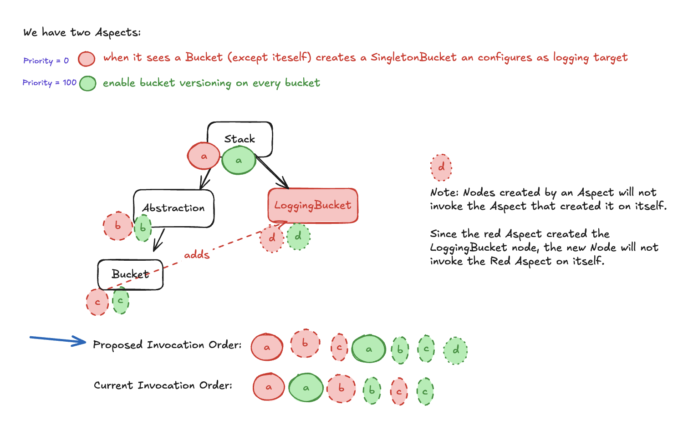

# Priority-Ordered Aspect Invocation

* **Original Author(s):**: @sumupitchayan
* **Tracking Issue**: #648
* **API Bar Raiser**: @rix0rrr @mrgrain

Redesigning Aspect invocation in CDK by allowing users to specify the order in which Aspects are applied.

## Background

[Aspects](https://docs.aws.amazon.com/cdk/v2/guide/aspects.html) is a feature in CDK that allows you to apply operations or transformations across all
constructs in a construct tree. Common use cases include tagging resources, enforcing encryption on S3 Buckets, or applying specific security or
compliance rules to all resources in a stack.

Conceptually, there are two types of Aspects:

* **Read-only aspects** scan the construct tree but do not make changes to the tree. Common use cases of read-only aspects include performing validations
(for example, enforcing that all S3 Buckets have versioning enabled) and logging (for example, collecting information about all deployed resources for
audits or compliance).
* **Mutating aspects** either (1.) add new nodes or (2.) mutate existing nodes of the tree in-place. One commonly used mutating Aspect is adding Tags to
resources. An example of an Aspect that adds a node is one that automatically adds a security group to every EC2 instance in the construct tree if
no default is specified.

Here is a simple example of creating and applying an Aspect on a Stack to enable versioning on all S3 Buckets:

```ts
import { IAspect, IConstruct, Tags, Stack } from 'aws-cdk-lib';

class EnableBucketVersioning implements IAspect {
  visit(node: IConstruct) {
    if (node instanceof CfnBucket) {
      node.versioningConfiguration = {
        status: 'Enabled'
      };
    }
  }
}

const app = new App();
const stack = new MyStack(app, 'MyStack');

// Apply the aspect to enable versioning on all S3 Buckets
Aspects.of(stack).add(new EnableBucketVersioning());
```

### The Problem with Aspects

The current algorithm for invoking aspects (see invokeAspects in [synthesis.ts](https://github.com/aws/aws-cdk/blob/8b495f9ec157c0b00674715f62b1bbcabf2096ac/packages/aws-cdk-lib/core/lib/private/synthesis.ts#L217))
does not handle all use cases — specifically, when an Aspect adds a new node to the Construct tree and when Aspects are applied out of order.

#### Aspects that Create New Nodes

For Aspects that create new nodes, inherited Aspects are not always applied to the newly created node or resource as expected. This occurs because the
algorithm only makes a single pass through the Construct tree, and therefore does not visit the newly added node.

A customer reported this in GitHub issue [#21341](https://github.com/aws/aws-cdk/issues/21341). They have one Aspect that adds Tags to all resources
in a Stack and another Aspect applied on a construct that creates an S3 Bucket on the parent Stack of that construct. The expected behavior is for
the new S3 Bucket to inherit the Tags from the parent Stack. However, while the bucket is created, it does not inherit any Tags. Below is the
customer's reproducible example:

```ts
import { Aspects, Tags, IAspect, Stack, StackProps } from 'aws-cdk-lib';
import { Bucket } from 'aws-cdk-lib/aws-s3';
import { Construct, IConstruct } from 'constructs';

export class AspectsIssueStack extends Stack {
  constructor(scope: Construct, id: string, props?: StackProps) {
    super(scope, id, props);
    
    // Tags is an Aspect:
    Tags.of(this).add('test-tag', 'test-value');
    new MyConstruct(this, 'myConstruct');
  }
}

class MyConstruct extends Construct {

  constructor(scope: IConstruct, id: string) {
    super(scope, id);
    
    const stack = Stack.of(scope);
    const s3Bucket = new Bucket(stack, 'bucket-with-tags');
    
    Aspects.of(this).add(new MyAspect());
  }
}

class MyAspect implements IAspect {
  public visit(node: IConstruct): void {
    // The bucket is added to the parent of the construct where the aspect it was initialized
    const stack = Stack.of(node);
    const s3Bucket = new Bucket(stack, 'bucket-without-tags-that-should-have');
  }
}
```

The current algorithm starts at the root and invokes all Aspects on the root level. It then recurses through the tree, visiting each of the root's
child nodes and invoking each child node's inherited and local Aspects.

See the sequence of Aspect invocation below:

1. Start at root (Stack)
2. Visit Child (Abstraction)
3. MyAspect creates NewBucket as another Child at the root level
4. But traversal has already finished with this level, so New Bucket is never visited again to be Tagged


Since MyAspect creates a node at the same level of the tree as the Abstraction where it is applied, the new node will never be visited. This is
because the current implementation recurses through each of the root node's children before the New Bucket is added as a child node.

#### Aspect Invocation Ordering

The other issue with the current Aspects invocation algorithm is the ordering in which Aspects are applied. Currently, Aspects are applied in the
exact order they are added. If multiple Aspects modify the same construct or attribute, the order of their application can affect the final outcome.
This may lead to unexpected behavior for users, as modifications made by one Aspect could be overwritten or altered by subsequent Aspects.

Additionally, this ordering can pose a problem for validation, as aspects may not have seen the final output if they execute before mutating aspects.
As an example, lets say we have three Aspects:

1. `ValidateEncryptionAspect` - validates that all S3 buckets must have encryption enabled
2. `DefaultEncryptionAsset` - sets a default encryption configuration for all S3 buckets
3. `EnvironmentBasedEncryptionAspect` - changes the encryption of S3 buckets based on some environment variable

Problems that could occur here are:

1. The validation aspect runs first and fails because the default encryption hasn't been applied yet
2. The default encryption gets overwritten by the environment-based encryption
3. The validation never sees the final encryption configuration set by the environment aspect

A real-world consequence of this might be that your validation passes in development but fails in production because the environment variables changed
the final configuration after validation.

## Working Backwards

To fix these problems with Aspects in CDK, we are redesigning Aspects so that they are applied in order based on a user-specified priority.

### CHANGELOG

#### feat(core): Priority-Ordered Aspect Invocation

* Introduced a priority-based ordering system for aspects in the CDK to allow users to control the order in which aspects are applied across constructs.
* Added default priority ranges to assist with common use cases (e.g., mutating aspects, readonly aspects) and to improve the execution flow of aspects.

### README

Users can ensure Aspects are applied in a predictable and controlled order by using the optional priority parameter when applying an Aspect. Priority
values must be non-negative integers, where a higher number means the Aspect will be applied later, and a lower number means it will be applied sooner.

```ts
export interface AspectOptions {
  /**
   * The priority value to apply on an Aspect.
   * Priority must be a non-negative integer.
   */
  readonly priority?: number;
}

export class Aspects {
  /**
   * Adds an aspect to apply this scope before synthesis.
   * @param aspect The aspect to add.
   * @param options Options to apply on this aspect.
   */
  public add(aspect: IAspect, options?: AspectOptions) {
    ...
  }
}
```

CDK provides standard priority values for mutating and readonly aspects to help ensure consistency across different construct libraries:

```ts
const MUTATING_PRIORITY = 200;
const READONLY_PRIORITY = 1000;
const DEFAULT_PRIORITY = 600;
```

If no priority is provided, the default value will be 600. This ensures that aspects without a specified priority run after mutating aspects but before
any readonly aspects.

Correctly applying Aspects with priority values ensures that mutating aspects (such as adding tags or resources) run before validation aspects, and new
nodes created by mutating aspects inherit aspects from their parent constructs. This allows users to avoid misconfigurations and ensure that the final
construct tree is fully validated before being synthesized.

The following diagram shows how the ordering of Aspect invocation on a tree with two Aspects, including one that adds a new node at the root. At the
bottom, it shows how the current Aspect invocation order compared to the aspect invocation ordering of this proposed solution:



#### Applying Aspects with Priority

```ts
import { Aspects, Stack, IAspect, Tags } from 'aws-cdk-lib';
import { Bucket } from 'aws-cdk-lib/aws-s3';

class MyAspect implements IAspect {
  visit(node: IConstruct) {
    // Modifies a resource in some way
  }
}

class ValidationAspect implements IAspect {
  visit(node: IConstruct) {
    // Perform some readonly validation on the cosntruct tree
  }
}

const stack = new Stack();

Aspects.of(stack).add(new MyAspect(), { priority: 200 } );  // Run first (mutating aspects)
Aspects.of(stack).add(new ValidationAspect(), { priority: 1000 } );  // Run later (readonly aspects)
```

We also give customers the ability to view all of their applied aspects and override the priority on these aspects.
We added the `AspectApplication` class to represent an Aspect that is applied to a node of the construct tree with a priority:

```ts
/**
 * Object respresenting an Aspect application. Stores the Aspect, the pointer to the construct it was applied
 * to, and the priority value of that Aspect.
 */
export class AspectApplication {
  /**
   * The construct that the Aspect was applied to.
   */
  public readonly construct: IConstruct;

  /**
   * The Aspect that was applied.
   */
  public readonly aspect: IAspect;

  /**
   * The priority value of this Aspect. Must be non-negative integer.
   */
  private _priority: number;
}
```

Users can access AspectApplications on a node by calling `list` from the Aspects class as follows:

```ts
const app = new App();
const stack = new MyStack(app, 'MyStack');

Aspects.of(stack).add(new MyAspect());

let aspectApplications: AspectApplication[] = Aspects.of(root).list;
```

#### Aspects with Third-Party Constructs

When a third-party construct adds and applies its own aspect, we can override that Aspect priority like so:

```ts
// Import third-party aspect
import { ThirdPartyConstruct } from 'some-library';

const stack: Stack;
const construct = new ThirdPartyConstruct(stack, 'third-party-construct');

// Author's aspect - adding to the stack
const validationAspect = new ValidationAspect();
Aspects.of(stack).add(validationAspect, { priority: 1000 } );  // Run later (validation)

// Getting the Aspect from the ThirdPartyConstruct
const thirdPartyAspectApplication: AspectApplication = Aspects.of(construct).list[0];
// Overriding the Aspect Priority from the ThirdPartyConstruct to run first
thirdPartyAspectApplication.priority = 0;
```

When using aspects from a library but controlling their application:

```ts
// Import third-party aspect
import { SecurityAspect } from 'some-library';

const stack: Stack;

// Application author has full control of ordering
const securityAspect = new SecurityAspect();
Aspects.of(stack).add(securityAspect, { priority: 50 } );

// Add own aspects in relation to third-party one
Aspects.of(stack).add(new MyOtherAspect(), { priority: 75 } );
```

In all scenarios, application authors can use priority values to ensure their aspects run in the desired order relative to other aspects, whether
those are their own or from third-party libraries. The standard priority ranges (200 for mutating, 600 default, 1000 for readonly) provide
guidance while still allowing full flexibility through custom priority values.

---

Ticking the box below indicates that the public API of this RFC has been
signed-off by the API bar raiser (the `status/api-approved` label was applied to the
RFC pull request):

```
[ ] Signed-off by API Bar Raiser @xxxxx
```

## Public FAQ

### What are we launching today?

We are launching an update to the CDK's Aspect system that allows users to control the order in which aspects are applied using a priority value.

### Why should I use this feature?

This feature provides greater control over the aspect application process, ensuring that aspects like validation and resource configuration are
applied in the correct order. It is especially useful for developers working with complex stacks and multiple aspects, where the order of
execution directly affects the result.

### How does this feature work?

Aspects can now be assigned a priority when added to a construct. Higher priority values will run later, while lower values will run first.
This allows users to ensure that mutating aspects are applied before validation aspects, preventing issues like failed validations or missed configurations.

### What is the default priority for aspects?

If no priority is set, aspects will default to a priority of 200. This ensures mutating aspects (with priority 100) run first,
followed by general aspects, and readonly aspects (with priority 300) run last.

### Can I override third-party aspects' priorities?

Yes, if a third-party construct adds aspects with its own priority, you can override that priority by setting it when you apply your own aspects
to the same construct.

## Internal FAQ

### Why are we doing this?

Currently, users face challenges with the order of aspect application, especially when mutating aspects are invoked out of order.
The goal of this feature is to give users fine-grained control over the execution order, ensuring that their infrastructure is set up and validated correctly.

### Why should we _not_ do this?

While this feature improves flexibility, it introduces the risk of more complex user configurations, which may be confusing for some. Users might also
need to refactor existing code to accommodate the new priority system, especially if they were relying on the previous order of aspect application.

### What is the technical solution (design) of this feature?

The feature introduces an optional priority parameter when aspects are added. Aspects are then sorted by their priority before being applied to constructs.
This ensures that mutating aspects are applied first and validation aspects follow, if the application author specifies so. Additionally, the algorithm
ensures that newly created nodes inherit aspects from their parent constructs, even if those nodes are added later in the process. See Appendix for
Pseudocode for the new `invokeAspects` function.

### Is this a breaking change?

No

### What alternative solutions did you consider?

We have two alternate solutions.

#### 1. `AspectType` enum to Encode Read-only and Mutating Aspects

Currently, there’s no clear distinction between read-only and mutating Aspects. We can fix this by introducing an optional aspectType parameter in
the new `IAspectV2` interface. This parameter will help categorize aspects as either `MUTATING` or `READONLY`. During invocation, we will execute all
`MUTATING` aspects first, followed by `READONLY` aspects. Aspects without a specified type will run after the mutating ones but before any readonly ones.

```ts
export enum AspectType {
  MUTATING,
  READONLY,
}

export interface IAspectV2 {
  aspectType?: AspectType;
  visit(node: IConstruct): void;
}
```

Then, users can specify the aspectType when writing their Aspect:

```ts
class MyMutatingAspect implements IAspectV2 {
  // Explicitly encoding the Aspect type:
  aspectType = AspectType.MUTATING
  
  visit(node: IConstruct) { ... }
}
```

Pros:

* Easy to understand and implement; minimal effort required from users.
* Solves the issue of executing read-only aspects before mutating ones.

Cons:

* Does not give users full control over the order of aspect invocation; does not address scenarios where specific ordering among mutating aspects is
necessary (e.g., ensuring aspects that create nodes are executed before those that mutate them).
  * Even if we further broke down the AspectType enum to have 3 options: READONLY, MUTATING-IN-PLACE, and MUTATING-ADD-NODE, we still don’t give customers
  the full ability to control their aspect invocation ordering.
* Existing users would need to modify their code to adapt to this new encoding of aspects.

#### 2. Multiple Passes of the Construct Tree with a Stabilization Loop

We can perform multiple passes over the construct tree to ensure that if an Aspect creates a new node, that node will inherit its parent’s Aspects and
be visited. To prevent infinite recursion, we can set a maximum iteration depth (e.g., 100 passes). If invokeAspects hits this limit while still mutating
the tree, it will throw an error. View pseudocode for this alternate solution in the Appendix.

Pros:

* Solves the first constraint without requiring changes from the customer. Newly created nodes will automatically inherit and apply their parent’s Aspects.

Cons:

* This solution doesn’t address the third constraint of Aspect ordering. We would still need a way to specify the order for cases where mutating and
validation Aspects apply to the same node.
* Validation aspects may still run before mutating ones, causing them to throw Errors and fail when they shouldn’t.
* * This solution will change customer’s infrastructure.
    * This reason alone is enough not to pursue this solution. A solution that will change customer’s infrastructure without them making any changes
    to their CDK code would be considered breaking.
* Additionally, this solution would be difficult to understand for customers, compared to assigning priority values.
  * Some times it will work as expected, but other times it will not (since we still have no way to prioritize the ordering of how mutating Aspects are
  applied).

### What are the drawbacks of this solution?

The primary risk is that users may not immediately understand the need to specify priorities, leading to issues if aspects are applied in the wrong
order. Additionally, this change may require users to revisit and update their existing code to take advantage of the new ordering system.

### What is the high-level project plan?

1. Submit this RFC and watch for feedback.
2. Implement initial changes as described in this RFC.
3. Implement additional changes (like potentially adding `priority` to the Aspect interface) depending on the feedback on this RFC.

### Are there any open issues that need to be addressed later?

We have discussed whether or not to add the `priority` property to the `IAspect` interface for users to set defaults.
For now, we are not but we can discuss this in the RFC process.

## Appendix

### New Invoke Aspects Algorithm (Pseudocode)

```
function invoke_aspects(root):
  aspects_map = collect_all_aspects(root)
  
  // Iterate through aspects sorted on priority:
  for prio in aspects_map.keys().sorted():
    for (aspect, node) in aspect_map[prio]:
        invoke_aspect(node, aspect)
  
  return
  
// Helper function for invoking an individual Aspect
function invoke_aspect(node, aspect):
  aspect.visit(node)
  // Recurse and Invoke the aspect on all the node's children (inherited Aspect)
  for child of node.children:
    invoke_aspect(child, aspect)
  
// Helper function for collecting all Aspects of the construct tree
function collect_all_Aspects(root):
  // Map of {priority : (Node, Aspect)[]}
  aspects_map = {}
    
  function aspects_from_node(node):
    for aspect of node.aspects:
      cur_prio = aspect.prio
      if cur_prio not in aspects_map:
        aspects_map[cur_prio] = []
      
      // Add Aspect to the map
      aspects_map[cur_prio] += (node, aspect)
      
    // Recurse through children
    for child of node.children:
      aspects_from_node(child)
  
  aspects_from_node(root)
  
  return aspects_map
```

### Alternate Solution #2 - Pseudocode

Here's what the `invokeAspects` function would look like for alternate solution #2, multiple passes of the construct tree with a stabilization loop:

```
// Invoke Aspects Function called on the Construct Tree.
function invokeAspects:
    for i in 0...100:
    
        // The recurse function will return a boolean indicating if it did anything to the tree.
        const didAnythingToTree = recurse(root, [])
      
        // If this pass of the recursion did not do anything, we are finished.
        if (!didAnything):
            return
    
    // Throw error if we don't return in the first 100 passes of the tree.
    throw Error('Maximum recursions reached')
     
// Helper function for recursing construct tree
function recurse(node, inheritedAspects):

    let didSomething = False
    
    // Here we combine current node's aspects with its inherited aspects
    let aspectsOfThisNode = inheritedAspects + node.aspects
    
    for aspect of aspectsOfThisNode:
        
        // We will track whether or not an aspect has been invoked for a node, probably using a Map.
        if alreadyInvoked(aspect, node):
            continue
        
        aspect.visit(node)
        didSomething = True
        
        // Continue recursion on each of the node's children
        for child of node.children:
            // 
            didSomething |= recurse(child, aspectsOfThisNode)
     
     return didSomething
```
