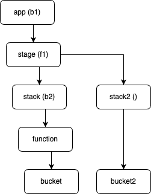

# Blueprint via Property Injection

* **Original Author(s):**: @pcheungamz
* **Tracking Issue**: [#693](https://github.com/aws/aws-cdk-rfcs/issues/693)
* **API Bar Raiser**: @rix0rrr

Blueprint is a way for orgs to enforce standards by setting default values to CDK Constructs.  The Blueprint standards can be shared and applied to many development teams.  This is done via injecting default property values at creation time.

Why do we need Blueprint?

Let's say our org wants to prevent publically accessible S3 Buckets.  You can extend the Bucket class, set `blockPublicAccess: BlockPublicAccess.BLOCK_ALL` and tell all development teams to use our new class.  Or we can also require all development teams to use `blockPublicAccess: BlockPublicAccess.BLOCK_ALL` in their code.  With Blueprint, we no longer have to subclass Bucket and it is easy for development teams to use.

What are the key pieces of Blueprint?

`IPropertyInjector` - An IPropertyInjector defines a way to inject additional properties that are not specified in the props.  It is specific to one Construct and operates on that Construct’s properties.  This will be called `Injector` for short.

`propertyInjectors` - A collection of Injectors attached to App, Stage, or Stack.  Any matching Construct created in this App, Stage, or Stack will have the Injector applied to it.

What is the Blueprint design philosophy?

An Org sets the standards and default value, and it is the responsibility of the development teams to adhere to that.  We also recognize that there are situations where the development team might need to override the standard.  In these situations, we value the autonomy of the development team by giving them the flexibility to override.

In the Working Backwards example below, the Org defines standard defaults for development teams to use, but development teams can override the defaults if they need to.  Development teams can also write their own Injectors and share them across teams.  

## Working Backwards

### Development Team Experience

Development teams can start using Blueprint by attaching propertyInjectors to App.
In the example below, this dev team wants use the Property Injectors provided by its org for S3 Buckets and Lambda Fucntions. 

```ts
import { BucketPropsInjector, FunctionPropsInjector } from '@my-org/standard-props-injectors';
...
const app = new App({
  ...
  propertyInjectors: [
    new BucketPropsInjector(),
    new FunctionPropsInjector(),
  ],
});
```

Dev teams can also attach propertyInjectors to Stacks as well.  This will override the Bucket Injector provided in App.

```ts
import { BetaBucketPropsInjector } from '@my-team/custom-props-injectors';
...
const betaStack = new Stack(stage, 'MyApp-beta-stack', {
  env: { account: '123456789012', region: 'us-east-1' },
  propertyInjectors: [
    new BetaBucketPropsInjector(),
  ],
});
```

In this case, Constructs created in betaStack will use `BetaBucketPropsInjector` instead of `BucketPropsInjector`.  This is useful when Beta resources have different requirements. 

See [Scope Tree Traversal](#scope-tree-traversal) for more information.

### Organization Level Standardization

As an org with many dev teams, we can standardize how AWS Resources are created by providing dev teams with Injectors.

AWS CDK will expose this `IPropertyInjector` interface for orgs to implement:

```ts
/**
 * This defines the context ofInjection.
 */
export interface InjectionContext {
  /**
   * scope from the Construct constructor
   */
  readonly scope: Construct;
  /**
   * id from the Construct constructor
   */
  readonly id: string;
}

/**
 * This attaches the inject function to the Construct that it operates on.
 */
export interface IPropertyInjector {
  /**
   * The FQN of the Construct class.
   */
  constructFqn: string;

  /**
   * The injector to be applied to the constructor of the Construct.
   */
  inject(originalProps: any, context: InjectionContext): any;
}
```

Here is a simple PropertyInjector to make sure the S3 Bucket is not publically accessible and SSL is used.

```ts
class MyBucketPropsInjector implements IPropertyInjector {
  public readonly constructFqn: string;

  constructor() {
    this.constructFqn = Bucket.UNIQUE_FQN;
  }

  inject(originalProps: BucketProps, _context: InjectionContext): BucketProps {
    return {
      blockPublicAccess: BlockPublicAccess.BLOCK_ALL,
      enforceSSL: true,
      ...originalProps,
    };
  }
}
```

Notes:
* We will add Bucket.UNIQUE_FQN to unique identify this Construct.  This is a new Property that we will add to Bucket and other supported Constructs.
* This TypeScript code will set blockPublicAccess to BlockPublicAccess.BLOCK_ALL and enforceSSL to true if these properties are not specified in originalProps.  This implementation allows the dev teams to override the org's recommended defaults.

## CDK Implementation Detail

### Add propertyInjectors to App, Stage, and Stack

In the constructor of App, we will add the propertyInjectors.

```ts
export class App extends Stage {
  ...
  constructor(props: AppProps = {}) {
    if (props.propertyInjectors) {
      const injectors = PropertyInjectors.of(this);
      injectors.add(...props.propertyInjectors);
      ...
    }
  }
}
...
```

We will need similar code to add `PropertyInjectors` to Stack.

### PropertyInjectors

The PropertyInjectors class has a map of constructFQN to IPropertyInjector.  This means that we can have only have one IPropertyInjector per Construct.  We put all the changes we want to make for a Construct in one place.

```ts
const PROPERTY_INJECTORS_SYMBOL = Symbol.for('@aws-cdk/core.PropertyInjectors');

export class PropertyInjectors {
  public static of(scope: IConstruct): PropertyInjectors {
    let propInjectors = (scope as any)[PROPERTY_INJECTORS_SYMBOL];
    if (!propInjectors) {
      propInjectors = new PropertyInjectors(scope);

      Object.defineProperty(scope, PROPERTY_INJECTORS_SYMBOL, {
        value: propInjectors,
        configurable: true,
        enumerable: true,
      });
    }
    return propInjectors;
  }
  
  private readonly _scope: IConstruct;
  private readonly _injectors: Map<string, IPropertyInjector>;

  private constructor(scope: IConstruct) {
    this._injectors = new Map<string, IPropertyInjector>();
    this._scope = scope;
  }

  /**
   * Add an array of IPropertyInjector to this collection of PropertyInjectors.
   * @param propsInjector
   */
  public add(...propsInjectors: IPropertyInjector[]) {
    for (const pi of propsInjectors) {
      if (this._injectors.has(pi.constructFqn)) {
        warn(`WARN: Overwriting injector for ${pi.constructFqn}`);
      }
      this._injectors.set(pi.constructFqn, pi);
      log(`=== Added ${pi.constructFqn} to ${this._scope}`);  
    }
  }
  
  /**
   * Get the PropertyInjector that is registered to the Construct's fqn.
   * @param fqn
   * @returns
   */
  public for(fqn: string): IPropertyInjector | undefined {
    return this._injectors.get(fqn);
  }
}
```

PropertyInjectors can be attached to any scope, but the typical use case is to attach PropertyInjectors to App, Stage, and Stack.

In [Scope Tree Traversal](#scope-tree-traversal), we will discuss how to find the correct injector when they are specified in app, stack, etc.

### Update Construct constructors

Below are changes we will make to S3 Bucket.  We need to add `UNIQUE_FQN` and in the constructor, call `applyInjectors`.

```ts
export class Bucket extends BucketBase {
  /**
   * Uniquely identifies this class.
   */
  public static readonly UNIQUE_FQN = 'aws-cdk-lib.aws-s3.Bucket';
  ...
  constructor(scope: Construct, id: string, props: BucketProps = {}) {
    props = applyInjectors(Bucket.UNIQUE_FQN, props, {
      scope,
      id,
    });

    super(scope, id, ...);
    ...
  }
}
```

`applyInjectors` finds the injector associated with `Bucket.UNIQUE_FQN` by calling `findInjectorsFromConstruct`,
and once the injector is found, it applies the changes to the props.  See the next section for how we walk up the scope tree to find the injector.


### Scope Tree Traversal

We have added propertyInjectors to App, Stage, and Stack, so we can specify injectors at different levels.  Let’s say we specified injectors as follows:
* At app, specify Bucket injector b1.
* At stage, specify Function injector f1.
* At stack, specify Bucket injector b2.
* No PropertyInjectors on stack2.
* No PropertyInjectors on function.



`findInjectorsFromConstruct` starts with the current scope and looks up the tree until an IPropertyInjector for that construct is found.

When function is created, the injector f1 is used, because there is no injector for Function at stack, but there is one at stage.

When bucket is created, the injector b2 is used.  Every bucket with scope of stack will be injected with b2.

bucket2 will use injector b1, because there is no Bucket injector found in stack2 so it will check stage, follow by app.


## FAQs

### Is this backward compatible?

Yes.  You do not need to specify or use any Injectors.  If no Injectors are specified, props are not changed.
Your existing code will continue to work.


### What changes are you making to AWS CDK?

* Introduce `IPropertyInjector` for organizations to implement.
* Introduce `PropertyInjectors` and allow it to be attached to App, Stage, and Stack.  Also see [Can I attach IPropertyInjector to other constructs?](#can-i-attach-ipropertyinjector-to-other-constructs)
* These [Constructs](#which-constructs-will-support-ipropertyinjector) will have their constructors modified so that they will call `applyInjectors` to look for the appropiate Injector to modify the props before `super` is called.  These Constructs will also have an UNIQUE_FQN property.

### Which Constructs will support IPropertyInjector?

Each of the Constructs below will also get a new UNIQUE_FQN property.

<!--BEGIN_TABLE-->
Package|Construct
---|-----
aws-cdk-lib.aws-apigateway|ApiKey
aws-cdk-lib.aws-apigateway|Deployment
aws-cdk-lib.aws-apigateway|DomainName
aws-cdk-lib.aws-apigateway|LambdaRestApi
aws-cdk-lib.aws-apigateway|RestApi
aws-cdk-lib.aws-apigateway|SpecRestApi
aws-cdk-lib.aws-apigateway|Stage
|
aws-cdk-lib.aws-apigatewayv2|HttpApi
aws-cdk-lib.aws-apigatewayv2|HttpAuthorizer
aws-cdk-lib.aws-apigatewayv2|HttpRoute
aws-cdk-lib.aws-apigatewayv2|DomainName
|
aws-cdk-lib.aws-appmesh|VirtualGateway
aws-cdk-lib.aws-appmesh|VirtualNode
|
aws-cdk-lib.aws-appsync|GraphqlApi
aws-cdk-lib.aws-appsync|HttpDataSource
|
aws-cdk-lib.aws-autoscaling|AutoScalingGroup
|
aws-cdk-lib.aws-backup|BackupVault
|
aws-cdk-lib.aws-certificatemanager|Certificate
|
aws-cdk-lib.aws-chatbot|SlackChannelConfiguration
|
aws-cdk-lib.aws-cloudfront|CloudFrontWebDistribution
aws-cdk-lib.aws-cloudfront|Distribution
|
aws-cdk-lib.aws-cloudtrail|Trail
|
aws-cdk-lib.aws-cognito|UserPoolClient
aws-cdk-lib.aws-cognito|UserPoolIdentityProviderSaml
|
aws-cdk-lib.aws-docdb|DatabaseCluster
|
aws-cdk-lib.aws-dynamodb|Table
aws-cdk-lib.aws-dynamodb|TableV2
|
aws-cdk-lib.aws-ec2|BastionHostLinux
aws-cdk-lib.aws-ec2|Instance
aws-cdk-lib.aws-ec2|InterfaceVpcEndpoint
aws-cdk-lib.aws-ec2|LaunchTemplate
aws-cdk-lib.aws-ec2|PrivateSubnet
aws-cdk-lib.aws-ec2|PublicSubnet
aws-cdk-lib.aws-ec2|SecurityGroup
aws-cdk-lib.aws-ec2|Subnet
aws-cdk-lib.aws-ec2|SubnetConfiguration
aws-cdk-lib.aws-ec2|Volume
aws-cdk-lib.aws-ec2|Vpc
|
aws-cdk-lib.aws-ecr|Repository
|
aws-cdk-lib.aws-ecs|BaseService
aws-cdk-lib.aws-ecs|Cluster
aws-cdk-lib.aws-ecs|ContainerDefinition
aws-cdk-lib.aws-ecs|Ec2Service
aws-cdk-lib.aws-ecs|Ec2TaskDefinition
aws-cdk-lib.aws-ecs|ExternalTaskDefinition
aws-cdk-lib.aws-ecs|FargateService
aws-cdk-lib.aws-ecs|TaskDefinition
|
aws-cdk-lib.aws-ecs-patterns|ApplicationLoadBalancedServiceBase
aws-cdk-lib.aws-ecs-patterns|ApplicationListenerProps
aws-cdk-lib.aws-ecs-patterns|ApplicationMultipleTargetGroupsServiceBase
aws-cdk-lib.aws-ecs-patterns|ApplicationLoadBalancedFargateService
aws-cdk-lib.aws-ecs-patterns|ApplicationLoadBalancedFargateServiceProps
aws-cdk-lib.aws-ecs-patterns|ApplicationMultipleTargetGroupsFargateService
aws-cdk-lib.aws-ecs-patterns|ApplicationMultipleTargetGroupsFargateServiceProps
aws-cdk-lib.aws-ecs-patterns|NetworkLoadBalancedFargateService
aws-cdk-lib.aws-ecs-patterns|NetworkLoadBalancedFargateServiceProps
aws-cdk-lib.aws-ecs-patterns|NetworkMultipleTargetGroupsFargateService
aws-cdk-lib.aws-ecs-patterns|NetworkMultipleTargetGroupsFargateServiceProps
aws-cdk-lib.aws-ecs-patterns|QueueProcessingFargateServiceProps
|
aws-cdk-lib.aws-efs|FileSystem
|
aws-cdk-lib.aws-eks|Cluster
aws-cdk-lib.aws-eks|FargateCluster
|
aws-cdk-lib.aws-elasticloadbalancingv2|ApplicationListener
aws-cdk-lib.aws-elasticloadbalancingv2|AddApplicationTargetsProps
aws-cdk-lib.aws-elasticloadbalancingv2|ApplicationLoadBalancer
aws-cdk-lib.aws-elasticloadbalancingv2|ApplicationTargetGroup
aws-cdk-lib.aws-elasticloadbalancingv2|BaseNetworkListenerProps
aws-cdk-lib.aws-elasticloadbalancingv2|AddNetworkTargetsProps
aws-cdk-lib.aws-elasticloadbalancingv2|NetworkListener
aws-cdk-lib.aws-elasticloadbalancingv2|NetworkLoadBalancer
aws-cdk-lib.aws-elasticloadbalancingv2|NetworkTargetGroup
|
aws-cdk-lib.aws-iam|Policy
aws-cdk-lib.aws-iam|PolicyStatement
aws-cdk-lib.aws-iam|Role
aws-cdk-lib.aws-iam|User
|
aws-cdk-lib.aws-kinesis|Stream
|
aws-cdk-lib.aws-kms|Key
|
aws-cdk-lib.aws-lambda|CodeSigningConfig
aws-cdk-lib.aws-lambda|Function
aws-cdk-lib.aws-lambda|FunctionUrl
|
aws-cdk-lib.aws-log|LogGroup
aws-cdk-lib.aws-log|LogRetention
|
aws-cdk-lib.aws-opensearchservice|Domain
|
aws-cdk-lib.aws-rds|DatabaseCluster
aws-cdk-lib.aws-rds|DatabaseClusterFromSnapshot
aws-cdk-lib.aws-rds|DatabaseInstance
aws-cdk-lib.aws-rds|DatabaseInstanceFromSnapshot
aws-cdk-lib.aws-rds|DatabaseInstanceReadReplica
aws-cdk-lib.aws-rds|DatabaseProxy
aws-cdk-lib.aws-rds|DatabaseSecret
aws-cdk-lib.aws-rds|ParameterGroup
aws-cdk-lib.aws-rds|ServerlessCluster
aws-cdk-lib.aws-rds|ServerlessClusterFromSnapshot
|
aws-cdk-lib.aws-s3|Bucket
|
aws-cdk-lib.aws-s3-deployment|BucketDeployment
|
aws-cdk-lib.aws-secretsmanager|Secret
|
aws-cdk-lib.aws-servicecatalog|ProductStackHistory
|
aws-cdk-lib.aws-ses|ConfigurationSet
aws-cdk-lib.aws-ses|DropSpamReceiptRule
aws-cdk-lib.aws-ses|EmailIdentity
aws-cdk-lib.aws-ses|ReceiptRule
|
aws-cdk-lib.aws-sns|Subscription
aws-cdk-lib.aws-sns|Topic
aws-cdk-lib.aws-sns|TopicPolicy
|
aws-cdk-lib.aws-sns-subscriptions|UrlSubscription
aws-cdk-lib.aws-sns-subscriptions|UrlSubscriptionProps
|
aws-cdk-lib.aws-sqs|Queue
|
aws-cdk-lib.aws-stepfunctions-tasks|EcsRunTask
|
aws-cdk-lib.custom-resources|Provider
aws-cdk-lib.custom-resources|ProviderProps
aws-cdk-lib.custom-resources|AwsCustomResource
<!--END_TABLE-->

### What happens when you need to create a accessLogBucket for a Bucket?  Would a Bucket injector trying to create accesslogBucket run into infinite recursion, since you are creating another Bucket inside the Bucket constructor?

Bucket Injectors that need to create a Bucket will need to take special care to avoid infinite recursion.  One way to accomplish this is to track the state in the Injector.  Here is an example.

```ts
class SpecialBucketInjector implements IPropertyInjector {
  public readonly constructFqn: string;

  // this variable will track if this Injector should be skipped.
  private _skip: boolean;

  constructor() {
    this._skip = false;
    this.constructFqn = Bucket.UNIQUE_FQN;
  }

  inject(originalProps: BucketProps, context: InjectionContext): BucketProps {
    if (this._skip) {
      return originalProps;
    }

    let accessLogBucket = originalProps.serverAccessLogsBucket;
    if (!accessLogBucket) {
      // When creating a new accessLogBucket, disable further Bucket injection.
      this._skip = true;

      // Since injection is disabled, make sure you provide all the necessary props.
      accessLogBucket = new Bucket(context.scope, 'my-access-log', {
        blockPublicAccess: BlockPublicAccess.BLOCK_ALL,
        removalPolicy: originalProps.removalPolicy ?? core.RemovalPolicy.RETAIN,
      });

      // turn on injection for Bucket again.
      this._skip = false;
    }

    return {
      serverAccessLogsBucket: accessLogBucket,
      ...originalProps,
    };
  }
}
```
We have to set `_skip` to true before the line to create an accessLogBucket.  Otherwise, it will try to create an accessLogBucket for an accessLogBucket, ad inifinitum.  

This technique should also be used when creating a DeadLetterQueue within aws-sqs.Queue, because we are creating a Queue within a Queue.  However, this is not necessary when creating a DeadLetterQueue inside a lambda Function Injector.

### Can I attach two differnt Bucket IPropertyInjector to a Stack?

What happens when I do this?
```ts
const myStack = new Stack(stage, 'MyApp-stack', {
  env: { account: '123456789012', region: 'us-east-1' },
  propertyInjectors: [
    new DefaultBucketPropsInjector(),
    new BetaBucketPropsInjector(),
  ],
});
```

Assuming both have `constructFqn` of `Bucket.UNIQUE_FQN`.
`BetaBucketPropsInjector` will overwrite `DefaultBucketPropsInjector`.  Any Bucket created in `myStack` will have `BetaBucketPropsInjector` applied to it.  This is because we use a Map keyed by constructFqn to store the Injectors and the second one will overwrite the first one.


### Can I attach IPropertyInjector to other constructs?

Yes.  You can use `.of`.

Example:
```ts
const function = new Function(stack, 'MyFunc', {
  ...
});

const b3 = new BucketInjector();

PropertyInjectors.of(function).add(b3);

const bucketA = new Bucket(function, 'test-mybucket', {
    ...
});
```

`bucketA` will get BucketInjector `b3` applied to it, regardless of what Bucket Injector was defined in Stack or App.
The typical use case is to attach IPropertyInjectors to App, Stage, and Stack.  So we have added `propertyInjectors` to their props for ease of use.
