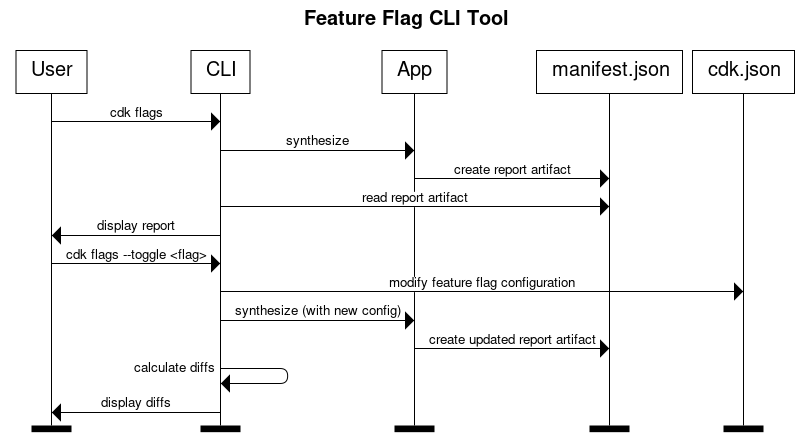

# RFC: Feature Flag Advisor

* Original Author(s): [@vivian12300](https://quip-amazon.com/GGQ9EAAQ3Jw)
* Tracking Issue: [#750](https://github.com/aws/aws-cdk-rfcs/issues/750)
* API Bar Raiser: [@rix0rrr](https://quip-amazon.com/YPP9EA8Gt6Q)

The CDK team uses [feature flags](https://github.com/aws/aws-cdk-rfcs/blob/main/text/0055-feature-flags.md) to implement changes that could impact current infrastructure. By using these flags, you can add security updates, new behaviors, or bug patches. New feature flags are automatically disabled in existing projects to retain backwards compatibility. Therefore, if you want to keep your feature flag configuration up-to-date, you are required to manually track and update them as releases become available. Additionally, since flags are not automatically updated, you might be unaware that a certain bug in your application could have been fixed by flipping on a feature flag. To help manage this, the `cdk flags` CLI tool allows you to view all flags, their recommended values, and modify them.

## Working Backwards

Feature flags are an important tool for adding bug fixes to your application. When the CDK team releases feature flags, we set a recommended state for them to be configured in new applications. This ensures that the proper bug fixes are integrated. As a user, you can choose to manually enable the flag and set it to the recommended configuration, or leave it at its default state, which may not include the latest bug fixes. The default state is the initial state that a feature flag is set to when it’s introduced. In most cases, the default state is "false", meaning the flag is off and doesn’t affect your application.

Even if you are aware of the feature flags within your application, configuring your feature flags requires you to manually edit your context in the `cdk.json` file for each flag you would like to modify. 

```
// To modify a feature flag's state, manually type in your desired state 
"context": {
    "@aws-cdk/aws-lambda:recognizeLayerVersion": true,
    "@aws-cdk/core:checkSecretUsage": true,
    "@aws-cdk/core:target-partitions": [
      "aws",
      "aws-cn"
    ],
    ...
    }
```

Additionally, if you do not create your CDK project using `cdk init`, your feature flags may not have been configured at all, resulting in differing app behavior and missing out on potential bug fixes. An example of how a feature flag could impact you is the `@aws-cdk/aws-cloudfront:defaultSecurityPolicyTLSv1.2_2021` flag. It changes the default behavior to use the updated version TLSv1.2_2021, which is a more secure and support TLS version for CloudFront. If you stuck with the previous version, you may have been exposed to security vulnerabilities and failed compliance tests. 

To address these issues and make the process easier, the `cdk flags` CLI command helps you find, modify, and view your feature flag configurations.

### README

Feature flags can be used to introduce bug fixes, security updates, or new behaviors, all while ensuring backwards compatibility with your application. This guide explains how to manage feature flags in your CDK application using the `cdk flags` CLI tool.

To increase visibility to `cdk flags`, you receive a notice whenever `cdk synth` is run on your application similar to the one below. This notice does not interrupt the `cdk synth` command but is visible until all of your feature flags have been configured.

```
> cdk synth
Notice: You currently have **10** unconfigured feature flags that may require attention to keep your application up-to-date. Run `cdk flags` to learn more.
```

After seeing the notice above, you can run `cdk flags` to see a report of your feature flag configurations that differ from our recommended states. Unconfigured flags will be labelled with - <unset> to show that flag currently has no value. The flags are displayed to you in the following order:

1. flags whose states do not match our recommended values
2. flags that are not configured at all

```
> cdk flags 
    Feature Flag                              Recommended                  User
  * @aws-cdk/...                              true                         false
  * @aws-cdk/...                              true                         false
  * @aws-cdk/...                              true                         - <unset>
```

Alternatively, you can also run `cdk flags --all` to see a report of all feature flags in the following order:

1. flags whose states match our recommended values
2. flags whose states do not match our recommended values
3. flags that are not configured at all

```
> cdk flags --all
    Feature Flag                              Recommended                  User
    @aws-cdk/...                              true                         true
  * @aws-cdk/...                              true                         false
  * @aws-cdk/...                              true                         false
  * @aws-cdk/...                              true                         - <unset>
```

### Modifying your feature flag values

To start, you can run `cdk flags -i` to view the interactive menu options or run `cdk flags --help` to see all options available to you.

From here, you can choose to modify your feature flag configurations. After choosing an option or running a command, you see the potential impact on your application and decide if you want to accept or reject the changes. Should you choose to accept, your CDK application resynthesizes with the new feature flag configurations. This means changes are not made until you have confirmed them. 

#### View all available options

```
> cdk flags --help
cdk flags 
Finds and displays a report of the feature flag configuration and compares your current values with our recommended values.
 
Options:
    --set                          modify your feature flag configuration
        --all                      --
            --recommended           | modify all feature flags to the recommended or default state
            --default              __
        --unconfigured             --
            --recommended           | modify unconfigured feature flags to the recommended or default state
            --default              __
        "#FLAGNAME#"               --
            --recommended           | modify a specific feature flag to the recommended, default, or custom state
            --default               | 
            --value=string         --
    --all                          view a report of all your feature flags
    -i                             view an interactive menu of options
    "#FLAGNAME#"                   view information about a specific flag
Examples:
cdk flags --all
cdk flags --all --recommended 
cdk flags "@aws-cdk/aws-cloudfront:defaultSecurityPolicyTLSv1.2_2021" --value="true"
```

#### Use the interactive menu

```
> cdk flags -i
    MENU ---------------------------------------------
    > Set all flags to recommended values 
      Set unconfigured flags to recommended values
      Reset unconfigured flags to their default configuration (no impact)
      Modify a specific flag
      Exit
```

If you want to remove the notice from running `cdk synth`, you can run any of the first 3 options. These options set your unconfigured feature flags to a value, thus removing the notice message. 

The first option,` set all flags to recommended values `, is equivalent to the command `cdk flags --set --recommended --all`. This option changes every single feature flag to our recommended value, overwriting existing configured values. To keep feature flag configuration up-to-date with the latest CDK feature flag configurations, use this command.

```
> cdk flags --set --recommended --all
    Feature Flag                              Recommended Value            User Value
  * @aws-cdk/...                              true                         false
  * @aws-cdk/...                              true                         false
  * @aws-cdk/...                              true                         - <unset>
  Here is the difference:
    Resources
    [~] AWS::S3::Bucket MyBucket
    └─ [~] Properties
        └─ [~] Encryption
            ├─ [-] None
            └─ [+] ServerSideEncryptionConfiguration:
                    - ...
    
    [~] AWS::CloudFront::Distribution MyDistribution
    └─ [~] Properties
        └─ [~] DefaultSecurityPolicy
            ├─ [-] TLSv1.0
            └─ [+] TLSv1.2_2021
                    - ...
    Number of stacks with differences: 2
  Would you like to accept or reject these changes? (Accept/reject)
> Accept
  Resynthesizing...
```

The second option, `set unconfigured flags to recommended values`, is equivalent to the command `cdk flags --set --recommended --unconfigured`. If you would prefer your existing configured flags untouched, this option only changes the unconfigured feature flags to our recommended values.

```
> cdk flags --set --recommended --unconfigured
    Feature Flag                              Recommended Value            User Value
  * @aws-cdk/...                              true                         - <unset>
  * @aws-cdk/...                              true                         - <unset>
  Here is the difference:
    Resources
    [~] AWS::S3::Bucket MyBucket
    └─ [~] Properties
        └─ [~] Encryption
            ├─ [-] None
            └─ [+] ServerSideEncryptionConfiguration:
                    - ...
 
    [~] AWS::CloudFront::Distribution MyDistribution
    └─ [~] Properties
        └─ [~] DefaultSecurityPolicy
            ├─ [-] TLSv1.0
            └─ [+] TLSv1.2_2021
                    - ...
    Number of stacks with differences: 2
  Would you like to accept or reject these changes? (Accept/reject)
> Accept
  Resynthesizing...
```

The third option,  `reset unconfigured flags to their default configuration`, is equivalent to the command `cdk flags --set --default --unconfigured`. If you want to ensure the unconfigured flags do not interfere with your application, this option changes the unconfigured feature flags to its default values. For example, if `@aws-cdk/aws-cloudfront:defaultSecurityPolicyTLSv1.2_2021` is unconfigured, it leads to the notice appearing after running `cdk synth`. However, if you set the flag to its default state (false), it will be configured, turned off, and have no impact on your application whatsoever. 

```
> cdk flags --set --default --unconfigured
    Feature Flag                              Recommended Value            User Value
  * @aws-cdk/...                              true                         - <unset>
  * @aws-cdk/...                              true                         - <unset>
  Here is the difference:
  
  Would you like to accept or reject these changes? (Accept/reject)
> Accept
  Resynthesizing...
```

The fourth option,  `modify a specific flag`, asks you which flag you want to modify. You are prompted to enter the name of the flag and choose an existing state after. Use this command if there is a specific bug fix you would like to incorporate into your application.

```
  Which flag would you like to modify?
> "@aws-cdk/aws-cloudfront:defaultSecurityPolicyTLSv1.2_2021"
  What value would you like to change "@aws-cdk/aws-cloudfront:defaultSecurityPolicyTLSv1.2_2021" to?
    > **true**
      false
  Here is the difference:
    Resources
    [~] AWS::CloudFront::Distribution MyDistribution
    └─ [~] Properties
        └─ [~] DefaultSecurityPolicy
            ├─ [-] TLSv1.0
            └─ [+] TLSv1.2_2021
                    - ...
    Number of stacks with differences: 1
  Would you like to accept or reject these changes? (Accept/reject)
> Accept
  Resynthesizing...
```

To achieve the same result, you can also run `cdk flags --set "@aws-cdk/aws-cloudfront:defaultSecurityPolicyTLSv1.2_2021" --value="true"`.

```
> cdk flags --set "@aws-cdk/aws-cloudfront:defaultSecurityPolicyTLSv1.2_2021" --value="true"
  Here is the difference:
    Resources
    [~] AWS::CloudFront::Distribution MyDistribution
    └─ [~] Properties
        └─ [~] DefaultSecurityPolicy
            ├─ [-] TLSv1.0
            └─ [+] TLSv1.2_2021
                    - ...
      Number of stacks with differences: 1
  Would you like to accept or reject these changes? (Accept/reject)
> Accept
  Resynthesizing...
```

### Inspect a specific feature flag

#### View more information about a flag

Besides running `cdk flags` and `cdk flags --all` to view your feature flag configuration, you can also utilize `cdk flags "#FLAGNAME#"` to inspect a specific feature flag and find out what a specific flag does. This can be helpful in cases where you want to understand a particular flag and its impact on your application.

```
> cdk flags "@aws-cdk/aws-cloudfront:defaultSecurityPolicyTLSv1.2_2021"
    Description: Enable this feature flag to have cloudfront distributions use the security policy TLSv1.2_2021 by default.
    Recommended Value: true
    User Value: true
```

#### Modify a particular flag

If you need to modify the value of this flag and want to make sure you’re setting it to a correct and supported state, run `cdk flags --set "#FLAGNAME#"` to see a list of options. From there, you can choose which option to set the flag to.

```
> cdk flags --set "@aws-cdk/aws-cloudfront:defaultSecurityPolicyTLSv1.2_2021"
   What value would you like to change "@aws-cdk/aws-cloudfront:defaultSecurityPolicyTLSv1.2_2021" to?
  > **** **true**
    false
  Here is the difference:
    Resources
    [~] AWS::CloudFront::Distribution MyDistribution
    └─ [~] Properties
        └─ [~] DefaultSecurityPolicy
            ├─ [-] TLSv1.0
            └─ [+] TLSv1.2_2021
                    - ...
    Number of stacks with differences: 2
  Would you like to accept or reject these changes? (Accept/reject)
> Accept
  Resynthesizing...   
```

If you already know the value you would like to change the state to, run  `cdk flags --set "#FLAGNAME#" --value="#state#"` as shown in the previous section.

### Rejecting a change

If you decide not to go through with a change, you will be asked whether you would like to reject all the feature flag changes or a specific one. Feature flags have the potential to alter the state of an application. We want to ensure you are able to configure as many feature flags as possible without there being a negative effect on your project. Therefore, we display the difference in CloudFormation templates after every change. The feature flags that modified your template will be marked with an asterisk (*) to aid you in deciding which changes to reject. 

```
  Would you like to accept or reject these changes? (Accept/reject)
> reject
  Would you like to reject all feature flag changes or reject specific change(s)?
[1] Reject all changes -> Restore all flags to their previous state
[2] Reject only changes to specific feature flags -> Undo specific flags
[3] Exit -> Accept all changes
> 2
Which feature flag change would you like to reject? For multiple options, separate them with a comma. 
[1] @aws-cdk/aws-cloudfront:defaultSecurityPolicyTLSv1.2_2021 *****
[2] @aws-cdk/aws-s3:BucketEncryption *****
[3] @aws-cdk/aws-iam:minimizePolicies 
[4] Exit
> 1, 2
Rejecting the change for @aws-cdk/aws-cloudfront:defaultSecurityPolicyTLSv1.2_2021 and @aws-cdk/aws-s3:BucketEncryption...
Resynthesizing for other changes...
```

## Why should I use this feature?

If you find yourself doing any of the following, you will benefit from the `cdk flags` command tool:

* Constantly needing to update feature flags in your CDK projects
* Manually editing `cdk.json` to modify your feature flag states
* Wanting to keep track of available feature flags and their current state
* Looking for a faster and more efficient way to toggle feature flags

## Why should we do this?

Feature flags have the potential to improve the your experience by incorporating bug fixes, so it is beneficial to create a visible tool for you to increase autonomy within their CDK projects. This tool also reduces the burden on you by allowing you to change your feature flag configurations through simple commands on your CLI. By creating a Feature Flag CLI tool, we show you information on your feature flag configuration, inform you about available feature flags, and allow you to modify their initial feature flag states seamlessly, resulting in a better experience.

## Why should we *not* do this?

This tool aims to simplify the feature flag configuration file by asking users if they would like to make the changes from the CLI. However, this creates a risk of users applying our recommendations without fully understanding its impact on their application. For example, a user could unknowingly enable a recommended flag that impacts behavior a user is depending on. To ensure they are informed about these changes as much as possible, any potential change results  in a comparison of their CloudFormation template and their modified one.

Adding a CLI tool also increases the CDK CLI complexity, requiring more maintenance and support for this feature.

## What alternative solutions did you consider?

Another solution could be to prompt users to configure their feature flags when they create their CDK app using `cdk init`. This increases visibility to the feature flags and can be integrated smoothly within their project creation process. However, this does not help existing projects and could be considered an inconvenience and unnecessary by users.

## What is the technical solution (design) of this feature?

To implement this feature, we would first generate a Feature Flag Report artifact to be stored in CloudAssembly. The report is a `Record` of individual `FeatureFlag` objects that contain the fields `userValue`, `recommendedValue`, and `summary.` When the `cdk flags` command is run, the CLI accesses this artifact stored in `manifest.json` and displays the report to the user. When the user request changes, a new CloudFormation template is generated and the differences are displayed. When the changes are confirmed, that value is changed in `cdk.json` and the entire application resynthesizes. If the user wants to reject a change, we run an algorithm to check which feature flag has impacted application by going through all the flags, changing their states, and recording if there was a change in the resulting CloudFormation template. Then, we mark those particular flags in the resulting display to notify the user. 


## Is this a breaking change?

No. Users will be able to view the impact of the changes they are requesting and reject them if necessary.

## Why not read from `recommended-feature-flags.json` from `aws-cdk-lib` directly?

The` recommended-feature-flags.json ` contains every feature flag and our recommended states for them. However, reading directly from `recommended-feature-flags.json` is not an option because it is not compatible with jsii projects. For non-Javascript projects, this file is not be included in the configuration when the jsii package is compiled in in other languages, meaning it wouldn’t work for CDK projects in languages like Python and Java.


