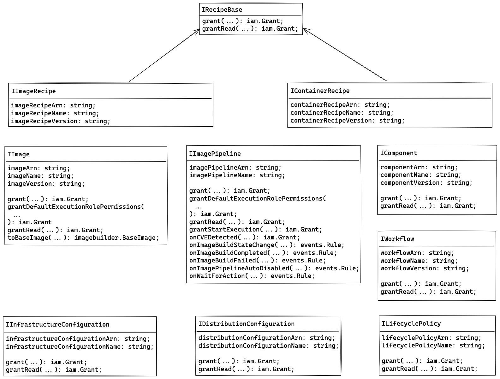
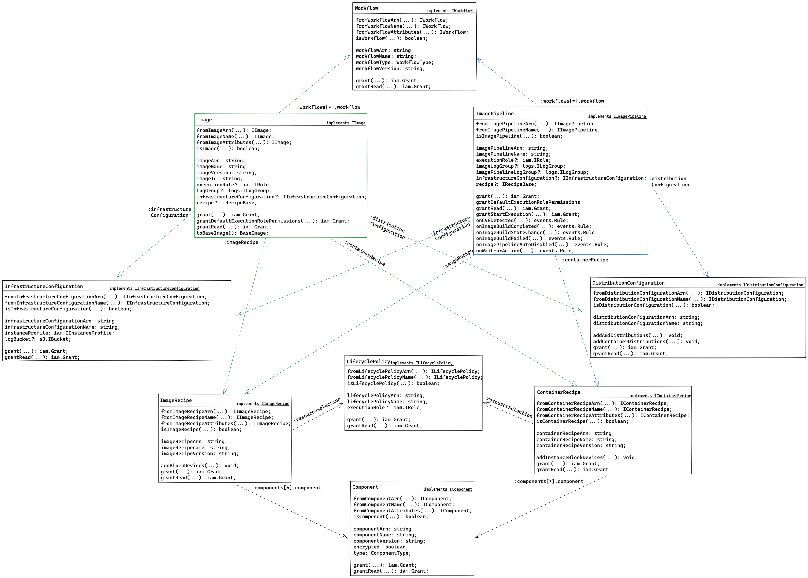

# EC2 Image Builder L2 Constructs

* **Original Author(s):**: @tarunb12
* **Tracking Issue**: [#789](https://github.com/aws/aws-cdk-rfcs/issues/789)
* **API Bar Raiser**: @kumsmrit

The `aws-imagebuilder` construct library allows you to create EC2 Image Builder resources, such as pipelines, images,
components, workflows, and lifecycle policies, with just a few lines of code. As with most construct libraries, you can
also easily define permissions and integrations using a simple API.

The amount of effort needed to create these resources is significantly reduced compared to using the AWS console or
CloudFormation directly, with best practices built-in. Below is a minimal example showing how L2 constructs simplify the
creation of EC2 Image Builder image pipelines using secure defaults, compared to the L1 equivalent code:

```ts
// Using L1 constructs
const instanceProfileRole = new iam.Role(stack, 'EC2InstanceProfileForImageBuilderRole', {
  assumedBy: iam.ServicePrincipal.fromStaticServicePrincipleName('ec2.amazonaws.com'),
  managedPolicies: [
    iam.ManagedPolicy.fromAwsManagedPolicyName('AmazonSSMManagedInstanceCore'),
    iam.ManagedPolicy.fromAwsManagedPolicyName('EC2InstanceProfileForImageBuilder'),
  ],
});

const instanceProfile = new iam.InstanceProfile(stack, 'EC2InstanceProfileForImageBuilder', {
  role: instanceProfileRole,
});

const bucket = new s3.Bucket(stack, 'ImageBuilderLoggingBucket', {
  bucketName: `ec2imagebuilder-logs-${stack.region}-${stack.account}`,
  enforceSSL: true,
});

const l1InfrastructureConfiguration = new imagebuilder.CfnInfrastructureConfiguration(stack, 'L1InfrastructureConfiguration', {
  name: 'l1-infrastructure-configuration',
  instanceProfileName: instanceProfile.instanceProfileName,
  instanceMetadataOptions: { httpTokens: 'required' },
  logging: {
    s3Bucket: bucket.bucketName,
    s3KeyPrefix: 'imagebuilder-logging',
  },
});

const l1ImageRecipe = new imagebuilder.CfnImageRecipe(stack, 'L1ImageRecipe', {
  name: 'l1-image-recipe',
  version: '1.0.0',
  parentImage: `arn:${stack.partition}:imagebuilder:${stack.region}:aws:image/amazon-linux-2023-x86/x.x.x`,
  components: [
    {
      componentArn: `arn:${stack.partition}:imagebuilder:${stack.region}:aws:component/update-linux/x.x.x`,
    },
  ],
});

const l1ImagePipeline = new imagebuilder.CfnImagePipeline(stack, 'L1ImagePipeline', {
  name: 'l1-image-pipeline',
  imageRecipeArn: l1ImageRecipe.attrArn,
  infrastructureConfigurationArn: l1InfrastructureConfiguration.attrArn,
});

// Equivalent, using L2 constructs
const l2ImagePipeline = new imagebuilder.ImagePipeline(stack, 'L2ImagePipeline', {
  recipe: new imagebuilder.ImageRecipe(stack, 'L2ImageRecipe', {
    baseImage: imagebuilder.AwsManagedImage.amazonLinux2023(stack, 'AL2023'),
    components: [
      {
        component: imagebuilder.AwsManagedComponent.updateOS(stack, 'UpdateOS', {
          platform: imagebuilder.Platform.Linux,
        }),
      },
    ],
  }),
});
```

## Working Backwards

**CHANGELOG**: `feat(imagebuilder): add support for EC2 Image Builder L2 Constructs`

---

# EC2 Image Builder Construct Library

[Amazon EC2 Image Builder](https://docs.aws.amazon.com/imagebuilder/latest/userguide/what-is-image-builder.html) is a
fully managed AWS service that helps you automate the creation, management, and deployment of customized, secure, and
up-to-date server images. You can use Image Builder to create Amazon Machine Images (AMIs) and container images for use
across AWS Regions.

This module is part of the [AWS Cloud Development Kit](https://github.com/aws/aws-cdk) project. It allows you to define
Image Builder pipelines, images, recipes, components, workflows, and lifecycle policies.

## Image Pipeline

An image pipeline provides the automation framework for building secure AMIs and container images. The pipeline
orchestrates the entire image creation process by combining an image recipe or container recipe with infrastructure
configuration and distribution configuration. Pipelines can run on a schedule or be triggered manually, and they manage
the build, test, and distribution phases automatically.

### Example

```ts
import * as cdk from 'aws-cdk-lib';
import * as ec2 from 'aws-cdk-lib/aws-ec2';
import * as iam from 'aws-cdk-lib/aws-iam';
import * as imagebuilder from 'aws-cdk-lib/aws-imagebuilder';
import * as lambda from 'aws-cdk-lib/aws-lambda';
import * as targets from 'aws-cdk-lib/aws-events-targets';

// Minimal pipeline setup
const minimalPipeline = new imagebuilder.ImagePipeline(stack, 'ImagePipeline', {
  recipe: new imagebuilder.ImageRecipe(stack, 'MinimalImageRecipe', {
    baseImage: imagebuilder.AwsManagedImage.amazonLinux2023(stack, 'AL2023'),
    components: [
      {
        component: imagebuilder.AwsManagedComponent.updateOS(stack, 'UpdateOS', {
          platform: imagebuilder.Platform.Linux,
        }),
      },
    ],
  }),
});

// Complex pipeline setup
const imagePipeline = new imagebuilder.ImagePipeline(stack, 'ImagePipeline', {
  name: 'test-image-pipeline',
  description: 'An Image Pipeline',
  // Optional - use a custom execution role
  executionRole: iam.Role.fromRoleName(stack, 'ImageBuilderRole', 'ImageBuilderExecutionRole'),
  // Run the pipeline every Monday at 12:00 PST
  schedule: imagebuilder.Schedule.cron({
    startCondition: imagebuilder.ScheduleStartCondition.EXPRESSION_MATCH_AND_DEPENDENCY_UPDATES_AVAILABLE,
    minute: '0',
    hour: '12',
    weekDay: 'MON',
    timezone: cdk.TimeZone.AMERICA_LOS_ANGELES,
  }),
  recipe: imagebuilder.ImageRecipe.fromImageRecipeAttributes(stack, 'ImageRecipe', {
    name: 'test-image-recipe',
    version: imagebuilder.Version.fromVersionAttributes({ major: '1', minor: '0', patch: '0' }),
  }),
  infrastructureConfiguration: imagebuilder.InfrastructureConfiguration.fromName(
    stack,
    'InfrastructureConfiguration',
    'test-infrastructure-configuration',
  ),
  distributionConfiguration: imagebuilder.DistributionConfiguration.fromName(
    stack,
    'DistributionConfiguration',
    'test-distribution-configuration',
  ),
  // Include customized workflows, in addition to the AWS-managed defaults
  workflows: [
    { workflow: imagebuilder.AwsManagedWorkflow.buildImage(stack, 'BuildImageWorkflow') },
    { workflow: imagebuilder.AwsManagedWorkflow.testImage(stack, 'TestImageWorkflow') },
    {
      workflow: imagebuilder.Workflow.fromWorkflowAttributes(stack, 'TestImageWorkflow', {
        name: 'custom-test-workflow',
        type: imagebuilder.WorkflowType.TEST,
        version: imagebuilder.Version.LATEST,
      }),
    },
    {
      workflow: imagebuilder.AwsManagedWorkflow.fromName(
        stack,
        'TestWorkflowAcrossInstanceTypes',
        'test-image-with-instance-type',
      ),
      onFailure: imagebuilder.WorkflowOnFailure.CONTINUE,
      parallelGroup: 'group-1',
      parameters: {
        instanceType: imagebuilder.WorkflowParameterValue.fromStringList([
          ec2.InstanceType.of(ec2.InstanceClass.COMPUTE7_INTEL_FLEX, ec2.InstanceSize.MEDIUM).toString(),
          ec2.InstanceType.of(ec2.InstanceClass.MEMORY_INTENSIVE_8_GRAVITON, ec2.InstanceSize.LARGE).toString(),
        ]),
      },
    },
  ],
  // Enable CVE scanning, testing, and OS/package collection for the pipeline
  scanningConfiguration: { enabled: true },
  testsConfiguration: { testsEnabled: true },
  enhancedImageMetadataEnabled: true,
});

// Wire up the WaitForAction event emitted from the pipeline
imagePipeline.onWaitForAction('WaitForActionEvent', {
  target: new targets.LambdaFunction(
    lambda.Function.fromFunctionName(stack, 'WaitForActionTriggerFunction', 'wait-for-action-trigger-function'),
  ),
});
```

## Image

An image is the output resource created by Image Builder, consisting of an AMI or container image plus metadata such as
version, platform, and creation details. Images are used as base images for future builds and can be shared across AWS
accounts. While images are the output from image pipeline executions, they can also be created in an ad-hoc manner
outside a pipeline, defined as a standalone resource.

### Example

```ts
import * as cdk from 'aws-cdk-lib';
import * as ec2 from 'aws-cdk-lib/aws-ec2';
import * as iam from 'aws-cdk-lib/aws-iam';
import * as imagebuilder from 'aws-cdk-lib/aws-imagebuilder';

const image = new imagebuilder.Image(stack, 'Image', {
  // Optional - use a custom execution role
  executionRole: iam.Role.fromRoleName(stack, 'ImageBuilderRole', 'ImageBuilderExecutionRole'),
  recipe: imagebuilder.ImageRecipe.fromImageRecipeAttributes(stack, 'ImageRecipe', {
    name: 'test-image-recipe',
    version: imagebuilder.Version.fromVersionAttributes({ major: '1', minor: '0', patch: '0' }),
  }),
  infrastructureConfiguration: imagebuilder.InfrastructureConfiguration.fromName(
    stack,
    'InfrastructureConfiguration',
    'test-infrastructure-configuration',
  ),
  distributionConfiguration: imagebuilder.DistributionConfiguration.fromName(
    stack,
    'DistributionConfiguration',
    'test-distribution-configuration',
  ),
  // Include customized workflows, in addition to the AWS-managed defaults
  workflows: [
    { workflow: imagebuilder.AwsManagedWorkflow.buildImage(stack, 'BuildImageWorkflow') },
    { workflow: imagebuilder.AwsManagedWorkflow.testImage(stack, 'TestImageWorkflow') },
    {
      workflow: imagebuilder.Workflow.fromWorkflowAttributes(stack, 'TestImageWorkflow', {
        name: 'custom-test-workflow',
        type: imagebuilder.WorkflowType.TEST,
        version: imagebuilder.Version.LATEST,
      }),
    },
    {
      workflow: imagebuilder.AwsManagedWorkflow.fromName(
        stack,
        'TestWorkflowAcrossInstanceTypes',
        'test-image-with-instance-type',
      ),
      onFailure: imagebuilder.WorkflowOnFailure.CONTINUE,
      parallelGroup: 'group-1',
      parameters: {
        instanceType: imagebuilder.WorkflowParameterValue.fromStringList([
          ec2.InstanceType.of(ec2.InstanceClass.COMPUTE7_INTEL_FLEX, ec2.InstanceSize.MEDIUM).toString(),
          ec2.InstanceType.of(ec2.InstanceClass.MEMORY_INTENSIVE_8_GRAVITON, ec2.InstanceSize.LARGE).toString(),
        ]),
      },
    },
  ],
  // Enable CVE scanning, testing, and OS/package collection for the pipeline
  scanningConfiguration: { enabled: true },
  testsConfiguration: { testsEnabled: true },
  enhancedImageMetadataEnabled: true,
});
```

## Image Recipe

An image recipe is a document that defines the base AMI and the components applied to produce the desired configuration
for the output AMI. You can use image recipes to duplicate builds and maintain versioned, shareable configurations.
Image recipes specify the base image, build components for customization, test components for validation, as well as
other customizations to make to the output image, such as the block devices associated with the output AMI.

### Example

```ts
import * as ec2 from 'aws-cdk-lib/aws-ec2';
import * as kms from 'aws-cdk-lib/aws-kms';
import * as imagebuilder from 'aws-cdk-lib/aws-imagebuilder';
import * as s3 from 'aws-cdk-lib/aws-s3';

const userData = ec2.UserData.forLinux();
userData.addS3DownloadCommand({
  bucket: s3.Bucket.fromBucketName(stack, 'Bucket', `test-bucket-${stack.account}`),
  bucketKey: 'test-key',
  localFile: 's3-executable.sh',
});
userData.addExecuteFileCommand({ filePath: 's3-executable.sh' });
userData.addCommands('User Data complete!');

const imageRecipe = new imagebuilder.ImageRecipe(stack, 'ImageRecipe', {
  name: 'test-image-recipe',
  version: imagebuilder.Version.fromString('1.0.0'),
  description: 'An Image Recipe',
  // Use an AL2023 base image
  baseImage: imagebuilder.BaseImage.fromSsmParameterName(
    stack,
    'AL2023Minimal',
    '/aws/service/ami-amazon-linux-latest/al2023-ami-minimal-kernel-default-x86_64',
  ),
  // Use an AWS-managed component, shared component, self-owned component with parameters, and marketplace component
  components: [
    {
      component: imagebuilder.AwsManagedComponent.updateOS(stack, 'UpdateOS', {
        platform: imagebuilder.Platform.Linux,
      }),
    },
    {
      component: imagebuilder.Component.fromArn(
        stack,
        'ComplianceTestComponent',
        `arn:${stack.partition}:imagebuilder:${stack.region}:123456789012:component/compliance-test/2025.x.x.x`,
      ),
    },
    {
      component: imagebuilder.AwsMarketplaceComponent.fromAwsMarketplaceComponentAttributes(
        stack,
        'MarketplaceComponent',
        {
          name: 'marketplace-component-name',
          marketplaceProductId: '12345678-1234-1234-1234-123456789012',
          version: imagebuilder.BuildVersion.LATEST,
        },
      ),
    },
    {
      component: imagebuilder.Component.fromComponentAttributes(stack, 'CustomComponent', {
        name: 'custom-component',
        version: imagebuilder.Version.LATEST,
      }),
      parameters: {
        CUSTOM_PARAMETER_KEY: imagebuilder.ComponentParameterValue.fromString('custom-parameter-value'),
      },
    },
  ],
  workingDirectory: '/var/tmp',
  // Optional - retain the SSM agent after the build, and apply custom userdata
  additionalInstanceConfiguration: {
    systemsManagerAgent: {
      uninstallAfterBuild: false,
    },
    userDataOverride: userData,
  },
  // Optional - attach additional block device to the build instance
  blockDevices: [
    {
      deviceName: '/dev/sda1',
      mappingEnabled: true,
      volume: ec2.BlockDeviceVolume.ebs(50, {
        deleteOnTermination: true,
        iops: 1000,
        volumeType: ec2.EbsDeviceVolumeType.GP3,
        throughput: 1000,
        encrypted: true,
        kmsKey: kms.Key.fromLookup(stack, 'VolumeKey', { aliasName: 'alias/volume-encryption-key' }),
      }),
    },
  ],
});
```

## Container Recipe

A container recipe is similar to an image recipe but specifically for container images. It defines the base container
image and components applied to produce the desired configuration for the output container image. Container recipes work
with Docker images from DockerHub, Amazon ECR, or Amazon-managed container images as starting points.

### Example

```ts
import * as ecr from 'aws-cdk-lib/aws-ecr';
import * as ec2 from 'aws-cdk-lib/aws-ec2';
import * as imagebuilder from 'aws-cdk-lib/aws-imagebuilder';
import * as kms from 'aws-cdk-lib/aws-kms';

const containerRecipe = new imagebuilder.ContainerRecipe(stack, 'ContainerRecipe', {
  name: 'test-container-recipe',
  version: imagebuilder.Version.fromString('1.0.0'),
  description: 'A Container Recipe',
  baseImage: imagebuilder.BaseImage.fromEcr(
    stack,
    'ECRImage',
    ecr.Repository.fromRepositoryName(stack, 'SourceRepository', 'source-repository'),
    'latest',
  ),
  // Optional - the Dockerfile used to build the container image
  dockerfile: imagebuilder.DockerfileData.fromString(`
    FROM {{{ imagebuilder:parentImage }}}
    CMD ["echo", "Hello, world!"]
    {{{ imagebuilder:environments }}}
    {{{ imagebuilder:components }}}
  `),
  targetRepository: imagebuilder.Repository.fromEcr(
    ecr.Repository.fromRepositoryName(stack, 'TargetRepository', 'imagebuilder-repository'),
  ),
  // Use an AWS-managed component, shared component, and a self-owned component with parameters
  components: [
    { component: imagebuilder.AwsManagedComponent.fromName(stack, 'update-linux-component', 'update-linux') },
    {
      component: imagebuilder.Component.fromArn(
        stack,
        'ComplianceTestComponent',
        `arn:${stack.partition}:imagebuilder:${stack.region}:123456789012:component/compliance-test/2025.x.x.x`,
      ),
    },
    {
      component: imagebuilder.Component.fromComponentAttributes(stack, 'CustomComponent', {
        name: 'custom-component',
        version: imagebuilder.Version.LATEST,
      }),
      parameters: {
        CUSTOM_PARAMETER: imagebuilder.ComponentParameterValue.fromString('custom-parameter-value'),
      },
    },
  ],
  workingDirectory: '/var/tmp',
  // The image + block devices to use for the EC2 instance used for building the container image
  instanceImage: imagebuilder.ContainerInstanceImage.fromSsmParameterName(
    stack,
    'ContainerInstanceImage',
    '/aws/service/ecs/optimized-ami/amazon-linux-2023/recommended',
  ),
  instanceBlockDevices: [
    {
      deviceName: '/dev/sda1',
      mappingEnabled: true,
      volume: ec2.BlockDeviceVolume.ebs(50, {
        deleteOnTermination: true,
        iops: 1000,
        volumeType: ec2.EbsDeviceVolumeType.GP3,
        throughput: 1000,
        encrypted: true,
        kmsKey: kms.Key.fromLookup(stack, 'VolumeKey', { aliasName: 'alias/volume-encryption-key' }),
      }),
    },
  ],
});
```

## Component

A component defines the sequence of steps required to customize an instance during image creation (build component) or
test an instance launched from the created image (test component). Components are created from declarative YAML or JSON
documents that describe runtime configuration for building, validating, or testing instances.

EC2 Image Builder supports AWS-managed components for common tasks, AWS Marketplace components, and custom components
that you create. Components run during specific workflow phases: build and validate phases during the build stage, and
test phase during the test stage.

### Example

```ts
import * as imagebuilder from 'aws-cdk-lib/aws-imagebuilder';
import * as kms from 'aws-cdk-lib/aws-kms';

const component = new imagebuilder.Component(stack, 'Component', {
  name: 'build-and-test-component',
  version: imagebuilder.Version.fromString('1.0.0'),
  description: 'A build and test component',
  changeDescription: 'Initial version',
  // Encrypt component data with a KMS key
  kmsKey: kms.Key.fromLookup(stack, 'ComponentKey', { aliasName: 'alias/component-encryption-key' }),
  platform: imagebuilder.Platform.Linux,
  // Include the OS versions this component supports
  supportedOsVersions: [
    imagebuilder.OSVersion.AMAZON_LINUX,
    imagebuilder.OSVersion.RHEL_10,
    imagebuilder.OSVersion.SLES_15,
    imagebuilder.OSVersion.UBUNTU,
  ],
  // Hello world component data
  data: imagebuilder.ComponentData.fromJsonObject({
    name: 'build-and-test-component',
    schemaVersion: imagebuilder.ComponentSchemaVersion.V1_0,
    phases: [
      {
        name: imagebuilder.ComponentPhaseName.BUILD,
        steps: [
          {
            action: imagebuilder.ComponentAction.EXECUTE_BASH,
            name: 'hello-world-build',
            inputs: {
              commands: ['echo "Hello build!"'],
            },
          },
        ],
      },
      {
        name: imagebuilder.ComponentPhaseName.VALIDATE,
        steps: [
          {
            action: imagebuilder.ComponentAction.EXECUTE_BASH,
            name: 'hello-world-validate',
            inputs: {
              commands: ['echo "Hello validate!"'],
            },
          },
        ],
      },
      {
        name: imagebuilder.ComponentPhaseName.TEST,
        steps: [
          {
            action: imagebuilder.ComponentAction.EXECUTE_BASH,
            name: 'hello-world-test',
            inputs: {
              commands: ['echo "Hello test!"'],
            },
          },
        ],
      },
    ],
  }),
});
```

## Infrastructure Configuration

Infrastructure configuration defines the compute resources and environment settings used during the image building
process. This includes instance types, IAM instance profile, VPC settings, subnets, security groups, SNS topics for
notifications, logging configuration, and troubleshooting settings like whether to terminate instances on failure or
keep them running for debugging.

### Example

```ts
import * as ec2 from 'aws-cdk-lib/aws-ec2';
import * as iam from 'aws-cdk-lib/aws-iam';
import * as imagebuilder from 'aws-cdk-lib/aws-imagebuilder';
import * as sns from 'aws-cdk-lib/aws-sns';
import * as s3 from 'aws-cdk-lib/aws-s3';

const vpc = new ec2.Vpc(stack, 'VPCForImageBuilds');
const dedicatedHost = new ec2.CfnHost(stack, 'DedicatedHost', {
  autoPlacement: 'on',
  availabilityZone: stack.availabilityZones[0],
  instanceType: ec2.InstanceType.of(ec2.InstanceClass.STANDARD6_GRAVITON, ec2.InstanceSize.LARGE).toString(),
});

const infrastructureConfiguration = new imagebuilder.InfrastructureConfiguration(stack, 'InfrastructureConfiguration', {
  name: 'test-infrastructure-configuration',
  description: 'An Infrastructure Configuration',
  // Optional - instance types to use for build/test
  instanceTypes: [
    ec2.InstanceType.of(ec2.InstanceClass.STANDARD7_INTEL, ec2.InstanceSize.LARGE),
    ec2.InstanceType.of(ec2.InstanceClass.BURSTABLE3, ec2.InstanceSize.LARGE),
  ],
  // Optional - host placement settings
  placement: {
    availabilityZone: stack.availabilityZones[0],
    hostId: dedicatedHost.attrHostId,
    tenancy: imagebuilder.Tenancy.HOST,
  },
  // Optional - create an instance profile with necessary permissions
  instanceProfile: new iam.InstanceProfile(stack, 'InstanceProfile', {
    instanceProfileName: 'test-instance-profile',
    role: new iam.Role(stack, 'InstanceProfileRole', {
      assumedBy: iam.ServicePrincipal.fromStaticServicePrincipleName('ec2.amazonaws.com'),
      managedPolicies: [
        iam.ManagedPolicy.fromAwsManagedPolicyName('AmazonSSMManagedInstanceCore'),
        iam.ManagedPolicy.fromAwsManagedPolicyName('EC2InstanceProfileForImageBuilder'),
      ],
    }),
  }),
  // Use VPC network configuration
  subnet: vpc.selectSubnets({ subnetType: ec2.SubnetType.PUBLIC }).subnets[0],
  securityGroups: [ec2.SecurityGroup.fromSecurityGroupId(stack, 'SecurityGroup', vpc.vpcDefaultSecurityGroup)],
  keyPair: ec2.KeyPair.fromKeyPairName(stack, 'KeyPair', 'imagebuilder-instance-key-pair'),
  terminateInstanceOnFailure: true,
  // Optional - IMDSv2 settings
  instanceMetadataOptions: {
    httpTokens: imagebuilder.HttpTokens.REQUIRED,
    httpPutResponseHopLimit: 1,
  },
  // Optional - publish image completion messages to an SNS topic
  notificationTopic: sns.Topic.fromTopicArn(
    stack,
    'Topic',
    `arn:${stack.partition}:imagebuilder:${stack.region}:${stack.account}:topic:image-builder-topic`,
  ),
  // Optional - log settings. Logging is enabled by default
  logging: {
    s3LoggingEnabled: true,
    s3Bucket: s3.Bucket.fromBucketName(stack, 'LogBucket', `imagebuilder-logging-${stack.account}`),
    s3KeyPrefix: 'imagebuilder-logs',
  },
  resourceTags: {
    Environment: 'production',
  },
});
```

## Distribution Configuration

Distribution configuration defines how and where your built images are distributed after successful creation. For AMIs,
this includes target AWS Regions, KMS encryption keys, account sharing permissions, License Manager associations, and
launch template configurations. For container images, it specifies the target Amazon ECR repositories across regions.

### Example

```ts
import * as ec2 from 'aws-cdk-lib/aws-ec2';
import * as iam from 'aws-cdk-lib/aws-iam';
import * as imagebuilder from 'aws-cdk-lib/aws-imagebuilder';
import * as kms from 'aws-cdk-lib/aws-kms';
import * as ssm from 'aws-cdk-lib/aws-ssm';
import * as s3 from 'aws-cdk-lib/aws-s3';

const distributionConfiguration = new imagebuilder.DistributionConfiguration(stack, 'DistributionConfiguration', {
  name: 'test-distribution-configuration',
  description: 'A Distribution Configuration',
  distributions: [
    {
      region: 'us-west-2',
      amiConfiguration: {
        name: 'imagebuilder-{{ imagebuilder:buildDate }}',
        description: 'Build AMI',
        kmsKey: kms.Key.fromLookup(stack, 'ComponentKey', { aliasName: 'alias/distribution-encryption-key' }),
        // Copy the AMI to different accounts
        targetAccountIds: ['123456789012', '098765432109'],
        // Add launch permissions on the AMI
        launchPermission: {
          organizationArns: [`arn:${stack.partition}:organizations::${stack.account}:organization/o-1234567abc`],
          organizationalUnitArns: [
            `arn:${stack.partition}:organizations::${stack.account}:ou/o-1234567abc/ou-a123-b4567890`,
          ],
          userGroups: ['all'],
          userIds: ['234567890123'],
        },
        // Attach tags to the AMI
        amiTags: {
          Environment: 'production',
          Version: '{{ imagebuilder:buildVersion }}',
        },
      },
      // Optional - publish the distributed AMI ID to an SSM parameter
      ssmParameters: [
        {
          parameter: ssm.StringParameter.fromStringParameterName(stack, 'Parameter', '/imagebuilder/ami'),
        },
        {
          amiAccount: '098765432109',
          parameter: ssm.StringParameter.fromStringParameterArn(
            stack,
            'CrossAccountParameter',
            `arn:${stack.partition}:ssm:us-west-2:098765432109:parameter/imagebuilder/prod/ami`,
          ),
        },
      ],
      // Optional - create a new launch template version with the distributed AMI ID
      launchTemplates: [
        {
          launchTemplate: ec2.LaunchTemplate.fromLaunchTemplateAttributes(stack, 'LaunchTemplate', {
            launchTemplateName: 'imagebuilder-ami',
          }),
          setDefaultVersion: true,
        },
        {
          accountId: '098765432109',
          launchTemplate: ec2.LaunchTemplate.fromLaunchTemplateAttributes(stack, 'CrossAccountLaunchTemplate', {
            launchTemplateName: 'imagebuilder-cross-account-ami',
          }),
          setDefaultVersion: true,
        },
      ],
      // Optional - enable Fast Launch on an imported launch template
      fastLaunchConfigurations: [
        {
          enabled: true,
          launchTemplate: ec2.LaunchTemplate.fromLaunchTemplateAttributes(stack, 'FastLaunchLT', {
            launchTemplateName: 'fast-launch-lt',
          }),
          maxParallelLaunches: 10,
          targetSnapshotCount: 2,
        },
      ],
      // Optional - license configurations to apply to the AMI
      licenseConfigurationArns: [
        'arn:aws:license-manager:us-west-2:123456789012:license-configuration:lic-abcdefghijklmnopqrstuvwxyz',
      ],
      // Optional - Export AMI to S3 as a VMDK file
      s3ExportConfiguration: {
        diskImageFormat: imagebuilder.DiskImageFormat.VMDK,
        role: iam.Role.fromRoleName(stack, 'VMExportRole', 'vmimport'),
        s3Bucket: s3.Bucket.fromBucketName(stack, 'VMExportBucket', `vm-export-${stack.account}`),
        s3Prefix: 'vm-images',
      },
    },
    {
      // Distribute AMI to ap-southeast-2 and publish the AMI ID to an SSM parameter
      region: 'ap-southeast-2',
      ssmParameters: [
        {
          parameter: ssm.StringParameter.fromStringParameterName(stack, 'CrossRegionParameter', '/imagebuilder/ami'),
        },
      ],
    },
  ],
});
```

## Workflow

Workflows define the sequence of steps that Image Builder performs during image creation. There are three workflow
types: BUILD (covers build stage configuration), TEST (covers test stage configuration), and DISTRIBUTION (covers
container image distribution). Workflows can be customized to include specific steps, error handling, and conditional
logic for complex image building scenarios.

### Example

```ts
import * as imagebuilder from 'aws-cdk-lib/aws-imagebuilder';
import * as kms from 'aws-cdk-lib/aws-kms';

const workflow = new imagebuilder.Workflow(stack, 'Workflow', {
  name: 'custom-build-workflow',
  type: imagebuilder.WorkflowType.BUILD,
  version: imagebuilder.Version.fromVersionAttributes({ major: '1', minor: '0', patch: '0' }),
  description: 'A test workflow',
  changeDescription: 'Initial version',
  kmsKey: kms.Key.fromLookup(stack, 'WorkflowKey', { aliasName: 'alias/workflow-encryption-key' }),
  // Workflow to create an AMI from an existing EC2 instance
  data: imagebuilder.WorkflowData.fromJsonObject({
    name: 'custom-build-workflow',
    description: 'Workflow to build an AMI from an EC2 instance',
    schemaVersion: imagebuilder.WorkflowSchemaVersion.V1_0,
    parameters: [
      {
        name: 'instanceId',
        type: imagebuilder.WorkflowParameterType.STRING,
      },
    ],
    steps: [
      {
        name: 'CreateOutputAMI',
        action: imagebuilder.WorkflowAction.CREATE_IMAGE,
        onFailure: imagebuilder.WorkflowOnFailure.ABORT,
        inputs: { 'instanceId.$': '$.parameters.instanceId' },
      },
      {
        name: 'TerminateBuildInstance',
        action: imagebuilder.WorkflowAction.TERMINATE_INSTANCE,
        onFailure: imagebuilder.WorkflowOnFailure.CONTINUE,
        inputs: { 'instanceId.$': '$.stepOutputs.LaunchBuildInstance.instanceId' },
      },
    ],
    outputs: [{ name: 'ImageId', value: '$.stepOutputs.CreateOutputAMI.imageId' }],
  }),
});
```

## Lifecycle Policy

Lifecycle policies help you manage the retention and cleanup of Image Builder resources automatically. These policies
define rules for deprecating or deleting old image versions, managing AMI snapshots, and controlling resource costs by
removing unused images based on age, count, or other criteria.

### Example

```ts
import * as cdk from 'aws-cdk-lib';
import * as iam from 'aws-cdk-lib/aws-iam';
import * as imagebuilder from 'aws-cdk-lib/aws-imagebuilder';

const lifecyclePolicy = new imagebuilder.LifecyclePolicy(stack, 'LifecyclePolicy', {
  name: 'test-lifecycle-policy',
  description: 'Lifecycle policy for AMIs with some cleanup rules',
  resourceType: imagebuilder.LifecyclePolicyResourceType.AMI_IMAGE,
  status: imagebuilder.LifecyclePolicyStatus.ENABLED,
  executionRole: iam.Role.fromRoleName(stack, 'LifecyclePolicyRole', 'ImageBuilderLifecyclePolicyRole'),
  details: [
    // Add a rule to delete AMIs and snapshots older than a week, with exclusion criteria
    {
      action: {
        type: imagebuilder.LifecyclePolicyActionType.DELETE,
        includeResources: {
          amis: true,
          snapshots: true,
        },
      },
      filter: {
        type: imagebuilder.LifecyclePolicyFilterType.AGE,
        value: 1,
        unit: imagebuilder.LifecyclePolicyTimeUnit.WEEKS,
      },
      exclusionRules: {
        amis: {
          isPublic: true,
          lastLaunched: cdk.Duration.days(14),
          regions: ['ap-southeast-2'],
          sharedAccounts: ['0987654321098'],
          tags: {
            AMIInUse: 'true',
          },
        },
        tags: {
          ImageInUse: 'true',
        },
      },
    },
  ],
});

// Add recipe to the lifecycle policy
lifecyclePolicy.addRecipeSelection(
  imagebuilder.ImageRecipe.fromImageRecipeAttributes(stack, 'ImageRecipe', {
    name: 'test-image-recipe',
    version: imagebuilder.Version.fromVersionAttributes({ major: '1', minor: '0', patch: '0' }),
  }),
);
```

---

Ticking the box below indicates that the public API of this RFC has been
signed-off by the API bar raiser (the `status/api-approved` label was applied to the
RFC pull request):

```
[ ] Signed-off by API Bar Raiser @xxxxx
```

---

## Public FAQ

### What are we launching today?

We are launching a comprehensive set of L2 constructs for Amazon EC2 Image Builder in the @aws-cdk/aws-imagebuilder
module.

### Why should I use this feature?

EC2 Image Builder L2 constructs dramatically simplify the creation and management of custom AMIs and container images:

1. **Reduced Complexity** - Create complete image building pipelines with just a few lines of code instead of managing
   multiple CloudFormation resources.
2. **Secure Defaults** - Built-in security best practices. This includes least-privileged IAM policies, IMDSv2 by
   default for EC2 instances, and S3 logging enabled by default for Image Builder using secure bucket settings. See
   [Secure and Best Practice Defaults](#secure-and-best-practice-defaults).
3. **Integrated Experience** - Seamless integration with other CDK constructs like VPC, IAM, SNS, and EventBridge.

## Internal FAQ

### Why are we doing this?

EC2 Image Builder is a critical service for organizations that need to create and maintain custom AMIs and container
images at scale. Currently, using Image Builder with CDK requires managing multiple L1 constructs with complex
interdependencies:

1. **High Complexity** - A basic pipeline requires 4-6 separate CloudFormation resources (Pipeline, Recipe,
   Infrastructure Configuration, Distribution Configuration, IAM roles, etc.)
2. **Security Challenges** - Easy to misconfigure IAM permissions, encryption, or networking
3. **Poor Developer Experience** - Verbose configuration with lots of boilerplate
4. **Limited Reusability** - Difficult to create reusable patterns

The [tracking issue](https://github.com/aws/aws-cdk/issues/8641) for EC2 Image Builder L2 constructs have 42 +1s,
indicating that customers want L2 constructs for EC2 Image Builder.

### Why should we _not_ do this?

EC2 Image Builder resources can already be provisioned via CDK today, using its L1 constructs.

### What is the technical solution (design) of this feature?

#### Props Interfaces

##### Image Pipeline

```ts
interface ImagePipelineProps {
  /**
   * The recipe that defines the base image, components, and customizations used to build the image.
   */
  readonly recipe: IRecipeBase;

  /**
   * The name of the image pipeline.
   *
   * @default - A name is generated
   */
  readonly name?: string;

  /**
   * The description of the image pipeline.
   *
   * @default - None
   */
  readonly description?: string;

  /**
   * The schedule of the image pipeline.
   *
   * @default - None - a manual image pipeline will be created.
   */
  readonly schedule?: Schedule;

  /**
   * The infrastructure configuration used for building the image.
   *
   * A default infrastructure configuration will be used if one is not provided.
   *
   * The default configuration will create an instance profile and role with minimal permissions, attached to the EC2
   * instance. This role will have the "AmazonSSMManagedInstanceCore" and "EC2InstanceProfileForImageBuilder" managed
   * policies attached. For container images, the "EC2InstanceProfileForImageBuilderECRContainerBuilds" managed policy
   * will also be attached. The role will be assumable by "ec2.amazonaws.com"
   *
   * S3 logging will be enabled by default. A bucket will be created in the current region with the name formatted as:
   * `ec2imagebuilder-logs-${AWS::Region}-${AWS::AccountId}`, where the log file keys will be prefixed with the image
   * pipeline name. This bucket will enforce SSL for all requests, block public access, have lifecycle policies for log
   * file prefixes, and use an S3-managed key for encryption. An IAM inline policy will be attached to the instance
   * profile role allowing s3:PutObject on this bucket. IMDSv2 will be required by default on the instances used to
   * build and test the image. The retention policy of the bucket will be set to RETAIN_ON_UPDATE_OR_DELETE.
   *
   * @default - An infrastructure configuration will be created with the default settings.
   */
  readonly infrastructureConfiguration?: IInfrastructureConfiguration;

  /**
   * The distribution configuration used for distributing the image.
   *
   * @default - None
   */
  readonly distributionConfiguration?: IDistributionConfiguration;

  /**
   * The list of workflow configurations used to build the image.
   *
   * @default - Image Builder will use a default set of workflows for the build to build, test, and distribute the
   * image.
   */
  readonly workflows?: WorkflowConfiguration[];

  /**
   * The execution role used to perform workflow actions to build this image.
   *
   * By default, the Image Builder Service Linked Role (SLR) will be created automatically and used as the execution
   * role. However, when providing a custom set of image workflows for the pipeline, an execution role will be
   * generated with the minimal permissions needed to execute the workflows. An execution role will also be generated if
   * enabling EC2 Fast Launch, without a launch template
   *
   * @default - Image Builder will use the SLR if possible. Otherwise, an execution role will be generated.
   */
  readonly executionRole?: iam.IRole;

  /**
   * Whether to grant default permissions to the execution role used to build and test the image. If this is set to
   * false, the execution role will not be granted any default permissions. This setting only applies when you pass
   * an execution role, or when one is generated automatically when providing a custom set of image workflows.
   *
   * @default - true
   */
  readonly grantDefaultPermissionsToExecutionRole?: boolean;

  /**
   * The log group to use for the image pipeline.
   *
   * @default - A log group will be created with a 90-day retention policy.
   */
  readonly imagePipelineLogGroup?: logs.ILogGroup;

  /**
   * The log group to use for images created from the image pipeline.
   *
   * @default - A log group will be created with a 90-day retention policy.
   */
  readonly imageLogGroup?: logs.ILogGroup;

  /**
   * Settings for vulnerability scanning.
   *
   * @default - None
   */
  readonly scanningConfiguration?: ImageScanningConfiguration;

  /**
   * If enabled, collects additional information about the image being created, including the operating system (OS)
   * version and package list for the AMI.
   *
   * @default - true
   */
  readonly enhancedImageMetadataEnabled?: boolean;

  /**
   * The testing configuration of the pipeline.
   *
   * @default - image testing is enabled
   */
  readonly testsConfiguration?: ImageTestsConfiguration;
}
```

##### Image

```ts
interface ImageProps {
  /**
   * The recipe that defines the base image, components, and customizations used to build the image.
   */
  readonly recipe: IRecipeBase;

  /**
   * The infrastructure configuration used for building the image.
   *
   * A default infrastructure configuration will be used if one is not provided.
   *
   * The default configuration will create an instance profile and role with minimal permissions, attached to the EC2
   * instance. This role will have the "AmazonSSMManagedInstanceCore" and "EC2InstanceProfileForImageBuilder" managed
   * policies attached. For container images, the "EC2InstanceProfileForImageBuilderECRContainerBuilds" managed policy
   * will also be attached. The role will be assumable by "ec2.amazonaws.com"
   *
   * S3 logging will be enabled by default. A bucket will be created in the current region with the name formatted as:
   * `ec2imagebuilder-logs-${AWS::Region}-${AWS::AccountId}`, where the log file keys will be prefixed with the image
   * name. This bucket will enforce SSL for all requests, block public access, have lifecycle policies for log file
   * prefixes, and use an S3-managed key for encryption. An IAM inline policy will be attached to the instance profile
   * role allowing s3:PutObject on this bucket. The retention policy of the bucket will be set to
   * RETAIN_ON_UPDATE_OR_DELETE.
   *
   * IMDSv2 will be required by default on the instances used to build and test the image.
   *
   * @default - An infrastructure configuration will be created with the default settings.
   */
  readonly infrastructureConfiguration?: IInfrastructureConfiguration;

  /**
   * The distribution configuration used for distributing the image.
   *
   * @default - None
   */
  readonly distributionConfiguration?: IDistributionConfiguration;

  /**
   * The list of workflow configurations used to build the image.
   *
   * @default - Image Builder will use a default set of workflows for the build to build, test, and distribute the
   * image.
   */
  readonly workflows?: WorkflowConfiguration[];

  /**
   * The execution role used to perform workflow actions to build the image.
   *
   * By default, the Image Builder Service Linked Role (SLR) will be created automatically and used as the execution
   * role. However, when providing a custom set of image workflows for the pipeline, an execution role will be
   * generated with the minimal permissions needed to execute the workflows. An execution role will also be generated if
   * enabling EC2 Fast Launch, without a launch template
   *
   * @default - Image Builder will use the SLR if possible. Otherwise, an execution role will be generated.
   */
  readonly executionRole?: iam.IRole;

  /**
   * Whether to grant default permissions to the execution role used to build and test the image. If this is set to
   * false, the execution role will not be granted any default permissions. This setting only applies when you pass
   * an execution role, or when one is generated automatically when providing a custom set of image workflows.
   *
   * @default - true
   */
  readonly grantDefaultPermissionsToExecutionRole?: boolean;

  /**
   * The log group to use for the image.
   *
   * @default - A log group will be created with a 90-day retention policy.
   */
  readonly logGroup?: logs.ILogGroup;

  /**
   * Settings for vulnerability scanning.
   *
   * @default - None
   */
  readonly scanningConfiguration?: ImageScanningConfiguration;

  /**
   * If enabled, collects additional information about the image being created, including the operating system (OS)
   * version and package list for the AMI.
   *
   * @default - true
   */
  readonly enhancedImageMetadataEnabled?: boolean;

  /**
   * The testing configuration of the image.
   *
   * @default - image testing is enabled
   */
  readonly testsConfiguration?: ImageTestsConfiguration;
}
```

##### Image Recipe

```ts
interface ImageRecipeProps {
  /**
   * The base image for customizations specified in the container recipe.
   */
  readonly baseImage: BaseImage;

  /**
   * The name of the image recipe.
   *
   * @default - A name is generated
   */
  readonly name?: string;

  /**
   * The version of the container recipe.
   *
   * @default - 1.0.0
   */
  readonly version?: Version;

  /**
   * The description of the image recipe.
   */
  readonly description?: string;

  /**
   * The list of component configurations to apply in the image build.
   *
   * @default - the AWS-managed hello world component is included if no components are provided
   */
  readonly components?: ComponentConfiguration[];

  /**
   * The additional tags to assign to the output AMI generated by the build.
   *
   * @default - None
   */
  readonly amiTags?: { [key: string]: string };

  /**
   * The block devices to attach to the instance used for building the image.
   *
   * @default - None
   */
  readonly blockDevices?: BlockDevice[];

  /**
   * The working directory for use during build and test workflows.
   *
   * @default - The Image Builder default working directory is used. For Linux builds, this would
   * be /tmp. For Windows builds, this would be C:/.
   */
  readonly workingDirectory?: string;

  /**
   * The additional settings and launch scripts to use for Image Builder instances.
   *
   * @default - None
   */
  readonly additionalInstanceConfiguration?: AdditionalInstanceConfiguration;
}
```

##### Container Recipe

```ts
interface ContainerRecipeProps {
  /**
   * The base image for customizations specified in the container recipe.
   */
  readonly baseImage: BaseImage;

  /**
   * The container repository where the output container image is stored.
   */
  readonly targetRepository: Repository;

  /**
   * The name of the container recipe.
   *
   * @default - A name is generated
   */
  readonly name?: string;

  /**
   * The version of the container recipe.
   *
   * @default - 1.0.0
   */
  readonly version?: Version;

  /**
   * The description of the container recipe.
   *
   * @default - None
   */
  readonly description?: string;

  /**
   * The Dockerfile template used to build the container image.
   *
   * @default - A standard Dockerfile template will be generated to pull the base image,
   * perform environment setup, and run all components in the recipe.
   */
  readonly dockerfile?: DockerfileData;

  /**
   * The list of component configurations to apply in the image build.
   *
   * @default - the AWS-managed hello world component is included if no components are provided
   */
  readonly components?: ComponentConfiguration[];

  /**
   * The KMS key used to encrypt the Dockerfile template.
   */
  readonly kmsKey?: kms.IKey;

  /**
   * The working directory for use during build and test workflows.
   *
   * @default - The Image Builder default working directory is used. For Linux builds, this would
   * be /tmp. For Windows builds, this would be C:/.
   */
  readonly workingDirectory?: string;

  /**
   * The operating system (OS) version of the base image.
   *
   * @default - Image Builder will determine the OS version of the base image, if sourced from a
   * third-party container registry. Otherwise, the OS version of the base image is required.
   */
  readonly osVersion?: string;

  /**
   * The operating system platform of the base image.
   *
   * @default - Image Builder will determine the platform of the base image, if sourced from a
   * third-party container registry. Otherwise, the platform of the base image is required.
   */
  readonly platform?: string;

  /**
   * The block devices to attach to the instance used for building, testing, and distributing the container image.
   *
   * @default - None
   */
  readonly instanceBlockDevices?: BlockDevice[];

  /**
   * The image to use to launch the instance used for building, testing, and distributing the container image.
   *
   * @default - Image Builder will use the appropriate ECS-optimized AMI
   */
  readonly instanceImage?: ContainerInstanceImage;
}
```

##### Component

```ts
interface ComponentProps {
  /**
   * The component document content that defines the build, validation, or test steps to be executed during the image
   * building process.
   */
  readonly data: ComponentData;

  /**
   * The operating system platform of the component.
   */
  readonly platform: Platform;

  /**
   * The name of the component.
   *
   * @default - A name is generated
   */
  readonly name?: string;

  /**
   * The version of the component.
   *
   * @default - 1.0.0
   */
  readonly version?: Version;

  /**
   * The description of the component.
   *
   * @default - None
   */
  readonly description?: string;

  /**
   * The change description of the component.
   *
   * @default - None
   */
  readonly changeDescription?: string;

  /**
   * The KMS key used to encrypt this component.
   *
   * @default - An Image Builder owned key will be used to encrypt the component.
   */
  readonly kmsKey?: kms.IKey;

  /**
   * The operating system versions supported by the component.
   *
   * @default - None
   */
  readonly supportedOsVersions?: string[];
}
```

##### Infrastructure Configuration

```ts
interface InfrastructureConfigurationProps {
  /**
   * The name of the infrastructure configuration.
   *
   * @default - A name is generated
   */
  readonly name?: string;

  /**
   * The description of the infrastructure configuration.
   *
   * @default - None
   */
  readonly description?: string;

  /**
   * The instance types to launch build and test EC2 instances with.
   *
   * @default - Image Builder will choose from a default set of instance types compatible with the AMI
   */
  readonly instanceTypes?: ec2.InstanceType[];

  /**
   * The instance profile to associate with the instance used to customize the AMI.
   *
   * By default, an instance profile and role will be created with minimal permissions, attached to the EC2 instance.
   * This role will have the "AmazonSSMManagedInstanceCore" and "EC2InstanceProfileForImageBuilder" managed policies
   * attached. For container images, the "EC2InstanceProfileForImageBuilderECRContainerBuilds" managed policy will also
   * be attached. The role will be assumable by "ec2.amazonaws.com"
   *
   * @default - an instance profile will be generated
   */
  readonly instanceProfile?: iam.IInstanceProfile;

  /**
   * The subnet in which to place the instance used to customize the AMI.
   *
   * @default - None
   */
  readonly subnet?: ec2.ISubnet;

  /**
   * The security groups to associate with the instance used to customize the AMI.
   *
   * @default - None
   */
  readonly securityGroups?: ec2.ISecurityGroup[];

  /**
   * The key pair used to connect to the build and test EC2 instances.
   */
  readonly keyPair?: ec2.IKeyPair;

  /**
   * Whether to terminate the EC2 instance when the build or test workflow fails.
   *
   * @default - true
   */
  readonly terminateInstanceOnFailure?: boolean;

  /**
   * The instance metadata options that you can set for the HTTP requests that pipeline builds use to launch
   * build and test instances.
   *
   * @default - instance metadata will be configured to require a token to access metadata using IMDSv2.
   */
  readonly instanceMetadataOptions?: InstanceMetadataOptions;

  /**
   * The SNS topic on which notifications are sent when an image build completes.
   *
   * @default - None
   */
  readonly notificationTopic?: sns.ITopic;

  /**
   * The log setting for the build.
   *
   * By default, S3 logging will be enabled. A bucket will be created in the current region with the name formatted as:
   * `ec2imagebuilder-logs-${AWS::Region}-${AWS::AccountId}`. This bucket will enforce SSL for all requests, block
   * public access, have lifecycle policies for log file prefixes, and use an S3-managed key for encryption. An IAM
   * inline policy will be attached to the instance profile role allowing s3:PutObject on this bucket. The retention
   * policy of the bucket will be set to RETAIN_ON_UPDATE_OR_DELETE.
   *
   * @default - S3 logging enabled
   */
  readonly logging?: InfrastructureConfigurationLogging;

  /**
   * The instance placement settings that define where the instances that are launched from your image will run.
   *
   * @default - None
   */
  readonly placement?: InfrastructureConfigurationPlacement;

  /**
   * The additional tags to assign to the Amazon EC2 instance that Image Builder launches during the build process.
   *
   * @default - None
   */
  readonly resourceTags?: { [key: string]: string };
}
```

##### Distribution Configuration

```ts
interface DistributionConfigurationProps {
  /**
   * The list of target regions and associated distribution settings where the built image will be distributed.
   */
  readonly distributions: Distribution[];

  /**
   * The name of the distribution configuration.
   *
   * @default - A name is generated
   */
  readonly name?: string;

  /**
   * The description of the distribution configuration.
   *
   * @default - None
   */
  readonly description?: string;
}
```

##### Workflow

```ts
interface WorkflowProps {
  /**
   * The workflow document content that defines the image creation process.
   */
  readonly data: WorkflowData;

  /**
   * The phase in the image build process for which the workflow resource is responsible.
   */
  readonly type: WorkflowType;

  /**
   * The name of the workflow.
   *
   * @default - A name is generated
   */
  readonly name?: string;

  /**
   * The version of the workflow.
   *
   * @default - 1.0.0
   */
  readonly version?: Version;

  /**
   * The description of the workflow.
   *
   * @default - None
   */
  readonly description?: string;

  /**
   * The change description of the workflow.
   *
   * @default - None
   */
  readonly changeDescription?: string;

  /**
   * The KMS key used to encrypt this workflow.
   *
   * @default - An Image Builder owned key will be used to encrypt the workflow.
   */
  readonly kmsKey?: kms.IKey;
}
```

##### Lifecycle Policy

```ts
interface LifecyclePolicyProps {
  /**
   * The type of Image Builder resource that the lifecycle policy applies to.
   */
  readonly resourceType: LifecyclePolicyResourceType;

  /**
   * Configuration details for the lifecycle policy rules.
   */
  readonly details: LifecyclePolicyDetail[];

  /**
   * Selection criteria for the resources that the lifecycle policy applies to.
   */
  readonly resourceSelection?: LifecyclePolicyResourceSelection;

  /**
   * The name of the lifecycle policy.
   *
   * @default - A name is generated
   */
  readonly name?: string;

  /**
   * The description of the lifecycle policy.
   *
   * @default - None
   */
  readonly description?: string;

  /**
   * Whether the lifecycle policy is enabled.
   *
   * @default - true
   */
  readonly status?: LifecyclePolicyStatus;

  /**
   * The execution role used to perform lifecycle actions.
   *
   * By default, an execution role will be generated with the minimal permissions needed to execute the lifecycle
   * policy. This role will have the "service-role/EC2ImageBuilderLifecycleExecutionPolicy" managed policy attached.
   *
   * @default - An execution role will be generated
   */
  readonly executionRole?: iam.IRole;
}
```

#### Interfaces

##### Diagram


##### Type definitions

```ts
import * as cdk from 'aws-cdk-lib';
import * as events from 'aws-cdk-lib/aws-events';
import * as iam from 'aws-cdk-lib/aws-iam';

interface IComponent extends cdk.IResource {
  /**
   * The ARN of the component
   *
   * @attribute
   */
  readonly componentArn: string;

  /**
   * The name of the component
   *
   * @attribute
   */
  readonly componentName: string;

  /**
   * The version of the component
   */
  readonly componentVersion: BuildVersion;

  /**
   * Grant custom actions to the given grantee for the component
   *
   * @param grantee - The principal
   * @param actions - The list of actions
   */
  grant(grantee: iam.IGrantable, ...actions: string[]): iam.Grant;

  /**
   * Grant read permissions to the given grantee for the component
   *
   * @param grantee - The principal
   */
  grantRead(grantee: iam.IGrantable): iam.Grant;
}

interface IContainerRecipe extends IRecipeBase {
  /**
   * The ARN of the container recipe
   *
   * @attribute
   */
  readonly containerRecipeArn: string;

  /**
   * The name of the container recipe
   *
   * @attribute
   */
  readonly containerRecipeName: string;

  /**
   * The version of the container recipe
   */
  readonly containerRecipeVersion: Version;
}

interface IDistributionConfiguration extends cdk.IResource {
  /**
   * The ARN of the distribution configuration
   *
   * @attribute
   */
  readonly distributionConfigurationArn: string;

  /**
   * The name of the distribution configuration
   *
   * @attribute
   */
  readonly distributionConfigurationName: string;

  /**
   * Grant custom actions to the given grantee for the distribution configuration
   *
   * @param grantee - The principal
   * @param actions - The list of actions
   */
  grant(grantee: iam.IGrantable, ...actions: string[]): iam.Grant;

  /**
   * Grant read permissions to the given grantee for the distribution configuration
   *
   * @param grantee - The principal
   */
  grantRead(grantee: iam.IGrantable): iam.Grant;
}

interface IImage extends cdk.IResource {
  /**
   * The ARN of the image
   *
   * @attribute
   */
  readonly imageArn: string;

  /**
   * The name of the image
   *
   * @attribute
   */
  readonly imageName: string;

  /**
   * The version of the image
   */
  readonly imageVersion: BuildVersion;


  /**
   * Grant custom actions to the given grantee for the image pipeline
   *
   * @param grantee - The principal
   * @param actions - The list of actions
   */
  grant(grantee: iam.IGrantable, ...actions: string[]): iam.Grant;

  /**
   * Grant read permissions to the given grantee for the image pipeline
   *
   * @param grantee - The principal
   */
  grantRead(grantee: iam.IGrantable): iam.Grant;

  /**
   * Creates an EventBridge rule for Image Builder image state change events
   *
   * @param id - Unique identifier for the rule
   * @param options - Configuration options for the event rule
   */
  onImageBuildStateChange(id: string, options?: events.OnEventOptions): events.Rule;

  /**
   * Creates an EventBridge rule for Image Builder image completion events
   *
   * @param id - Unique identifier for the rule
   * @param options - Configuration options for the event rule
   */
  onImageBuildCompleted(id: string, options?: events.OnEventOptions): events.Rule;

  /**
   * Creates an EventBridge rule for Image Builder image failure events
   *
   * @param id - Unique identifier for the rule
   * @param options - Configuration options for the event rule
   */
  onImageBuildFailed(id: string, options?: events.OnEventOptions): events.Rule;

  /**
   * Creates an EventBridge rule for Image Builder wait for action events
   *
   * @param id - Unique identifier for the rule
   * @param options - Configuration options for the event rule
   */
  onWaitForAction(id: string, options?: events.OnEventOptions): events.Rule;

  /**
   * Converts the image to a BaseImage, to use as the parent image in a recipe
   */
  toBaseImage(): BaseImage;
}

interface IImageRecipe extends IRecipeBase {
  /**
   * The ARN of the image recipe
   *
   * @attribute
   */
  readonly imageRecipeArn: string;

  /**
   * The name of the image recipe
   *
   * @attribute
   */
  readonly imageRecipeName: string;

  /**
   * The version of the image recipe
   */
  readonly imageRecipeVersion: Version;
}

interface IImagePipeline extends cdk.IResource {
  /**
   * The ARN of the image pipeline
   *
   * @attribute
   */
  readonly imagePipelineArn: string;

  /**
   * The name of the image pipeline
   *
   * @attribute
   */
  readonly imagePipelineName: string;

  /**
   * Grant custom actions to the given grantee for the image pipeline
   *
   * @param grantee - The principal
   * @param actions - The list of actions
   */
  grant(grantee: iam.IGrantable, ...actions: string[]): iam.Grant;

  /**
   * Grant read permissions to the given grantee for the image pipeline
   *
   * @param grantee - The principal
   */
  grantRead(grantee: iam.IGrantable): iam.Grant;

  /**
   * Grant permissions to the given grantee to start an execution of the image pipeline
   *
   * @param grantee - The principal
   */
  grantStartExecution(grantee: iam.IGrantable): iam.Grant;

  /**
   * Creates an EventBridge rule for Image Builder image state change events
   *
   * @param id - Unique identifier for the rule
   * @param options - Configuration options for the event rule
   */
  onImageBuildStateChange(id: string, options?: events.OnEventOptions): events.Rule;

  /**
   * Creates an EventBridge rule for Image Builder image completion events
   *
   * @param id - Unique identifier for the rule
   * @param options - Configuration options for the event rule
   */
  onImageBuildCompleted(id: string, options?: events.OnEventOptions): events.Rule;

  /**
   * Creates an EventBridge rule for Image Builder image failure events
   *
   * @param id - Unique identifier for the rule
   * @param options - Configuration options for the event rule
   */
  onImageBuildFailed(id: string, options?: events.OnEventOptions): events.Rule;

  /**
   * Creates an EventBridge rule for Image Builder wait for action events
   *
   * @param id - Unique identifier for the rule
   * @param options - Configuration options for the event rule
   */
  onWaitForAction(id: string, options?: events.OnEventOptions): events.Rule;
}

interface IInfrastructureConfiguration extends cdk.IResource {
  /**
   * The ARN of the infrastructure configuration
   *
   * @attribute
   */
  readonly infrastructureConfigurationArn: string;

  /**
   * The name of the infrastructure configuration
   *
   * @attribute
   */
  readonly infrastructureConfigurationName: string;

  /**
   * Grant custom actions to the given grantee for the infrastructure configuration
   *
   * @param grantee - The principal
   * @param actions - The list of actions
   */
  grant(grantee: iam.IGrantable, ...actions: string[]): iam.Grant;

  /**
   * Grant read permissions to the given grantee for the infrastructure configuration
   *
   * @param grantee - The principal
   */
  grantRead(grantee: iam.IGrantable): iam.Grant;
}

interface ILifecyclePolicy extends cdk.IResource {
  /**
   * The ARN of the lifecycle policy
   *
   * @attribute
   */
  readonly lifecyclePolicyArn: string;

  /**
   * The name of the lifecycle policy
   *
   * @attribute
   */
  readonly lifecyclePolicyName: string;

  /**
   * Grant custom actions to the given grantee for the lifecycle policy
   *
   * @param grantee - The principal
   * @param actions - The list of actions
   */
  grant(grantee: iam.IGrantable, ...actions: string[]): iam.Grant;

  /**
   * Grant read permissions to the given grantee for the lifecycle policy
   *
   * @param grantee - The principal
   */
  grantRead(grantee: iam.IGrantable): iam.Grant;
}

interface IRecipeBase {
  /**
   * Applies the recipe to the given lifecycle policy as a selected resource
   *
   * @param policy - The lifecycle policy to apply the recipe to
   */
  applyToLifecyclePolicy(policy: LifecyclePolicy): void;

  /**
   * Grant custom actions to the given grantee for the recipe
   *
   * @param grantee - The principal
   * @param actions - The list of actions
   */
  grant(grantee: iam.IGrantable, ...actions: string[]): iam.Grant;

  /**
   * Grant read permissions to the given grantee for the recipe
   *
   * @param grantee - The principal
   */
  grantRead(grantee: iam.IGrantable): iam.Grant;
}

interface IWorkflow extends cdk.IResource {
  /**
   * The ARN of the workflow
   *
   * @attribute
   */
  readonly workflowArn: string;

  /**
   * The name of the workflow
   *
   * @attribute
   */
  readonly workflowName: string;

  /**
   * The type of the workflow
   */
  readonly workflowType: WorkflowType;

  /**
   * The version of the workflow
   */
  readonly workflowVersion: BuildVersion;

  /**
   * Grant custom actions to the given grantee for the workflow
   *
   * @param grantee - The principal
   * @param actions - The list of actions
   */
  grant(grantee: iam.IGrantable, ...actions: string[]): iam.Grant;

  /**
   * Grant read permissions to the given grantee for the workflow
   *
   * @param grantee - The principal
   */
  grantRead(grantee: iam.IGrantable): iam.Grant;
}
```

#### Constructs

##### Diagram



##### Type definitions

```ts
class Component extends ComponentBase {
  static fromArn(scope: Construct, id: string, arn: string): IComponent;
  static fromName(scope: Construct, id: string, name: string): IComponent;
  static fromComponentAttributes(scope: Construct, id: string, attrs: ComponentAttributes): IComponent;
  static isComponent(x: any): x is Component;

  /**
   * The ARN of the component
   *
   * @attribute
   */
  readonly componentArn: string;

  /**
   * The name of the component
   *
   * @attribute
   */
  readonly componentName: string;

  /**
   * The version of the component
   */
  readonly componentVersion: BuildVersion;

  /**
   * Whether the component is encrypted
   *
   * @attribute
   */
  readonly encrypted: boolean;

  /**
   * The type of the component
   *
   * @attribute
   */
  readonly type: ComponentType;

  constructor(scope: Construct, id: string, props: ComponentProps);
}

class ContainerRecipe extends ContainerRecipeBase {
  static fromArn(scope: Construct, id: string, arn: string): IContainerRecipe;
  static fromName(scope: Construct, id: string, name: string): IContainerRecipe;
  static fromContainerRecipeAttributes(
    scope: Construct,
    id: string,
    attrs: ContainerRecipeAttributes,
  ): IContainerRecipe;
  static isContainerRecipe(x: any): x is ContainerRecipe;

  /**
   * The ARN of the container recipe
   *
   * @attribute
   */
  readonly containerRecipeArn: string;

  /**
   * The name of the container recipe
   *
   * @attribute
   */
  readonly containerRecipeName: string;

  /**
   * The version of the container recipe
   */
  readonly containerRecipeVersion: Version;

  constructor(scope: Construct, id: string, props: ContainerRecipeProps);
}

class DistributionConfiguration extends DistributionConfigurationBase {
  static fromArn(scope: Construct, id: string, arn: string): IDistributionConfiguration;
  static fromName(scope: Construct, id: string, name: string): IDistributionConfiguration;

  /**
   * The ARN of the distribution configuration
   *
   * @attribute
   */
  readonly distributionConfigurationArn: string;

  /**
   * The name of the distribution configuration
   *
   * @attribute
   */
  readonly distributionConfigurationName: string;

  constructor(scope: Construct, id: string, props: DistributionConfigurationProps);
}

class Image extends ImageBase {
  static fromArn(scope: Construct, id: string, arn: string): IImage;
  static fromName(scope: Construct, id: string, name: string): IImage;
  static fromImageAttributes(scope: Construct, id: string, attrs: ImageAttributes): IImage;
  static isImage(x: any): x is Image;

  /**
   * The ARN of the image
   *
   * @attribute
   */
  readonly imageArn: string;

  /**
   * The name of the image
   *
   * @attribute
   */
  readonly imageName: string;

  /**
   * The version of the image
   */
  readonly imageVersion: BuildVersion;

  /**
   * The AMI ID of the EC2 AMI, or URI for the container
   *
   * @attribute
   */
  readonly imageId: string;

  /**
   * The execution role used for the image build
   */
  readonly executionRole?: iam.IRole;

  /**
   * The log group where image build logs are logged to
   */
  readonly logGroup?: logs.ILogGroup;

  /**
   * The infrastructure configuration used for the image build
   */
  readonly infrastructureConfiguration?: IInfrastructureConfiguration;

  constructor(scope: Construct, id: string, props: ImageProps);

  /**
   * Applies the recipe for the image pipeline to the given lifecycle policy as a selected resource
   *
   * @param policy - The lifecycle policy to apply the image pipeline's recipe to
   */
  applyRecipeToLifecyclePolicy(policy: LifecyclePolicy): void;
}

class ImagePipeline extends ImagePipelineBase {
  static fromArn(scope: Construct, id: string, arn: string): IImagePipeline;
  static fromName(scope: Construct, id: string, name: string): IImagePipeline;
  static isImagePipeline(x: any): x is ImagePipeline;

  /**
   * The ARN of the image pipeline
   *
   * @attribute
   */
  readonly imagePipelineArn: string;

  /**
   * The name of the image pipeline
   *
   * @attribute
   */
  readonly imagePipelineName: string;

  /**
   * The execution role used for the image build
   */
  readonly executionRole?: iam.IRole;

  /**
   * The log group where image build logs are logged to
   */
  readonly imageLogGroup?: logs.ILogGroup;

  /**
   * The log group where image pipeline logs are logged to
   */
  readonly imagePipelineLogGroup?: logs.ILogGroup;

  /**
   * The infrastructure configuration used for the image build
   */
  readonly infrastructureConfiguration?: IInfrastructureConfiguration;

  constructor(scope: Construct, id: string, props: ImagePipelineProps);

  /**
   * Applies the recipe for the image pipeline to the given lifecycle policy as a selected resource
   *
   * @param policy - The lifecycle policy to apply the image pipeline's recipe to
   */
  applyRecipeToLifecyclePolicy(policy: LifecyclePolicy): void;
}

class ImageRecipe extends ImageRecipeBase {
  static fromArn(scope: Construct, id: string, arn: string): IImageRecipe;
  static fromName(scope: Construct, id: string, name: string): IImageRecipe;
  static fromImageRecipeAttributes(scope: Construct, id: string, attrs: ImageRecipeAttributes): IImageRecipe;
  static isImageRecipe(x: any): x is ImageRecipe;

  /**
   * The ARN of the image recipe
   *
   * @attribute
   */
  readonly imageRecipeArn: string;

  /**
   * The name of the image recipe
   *
   * @attribute
   */
  readonly imageRecipeName: string;

  /**
   * The version of the image recipe
   */
  readonly imageRecipeVersion: Version;

  constructor(scope: Construct, id: string, props: ImageRecipeProps);
}

class InfrastructureConfiguration extends InfrastructureConfigurationBase {
  static fromArn(scope: Construct, id: string, arn: string): IInfrastructureConfiguration;
  static fromName(scope: Construct, id: string, name: string): IInfrastructureConfiguration;
  static isInfrastructureConfiguration(x: any): x is InfrastructureConfiguration;

  /**
   * The ARN of the infrastructure configuration
   *
   * @attribute
   */
  readonly infrastructureConfigurationArn: string;

  /**
   * The name of the infrastructure configuration
   *
   * @attribute
   */
  readonly infrastructureConfigurationName: string;

  /**
   * The bucket used to upload image build logs
   */
  readonly logBucket?: s3.IBucket;

  /**
   * The EC2 instance profile to use for the build
   */
  readonly instanceProfile?: iam.IInstanceProfile;

  constructor(scope: Construct, id: string, props: InfrastructureConfigurationProps);
}

class LifecyclePolicy extends LifecyclePolicyBase {
  static fromArn(scope: Construct, id: string, arn: string): ILifecyclePolicy;
  static fromName(scope: Construct, id: string, name: string): ILifecyclePolicy;
  static isLifecyclePolicy(x: any): x is LifecyclePolicy;

  /**
   * The ARN of the lifecycle policy
   *
   * @attribute
   */
  readonly lifecyclePolicyArn: string;

  /**
   * The name of the lifecycle policy
   */
  readonly lifecyclePolicyName: string;

  /**
   * The execution role used for lifecycle policy executions
   */
  readonly executionRole?: string;

  constructor(scope: Construct, id: string, props: LifecyclePolicyProps);

  addRecipeSelection(recipe: IRecipeBase): void;
}

class Workflow extends WorkflowBase {
  static fromArn(scope: Construct, id: string, arn: string): IWorkflow;
  static fromName(scope: Construct, id: string, name: string): IWorkflow;
  static fromWorkflowAttributes(scope: Construct, id: string, attrs: WorkflowAttributes): IWorkflow;
  static isWorkflow(x: any): x is Workflow;

  /**
   * The ARN of the workflow
   *
   * @attribute
   */
  readonly workflowArn: string;

  /**
   * The name of the workflow
   */
  readonly workflowName: string;

  /**
   * The type of the workflow
   */
  readonly workflowType: WorkflowType;

  /**
   * The version of the workflow
   */
  readonly workflowVersion: BuildVersion;

  constructor(scope: Construct, id: string, props: WorkflowProps);
}
```

#### Classes

##### Diagram


##### Type definitions

```ts
class Component extends ComponentBase {
  static fromArn(scope: Construct, id: string, arn: string): IComponent;
  static fromName(scope: Construct, id: string, name: string): IComponent;
  static fromComponentAttributes(scope: Construct, id: string, attrs: ComponentAttributes): IComponent;
  static isComponent(x: any): x is Component;

  /**
   * The ARN of the component
   *
   * @attribute
   */
  readonly componentArn: string;

  /**
   * The name of the component
   *
   * @attribute
   */
  readonly componentName: string;

  /**
   * The version of the component
   */
  readonly componentVersion: BuildVersion;

  /**
   * Whether the component is encrypted
   *
   * @attribute
   */
  readonly encrypted: boolean;

  /**
   * The type of the component
   *
   * @attribute
   */
  readonly type: ComponentType;

  constructor(scope: Construct, id: string, props: ComponentProps);
}

class ContainerRecipe extends ContainerRecipeBase {
  static fromArn(scope: Construct, id: string, arn: string): IContainerRecipe;
  static fromName(scope: Construct, id: string, name: string): IContainerRecipe;
  static fromContainerRecipeAttributes(
    scope: Construct,
    id: string,
    attrs: ContainerRecipeAttributes,
  ): IContainerRecipe;
  static isContainerRecipe(x: any): x is ContainerRecipe;

  /**
   * The ARN of the container recipe
   *
   * @attribute
   */
  readonly containerRecipeArn: string;

  /**
   * The name of the container recipe
   *
   * @attribute
   */
  readonly containerRecipeName: string;

  /**
   * The version of the container recipe
   */
  readonly containerRecipeVersion: Version;

  constructor(scope: Construct, id: string, props: ContainerRecipeProps);
}

class DistributionConfiguration extends DistributionConfigurationBase {
  static fromArn(scope: Construct, id: string, arn: string): IDistributionConfiguration;
  static fromName(scope: Construct, id: string, name: string): IDistributionConfiguration;

  /**
   * The ARN of the distribution configuration
   *
   * @attribute
   */
  readonly distributionConfigurationArn: string;

  /**
   * The name of the distribution configuration
   *
   * @attribute
   */
  readonly distributionConfigurationName: string;

  constructor(scope: Construct, id: string, props: DistributionConfigurationProps);
}

class Image extends ImageBase {
  static fromArn(scope: Construct, id: string, arn: string): IImage;
  static fromName(scope: Construct, id: string, name: string): IImage;
  static fromImageAttributes(scope: Construct, id: string, attrs: ImageAttributes): IImage;
  static isImage(x: any): x is Image;

  /**
   * The ARN of the image
   *
   * @attribute
   */
  readonly imageArn: string;

  /**
   * The name of the image
   *
   * @attribute
   */
  readonly imageName: string;

  /**
   * The version of the image
   */
  readonly imageVersion: BuildVersion;

  /**
   * The AMI ID of the EC2 AMI, or URI for the container
   *
   * @attribute
   */
  readonly imageId: string;

  /**
   * The execution role used for the image build
   */
  readonly executionRole?: iam.IRole;

  /**
   * The log group where image build logs are logged to
   */
  readonly logGroup?: logs.ILogGroup;

  /**
   * The infrastructure configuration used for the image build
   */
  readonly infrastructureConfiguration?: IInfrastructureConfiguration;

  constructor(scope: Construct, id: string, props: ImageProps);

  /**
   * Applies the recipe for the image pipeline to the given lifecycle policy as a selected resource
   *
   * @param policy - The lifecycle policy to apply the image pipeline's recipe to
   */
  applyRecipeToLifecyclePolicy(policy: LifecyclePolicy): void;
}

class ImagePipeline extends ImagePipelineBase {
  static fromArn(scope: Construct, id: string, arn: string): IImagePipeline;
  static fromName(scope: Construct, id: string, name: string): IImagePipeline;
  static isImagePipeline(x: any): x is ImagePipeline;

  /**
   * The ARN of the image pipeline
   *
   * @attribute
   */
  readonly imagePipelineArn: string;

  /**
   * The name of the image pipeline
   *
   * @attribute
   */
  readonly imagePipelineName: string;

  /**
   * The execution role used for the image build
   */
  readonly executionRole?: iam.IRole;

  /**
   * The log group where image build logs are logged to
   */
  readonly imageLogGroup?: logs.ILogGroup;

  /**
   * The log group where image pipeline logs are logged to
   */
  readonly imagePipelineLogGroup?: logs.ILogGroup;

  /**
   * The infrastructure configuration used for the image build
   */
  readonly infrastructureConfiguration?: IInfrastructureConfiguration;

  constructor(scope: Construct, id: string, props: ImagePipelineProps);

  /**
   * Applies the recipe for the image pipeline to the given lifecycle policy as a selected resource
   *
   * @param policy - The lifecycle policy to apply the image pipeline's recipe to
   */
  applyRecipeToLifecyclePolicy(policy: LifecyclePolicy): void;
}

class ImageRecipe extends ImageRecipeBase {
  static fromArn(scope: Construct, id: string, arn: string): IImageRecipe;
  static fromName(scope: Construct, id: string, name: string): IImageRecipe;
  static fromImageRecipeAttributes(scope: Construct, id: string, attrs: ImageRecipeAttributes): IImageRecipe;
  static isImageRecipe(x: any): x is ImageRecipe;

  /**
   * The ARN of the image recipe
   *
   * @attribute
   */
  readonly imageRecipeArn: string;

  /**
   * The name of the image recipe
   *
   * @attribute
   */
  readonly imageRecipeName: string;

  /**
   * The version of the image recipe
   */
  readonly imageRecipeVersion: Version;

  constructor(scope: Construct, id: string, props: ImageRecipeProps);
}

class InfrastructureConfiguration extends InfrastructureConfigurationBase {
  static fromArn(scope: Construct, id: string, arn: string): IInfrastructureConfiguration;
  static fromName(scope: Construct, id: string, name: string): IInfrastructureConfiguration;
  static isInfrastructureConfiguration(x: any): x is InfrastructureConfiguration;

  /**
   * The ARN of the infrastructure configuration
   *
   * @attribute
   */
  readonly infrastructureConfigurationArn: string;

  /**
   * The name of the infrastructure configuration
   *
   * @attribute
   */
  readonly infrastructureConfigurationName: string;

  /**
   * The bucket used to upload image build logs
   */
  readonly logBucket?: s3.IBucket;

  constructor(scope: Construct, id: string, props: InfrastructureConfigurationProps);
}

class LifecyclePolicy extends LifecyclePolicyBase {
  static fromArn(scope: Construct, id: string, arn: string): ILifecyclePolicy;
  static fromName(scope: Construct, id: string, name: string): ILifecyclePolicy;
  static isLifecyclePolicy(x: any): x is LifecyclePolicy;

  /**
   * The ARN of the lifecycle policy
   *
   * @attribute
   */
  readonly lifecyclePolicyArn: string;

  /**
   * The name of the lifecycle policy
   */
  readonly lifecyclePolicyName: string;

  /**
   * The execution role used for lifecycle policy executions
   */
  readonly executionRole?: string;

  constructor(scope: Construct, id: string, props: LifecyclePolicyProps);

  addRecipeSelection(recipe: IRecipeBase): void;
}

class Workflow extends WorkflowBase {
  static fromArn(scope: Construct, id: string, arn: string): IWorkflow;
  static fromName(scope: Construct, id: string, name: string): IWorkflow;
  static fromWorkflowAttributes(scope: Construct, id: string, attrs: WorkflowAttributes): IWorkflow;
  static isWorkflow(x: any): x is Workflow;

  /**
   * The ARN of the workflow
   *
   * @attribute
   */
  readonly workflowArn: string;

  /**
   * The name of the workflow
   */
  readonly workflowName: string;

  /**
   * The type of the workflow
   */
  readonly workflowType: WorkflowType;

  /**
   * The version of the workflow
   */
  readonly workflowVersion: BuildVersion;

  constructor(scope: Construct, id: string, props: WorkflowProps);
}

abstract class AwsManagedComponent {
  static awsCliV2(scope: Construct, id: string, attrs: AwsManagedComponentAttributes): IComponent;
  static helloWorld(scope: Construct, id: string, attrs: AwsManagedComponentAttributes): IComponent;
  static python3(scope: Construct, id: string, attrs: AwsManagedComponentAttributes): IComponent;
  static reboot(scope: Construct, id: string, attrs: AwsManagedComponentAttributes): IComponent;
  static stigBuild(scope: Construct, id: string, attrs: AwsManagedComponentAttributes): IComponent;
  static updateOS(scope: Construct, id: string, attrs: AwsManagedComponentAttributes): IComponent;

  static fromName(scope: Construct, id: string, name: string): IComponent;
}

abstract class AwsManagedImage {
  static amazonLinux2(scope: Construct, id: string, attrs?: AwsManagedImageAttributes): IImage;
  static amazonLinux2023(scope: Construct, id: string, attrs?: AwsManagedImageAttributes): IImage;
  static redHatEnterpriseLinux10(scope: Construct, id: string, attrs?: AwsManagedImageAttributes): IImage;
  static suseLinuxEnterpriseServer15(scope: Construct, id: string, attrs?: AwsManagedImageAttributes): IImage;
  static windows2022(scope: Construct, id: string, attrs?: AwsManagedImageAttributes): IImage;
  static windows2025(scope: Construct, id: string, attrs?: AwsManagedImageAttributes): IImage;

  static fromName(scope: Construct, id: string, name: string): IImage;
}

abstract class AwsManagedWorkflow {
  static buildContainer(scope: Construct, id: string): IWorkflow;
  static buildImage(scope: Construct, id: string): IWorkflow;
  static distributeContainer(scope: Construct, id: string): IWorkflow;
  static testContainer(scope: Construct, id: string): IWorkflow;
  static testImage(scope: Construct, id: string): IWorkflow;

  static fromName(scope: Construct, id: string, name: string): IWorkflow;
}

abstract class AwsMarketplaceComponent {
  static fromAwsMarketplaceComponentAttributes(
    scope: Construct,
    id: string,
    attrs: AwsMarketplaceComponentAttributes,
  ): IComponent;
}

abstract class BaseImage {
  static fromAmiId(scope: Construct, id: string, amiId: string): BaseImage;
  static fromMachineImage(scope: Construct, id: string, machineImage: ec2.IMachineImage): BaseImage;
  static fromArn(scope: Construct, id: string, arn: string): BaseImage;
  static fromAwsManaged(scope: Construct, id: string, imageName: string): BaseImage;
  static fromDockerHub(scope: Construct, id: string, image: string): BaseImage;
  static fromEcr(scope: Construct, id: string, repository: ecr.IRepository, tag?: string): BaseImage;
  static fromEcrPublic(scope: Construct, id: string, repositoryUri: string, tag?: string): BaseImage;
  static fromImage(scope: Construct, id: string, image: IImage): BaseImage;
  static fromMarketplaceProductId(scope: Construct, id: string, productId: string): BaseImage;
  static fromSsmParameter(scope: Construct, id: string, parameter: ssm.IStringParameter): BaseImage;
  static fromSsmParameterName(scope: Construct, id: string, parameterName: string): BaseImage;
}

abstract class BuildVersion extends Version {
  static readonly LATEST: BuildVersion;

  /**
   * The build version string
   */
  readonly buildVersion?: string;

  static fromString(buildVersionString: string): BuildVersion;
  static fromBuildVersionAttributes(attrs: BuildVersionAttributes): BuildVersion;
  /**
   * The latest major version for the given version string
   */
  get latestMajorVersion(): Version;

  /**
   * The latest minor version for the given version string
   */
  get latestMinorVersion(): Version;

  /**
   * The latest patch version for the given version string
   */
  get latestPatchVersion(): Version;
}

abstract class ComponentData {
  static fromAsset(path: string, bucket?: s3.IBucket, key?: string): ComponentData;
  static fromS3(bucket: s3.IBucket, key: string): ComponentData;
  static fromS3UploadedAsset(path: string, bucket?: s3.IBucket, key?: string): ComponentData;
  static fromJsonObject(data: object): ComponentData;
  static fromString(data: string): ComponentData;
}

abstract class DockerfileData {
  static fromAsset(path: string): DockerfileData;
  static fromS3(bucket: s3.IBucket, key: string): DockerfileData;
  static fromS3UploadedAsset(path: string, bucket?: s3.IBucket, key?: string): ComponentData;
  static fromString(data: string): DockerfileData;
}

abstract class ComponentParameterValue {
  static fromString(value: string): ComponentParameterValue;
}

abstract class ContainerInstanceImage {
  static fromAmiId(scope: Construct, id: string, amiId: string): ContainerInstanceImage;
  static fromMachineImage(scope: Construct, id: string, machineImage: ec2.IMachineImage): ContainerInstanceImage;
  static fromSsmParameter(scope: Construct, id: string, parameter: ssm.IStringParameter): ContainerInstanceImage;
  static fromSsmParameterName(scope: Construct, id: string, parameterName: string): ContainerInstanceImage;
}

abstract class Repository {
  static fromEcr(repository: ecr.IRepository): Repository;
}

abstract class Schedule {
  /**
   * The schedule expression string
   */
  readonly expressionString: string;

  static rate(options: RateOptions): Schedule;
  static cron(options: CronOptions): Schedule;
  static expression(expression: string, scheduleOptions?: ScheduleCommonOptions): Schedule;
}

class Version {
  static readonly LATEST: Version;

  /**
   * The version string
   */
  readonly version: string;

  /**
   * The major version number
   */
  readonly majorVersion: string;

  /**
   * The minor version number
   */
  readonly minorVersion: string;

  /**
   * The patch version number
   */
  readonly patchVersion: string;

  static fromString(versionString: string): Version;
  static fromVersionAttributes(attrs: VersionAttributes): Version;

  /**
   * The latest major version for the given version string
   */
  get latestMajorVersion(): Version;

  /**
   * The latest minor version for the given version string
   */
  get latestMinorVersion(): Version;
}

abstract class WorkflowData {
  static fromAsset(path: string): WorkflowData;
  static fromS3(bucket: s3.IBucket, key: string): WorkflowData;
  static fromS3UploadedAsset(path: string, bucket: s3.IBucket, key: string): WorkflowData;
  static fromJsonObject(data: object): WorkflowData;
  static fromString(data: string): WorkflowData;
}

abstract class WorkflowParameterValue {
  static fromBoolean(value: boolean): WorkflowParameterValue;
  static fromInteger(value: number): WorkflowParameterValue;
  static fromString(value: string): WorkflowParameterValue;
  static fromStringList(values: string[]): WorkflowParameterValue;
}
```

### Is this a breaking change?

No. This change introduces new constructs, which is not a breaking change.

### What alternative solutions did you consider?

Maintaining only L1 constructs for EC2 Image Builder.

### What are the drawbacks of this solution?

N/A

### What is the high-level project plan?

* [ ] Complete and submit RFC for community review
* [ ] Get API Bar Raiser approval
* [ ] Implement core constructs (ImagePipeline, ImageRecipe, Component, etc.)
* [ ] Write tests and documentation
* [ ] Beta release for community feedback
* [ ] Public release

### Are there any open issues that need to be addressed later?

N/A

## Appendix

### Secure and Best Practice Defaults

* **EC2 instance profile role**. Instance profiles are used in image builds as a way to attach an IAM role to the EC2
  instances used to build/test the image, needed to perform operations on the instance. Instance profiles are an
  optional parameter in a pipelines infrastructure settings, and by default will be generated with a set of minimal
  permissions. This role would have the "AmazonSSMManagedInstanceCore" and "EC2InstanceProfileForImageBuilder" managed
  policies attached. For container images, the "EC2InstanceProfileForImageBuilderECRContainerBuilds" managed policy will
  also be attached. The role will be assumable by the EC2 service principal.

* **Image Builder execution role for workflows**. Execution roles are used in Image Builder to perform workflow actions.
  By default, the Image Builder Service Linked Role (SLR) will be created automatically and used as the execution role.
  However, when providing a custom set of image workflows for the pipeline, an execution role will be generated with the
  minimal permissions needed to execute the workflows. You can also indicate whether you want to grant the role the
  default set of permissions for Image Builder, using the `grantDefaultPermissionsToExecutionRole` field in the image or
  pipeline - which will apply whenever you pass an `executionRole` or when an execution role is generated for you.

* **Image Builder execution role for lifecycle policies**. Execution roles are also used in Image Builder to perform
  lifecycle policies. By default, an execution role will be generated with the minimal permissions needed to execute the
  lifecycle policy. This role will have the "service-role/EC2ImageBuilderLifecycleExecutionPolicy" managed policy
  attached.

* **IMDSv2 token required by default for Image Builder instances**. By default, tokens will be required when making
  requests to IMDSv2 for any instances launched in Image Builder.

* **Automatic pipeline disabling**. Image pipelines will be configured to automatically disable after 5 consecutive
  image build failures.

* **CloudWatch logging with retention**. Image Builder logs image pipeline details, image build details and component
  execution details into a CloudWatch log group. For images and image pipelines, a CloudWatch log group will be created
  by default with a 90-day retention policy.

* **S3 logging for image builds**. By default, S3 logging will be enabled. A bucket will be created in the current
  region with the name formatted as: `ec2imagebuilder-logs-${AWS::Region}-${AWS::AccountId}`, where the log file keys
  will be prefixed with the image pipeline or image name. This bucket will enforce SSL for all requests, block public
  access, have lifecycle policies for log file prefixes (Infrequent Access storage class after 30 days, Glacier after 90
  days, expire after 1 year), and use an S3-managed key for encryption. A policy will be attached to the instance
  profile role allowing `s3:PutObject` on this bucket. The retention policy of the bucket will be set to
  `RETAIN_ON_UPDATE_OR_DELETE`.
