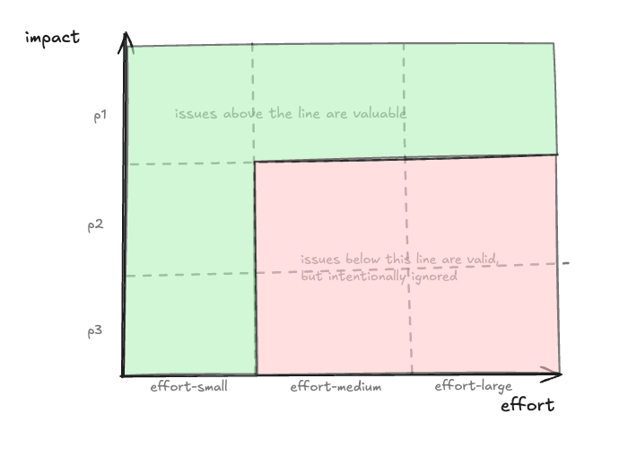
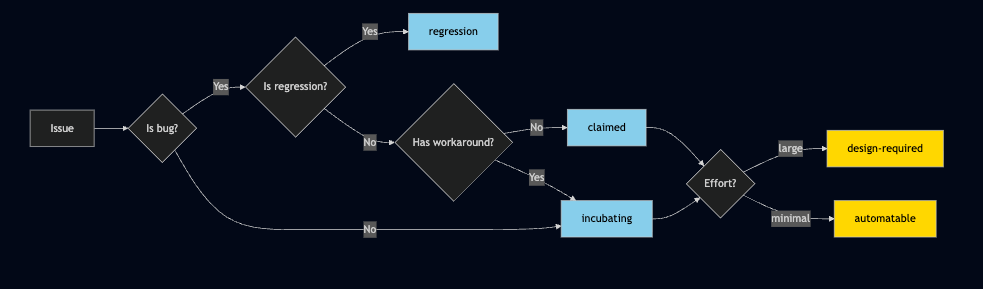
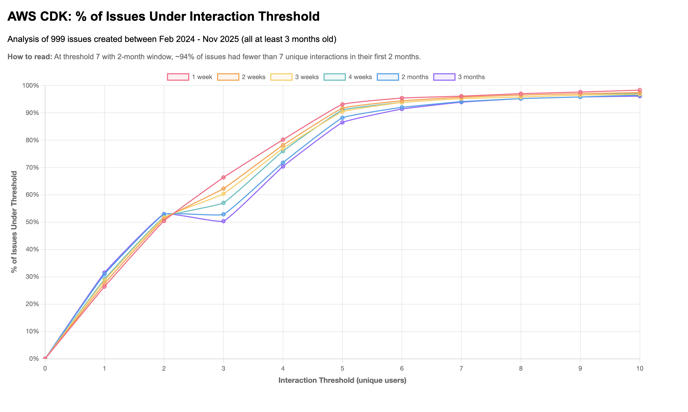
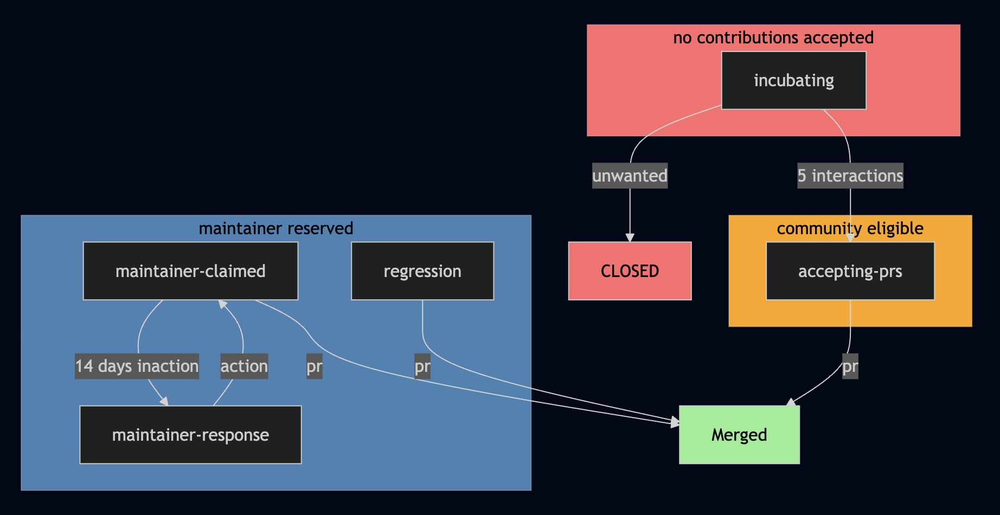

# Automated Issue Triage

* **Original Author(s):**: @conroyka
* **Tracking Issue**: #877
* **API Bar Raiser**: @mrgrain

> This RFC does not follow the typical RFC framework because it is not a technical design.
> I still want to work out in the open though!

## Why

Contributing to the CDK has long been messy, tedious, convoluted, etc. Meanwhile agentic AI is
reshaping the landscape of open-source contributions as it lowers the barrier to contribute
PRs to aws-cdk. We are seeing (and encouraging) more AI-generated contributions but this comes with
significant challenges -- increasing throughput of PRs is not always a net-positive, and ignores the
bigger picture of the code lifecycle (reviewing and maintaining in perpetuity).

We also have 2300+ open issues. We don't actually _want_ contributions to solve all these issues;
many open issues are _unwanted_: some combination of low impact and high effort (here "effort" means
both cost to create the PR and cost to maintain the changes). The diagram below conveys what we want
to support in the pre-AI era:

However, some of our assumptions don't hold true anymore.
First of all, effort level triage encapsulates developer effort only (which is rapidly minimized
by agentic AI) and does not consider review and maintenance effort (which is what we
care about). Second of all, initial triaging of priority is just a best guess, so we hedge:
if you author a PR for a `p2` contribution, we wont promise a review but maybe you will get one
eventually. This is inefficient because the decision on whether an issue should be fixed at all
happens only after a PR is created. And this consideration is left subjective to the reviewer,
which causes friction when we decided an approach wasn't worth the effort in the review phase.

Ultimately, this proposal aims to increase efficiency: an automated triage process with a clear
set of rules provides clarity over what issues we want solved, and limits churn on community
contributed PRs -- we will have high confidence that all PRs that come in are solving an issue
that has [Demonstrated Customer Impact](#demonstrated-customer-impact).

## Proposal

We will:

1. Fully automate triaging with new labels, and an appeals process via community input.
2. Be extremely clear on what subset of open issues welcome community contributions.
3. Meaningfully lower the open issue count in the aws-cdk repo by closing unwanted issues.

### Priority Labels

- `regression`: This is _actively_ worked on by a CDK maintainer at a fast pace. `regression` replaces the `p0` label exactly.
- `maintainer-response`: An issue from a lower priority tier that has been bubbled up to review.
- `maintainer-claimed`: Important issues (i.e. bugs without a workaround) that CDK Maintainers are
actively working on. After 14 days of inaction these issues will be upgraded to `maintainer-response`.
- `accepting-prs`: Bugs/features that have [Demonstrated Customer Impact](#demonstrated-customer-impact). Indicates that the CDK team
is happy to review and maintain.
- `incubating`: Bugs/features that we do not want to support without better signals from our customers.
All incoming issues with workarounds are triaged here to start. Issues that subsequently show
[Demonstrated Customer Impact](#demonstrated-customer-impact) are upgraded to `accepting-prs`.
- `unwanted`: `incubating` issues that have been human-reviewed and closed.

### Effort Labels

`design-required`: Feature requests that were previously labelled `effort-large`. No one, not the
community, maintainers, or AI should action on these issues without an approved RFC or design artifact.
`automatable`: Issues that are straightforward and can be automated. This grouping will expand
over time. `automatable` issues will kick off a human-in-the-loop AI cycle to create a high-quality
PR with minimal lead time. At the start, `automatable` issues are _issues that do not require
testing_ -- think updates to [enums](https://github.com/aws/aws-cdk/pull/36798), [region info](https://github.com/aws/aws-cdk/issues/36880), docs, etc.
`good-first-issue`: This is an open-source standard that I would like to keep as an ad-hoc
curated list of what we think is the easiest selection of available and wanted issues.

### Triage

Triaging is simple and well-defined, allowing for a fully automated triage process for CDK and
other AWS open-source projects that adopt this proposal. Issues can be triaged immediately and
maintainers can spend their time elsewhere.

Notably, our initial triage process results in only a subset of labels being used. Other labels
require additional time windows. See [Upgrades and Downgrades](#upgrades-and-downgrades) for details on
how issues get upgraded.

### Upgrades and Downgrades

1. All incoming issues start as `incubating`. Issues that [demonstrate customer impact](#demonstrated-customer-impact)
are upgraded to `accepting-prs`.

2. A `maintainer-claimed` issue is awaiting maintainer action, a phrase which here means providing
a workaround or creating a PR. After 14 days of inaction, `maintainer-claimed` issues upgrade to
`maintainer-response`.

3. `incubating` PRs are eligible to be closed as `unwanted` with a reason provided as a comment.
Closure comes with a human review but AI will assist the decision making. AI helps us be more efficient
when it comes to surfacing issues we may not want, based on subjective criteria (duplicate of previously
closed issue, feature request misidentified as a bug, not the path we want to go down).

### Pull Requests

Pull requests will inherit the labels of the issue they address. Pull requests without a linked issue
are by default labeled `incubating`. We will have heavy-handed communication in the Contributing Guide
and in the PR description template that `incubating` PRs will not be reviewed. After 28 days, 
`incubating` PRs are auto-closed. Critically, `incubating` PRs are `incubating` because they have been 
identified as not worth review effort and maintenance effort, so we will ignore them.

### Demonstrated Customer Impact

An issue must demonstrate customer impact during an incubation period of 28 days to upgrade to `accepting-prs`.
To demonstrate customer impact, 5 unique individuals must react to, comment, or link the issue. This number
is a proposal but derived from data from 1000 recent issues:

## Epilogue

There are clear expectations in this model. `maintainer-claimed` issues are claimed and actively worked on by
CDK maintainers. `accepting-prs` issues are eligible for community contributions. No one should contribute a
solution to `incubating` issues.

I want to be clear — these are intentionally rigid rules for triage automation to follow. Triage is inherently
a best-effort activity, and with the right guardrails is ripe for automation. Separate to the triage process
humans and additional tools should intervene where appropriate to move issues from one bucket to another.

The goal is to save triage time and be transparent with the community on what is a good idea to work on.
