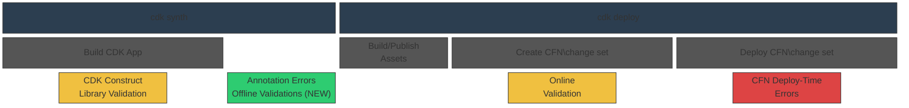

# CDK Comprehensive Validation RFC

* **Original Author(s):**: @kaizencc
* **Tracking Issue**: #897
* **API Bar Raiser**: @rix0rr

CDK Comprehensive Validation shifts left failures that occur during AWS CloudFormation
deployment time to local development.

## Working Backwards

### Blog Post

#### Catch CloudFormation Failures Before They Happen with CDK Comprehensive Validation

April 1, 2026 · AWS CDK Team

Today, we are announcing CDK Comprehensive Validation,
a new feature that shifts CloudFormation deployment failures left
by catching misconfigurations during local development —
before your template ever reaches AWS CloudFormation.
Whether you are deploying infrastructure yourself
or relying on an AI agent to build and deploy on your behalf,
slow feedback from deployment failures disrupts your development lifecycle.
CDK Comprehensive Validation gives you confidence that your deployment will succeed,
up to X% faster than waiting for a full `cdk deploy` to fail.

CDK Comprehensive Validation combines three validation concepts under one umbrella:

- Construct library errors: errors written into CDK code that cause exceptions _during_ synthesis
- "Offline" validation: local validation of CFN templates immediately _after_ synthesis
- "Online" validation: validation prior to CFN change set execution with access to your AWS account

A new `cdk validate` command unifies these validation types into one comprehensive output.

##### Three Layers of Defense

The AWS CDK already provides built-in validation at two points in the deployment lifecycle:
construct library exceptions during synthesis and Online Validation during change set creation.
CDK Comprehensive Validation adds a third layer — Offline Validation —
that runs immediately after synthesis, filling the gap between app-level checks and deployment-time checks.

Note that, Annotation warnings/errors and optional Policy Validation plugins operate at the post-synthesis layer.
Offline Validation provides additional default rules at this layer and also combines the other validations into
one concept. These default rules cover invalid property values, deprecated runtimes, and other mistakes that will
definitively fail CloudFormation deployment. Since this validation happens at the CFN template level, all CDK
Construct levels (L1+) will benefit from Offline Validaton.

The default layers of defense are as follows:



* **CDK construct library exceptions (existing)** — Handwritten checks that run when your CDK constructs
  are built during synthesis. These catch issues like negative duration values or missing required properties.
* **Offline Validation (NEW)** — Immediately after synthesis, the new built-in validation engine evaluates
  your CloudFormation template against hundreds of rules.
* **CFN Early Validation (existing)** — During `cdk deploy`, CloudFormation validates your change set
  before execution, catching issues like resources that already exist. Note that you get this by default, but
  not if you bypass change set creation with `--method=direct`.

##### Offline Validation

Offline validation runs automatically as part of `cdk synth` with no additional configuration required.
It combines all post-synthesis checks into one term that covers Annotation errors and warnings as well as
[Policy Validation](https://docs.aws.amazon.com/cdk/v2/guide/policy-validation-synthesis.html)
plugins. In fact, the new rule set shipped as part of Offline Validation is implemented
as a default Policy Validation plugin. This default rule set ships with 200+ rules across four categories,
each mapped to a severity level:

- **Template correctness** (Fatal) — schema validation, intrinsic function type-checking, reference integrity,
  and circular dependency detection. These will definitively fail CloudFormation deployment and cannot be suppressed.
- **Resource-specific checks** (Error) — Lambda runtime deprecation, Fargate CPU/memory combinations,
  CloudWatch limits, and similar service constraints. These will very likely fail deployment but can be
  suppressed if intentional.
- **Security** (Error) — IAM wildcard actions, secrets in parameters, and open security groups.
- **Best practices** (Warning) — DeletionPolicy on stateful resources, SnapStart adoption, and similar
  recommendations. These are suppressible and won't block synthesis.

##### Custom Rules and Sharing Across Organizations

A new `Validations` API becomes the one-stop shop for customizations that previously were ad-hoc with different
interfaces, implementations, and outputs.

First, `Validations` will directly replace `Annotations` as the place to add ad-hoc errors or warnings:

```ts
Validations.of(myConstruct).addWarning('annotation:WarningId', 'message');
Validations.of(myConstruct).addError('annotation:ErrorId', 'message');
```

The existing `CfnGuardValidator` plugin works seamlessly with this new design:

```ts
import { CfnGuardValidator } from '@cdklabs/cdk-validator-cfnguard';

// previously new CfnGuardValidator() would be configured directly on the app
Validations.of(myApp).addPlugin(new CfnGuardValidator());
```

The previous entrypoint of plugins within the `App`, `policyValidationsBeta1` will be deprecated
but not removed, following the CDK's [experimental ("preview") API guidelines](https://github.com/aws/aws-cdk/blob/main/CONTRIBUTING.md#adding-new-experimental-preview-apis).

CDK Nag has shipped a new major version that adopts a two-phase approach: (1) emit findings and record
suppressions into internal state, (2) produce reports from that state (e.g. write suppression reasons to
CloudFormation metadata for audit trails). The existing CDK Nag user-facing API remains the same.

Separately, CDK Nag is now also vended as a Validations plugin, fitting natively into the new plugin interface.
You can plug CDK Nag rule sets into `Validations`, which becomes baked into anywhere validation happens or is
presented (example output shown in the `cdk validate` section).

```ts
import { AwsSolutionsChecks } from 'cdk-nag';

// previously Aspects.of(app).add(new AwsSolutionsChecks())
Validations.of(myApp).addPlugin(new CdkNagPlugin({ packs: [new AwsSolutionsChecks[]]}));
```

Finally, specific rules can be custom-written in a policy language of your choice. CDK will manage plugin wrappers
around Rego and CFN Guard for convenience.

```ts
// in @your-org/cfn-rules
import { RegoValidator } from 'aws-cdk-lib/validations';
export class CustomRegoValidator extends RegoValidator {}

// consumed as
import { CustomRegoValidator } from '@your-org/cfn-rules';
Validations.of(myApp).addPlugin(new CustomRegoValidator());
```

##### Suppressing Errors and Warnings

Offline validation findings at error or warning severity can be suppressed directly in your CDK code
using the `Validations.of()` API:

```ts
Validations.of(myConstruct).acknowledge({ id: 'annotation:WarningId', reason: 'Accepted risk per team review' });
```

Because `acknowledge()` writes to construct tree metadata, plugins like CDK Nag can read
acknowledgments and build their own audit reports (e.g. writing suppression reasons to
CloudFormation metadata). This eliminates the need for a special flag on warnings and allows
CDK Nag to maintain its existing audit trail behavior through the standard `Validations` API.

##### `cdk validate`

You can also run all validation layers together using the new `cdk validate` command:

```bash
cdk validate [STACKS..] [--include <method>]
```

By default, this synthesizes your template and runs all validation methods.
You can optionally restrict to specific methods using `--include`:

```bash
cdk validate MyAppStack
cdk validate MyAppStack --include offline --include online
```

The unified output deliniates error provenance and severity. Findings have three severity levels:

- **Fatal** — the template will definitively fail CloudFormation deployment. Fatal findings fail `cdk synth` and cannot be suppressed.
- **Error** — likely misconfigurations that can be suppressed if intentional. It is recommended that users configure their CDK App via
  feature flag to fail on errors but this does not come by default to preserve backwards compatibility.
- **Warning** — best practice recommendations that can be suppressed.

The following example is of a user with a CDK Nag Policy Validation plugin enabled:

```bash
> cdk validate MyAppStack
Validation Report
-----------------

(Fatal)

F3012 - Unknown resource type (1 occurrences)
Severity: Fatal
Source: ValidationEngine (Default)

  Occurrences:

    - Construct Path: MyStack/VpcStack/PublicSubnet
    - Template Path: ./cdk.out/MyStack.template.json
    - Creation Stack:
        └──  MyStack (MyStack)
             └──  VpcStack (MyStack/VpcStack)
                  └──  PublicSubnet (MyStack/VpcStack/PublicSubnet)
                       │ Construct: aws-cdk-lib/aws-ec2.PublicSubnet
                       │ Library Version: 2.180.0
                       │ Location: new MyStack (lib/my-stack.ts:30:5)
    - Resource ID: VpcStackPublicSubnetABC123

  Description: Resource type 'AWS::EC2::Subnt' is not a valid CloudFormation resource type

(Errors)

AwsSolutions-S1 (1 occurrences)
Severity: Error
Source: CdkNagValidator
Suppress: Validations.of(construct).acknowledge({ id: 'AwsSolutions-S1', reason: '...' })

  Occurrences:

    - Construct Path: MyStack/DataBucket
    - Template Path: ./cdk.out/MyStack.template.json
    - Creation Stack:
        └──  MyStack (MyStack)
             └──  DataBucket (MyStack/DataBucket)
                  │ Construct: aws-cdk-lib/aws-s3.Bucket
                  │ Library Version: 2.180.0
                  │ Location: new MyStack (lib/my-stack.ts:12:5)
    - Resource ID: DataBucket2C40E2F8
    - Template Locations:
      > Properties/LoggingConfiguration

  Description: The S3 Bucket does not have server access logs enabled
  How to fix: Enable server access logging by setting the serverAccessLogsBucket property

Subnet has MapPublicIpOnLaunch enabled (1 occurrences)
Severity: Error
Source: Construct Annotations
Suppress: Validations.of(construct).acknowledge({ id: 'annotation:MapPublicIpOnLaunch', reason: '...' })

  Occurrences:

    - Construct Path: MyStack/VpcStack/PublicSubnet
    - Template Path: ./cdk.out/MyStack.template.json
    - Creation Stack:
        └──  MyStack (MyStack)
             └──  VpcStack (MyStack/VpcStack)
                  └──  PublicSubnet (MyStack/VpcStack/PublicSubnet)
                       │ Construct: aws-cdk-lib/aws-ec2.PublicSubnet
                       │ Library Version: 2.180.0
                       │ Location: new MyStack (lib/my-stack.ts:30:5)
    - Resource ID: VpcStackPublicSubnetABC123

  Description: Subnet has MapPublicIpOnLaunch enabled without justification

(Warnings)

I3011 - S3 bucket versioning should be enabled (1 occurrences)
Severity: Warning
Source: ValidationEngine (Default)
Suppress: Validations.of(construct).acknowledge({ id: 'aws-cdk-lib:S3.bucketVersioning', reason: '...' })

  Occurrences:

    - Construct Path: MyStack/DataBucket
    - Template Path: ./cdk.out/MyStack.template.json
    - Creation Stack:
        └──  MyStack (MyStack)
             └──  DataBucket (MyStack/DataBucket)
                  │ Construct: aws-cdk-lib/aws-s3.Bucket
                  │ Library Version: 2.180.0
                  │ Location: new MyStack (lib/my-stack.ts:12:5)
    - Resource ID: DataBucket2C40E2F8
    - Template Locations:
      > Properties/VersioningConfiguration

  Description: S3 bucket should have versioning enabled for data protection
  How to fix: Set versioned: true on the Bucket construct

Bucket policy allows public read access (1 occurrences)
Severity: Warning
Source: Construct Annotations
Suppress: Validations.of(construct).acknowledge({ id: 'aws-cdk-lib:S3.publicRead', reason: '...' })

  Occurrences:

    - Construct Path: MyStack/DataBucket
    - Template Path: ./cdk.out/MyStack.template.json
    - Creation Stack:
        └──  MyStack (MyStack)
             └──  DataBucket (MyStack/DataBucket)
                  │ Construct: aws-cdk-lib/aws-s3.Bucket
                  │ Library Version: 2.180.0
                  │ Location: new MyStack (lib/my-stack.ts:12:5)
    - Resource ID: DataBucket2C40E2F8

  Description: Bucket policy allows public read access

Policy Validation Report Summary

╔═════════════════════════════════════╤═════════╤═══════╤═══════╤══════════╗
║ Source                              │ Status  │ Fatal │ Error │ Warning  ║
╟─────────────────────────────────────┼─────────┼───────┼───────┼──────────╢
║ ValidationEngine (Default)          │ failure │ 1     │ 0     │ 1        ║
╟─────────────────────────────────────┼─────────┼───────┼───────┼──────────╢
║ CdkNagValidator                     │ failure │ 0     │ 1     │ 0        ║
╟─────────────────────────────────────┼─────────┼───────┼───────┼──────────╢
║ Construct Annotations               │ failure │ 0     │ 1     │ 1        ║
╚═════════════════════════════════════╧═════════╧═══════╧═══════╧══════════╝

1 fatal, 2 errors, 2 warnings

Validation failed. See the validation report above for details
```

The command also generates the report in JSON format with the `--json` option.

```json
{
  "title": "Validation Report",
  "summary": {
    "status": "failure",
    "fatal": 1,
    "errors": 2,
    "warnings": 2,
    "sources": [
      { "name": "ValidationEngine (Default)", "version": "1.0.0", "status": "failure", "fatal": 1, "errors": 0, "warnings": 1 },
      { "name": "CdkNagValidator", "version": "2.28.0", "status": "failure", "fatal": 0, "errors": 1, "warnings": 0 },
      { "name": "Construct Annotations", "status": "failure", "fatal": 0, "errors": 1, "warnings": 1 }
    ]
  },
  "fatal": [
    {
      "ruleName": "F3012",
      "severity": "Fatal",
      "source": "ValidationEngine (Default)",
      "description": "Resource type 'AWS::EC2::Subnt' is not a valid CloudFormation resource type",
      "occurrences": [
        {
          "constructPath": "MyStack/VpcStack/PublicSubnet",
          "templatePath": "./cdk.out/MyStack.template.json",
          "resourceLogicalId": "VpcStackPublicSubnetABC123",
          "constructStack": {
            "id": "MyStack",
            "path": "MyStack",
            "construct": "aws-cdk-lib.Stack",
            "libraryVersion": "2.180.0",
            "location": "Object.<anonymous> (bin/app.ts:8:1)",
            "child": {
              "id": "VpcStack",
              "path": "MyStack/VpcStack",
              "construct": "aws-cdk-lib/aws-ec2.Vpc",
              "libraryVersion": "2.180.0",
              "location": "new MyStack (lib/my-stack.ts:28:5)",
              "child": {
                "id": "PublicSubnet",
                "path": "MyStack/VpcStack/PublicSubnet",
                "construct": "aws-cdk-lib/aws-ec2.PublicSubnet",
                "libraryVersion": "2.180.0",
                "location": "new MyStack (lib/my-stack.ts:30:5)"
              }
            }
          }
        }
      ]
    }
  ],
  "errors": [
    {
      "ruleName": "AwsSolutions-S1",
      "severity": "Error",
      "source": "CdkNagValidator",
      "description": "The S3 Bucket does not have server access logs enabled",
      "fix": "Enable server access logging by setting the serverAccessLogsBucket property",
      "suppress": {
        "mechanism": "acknowledge",
        "id": "AwsSolutions-S1",
        "instruction": "Validations.of(construct).acknowledge({ id: 'AwsSolutions-S1', reason: '...' })"
      },
      "occurrences": [
        {
          "constructPath": "MyStack/DataBucket",
          "templatePath": "./cdk.out/MyStack.template.json",
          "resourceLogicalId": "DataBucket2C40E2F8",
          "locations": ["Properties/LoggingConfiguration"],
          "constructStack": {
            "id": "MyStack",
            "path": "MyStack",
            "construct": "aws-cdk-lib.Stack",
            "libraryVersion": "2.180.0",
            "location": "Object.<anonymous> (bin/app.ts:8:1)",
            "child": {
              "id": "DataBucket",
              "path": "MyStack/DataBucket",
              "construct": "aws-cdk-lib/aws-s3.Bucket",
              "libraryVersion": "2.180.0",
              "location": "new MyStack (lib/my-stack.ts:12:5)"
            }
          }
        }
      ]
    },
    {
      "ruleName": "Subnet has MapPublicIpOnLaunch enabled",
      "severity": "Error",
      "source": "Construct Annotations",
      "description": "Subnet has MapPublicIpOnLaunch enabled without justification",
      "suppress": {
        "mechanism": "acknowledge",
        "id": "annotation:MapPublicIpOnLaunch",
        "instruction": "Validations.of(construct).acknowledge({ id: 'annotation:MapPublicIpOnLaunch', reason: '...' })"
      },
      "occurrences": [
        {
          "constructPath": "MyStack/VpcStack/PublicSubnet",
          "templatePath": "./cdk.out/MyStack.template.json",
          "resourceLogicalId": "VpcStackPublicSubnetABC123",
          "constructStack": {
            "id": "MyStack",
            "path": "MyStack",
            "construct": "aws-cdk-lib.Stack",
            "libraryVersion": "2.180.0",
            "location": "Object.<anonymous> (bin/app.ts:8:1)",
            "child": {
              "id": "VpcStack",
              "path": "MyStack/VpcStack",
              "construct": "aws-cdk-lib/aws-ec2.Vpc",
              "libraryVersion": "2.180.0",
              "location": "new MyStack (lib/my-stack.ts:28:5)",
              "child": {
                "id": "PublicSubnet",
                "path": "MyStack/VpcStack/PublicSubnet",
                "construct": "aws-cdk-lib/aws-ec2.PublicSubnet",
                "libraryVersion": "2.180.0",
                "location": "new MyStack (lib/my-stack.ts:30:5)"
              }
            }
          }
        }
      ]
    }
  ],
  "warnings": [
    {
      "ruleName": "I3011",
      "severity": "Warning",
      "source": "ValidationEngine (Default)",
      "description": "S3 bucket should have versioning enabled for data protection",
      "fix": "Set versioned: true on the Bucket construct",
      "suppress": {
        "mechanism": "acknowledge",
        "id": "aws-cdk-lib:S3.bucketVersioning",
        "instruction": "Validations.of(construct).acknowledge({ id: 'aws-cdk-lib:S3.bucketVersioning', reason: '...' })"
      },
      "occurrences": [
        {
          "constructPath": "MyStack/DataBucket",
          "templatePath": "./cdk.out/MyStack.template.json",
          "resourceLogicalId": "DataBucket2C40E2F8",
          "locations": ["Properties/VersioningConfiguration"],
          "constructStack": {
            "id": "MyStack",
            "path": "MyStack",
            "construct": "aws-cdk-lib.Stack",
            "libraryVersion": "2.180.0",
            "location": "Object.<anonymous> (bin/app.ts:8:1)",
            "child": {
              "id": "DataBucket",
              "path": "MyStack/DataBucket",
              "construct": "aws-cdk-lib/aws-s3.Bucket",
              "libraryVersion": "2.180.0",
              "location": "new MyStack (lib/my-stack.ts:12:5)"
            }
          }
        }
      ]
    },
    {
      "ruleName": "Bucket policy allows public read access",
      "severity": "Warning",
      "source": "Construct Annotations",
      "description": "Bucket policy allows public read access",
      "suppress": {
        "mechanism": "acknowledge",
        "id": "aws-cdk-lib:S3.publicRead",
        "instruction": "Validations.of(construct).acknowledge({ id: 'aws-cdk-lib:S3.publicRead', reason: '...' })"
      },
      "occurrences": [
        {
          "constructPath": "MyStack/DataBucket",
          "templatePath": "./cdk.out/MyStack.template.json",
          "resourceLogicalId": "DataBucket2C40E2F8",
          "constructStack": {
            "id": "MyStack",
            "path": "MyStack",
            "construct": "aws-cdk-lib.Stack",
            "libraryVersion": "2.180.0",
            "location": "Object.<anonymous> (bin/app.ts:8:1)",
            "child": {
              "id": "DataBucket",
              "path": "MyStack/DataBucket",
              "construct": "aws-cdk-lib/aws-s3.Bucket",
              "libraryVersion": "2.180.0",
              "location": "new MyStack (lib/my-stack.ts:12:5)"
            }
          }
        }
      ]
    }
  ]
}
```

This makes `cdk validate` an ideal success gate for agentic workflows —
an AI agent can run it after generating infrastructure code
and immediately know whether the template is valid
without waiting for a full deployment.

##### CDK Toolkit

Offline Validation will be built natively into the CDK Toolkit. The
`synth` method (and other methods that synthesize) will automatically validate.
A new `validate` method will be available that mirrors the `cdk validate` CLI command.

##### Get Started

CDK Comprehensive Validation is available today.
Upgrade to the latest AWS CDK CLI and run `cdk synth` —
offline validation runs automatically.
Use `cdk validate` for a unified view of all validation results.

---

Ticking the box below indicates that the public API of this RFC has been
signed-off by the API bar raiser (the `status/api-approved` label was applied to the
RFC pull request):

```
[x] Signed-off by API Bar Raiser @rix0rrr
```

## Public FAQ

### What are we launching today?

We are launching CDK Comprehensive Validation which represents a holistic view of validation across 3 different layers of CDK.
The main innovation focuses on the post-synthesis layer of validation.

1. Layer 1: CDK Construct Library Validation. This does not change and errors fail synthesis.
2. Layer 2: Offline Validation. An umbrella term to cover post-synthesis validation. This encompasses Annotation errors/warnings,
   PolicyValidation plugins, and a new Offline Validation engine. All these mechanisms are rolled into one `Validations` class
   that covers customer interaction with this layer of defense.
3. Layer 3: Online Validation. A wrapper around CFN Early Validation. This does not change.

We are also launching `cdk validate` and a corresponding `validate` method in the CDK Toolkit that provides JSON and/or
human-readable output of validations across the 3 different layers.

### Why should I use this feature?

Customers automatically get the benefits of Offline Validation during `cdk synth`. Customers will use the validation output
to quickly reason about issues in their CDK App. This in turn makes deployment during `cdk deploy` succeed more often.

The `Validations` API is a consolidated view of a CDK App's validaiton posture, which represents an evolution over the currently
disjoint systems clobbered together: CDK Nag, CFN Guard Validator, custom Annotations all live in separately in the post-synthesis
validation layer. Customers will use `Validations` to easily customize and reason about their CDK App's validation posture. It
will also be easier for you to vend and configure their custom validations across teams.

### What is the validation posture of CDK moving forward?

CDK's validation mechanisms include the following:

* construct library exceptions — handwritten errors that occur during synthesis
* [NEW] Offline Validation — validation of the synthesized CloudFormation Template immediately after synthesis. This covers some existing validation mechanisms:
  * Annotation Warnings & Errors - handwritten warnings/errors that are evaluated immediately after synthesis optionally including
  opinionated rules like CDK Nag.
  * Optional [policy validation](https://docs.aws.amazon.com/cdk/v2/guide/policy-validation-synthesis.html) plugins -
  allowing CFN Guard rules, etc.
  * Default plugin covering common CFN deployment failures.
* Online Validation aka CFN Early Validation — CFN change sets are validated during CFN change set creation at CDK deploy time
* CFN Deploy-Time Errors — Actual errors that occur during CFN deployment

Offline Validations is meant to consolidate interfaces for all different types of post-synthesis validation into one ergonomic API.
Existing custom setups will continue to work seamlessly but can now be managed inside one `Validations` class that clearly defines
the validation position of a CDK App. Validations will be easier to define in one place going forward.

## Internal FAQ

### Why are we doing this?

Moving eventual errors earlier in the development cycle speeds up deployment time for humans and AI agents alike.
Consolidating CDK's various mechanisms for post-synthesis validation into one ergonomic `Validations` API will make it
simpler to customize and reason about a CDK App's validation posture. This RFC represents a much simpler view of
post-synthesis validations than what exists today.

Furthermore, `cdk validate` combines CDK's validations from different sources under one umbrella and will become the one-stop shop
for agentic workflows to validate their work, up to X% faster than a full cdk deploy.

### Why should we not do this?

There are two risks associated with this proposal:

- material increase of synth time (larger than the ~1s quoted in this RFC)
- false positives

For synth time, we have evaluated that the main time sink will be the start up cost of the engine at 600-1000ms. The actual
validation of CFN templates takes a negligible amount of time. We can get creative with parallelizing the engine start up
and track this start up cost in telemetry to ensure it does not increase over time.

False positives will always be a risk, but this risk is somewhat mitigated by having a robust suppression mechanism. Although
needing to suppress incorrect errors/warnings is friction to the user, it acts as a safety blanket to ensure validation does
not actually block customers from deployment.

### What is the technical solution (design) of this feature?

The technical components of Offline Validation include:

- Offline Validation Engine
- Integration point in the synthesis command of CDK CLI
- Suppression mechanism
- Custom rule sets
- `cdk validate` command

#### Offline Validation Engine

The engine runs against the synthesized CloudFormation template json/yaml.
The engine will handle intrinsics natively. The engine requirements include:

* default rule set includes CFN Guard rules and CFN schema validation
* support for custom rule sets written in a policy language like Rego
* can be executed during `cdk synth` automatically, while not adding over Y milliseconds of overhead
* produces findings at three severity levels: fatal, error, and warning. Fatal findings fail synthesis.
  Errors and warnings are displayed in the validation report and can be suppressed.

The actual implementation of the engine is out of scope of this RFC however.

The default rule set is likely to be around ~10MB when considering the size of the CFN schema
and other sources. This is a high penalty to pay, and can be paid either by the CDK CLI or CDK framework.
This RFC proposes that the code lives in the framework. For comparison, the v2.1117.0 CDK CLI version is
~24MB unpacked and the v2.249.0 CDK framework version is ~108MB. Note that this comparison did not factor in
the direction of this RFC; the main reason for putting Offline Validation in the framework
is that it follows historical precedent.

#### Engine Integration

We will reuse the existing [Policy Validation](https://github.com/aws/aws-cdk/blob/main/packages/aws-cdk-lib/core/lib/validation/validation.ts)
plugin interface (and remove `Beta1` from the interface), which looks like this:

```ts
export interface IPolicyValidationPlugin {
  readonly name: string;
  readonly ruleIds?: string[];
  readonly version?: string;
  validate(context: IPolicyValidationContext): PolicyValidationReport;
}

export interface IPolicyValidationContext {
  readonly templatePaths: string[];
}

export interface PolicyValidationReport {
  readonly success: boolean;
  readonly violations: PolicyViolation[];
  readonly metadata?: Record<string, string>;
  readonly pluginVersion?: string;
}

export interface PolicyViolation {
  readonly ruleName: string;
  readonly description: string;
  readonly violatingResources: PolicyViolatingResource[];
  readonly fix?: string;
  readonly severity?: string;
  readonly ruleMetadata?: Record<string, string>;
}
```

The `IPolicyValidationPluginBeta1` interface has lived in the CDK framework for 3 years without change. There is one open issue
that we plan to fix: [print](https://github.com/aws/aws-cdk/issues/25331) to stderr rather than stdout. Afterwards, this RFC proposes
to graduate the interface to stable by removing the `Beta1` suffix.

The validation logic lives in the framework to allow for seamless integration of default validations and custom validations.
Annotation warnings & errors and Policy Validation plugins are already established in the framework. By reusing the Policy
Validation plugin system, Offline Validation is able to unify all validation mechanisms that happen post-synthesis and pre-deploy.

This comes with the challenge of dealing with Offline Validation's estimated ~10MB unbundled package size and ~600-1000ms startup
cost when initializing the engine. We are deciding that we are okay with the size of validation in the framework rather than the CLI,
and that the engine startup will run parallel with synthesis to minimize its impact. The actual time to validate templates will be
negligible; about 1ms per resource.

By putting Offline Validation in the framework, both the CLI and the CDK Toolkit will be able to use it with no additional
implementation. Offline Validation will run by default in addition to any other plugins the user provides.

#### Suppression Mechanism

There is a suppression mechanism available for Annotation warnings today:
`Annotations.of(construct).acknowledgeWarning()`.
This will be deprecated in favor of a unified `Validations.of()` API that covers
suppression for all types of post-synthesis CDK errors and warnings.

The main `Validations` method will be `acknowledge`,
where the user supplies one or more rule IDs.
Under the hood, we will use the ID to differentiate `Annotation` rules from Offline
Validation rules and abstract the rule provenance away from the user.

```ts
export interface Acknowledgment {
  readonly id: string;
  readonly reason: string;
}

export class Validations {
  public static of(construct: IConstruct): Validations {
    return new Validations(construct);
  }

  private constructor(private readonly construct: IConstruct) {}

  public acknowledge(...rules: Acknowledgment[]): void {
    for (const rule of rules) {
      // Always write to construct metadata so plugins (e.g. CDK Nag) can read acknowledgments
      this.recordAcknowledgment(rule.id, rule.reason);

      // Additionally route to the appropriate handler
      if (this.isAnnotationRule(rule.id)) {
        Annotations.of(this.construct).acknowledgeWarning(rule.id);
      }
    }
  }

  private recordAcknowledgment(id: string, reason: string) {
    const existing = this.construct.node.metadata.find(
      m => m.type === Validations.ACKNOWLEDGED_RULES_METADATA_KEY,
    );

    const acknowledged: Record<string, string> = existing?.data ?? {};
    acknowledged[id] = reason;

    this.construct.node.addMetadata(Validations.ACKNOWLEDGED_RULES_METADATA_KEY, acknowledged);
  }
}
```

The suppressed rules stored in the construct metadata will be available to filter violations
reported by the offline validation engine. Because all acknowledgments are written to construct
metadata regardless of rule provenance, plugins like CDK Nag can read them to produce their own
audit trail (e.g. writing suppression reasons to CloudFormation metadata).

#### Custom Rule Mechanism

Custom rules can come in a few flavors:

- Annotations
- Aspect rules (this is how CDK Nag is vended, but under the hood it uses Annotations)
- Plugins

They are all handled by the `Validations` class. Rule provenance will be handled by well-known
ID prefixes when initialized (i.e. annotation warnings will be prefixed with `annotation:`).

Rules must be scoped to a CDK App or Stack.`Validations` will utilize construct metadata so the
information is available after synthesis:

```ts
export class Validations {
  public addPlugin(plugin: IPolicyValidationPlugin) {
    const stage = Stage.of(this.construct);
    if (!stage) {
      throw new Error('addPlugin() must be called within a Stage or App');
    }
    stage.policyValidation.push(plugin);
  }  
}
```

After synthesis, different sources are handled individually. `Annotation` rules
are handled by traversing the construct tree (no change here). Individual plugins are handled as
they were before. The specific `RegoValidator` and `CfnGuardValidator` plugins will utilize the
Offline Validation engine under the hood to evaluate rules written in those languages.

#### Online Validation in `cdk validate`

`cdk deploy` already surfaces CFN Early Validation errors through `DescribeEvents`. When a change set
fails with `AWS::EarlyValidation` in the `StatusReason`, CDK calls `DescribeEvents` with the change set
ARN and `Filters: { FailedEvents: true }` to retrieve structured per-resource validation errors. Today,
these are formatted and thrown as a `DeploymentError`.

`cdk validate` reuses this same mechanism but maps the results into the validation report schema instead
of throwing. The lifecycle is a) create a change set per stack, b) poll until complete, c) call `DescribeEvents`
if early validation failed, d) delete the change set (no execution), e) merge the results with offline
findings into one report.

##### DescribeEvents Response Schema

Each event returned by `DescribeEvents` contains:

| Field | Description |
|---|---|
| `LogicalResourceId` | CFN logical ID of the failing resource |
| `ResourceType` | CFN resource type (e.g. `AWS::Lambda::Function`) |
| `ValidationName` | Category identifier (e.g. `PROPERTY_VALIDATION`, `NAME_CONFLICT_VALIDATION`) |
| `ValidationStatusReason` | Human-readable error message |
| `ValidationPath` | JSON path to the offending property in the template |
| `ValidationFailureMode` | `FAIL` (blocks execution) or `WARN` (allows execution) |

##### Mapping to the Validation Report

| Report field | Source |
|---|---|
| `ruleName` | Derived from `ValidationName` + a normalized prefix of `ValidationStatusReason` (see below) |
| `severity` | `FAIL` → `Fatal`, `WARN` → `Warning` |
| `source` | `"CloudFormation"` |
| `description` | `ValidationStatusReason` |
| `occurrences[].resourceLogicalId` | `LogicalResourceId` |
| `occurrences[].templatePath` | Known by CDK (we sent the template) |
| `occurrences[].locations` | `ValidationPath` |
| `occurrences[].constructPath` | Resolved from `LogicalResourceId` via the construct tree |
| `occurrences[].constructStack` | Resolved from construct path via existing source tracing |

##### `ruleName` Derivation

`ValidationName` is a category shared by many errors — for example, `PROPERTY_VALIDATION` covers type
mismatches, missing required properties, invalid enum values, and more. Using the category alone as
`ruleName` would group unrelated errors under one rule.

To produce a more useful identifier, CDK will derive `ruleName` by combining `ValidationName` with a
normalized prefix of `ValidationStatusReason`. For example:

| `ValidationName` | `ValidationStatusReason` | Derived `ruleName` |
|---|---|---|
| `PROPERTY_VALIDATION` | `DISABLED is not a valid enum value. Supported values: [Active, PassThrough]` | `PROPERTY_VALIDATION:InvalidEnumValue` |
| `PROPERTY_VALIDATION` | `Missing required property: FunctionName` | `PROPERTY_VALIDATION:MissingRequiredProperty` |
| `PROPERTY_VALIDATION` | `Unsupported property: Foo` | `PROPERTY_VALIDATION:UnsupportedProperty` |
| `NAME_CONFLICT_VALIDATION` | `Resource with the given name already exists` | `NAME_CONFLICT_VALIDATION:ResourceAlreadyExists` |
| `BUCKET_EMPTINESS_VALIDATION` | `S3 bucket is not empty` | `BUCKET_EMPTINESS_VALIDATION:BucketNotEmpty` |

The normalization extracts a stable error class from the message text (stripping variable parts like
specific property names or values). This gives users a meaningful identifier to reference and, for
`WARN`-mode findings, to suppress via `Validations.of(construct).acknowledge()`.

##### Severity and Suppression

`FAIL`-mode findings map to `Fatal` severity and cannot be suppressed — they represent configurations
that will definitively fail deployment. `WARN`-mode findings (e.g. S3 bucket not empty on delete) map
to `Warning` severity and can be acknowledged:

```ts
Validations.of(myBucket).acknowledge({
  id: 'BUCKET_EMPTINESS_VALIDATION:BucketNotEmpty',
  reason: 'Bucket will be emptied by a custom resource before deletion',
});
```

##### Example Output

A CFN Early Validation finding in the `cdk validate` report:

```
PROPERTY_VALIDATION:InvalidEnumValue (1 occurrences)
Severity: Fatal
Source: CloudFormation

  Occurrences:

    - Construct Path: MyStack/MyLambdaFunction
    - Template Path: ./cdk.out/MyStack.template.json
    - Creation Stack:
        └──  MyStack (MyStack)
             └──  MyLambdaFunction (MyStack/MyLambdaFunction)
                  │ Construct: aws-cdk-lib/aws-lambda.Function
                  │ Library Version: 2.180.0
                  │ Location: new MyStack (lib/my-stack.ts:15:5)
    - Resource ID: MyLambdaFunction
    - Template Locations:
      > /Resources/MyLambdaFunction/Properties/TracingConfig/Mode

  Description: DISABLED is not a valid enum value. Supported values: [Active, PassThrough]
```

#### Telemetry

To support the launch of CDK Comprehensive Validation, we will collect additional metrics that fit directly
into the existing [schema](https://github.com/aws/aws-cdk-cli/blob/main/packages/aws-cdk/lib/cli/telemetry/schema.ts):

- Fatal/Error/Warning counters:

```json
{
  "counters": {
    "fatalValidationCount": 0,
    "errorValidationCount": 3,
    "warningValidationCount": 7
  }
}
```

- Duration of engine startup and engine validation:

```json
{
  "duration": {
    "components": {
      "validationEngineLoad": 1000,
      "validationTime": 50
    }
  }
}
```

### Is this a breaking change?

No. Fatal Offline Validation rules represent configurations that _cannot_ successfully deploy.
Errors represent likely misconfigurations that can be suppressed if intentional.
And if we are unsure whether something will fail deployment, we will provide it as a suppressable warning.
Errors will fail synthesis only if a feature flag is configured.

### What alternative solutions did you consider?

1. Rely solely on CFN Early Validation: rejected because it requires a CFN change set
   and that happens too late in the deployment process.
2. Write more CDK construct library exceptions: rejected because it is a treadmill,
   and L1 level users do not get access to L2 level validations.
3. Validation logic in the library: The main reasons to do so center around the ~10MB size and ~600-1000ms startup
   cost of the validation engine. For now, we decided to go with the established protocol of offline validation
   happening in the framework, and are willing to eat the ~10MB size cost (and have ideas for parallelizing the
   startup cost).
4. Custom rules written in TS: This would be a fully managed API that we would vend and then map to a policy language rule
   on the backend before feeding to the Offline Validation engine. It was determined that this is not necessary so long as
   we expose policy-language-specific plugins like `RegoValidator`. It is possible in the future to add support directly in
   code, with a CDK construct that synthesizes into policy langugae rules. But that is more complicated and we will start
   with the simple solution first.

### What are the drawbacks of this solution?

1. Synth time: Adding offline validation to cdk synth increases synthesis time.
   This conflicts with the parallel goal of reducing average synth time. We have decided that we are willing
   to accept a time penalty of around 1s to provide validation during synthesis. If it turns out that the time
   penalty is not in the same ballpark, we will need to provide an easy way to opt-out.
2. Overlap with existing CDK Policy Validation: Customers with existing policy validation plugins will
   have questions as to what is now an overlap and what they need to keep in their set up.
   Clear documentation and messaging is needed to explain how the default rules interact and whether
   customers should keep existing plugins or migrate to adding custom rules to the default plugin.
3. Package size: The default rule set and WASM engine is estimated to add approximately 50MB unpacked size
   to the framework. Disk footprint is negligible for most environments. CI/CD pipelines that install the library
   fresh per run will see a modest increase in install time proportional to the download size increase.

### What is the high-level project plan?

The project can be split into four phases:

- Stabilize the existing API surface: graduate `Beta1` interfaces to stable, create `Validations` class with `addPlugin()`, add
`addWarning()`/`addError()` methods, implement `acknowledge()` for suppressions, and update the dev guide
- Unify the validation report: integrate Annotations errors/warnings into the validation report, update the report JSON schema,
create `OfflineValidationPlugin`, and build `RegoValidator`/`CfnGuardValidator` base.
- Create the CLI command: implement the `validate` CDK Toolkit method, add `cdk validate` and `--offline` option.
- Polish: parallelize engine startup with synthesis, add validation telemtry updates, deprecate `Anotations`, turn CDK Nag into
a plugin.
