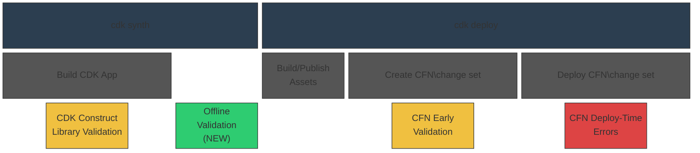

# CDK Comprehensive Validation RFC

* **Original Author(s):**: @kaizencc
* **Tracking Issue**: #897
* **API Bar Raiser**: @rix0rr

CDK Comprehensive Validation shifts left failures that occur during AWS CloudFormation
deployment time to local development.

## Working Backwards

### Blog Post

#### Catch CloudFormation Failures Before They Happen with CDK Comprehensive Validation

April 1, 2026 · AWS CDK Team

Today, we are announcing CDK Comprehensive Validation,
a new feature that shifts CloudFormation deployment failures left
by catching misconfigurations during local development —
before your template ever reaches AWS CloudFormation.
Whether you are deploying infrastructure yourself
or relying on an AI agent to build and deploy on your behalf,
slow feedback from deployment failures disrupts your development lifecycle.
CDK Comprehensive Validation gives you confidence that your deployment will succeed,
up to X% faster than waiting for a full `cdk deploy` to fail.

A new `cdk validate` command also unifies all validation output —
offline rule checks, construct library errors, and CloudFormation change set validation —
into a single invocation.

##### Three Layers of Defense

The AWS CDK already provides built-in validation at two points in the deployment lifecycle:
construct library exceptions during synthesis
and CloudFormation Early Validation during change set creation.
CDK Comprehensive Validation adds a third layer — offline validation —
that runs immediately after synthesis,
filling the gap between app-level checks and deployment-time checks.



* **CDK construct library exceptions (existing)** — Handwritten checks that run when your CDK constructs
  are built during synthesis. These catch issues like negative duration values or missing required properties.
* **Offline Validation (NEW)** — Immediately after synthesis, the new built-in validation engine evaluates
  your CloudFormation template against hundreds of rules. Unlike external tools, this engine resolves
  CloudFormation intrinsic functions natively, so it can catch issues that currently available CloudFormation
  analysis tools miss.
* **CFN Early Validation (existing)** — During `cdk deploy`, CloudFormation validates your change set
  before execution, catching issues like resources that already exist.

##### Offline Validation

Offline validation runs automatically as part of `cdk synth`
with no additional configuration required.
It ships with a comprehensive default rule set that checks for common misconfigurations
including invalid property values, deprecated runtimes, overly permissive IAM policies,
missing encryption, and cross-resource dependency issues.
The engine is compiled to WASM and adds under Y seconds to synthesis time.

Offline Validation reuses the same protocol as the existing
[Policy Validation](https://docs.aws.amazon.com/cdk/v2/guide/policy-validation-synthesis.html)
and is implemented via a new entrypoint in the CDK CLI.
If you are using the Policy Validation plugin system you can continue to do so
but there may be overlap with what is being validated.
If you have written custom rules in CloudFormation Guard syntax they can be applied directly to Offline Validation.
If your Policy Validation plugin is written in TypeScript,
you can now supply your plugin via the CDK CLI in addition to the CDK App.

##### `cdk validate`

You can also run all validation layers together using the new `cdk validate` command:

```bash
cdk validate [STACKS..] [--include <method>]
```

By default, this synthesizes your template and runs all validation methods.
You can optionally restrict to specific methods using `--include`:

```bash
cdk validate MyAppStack
cdk validate MyAppStack --include offline --include online
```

The unified output clearly distinguishes between blockers and suppressable issues:

```bash
> cdk validate MyAppStack

Stack MyAppStack
 [warning] [suppressable] UseLatestVersion: Node.js 16 runtime is deprecated.
           Consider upgrading to Node.js 20 or later
           (at Resources/MyLambdaFunction)

 [error] [suppressable] InvalidArchitectureValue: Allowed values: x86_64, arm64.
         Received: "x64_86" (at Resources/MyLambdaFunction)

Found 1 error, 1 warning.
```

This makes `cdk validate` an ideal success gate for agentic workflows —
an AI agent can run it after generating infrastructure code
and immediately know whether the template is valid
without waiting for a full deployment.

##### Custom Rules and Sharing Across Organizations

Organizations can extend the default rule set with custom rules
written in a policy language like Rego or CloudFormation Guard.

For example, here is a rule that checks Lambda function architectures:

```rego
package cfn

deny[msg] {
    resource := input.Resources[name]
    resource.Type == "AWS::Lambda::Function"
    arch := resource.Properties.Architectures[_]
    not arch_valid(arch)
    msg := sprintf(
      "InvalidArchitectureValue: Allowed values: x86_64, arm64. Received: \"%s\" (at Resources/%s)",
      [arch, name]
    )
}

arch_valid("x86_64")
arch_valid("arm64")
```

Custom rules are loaded from a configurable directory specified in `cdk.json`
or via the `--custom-rules` CLI option.
The engine automatically collects `.rego` files from the specified path.

```json
{
 "validate": {
   "customRules": [
     "node_modules/@your-org/cfn-rules/rules",
     "./my-local-rules"
   ]
 }
}
```

```bash
cdk synth --custom-rules ./my-local-rules
cdk validate --custom-rules ./my-local-rules
```

Because Rego files are plain text with no compilation step,
they can be distributed through any package manager (npm, PyPI, Maven, NuGet).
This gives organizations semver for rule versioning, changelogs for communicating changes,
and the dependency management that CDK users already rely on.

To share custom rules across teams or an entire organization,
we recommend publishing them in your package manager of choice.
Rego files are plain text — no compilation or runtime is involved.

##### Suppressing Warnings and Errors

Offline validation findings can be suppressed directly in your CDK code
using the new `Validations.of()` API:

```ts
Validations.of(myConstruct).acknowledge('UseLatestVersion');
Validations.of(myConstruct).acknowledgeAllWarnings();
```

`Validations.of()` also handles annotation warning suppression,
becoming the unified way to acknowledge warnings in CDK.

##### Get Started

CDK Comprehensive Validation is available today.
Upgrade to the latest AWS CDK CLI and run `cdk synth` —
offline validation runs automatically.
Use `cdk validate` for a unified view of all validation results.
To add custom rules, create a directory of `.rego` files
and configure the path in your `cdk.json`.

### README

#### cdk validate

```
cdk validate [STACKS..] [--include <method>]
```

You can use cdk validate to run offline and online validation against a CDK stack or app.

This synthesizes a CFN template and verifies it against offline rules, such as:

* Lambda Function Architecture values must be one of: x86_64, arm64, got: x64_86

It also generates (without executing) a CFN change set to check against online rules, such as:

* Resource of type `AWS::S3::Bucket` with identifier MyBucket already exists

The output looks like this:

```bash
> cdk validate MyAppStack

Stack MyAppStack
 // Annotation Warnings
 [warning] [suppressable] ThroughputNotSupported: The throughput property is not supported
           on EC2 instances. Use a Launch Template instead.
           (at Resources/MyEc2Instance)

 // Offline Warnings
 [warning] [suppressable] UseLatestVersion: Node.js 16 runtime is deprecated.
           Consider upgrading to Node.js 20 or later
           (at Resources/MyLambdaFunction)

 // Annotation Errors
 [error] [blocking] MyOwnError: Bucket versioning is not enabled
         (at Resources/MyBucket)

 // Construct Library Errors
 [error] [blocking] DurationAmountsCannotNegative: Duration amounts cannot be negative.
         Received: -1 (at Resources/MyLambdaFunction)

 // Offline Errors
 [error] [suppressable] InvalidArchitectureValue: Allowed values: x86_64, arm64.
         Received: "x64_86" (at Resources/MyLambdaFunction)

 // Online Errors
 [error] [blocking] ResourceExists: Resource already exists (at Resources/MyS3Bucket)

Found 4 errors, 2 warnings.
```

> Note that, if there are Construct Library errors then synthesis fails and the other types
> of errors will not surface. Offline errors will be suppressable as we can
> generate a CloudFormation template and do not want to block users in case we are wrong.

A warning is always suppressable. Suppressable errors indicate issues that we believe will
fail CloudFormation Deployment, but since we can synthesize a CloudFormation template, we
will not stand in the way. An error that is a blocker fails the synthesis step and there
is no CloudFormation template that can be deployed.

You can optionally specify `--include` to restrict to a specific type of validation:

```bash
cdk validate --include offline
cdk validate --include online
```

#### Suppressing Warnings

Warnings in the CDK are meant to communicate best practices and must be acknowledgeable.
Warnings can come from Annotations or Offline Validations.

Annotation Warnings can be suppressed in code:

```ts
Annotations.of(myConstruct).acknowledgeWarning(
  'my-library:Construct:someWarning',
);
```

Offline Validations can similarly be suppressed in code:

```ts
Validations.of(myConstruct).acknowledge(
  'my-construct:UseLatestVersion',
);
```

Because CDK users see a unified list of warnings from cdk validate,
we cannot expect them to differentiate between Annotation and Offline Validation warnings.
Therefore, Validations.of will also be able to handle Annotation warning suppression
and will become the unified way to suppress warnings in CDK.
Acknowledging warnings via Annotations will be deprecated.

We will also expose additional syntactic sugar to allow for more robust suppression.
To start, we will support `acknowledgeAllWarnings` and `acknowledge`.

```ts
Validations.of(myConstruct).acknowledgeAllWarnings();
Validations.of(myConstruct).acknowledge([
  'UseLatestVersion',
  'InvalidArchitectureValue',
]);
```

#### Validating custom rule sets

Custom rules can be written in a policy language like Rego.
For example, the InvalidArchitectureValue rule is defined as follows:

```rego
package cfn

deny[msg] {
    resource := input.Resources[name]
    resource.Type == "AWS::Lambda::Function"
    arch := resource.Properties.Architectures[_]
    not arch_valid(arch)
    msg := sprintf(
      "InvalidArchitectureValue: Allowed values: x86_64, arm64. Received: \"%s\" (at Resources/%s)",
      [arch, name]
    )
}

arch_valid("x86_64")
arch_valid("arm64")
```

Custom rules are loaded via file/directory path specified in `cdk.json`
or with the `--custom-rules` option.

Rules with the `.rego` file extension will be automatically loaded into the validation for
that CDK stack or app.

---

Ticking the box below indicates that the public API of this RFC has been
signed-off by the API bar raiser (the `status/api-approved` label was applied to the
RFC pull request):

```
[ ] Signed-off by API Bar Raiser @xxxxx
```

## Public FAQ

### What are we launching today?

Today, we are announcing CDK Comprehensive Validation,
which shifts deployment failures left by catching misconfigurations
before they reach AWS CloudFormation deployment.
Whether you are deploying infrastructure yourself
or relying on an AI agent to build and deploy on your behalf,
slow feedback from CloudFormation failures disrupts your deployment lifecycle.

The AWS CDK CLI already surfaces CloudFormation Early Validation results during `cdk deploy`,
catching errors during change set creation before your change set is executed.
With this launch, we are adding a new offline validation step
that runs immediately after synthesis during `cdk synth`,
supplementing the online validation that Early Validation provides.
Together with the existing app-level validation
that runs when your CDK constructs are built,
this gives both human developers and AI agents
three layers of defense against deployment failures.

A new `cdk validate` command unifies all validation output —
offline rule checks, construct library errors, and CloudFormation change set validation —
into a single command.

### Why should I use this feature?

You automatically get the benefits of Offline Validation during `cdk synth`,
making you more confident that your ensuing cdk deploy will succeed.
You can integrate the cdk validate command into your AI workflows
as a success gate for rapid agentic cycles.

### What is the validation posture of CDK moving forward?

CDK's _default_ validation mechanisms include the following:

* construct library exceptions — handwritten errors that occur during synthesis
* Annotation Warnings & Errors - handwritten warnings/errors that are evaluated immediately after synthesis
* [NEW] Offline Validation — validation of the synthesized CloudFormation Template immediately after synthesis
* CFN Early Validation — CFN change sets are validated during CFN change set creation at CDK deploy time
* CFN Deploy-Time Errors — Actual errors that occur during CFN deployment

CDK also offers additional validation mechanisms within the ecosystem:

* [policy validation](https://docs.aws.amazon.com/cdk/v2/guide/policy-validation-synthesis.html) -
  post-synthesis validation that is defined in the CDK App or Stage.
* [Cfn Guard Hooks](https://docs.aws.amazon.com/cdk/api/v2/docs/aws-cdk-lib.CfnGuardHook.html) -
  integration with a CloudFormation feature to evaluate Guard DSL rules before CFN stack operations.
* [`cdk-nag`](https://github.com/cdklabs/cdk-nag) - best-practice rules
* custom [Annotations](https://docs.aws.amazon.com/cdk/api/v2/docs/aws-cdk-lib.Annotations.html) -
  customer-written warnings/errors that are evaluated post-synthesis.

Offline Validation is meant to bring much of these additional validation rule sets natively into the CDK CLI.
Customers can continue to use these mechanisms but many custom set ups will no longer be necessary.

## Internal FAQ

### Why are we doing this?

Moving eventual errors earlier in the development cycle is always a good idea.
This speeds up deployment time for humans and AI agents alike.
cdk validate combines CDK's validations from different sources under one umbrella
and will become the one-stop shop for agentic workflows to validate their work,
up to X% faster than a full cdk deploy.

### Why should we not do this?

We should not do this if validation bloats the time of cdk synth,
as we have a parallel goal of lowering the average cdk synth time.
We also need to be careful that the errors we surface are not false positives,
where the CloudFormation deployment actually succeeds but we return an error —
this can be somewhat mitigated by providing an ergonomic suppression mechanism.

### What is the technical solution (design) of this feature?

The technical components of Offline Validation include:

- Offline Validation Engine
- Integration point in the synthesis command of CDK CLI
- Suppression mechanism
- Custom rule sets
- `cdk validate` command

#### Offline Validation Engine

The engine runs against the synthesized CloudFormation template json/yaml.
The engine will handle intrinsics natively. The engine requirements include:

* default rule set includes CFN Guard rules and CFN schema validation
* support for custom rule sets written in a policy language like Rego
* executes during `cdk synth` automatically, adding under Y milliseconds of additional time to cdk synth
* finds both errors and warnings, where warnings can be suppressed.

The actual implementation of the engine is out of scope of this RFC however.

The default rule set is likely to be around ~50MB when considering the size of the CFN schema
and other sources. This is a high penalty to pay considering the v2.1117.0 CDK CLI version is
~24MB unpacked. We are effectively tripling the unpacked size with the default validation rules.

Still, its better to ship this size penalty in the CLI over the framework, as any cold-start initialization
of the Validation Engine can be amortized across long-running CDK Toolkit processes like `watch`.

#### Engine Integration

We will reuse the existing [Policy Validation](https://github.com/aws/aws-cdk/blob/main/packages/aws-cdk-lib/core/lib/validation/validation.ts)
plugin interface (and remove `Beta1` from the interface), which looks like this:

```ts
export interface IPolicyValidationPlugin {
  readonly name: string;
  readonly ruleIds?: string[];
  readonly version?: string;
  validate(context: IPolicyValidationContext): PolicyValidationReport;
}

export interface IPolicyValidationContext {
  readonly templatePaths: string[];
}

export interface PolicyValidationReport {
  readonly success: boolean;
  readonly violations: PolicyViolation[];
  readonly metadata?: Record<string, string>;
  readonly pluginVersion?: string;
}

export interface PolicyViolation {
  readonly ruleName: string;
  readonly description: string;
  readonly violatingResources: PolicyViolatingResource[];
  readonly fix?: string;
  readonly severity?: string;
  readonly ruleMetadata?: Record<string, string>;
}
```

When Policy Validation was introduced in [RFC 477](https://github.com/aws/aws-cdk-rfcs/pull/478/changes#diff-6f534b60e9273eb5c44a7f32f86767c9b7c3053a113524d12380b248d970d021R487),
we evaluated whether it made sense for plugins to be introduced in the CLI rather than the framework.
This path was discarded because:

* All plugins would have to be written in TypeScript/JavaScript for them to be
  consumable by the CLI.
* If an application is synthesized without using the CDK CLI, it’s not subject
  to policy validation.

Both of these reasons point to niche setups that will remain supported by the framework plugin location.
This RFC intends to introduce a _supplemental_ plugin location, which will become the standard plugin point
for most standard setups that run CDK CLI and use TypeScript packages.

We will pull the `IPolicyValidationPlugin` protocol out into its own package that both the CDK CLI and CDK framework will depend on.
The `validate` method will hold most of the plugin implementation; we will call the Offline Validation Engine
from there. We can extend the interface contract however we see fit with additional optional properties to fit
our needs regarding output reporting.

Available plugins will get evaluated during the `cloudExecutable.synthesize()` method, which is the
earliest common ancestor for all CLI methods that synthesize.

```ts
// Run plugins against synthesized templates
const allStacks = ret.assembly.stacks;
if (allStacks.length > 0) {
  const plugins = [new OfflineValidationPlugin(), ...(policyPlugins ?? [])];
  await runPolicyValidation(allStacks, plugins, ioHelper);
}
```

Offline Validation will run by default in addition to any other plugins the user provides.

#### Suppression Mechanism

There is a suppression mechanism available for Annotation warnings today:
`Annotations.of(construct).acknowledgeWarning()`.
This will be deprecated in favor of a unified `Validations.of()` API that covers
suppression for all types of CDK errors and warnings.

The main `Validations` method will be `acknowledge`,
where the user supplies one or more rule IDs.
Under the hood, we will use the ID to differentiate `Annotation` rules from Offline
Validation rules and abstract the rule provenance away from the user.

```ts
export class Validations {
  public static of(construct: IConstruct): Validations {
    return new Validations(construct);
  }

  private constructor(private readonly construct: IConstruct) {}

  public acknowledge(...ruleIds: string[]): void {
    for (const id of ruleIds) {
      if (this.isAnnotationRule(id)) {
        Annotations.of(this.construct).acknowledgeWarning(id);
      } else if (this.isOfflineRule(id)) {
        this.supressOfflineValidation(id);
      } else {
        // warn that the id is invalid
      }
    }
  }

  private suppressOfflineValidation(id: string) {
    const existing = this.construct.node.metadata.find(
      m => m.type === Validations.SUPPRESSED_RULES_METADATA_KEY,
    );

    const suppressions: string[] = existing?.data ?? [];
    if (!suppressions.includes(ruleId)) {
      suppressions.push(ruleId);
    }

    this.construct.node.addMetadata(Validations.SUPPRESSED_RULES_METADATA_KEY, suppressions);
  }
}
```

The suppressed rules stored in the construct metadata will be available after synthesis to
pipe to the offline validation engine.

#### Custom Rule Mechanism

Custom rules are written in Rego and configured via `cdk.json` or the `--custom-rules` CLI option.
Both point to directories or individual `.rego` files on disk.

The CLI reads custom rule paths during synth, resolves all paths, collects `.rego` files, and passes them to the `OfflineValidationPlugin`:

```ts
const customRulePaths = [
  ...cdkJsonConfig.validation?.customRules ?? [],
  ...clioptions.customRules ?? [],
];

const offlinePlugin = new OfflineValidationPlugin({
  customRules: resolveRegoPaths(customRulePaths),
});
```

### Is this a breaking change?

No

### What alternative solutions did you consider?

1. Rely solely on CFN Early Validation: rejected because it requires a CFN change set
   and that happens too late in the deployment process.
2. Write more CDK construct library exceptions: rejected because it is a treadmill,
   and L1 level users do not get access to L2 level validations.
3. Use the existing CDK Policy Validation plugin system in the framework: rejected because
   we want the validation to be usable in the CLI during the `cdk synth` and `cdk validate` commands.
4. Custom rules: Add custom rules via `Validations.of(stack).addRules()` using construct metadata:
   rejected because custom rules apply globally to the entire CloudFormation template,
   not to individual constructs. Storing rule paths as construct metadata implies
   per-construct scoping that does not exist. This is not a 1-way door; if a use case arisese
   for per-construct scoped rules then we can implement this.

### What are the drawbacks of this solution?

1. Synth time: Adding offline validation to cdk synth increases synthesis time.
   This conflicts with the parallel goal of reducing average synth time.
   Needs careful benchmarking and opt-out.
2. False positives: If offline rules flag something that CloudFormation would actually accept,
   users get blocked unnecessarily.
   The suppression mechanism mitigates this
   but adds cognitive overhead to determine if the error is real.
3. Overlap with existing CDK Policy Validation: Two validation systems running at synth time
   could confuse users. Clear documentation and messaging is needed
   to explain how the built-in engine relates to the existing plugin system.
4. Package size: The default rule set and WASM engine is estimated to add approximately 50MB to the CDK CLI
   package on disk, tripling its current unpacked size from ~24MB to ~74MB.
   The npm tarball is gzip-compressed during publish, so the actual download increase
   is ~15MB — comparable to other large CLI tools in the ecosystem.
   Disk footprint is negligible for most environments.
   CI/CD pipelines that install the CLI fresh per run will see a modest increase
   in install time proportional to the download size increase.

### What is the high-level project plan?

The project can be split into four parts:

* Integrate a built-in WASM-based offline validation engine
  with a default rule set, custom Rego rule support,
  and native CloudFormation intrinsic function resolution
* Create the `cdk validate` CLI command that unifies output
  from construct library exceptions, offline validation, and online validation
* Create a unified suppression mechanism via `Validations.of()`
  that handles both offline validation and annotation warnings
* Standardize output from all locations where we report errors/warnings, including:
  * code-level errors
  * annotation warnings and errors
  * offline warnings and errors
  * CFN Early Validation errors
