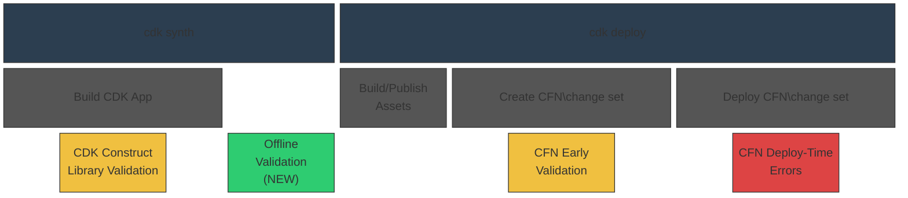

# CDK Comprehensive Validation RFC

* **Original Author(s):**: @kaizencc
* **Tracking Issue**: #897
* **API Bar Raiser**: @rix0rr

CDK Comprehensive Validation shifts left failures that occur during AWS CloudFormation
deployment time to local development.

## Working Backwards

### Blog Post

#### Catch CloudFormation Failures Before They Happen with CDK Comprehensive Validation

April 1, 2026 · AWS CDK Team

Today, we are announcing CDK Comprehensive Validation,
a new feature that shifts CloudFormation deployment failures left
by catching misconfigurations during local development —
before your template ever reaches AWS CloudFormation.
Whether you are deploying infrastructure yourself
or relying on an AI agent to build and deploy on your behalf,
slow feedback from deployment failures disrupts your development lifecycle.
CDK Comprehensive Validation gives you confidence that your deployment will succeed,
up to X% faster than waiting for a full `cdk deploy` to fail.

A new `cdk validate` command also unifies all validation output —
offline rule checks, construct library errors, and CloudFormation change set validation —
into a single invocation.

##### Three Layers of Defense

The AWS CDK already provides built-in validation at two points in the deployment lifecycle:
construct library exceptions during synthesis
and CloudFormation Early Validation during change set creation.
CDK Comprehensive Validation adds a third layer — offline validation —
that runs immediately after synthesis,
filling the gap between app-level checks and deployment-time checks.



* **CDK construct library exceptions (existing)** — Handwritten checks that run when your CDK constructs
  are built during synthesis. These catch issues like negative duration values or missing required properties.
* **Offline Validation (NEW)** — Immediately after synthesis, the new built-in validation engine evaluates
  your CloudFormation template against hundreds of rules. Unlike external tools, this engine resolves
  CloudFormation intrinsic functions natively, so it can catch issues that currently available CloudFormation
  analysis tools miss.
* **CFN Early Validation (existing)** — During `cdk deploy`, CloudFormation validates your change set
  before execution, catching issues like resources that already exist. Note that you get this by default, but
  not if you bypass change set creation with `--method=direct`. 

##### Offline Validation

Offline validation runs automatically as part of `cdk synth` with no additional configuration required.
It combines all post-synthesis checks into one term that covers Annotation errors and warnings as well as
[Policy Validation](https://docs.aws.amazon.com/cdk/v2/guide/policy-validation-synthesis.html)
plugins. In fact, the new rule set shipped as part of Offline Validation is implemented
as a default Policy Validation plugin. This default rule set covers common misconfigurations including
invalid property values, deprecated runtimes, overly permissive IAM policies, missing encryption, and
cross-resource dependency issues. These additional validations add under Y seconds to synthesis time.

##### `cdk validate`

You can also run all validation layers together using the new `cdk validate` command:

```bash
cdk validate [STACKS..] [--include <method>]
```

By default, this synthesizes your template and runs all validation methods.
You can optionally restrict to specific methods using `--include`:

```bash
cdk validate MyAppStack
cdk validate MyAppStack --include offline --include online
```

The unified output deliniates error provenance and whether the issue is suppressable. The following
example is of a user with a CDK Nag Policy Validation plugin enabled:

```bash
> cdk validate MyAppStack
Validation Report
-----------------

(Blocking)

AwsSolutions-S1 (1 occurrences)
Severity: Error
Source: CdkNagValidator

  Occurrences:

    - Construct Path: MyStack/DataBucket
    - Template Path: ./cdk.out/MyStack.template.json
    - Creation Stack:
        └──  MyStack (MyStack)
             └──  DataBucket (MyStack/DataBucket)
                  │ Construct: aws-cdk-lib/aws-s3.Bucket
                  │ Library Version: 2.180.0
                  │ Location: new MyStack (lib/my-stack.ts:12:5)
    - Resource ID: DataBucket2C40E2F8
    - Template Locations:
      > Properties/LoggingConfiguration

  Description: The S3 Bucket does not have server access logs enabled
  How to fix: Enable server access logging by setting the serverAccessLogsBucket property

Subnet has MapPublicIpOnLaunch enabled (1 occurrences)
Severity: Error
Source: Construct Annotations

  Occurrences:

    - Construct Path: MyStack/VpcStack/PublicSubnet
    - Template Path: ./cdk.out/MyStack.template.json
    - Creation Stack:
        └──  MyStack (MyStack)
             └──  VpcStack (MyStack/VpcStack)
                  └──  PublicSubnet (MyStack/VpcStack/PublicSubnet)
                       │ Construct: aws-cdk-lib/aws-ec2.PublicSubnet
                       │ Library Version: 2.180.0
                       │ Location: new MyStack (lib/my-stack.ts:30:5)
    - Resource ID: VpcStackPublicSubnetABC123

  Description: Subnet has MapPublicIpOnLaunch enabled without justification

(Suppressable)

I3011 - S3 bucket versioning should be enabled (1 occurrences)
Severity: Warning
Source: ValidationEngine (Default)
Suppress: Validations.of(construct).acknowledge('aws-cdk-lib:S3.bucketVersioning')

  Occurrences:

    - Construct Path: MyStack/DataBucket
    - Template Path: ./cdk.out/MyStack.template.json
    - Creation Stack:
        └──  MyStack (MyStack)
             └──  DataBucket (MyStack/DataBucket)
                  │ Construct: aws-cdk-lib/aws-s3.Bucket
                  │ Library Version: 2.180.0
                  │ Location: new MyStack (lib/my-stack.ts:12:5)
    - Resource ID: DataBucket2C40E2F8
    - Template Locations:
      > Properties/VersioningConfiguration

  Description: S3 bucket should have versioning enabled for data protection
  How to fix: Set versioned: true on the Bucket construct

Bucket policy allows public read access (1 occurrences)
Severity: Warning
Source: Construct Annotations
Suppress: Validations.of(construct).acknowledge('aws-cdk-lib:S3.publicRead')

  Occurrences:

    - Construct Path: MyStack/DataBucket
    - Template Path: ./cdk.out/MyStack.template.json
    - Creation Stack:
        └──  MyStack (MyStack)
             └──  DataBucket (MyStack/DataBucket)
                  │ Construct: aws-cdk-lib/aws-s3.Bucket
                  │ Library Version: 2.180.0
                  │ Location: new MyStack (lib/my-stack.ts:12:5)
    - Resource ID: DataBucket2C40E2F8

  Description: Bucket policy allows public read access

Policy Validation Report Summary

╔═════════════════════════════════════╤═════════╤════════════════════╗
║ Source                              │ Status  │ Blocking / Suppr.  ║
╟─────────────────────────────────────┼─────────┼────────────────────╢
║ ValidationEngine (Default)          │ success │ 0 / 1              ║
╟─────────────────────────────────────┼─────────┼────────────────────╢
║ CdkNagValidator                     │ failure │ 1 / 0              ║
╟─────────────────────────────────────┼─────────┼────────────────────╢
║ Construct Annotations               │ failure │ 1 / 1              ║
╚═════════════════════════════════════╧═════════╧════════════════════╝

2 blocking, 2 suppressable

Validation failed. See the validation report above for details
```

The command also generates the report in JSON format with the `--json` option.

```json
{
  "title": "Validation Report",
  "summary": {
    "status": "failure",
    "blocking": 2,
    "suppressable": 2,
    "sources": [
      { "name": "ValidationEngine (Default)", "version": "1.0.0", "status": "success", "blocking": 0, "suppressable": 1 },
      { "name": "CdkNagValidator", "version": "2.28.0", "status": "failure", "blocking": 1, "suppressable": 0 },
      { "name": "Construct Annotations", "status": "failure", "blocking": 1, "suppressable": 1 }
    ]
  },
  "blocking": [
    {
      "ruleName": "AwsSolutions-S1",
      "severity": "Error",
      "source": "CdkNagValidator",
      "description": "The S3 Bucket does not have server access logs enabled",
      "fix": "Enable server access logging by setting the serverAccessLogsBucket property",
      "occurrences": [
        {
          "constructPath": "MyStack/DataBucket",
          "templatePath": "./cdk.out/MyStack.template.json",
          "resourceLogicalId": "DataBucket2C40E2F8",
          "locations": ["Properties/LoggingConfiguration"],
          "constructStack": {
            "id": "MyStack",
            "path": "MyStack",
            "construct": "aws-cdk-lib.Stack",
            "libraryVersion": "2.180.0",
            "location": "Object.<anonymous> (bin/app.ts:8:1)",
            "child": {
              "id": "DataBucket",
              "path": "MyStack/DataBucket",
              "construct": "aws-cdk-lib/aws-s3.Bucket",
              "libraryVersion": "2.180.0",
              "location": "new MyStack (lib/my-stack.ts:12:5)"
            }
          }
        }
      ]
    },
    {
      "ruleName": "Subnet has MapPublicIpOnLaunch enabled",
      "severity": "Error",
      "source": "Construct Annotations",
      "description": "Subnet has MapPublicIpOnLaunch enabled without justification",
      "occurrences": [
        {
          "constructPath": "MyStack/VpcStack/PublicSubnet",
          "templatePath": "./cdk.out/MyStack.template.json",
          "resourceLogicalId": "VpcStackPublicSubnetABC123",
          "constructStack": {
            "id": "MyStack",
            "path": "MyStack",
            "construct": "aws-cdk-lib.Stack",
            "libraryVersion": "2.180.0",
            "location": "Object.<anonymous> (bin/app.ts:8:1)",
            "child": {
              "id": "VpcStack",
              "path": "MyStack/VpcStack",
              "construct": "aws-cdk-lib/aws-ec2.Vpc",
              "libraryVersion": "2.180.0",
              "location": "new MyStack (lib/my-stack.ts:28:5)",
              "child": {
                "id": "PublicSubnet",
                "path": "MyStack/VpcStack/PublicSubnet",
                "construct": "aws-cdk-lib/aws-ec2.PublicSubnet",
                "libraryVersion": "2.180.0",
                "location": "new MyStack (lib/my-stack.ts:30:5)"
              }
            }
          }
        }
      ]
    }
  ],
  "suppressable": [
    {
      "ruleName": "I3011",
      "severity": "Warning",
      "source": "ValidationEngine (Default)",
      "description": "S3 bucket should have versioning enabled for data protection",
      "fix": "Set versioned: true on the Bucket construct",
      "suppress": {
        "mechanism": "acknowledge",
        "id": "aws-cdk-lib:S3.bucketVersioning",
        "instruction": "Validations.of(construct).acknowledge('aws-cdk-lib:S3.bucketVersioning')"
      },
      "occurrences": [
        {
          "constructPath": "MyStack/DataBucket",
          "templatePath": "./cdk.out/MyStack.template.json",
          "resourceLogicalId": "DataBucket2C40E2F8",
          "locations": ["Properties/VersioningConfiguration"],
          "constructStack": {
            "id": "MyStack",
            "path": "MyStack",
            "construct": "aws-cdk-lib.Stack",
            "libraryVersion": "2.180.0",
            "location": "Object.<anonymous> (bin/app.ts:8:1)",
            "child": {
              "id": "DataBucket",
              "path": "MyStack/DataBucket",
              "construct": "aws-cdk-lib/aws-s3.Bucket",
              "libraryVersion": "2.180.0",
              "location": "new MyStack (lib/my-stack.ts:12:5)"
            }
          }
        }
      ]
    },
    {
      "ruleName": "Bucket policy allows public read access",
      "severity": "Warning",
      "source": "Construct Annotations",
      "description": "Bucket policy allows public read access",
      "suppress": {
        "mechanism": "acknowledge",
        "id": "aws-cdk-lib:S3.publicRead",
        "instruction": "Validations.of(construct).acknowledge('aws-cdk-lib:S3.publicRead')"
      },
      "occurrences": [
        {
          "constructPath": "MyStack/DataBucket",
          "templatePath": "./cdk.out/MyStack.template.json",
          "resourceLogicalId": "DataBucket2C40E2F8",
          "constructStack": {
            "id": "MyStack",
            "path": "MyStack",
            "construct": "aws-cdk-lib.Stack",
            "libraryVersion": "2.180.0",
            "location": "Object.<anonymous> (bin/app.ts:8:1)",
            "child": {
              "id": "DataBucket",
              "path": "MyStack/DataBucket",
              "construct": "aws-cdk-lib/aws-s3.Bucket",
              "libraryVersion": "2.180.0",
              "location": "new MyStack (lib/my-stack.ts:12:5)"
            }
          }
        }
      ]
    }
  ]
}
```

This makes `cdk validate` an ideal success gate for agentic workflows —
an AI agent can run it after generating infrastructure code
and immediately know whether the template is valid
without waiting for a full deployment.

##### Custom Rules and Sharing Across Organizations

Organizations can extend the default rule set with custom rules
written in a policy language like Rego or CloudFormation Guard.

For example, here is a rule that checks Lambda function architectures:

```rego
package cfn

deny[msg] {
    resource := input.Resources[name]
    resource.Type == "AWS::Lambda::Function"
    arch := resource.Properties.Architectures[_]
    not arch_valid(arch)
    msg := sprintf(
      "InvalidArchitectureValue: Allowed values: x86_64, arm64. Received: \"%s\" (at Resources/%s)",
      [arch, name]
    )
}

arch_valid("x86_64")
arch_valid("arm64")
```

Custom rules can be configured in the library and in the CLI. In the library, you can reference
specific packages directly in code:

```ts
import { rulesDir } from '@your-org/cfn-rules';

Validations.of(myApp).addRules({ sources: [rulesDir] });
```

Because Rego files are plain text with no compilation step,
they can be distributed through any package manager (npm, PyPI, Maven, NuGet).
This gives organizations semver for rule versioning, changelogs for communicating changes,
and the dependency management that CDK users already rely on.

To share custom rules across teams or an entire organization,
we recommend publishing them in your package manager of choice.
Rego files are plain text — no compilation or runtime is involved.

##### Suppressing Warnings and Errors

Offline validation findings can be suppressed directly in your CDK code
using the `Validations.of()` API:

```ts
Validations.of(myConstruct).acknowledge('UseLatestVersion');
Validations.of(myConstruct).acknowledgeAllWarnings();
```

`Validations.of()` also handles annotation warning suppression,
becoming the unified way to acknowledge warnings in CDK.

##### CDK Toolkit

Offline Validation will be built natively into the CDK Toolkit. The
`synth` method (and other methods that synthesize) will automatically validate.
A new `validate` method will be available that mirrors the `cdk validate` CLI command.

##### Get Started

CDK Comprehensive Validation is available today.
Upgrade to the latest AWS CDK CLI and run `cdk synth` —
offline validation runs automatically.
Use `cdk validate` for a unified view of all validation results.

---

Ticking the box below indicates that the public API of this RFC has been
signed-off by the API bar raiser (the `status/api-approved` label was applied to the
RFC pull request):

```
[ ] Signed-off by API Bar Raiser @xxxxx
```

## Public FAQ

### What are we launching today?

Today, we are announcing CDK Comprehensive Validation,
which shifts deployment failures left by catching misconfigurations
before they reach AWS CloudFormation deployment.
Whether you are deploying infrastructure yourself
or relying on an AI agent to build and deploy on your behalf,
slow feedback from CloudFormation failures disrupts your deployment lifecycle.

The AWS CDK CLI already surfaces CloudFormation Early Validation results during `cdk deploy`,
catching errors during change set creation before your change set is executed.
With this launch, we are adding a new offline validation step
that runs immediately after synthesis during `cdk synth`,
supplementing the online validation that Early Validation provides.
Together with the existing app-level validation
that runs when your CDK constructs are built,
this gives both human developers and AI agents
three layers of defense against deployment failures.

A new `cdk validate` command unifies all validation output —
offline rule checks, construct library errors, and CloudFormation change set validation —
into a single command.

### Why should I use this feature?

You automatically get the benefits of Offline Validation during `cdk synth`,
making you more confident that your ensuing cdk deploy will succeed.
You can integrate the cdk validate command into your AI workflows
as a success gate for rapid agentic cycles.

### What is the validation posture of CDK moving forward?

CDK's validation mechanisms include the following:

* construct library exceptions — handwritten errors that occur during synthesis
* [NEW] Offline Validation — validation of the synthesized CloudFormation Template immediately after synthesis. This covers some existing validation mechanisms:
  * Annotation Warnings & Errors - handwritten warnings/errors that are evaluated immediately after synthesis
  * Optional [policy validation](https://docs.aws.amazon.com/cdk/v2/guide/policy-validation-synthesis.html) plugins - allowing CDK Nag, CFN Guard rules, etc.
  * Default policy validation plugin covering common CFN deployment failures.
* CFN Early Validation — CFN change sets are validated during CFN change set creation at CDK deploy time
* CFN Deploy-Time Errors — Actual errors that occur during CFN deployment

Offline Validatios is meant to bring much of these additional validation rule sets natively into the CDK CLI.
Customers can continue to use these mechanisms but many custom set ups will no longer be necessary.

## Internal FAQ

### Why are we doing this?

Moving eventual errors earlier in the development cycle is always a good idea.
This speeds up deployment time for humans and AI agents alike.
cdk validate combines CDK's validations from different sources under one umbrella
and will become the one-stop shop for agentic workflows to validate their work,
up to X% faster than a full cdk deploy.

### Why should we not do this?

We should not do this if validation bloats the time of cdk synth,
as we have a parallel goal of lowering the average cdk synth time.
We also need to be careful that the errors we surface are not false positives,
where the CloudFormation deployment actually succeeds but we return an error —
this can be somewhat mitigated by providing an ergonomic suppression mechanism.

### What is the technical solution (design) of this feature?

The technical components of Offline Validation include:

- Offline Validation Engine
- Integration point in the synthesis command of CDK CLI
- Suppression mechanism
- Custom rule sets
- `cdk validate` command

#### Offline Validation Engine

The engine runs against the synthesized CloudFormation template json/yaml.
The engine will handle intrinsics natively. The engine requirements include:

* default rule set includes CFN Guard rules and CFN schema validation
* support for custom rule sets written in a policy language like Rego
* executes during `cdk synth` automatically, adding under Y milliseconds of additional time to cdk synth
* finds both errors and warnings, where warnings can be suppressed.

The actual implementation of the engine is out of scope of this RFC however.

The default rule set is likely to be around ~50MB when considering the size of the CFN schema
and other sources. This is a high penalty to pay considering the v2.1117.0 CDK CLI version is
~24MB unpacked. We are effectively tripling the unpacked size with the default validation rules.

Still, its better to ship this size penalty in the CLI over the framework, as any cold-start initialization
of the Validation Engine can be amortized across long-running CDK Toolkit processes like `watch`.

#### Engine Integration

We will reuse the existing [Policy Validation](https://github.com/aws/aws-cdk/blob/main/packages/aws-cdk-lib/core/lib/validation/validation.ts)
plugin interface (and remove `Beta1` from the interface), which looks like this:

```ts
export interface IPolicyValidationPlugin {
  readonly name: string;
  readonly ruleIds?: string[];
  readonly version?: string;
  validate(context: IPolicyValidationContext): PolicyValidationReport;
}

export interface IPolicyValidationContext {
  readonly templatePaths: string[];
}

export interface PolicyValidationReport {
  readonly success: boolean;
  readonly violations: PolicyViolation[];
  readonly metadata?: Record<string, string>;
  readonly pluginVersion?: string;
}

export interface PolicyViolation {
  readonly ruleName: string;
  readonly description: string;
  readonly violatingResources: PolicyViolatingResource[];
  readonly fix?: string;
  readonly severity?: string;
  readonly ruleMetadata?: Record<string, string>;
}
```

The validation logic lives in the framework to allow for seamless integration of default validations and custom validations.
Annotation warnings & errors and Policy Validation plugins are already established in the framework. By reusing the Policy
Validation plugin system, Offline Validation is able to unify all validation mechanisms that happen post-synthesis and pre-deploy.

This comes with the challenge of dealing with Offline Validation's estimated ~50MB unbundled package size and ~600-1000ms startup
cost when initializing the engine. We are deciding that we are okay with the size of validation in the framework rather than the CLI,
and that the engine startup will run parallel with synthesis to minimize its impact. The actual time to validate templates will be
negligible; about 1ms per resource.

By putting Offline Validation in the framework, both the CLI and the CDK Toolkit will be able to use it with no additional
implementation. Offline Validation will run by default in addition to any other plugins the user provides.

#### Suppression Mechanism

There is a suppression mechanism available for Annotation warnings today:
`Annotations.of(construct).acknowledgeWarning()`.
This will be deprecated in favor of a unified `Validations.of()` API that covers
suppression for all types of post-synthesis CDK errors and warnings.

The main `Validations` method will be `acknowledge`,
where the user supplies one or more rule IDs.
Under the hood, we will use the ID to differentiate `Annotation` rules from Offline
Validation rules and abstract the rule provenance away from the user.

```ts
export class Validations {
  public static of(construct: IConstruct): Validations {
    return new Validations(construct);
  }

  private constructor(private readonly construct: IConstruct) {}

  public acknowledge(...ruleIds: string[]): void {
    for (const id of ruleIds) {
      if (this.isAnnotationRule(id)) {
        Annotations.of(this.construct).acknowledgeWarning(id);
      } else if (this.isOfflineRule(id)) {
        this.supressOfflineValidation(id);
      } else {
        // warn that the id is invalid
      }
    }
  }

  private suppressOfflineValidation(id: string) {
    const existing = this.construct.node.metadata.find(
      m => m.type === Validations.SUPPRESSED_RULES_METADATA_KEY,
    );

    const suppressions: string[] = existing?.data ?? [];
    if (!suppressions.includes(ruleId)) {
      suppressions.push(ruleId);
    }

    this.construct.node.addMetadata(Validations.SUPPRESSED_RULES_METADATA_KEY, suppressions);
  }
}
```

The suppressed rules stored in the construct metadata will be available to filter violations
reported by the offline validation engine.

#### Custom Rule Mechanism

Custom rules are written in Rego and configured in code via `Validations.of(stack).addRules()`.
The user supplies directories or individual `.rego` files on disk.

Rules must be scoped to specific constructs within a CDK App. That means we must translate
the scope to a filter that is applied in a post-validation step. To facilitate this, `Validations`
will manipulate the construct metadata so the information is available after synthesis:

```ts
export class Validations {
  public addRules(options: { sources: string[] }): void {
    const stage = Stage.of(this.construct);
    if (!stage) {
      throw new Error('addRules() must be called within a Stage or App');
    }
    for (const source of options.sources) {
      const resolved = path.resolve(source);
      stage.node.addMetadata(Validations.CUSTOM_RULES_METADATA_KEY, resolved);
    }
  }
}
```

After synthesis, this gets translated and then sent to the engine:

```ts
function collectCustomRulesFromAssembly(assembly: CloudAssembly): string[] {
  const paths: string[] = [];
  for (const stack of assembly.stacksRecursively) {
    for (const [, entries] of Object.entries(stack.manifest.metadata ?? {})) {
      for (const entry of entries) {
        if (entry.type === Validations.CUSTOM_RULES_METADATA_KEY) {
          paths.push(entry.data as string);
        }
      }
    }
  }
  return [...new Set(paths)];
}
```

### Is this a breaking change?

Maybe. The purpose of blocking Offline Validation rules is that such a configuration _cannot_ successfully deploy.
And if we are unsure of that, we provide the error/warning as suppressable. Still, a previously successful CDK App
could now receive suppressable errors and may need code updates to run successfully. Because we are committed to
backwards compatibility, some rules we really want to be errors may have to be warnings. Alternatively, `cdk validate`
can throw the right errors while we may need to take a softer approach in `cdk synth`.

### What alternative solutions did you consider?

1. Rely solely on CFN Early Validation: rejected because it requires a CFN change set
   and that happens too late in the deployment process.
2. Write more CDK construct library exceptions: rejected because it is a treadmill,
   and L1 level users do not get access to L2 level validations.
3. Validation logic in the library: The main reasons to do so center around the ~50MB size and ~600-1000ms startup
   cost of the validation engine. For now, we decided to go with the established protocol of offline validation
   happening in the framework, and are willing to eat the ~50MB size cost (and have ideas for parallelizing the
   startup cost).
4. Custom rules written in TS: Right now the proposal is to allow for rules to be written in rego/guard rules
   only. It is possible in the future to add support directly in code, with a CDK construct that synthesizes
   into policy langugae rules. But that is more complicated and we will start with the simple solution first.

### What are the drawbacks of this solution?

1. Synth time: Adding offline validation to cdk synth increases synthesis time.
   This conflicts with the parallel goal of reducing average synth time.
   Needs careful benchmarking and opt-out.
2. False positives: If offline rules flag something that CloudFormation would actually accept,
   users get blocked unnecessarily.
   The suppression mechanism mitigates this
   but adds cognitive overhead to determine if the error is real.
3. Overlap with existing CDK Policy Validation: Customers with existing policy validation plugins will
   have questions as to what is now an overlap and what they need to keep in their set up. 
   Clear documentation and messaging is needed to explain how the default rules interact and whether
   customers should keep existing plugins or migrate to adding custom rules to the default plugin.
4. Package size: The default rule set and WASM engine is estimated to add approximately 50MB unpacked size
   to the framework. Disk footprint is negligible for most environments. CI/CD pipelines that install the library
   fresh per run will see a modest increase in install time proportional to the download size increase.

### What is the high-level project plan?

The project can be split into four parts:

* Integrate a built-in WASM-based offline validation engine
  with a default rule set, custom Rego rule support,
  and native CloudFormation intrinsic function resolution
* Create the `cdk validate` CLI command that unifies output
  from construct library exceptions, offline validation, and online validation
* Create a unified suppression mechanism via `Validations.of()`
  that handles both offline validation and annotation warnings
* Standardize output from all locations where we report errors/warnings, including:
  * code-level errors
  * annotation warnings and errors
  * offline warnings and errors
  * CFN Early Validation errors
