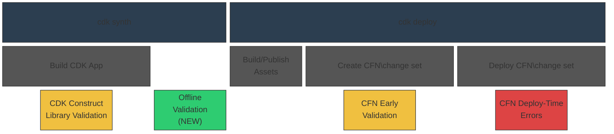

# CDK Comprehensive Validation RFC

* **Original Author(s):**: @kaizencc
* **Tracking Issue**: #897
* **API Bar Raiser**: @rix0rr

CDK Comprehensive Validation shifts left failures that occur during AWS CloudFormation
deployment time to local development.

## Working Backwards

### Blog Post

#### Catch CloudFormation Failures Before They Happen with CDK Comprehensive Validation

April 1, 2026 · AWS CDK Team

Today, we are announcing CDK Comprehensive Validation,
a new feature that shifts CloudFormation deployment failures left
by catching misconfigurations during local development —
before your template ever reaches AWS CloudFormation.
Whether you are deploying infrastructure yourself
or relying on an AI agent to build and deploy on your behalf,
slow feedback from deployment failures disrupts your development lifecycle.
CDK Comprehensive Validation gives you confidence that your deployment will succeed,
up to 90% faster than waiting for a full `cdk deploy` to fail.

A new `cdk validate` command also unifies all validation output —
offline rule checks, construct library errors, and CloudFormation change set validation —
into a single invocation.

##### Three Layers of Defense

The AWS CDK already provides validation at two points in the deployment lifecycle:
construct library validation during synthesis
and CloudFormation Early Validation during change set creation.
CDK Comprehensive Validation adds a third layer — offline validation —
that runs immediately after synthesis,
filling the gap between app-level checks and deployment-time checks.



* **CDK Construct Library Validation (existing)** — Handwritten checks that run when your CDK constructs
  are built during synthesis. These catch issues like negative duration values or missing required properties.
* **Offline Validation (NEW)** — Immediately after synthesis, the new built-in validation engine evaluates
  your CloudFormation template against hundreds of rules. Unlike external tools, this engine resolves
  CloudFormation intrinsic functions natively, so it can catch issues that static analysis tools miss.
* **CFN Early Validation (existing)** — During `cdk deploy`, CloudFormation validates your change set
  before execution, catching issues like resources that already exist.

##### Offline Validation

Offline validation runs automatically as part of `cdk synth`
with no additional configuration required.
It ships with a comprehensive default rule set that checks for common misconfigurations
including invalid property values, deprecated runtimes, overly permissive IAM policies,
missing encryption, and cross-resource dependency issues.
The engine is compiled to WebAssembly and adds under 1 second to synthesis time.

If you are already using the existing [Policy Validation](https://docs.aws.amazon.com/cdk/v2/guide/policy-validation-synthesis.html) plugin system
to integrate external tools like CloudFormation Guard,
those plugins will continue to work alongside the new built-in engine.
However, CDK Comprehensive Validation
works out-of-the-box with no external tools required.

##### `cdk validate`

You can also run all validation layers together using the new `cdk validate` command:

```bash
cdk validate [STACKS..] [--include <method>]
```

By default, this synthesizes your template and runs all validation methods.
You can optionally restrict to specific methods using `--include`:

```bash
cdk validate MyAppStack
cdk validate MyAppStack --include offline --include online
```

The unified output clearly distinguishes between blockers and suppressable issues:

```bash
> cdk validate MyAppStack

Stack MyAppStack
 [warning] [suppressable] UseLatestVersion: Node.js 16 runtime is deprecated.
           Consider upgrading to Node.js 20 or later
           (at Resources/MyLambdaFunction)

 [error] [suppressable] InvalidArchitectureValue: Allowed values: x86_64, arm64.
         Received: "x64_86" (at Resources/MyLambdaFunction)

Found 1 error, 1 warning.
```

This makes `cdk validate` an ideal success gate for agentic workflows —
an AI agent can run it after generating infrastructure code
and immediately know whether the template is valid
without waiting for a full deployment.

##### Custom Rules and Sharing Across Organizations

Organizations can extend the default rule set with custom rules
written in a policy language like Rego. The default rule set will be a superset
over CloudFormation Guard rules so there is no need to add those rules again.


For example, here is a rule that checks Lambda function architectures:

```rego
package cfn

deny[msg] {
    resource := input.Resources[name]
    resource.Type == "AWS::Lambda::Function"
    arch := resource.Properties.Architectures[_]
    not arch_valid(arch)
    msg := sprintf(
      "InvalidArchitectureValue: Allowed values: x86_64, arm64. Received: \"%s\" (at Resources/%s)",
      [arch, name]
    )
}

arch_valid("x86_64")
arch_valid("arm64")
```

Custom rules are loaded from a configurable directory specified in `cdk.json`
or via the `--custom-rules` CLI option.
The engine automatically collects `.rego` files from the specified path.

To share custom rules across teams or an entire organization,
we recommend publishing them in your package manager of choice.
Rego files are plain text — no compilation or runtime is involved.

For example, in npm, a rule package looks like this:

```
@your-org/cfn-rules/
├── package.json        # { "files": ["rules/**"] }
└── rules/
    ├── encryption.rego
    ├── iam.rego
    └── networking.rego
```

Teams install the package and configure `cdk.json`:

```json
{
  "validation": {
    "customRules": ["node_modules/@your-org/cfn-rules/rules"]
  }
}
```

This gives you semver for rule versioning, changelogs for communicating changes,
and the dependency management CDK users already rely on.
A security team can publish and iterate on organization-wide rules,
and application teams pick them up through a normal dependency update.

##### Suppressing Warnings and Errors

Offline validation findings can be suppressed directly in your CDK code
using the new `Validations.of()` API:

```ts
Validations.of(myConstruct).acknowledge('UseLatestVersion');
Validations.of(myConstruct).acknowledgeAllWarnings();
```

`Validations.of()` also handles annotation warning suppression,
becoming the unified way to acknowledge warnings in CDK.

##### Get Started

CDK Comprehensive Validation is available today.
Upgrade to the latest AWS CDK CLI and run `cdk synth` —
offline validation runs automatically.
Use `cdk validate` for a unified view of all validation results.
To add custom rules, create a directory of `.rego` files
and configure the path in your `cdk.json`.

### README

#### cdk validate

```
cdk validate [STACKS..] [--include <method>]
```

You can use cdk validate to run offline and online validation against a CDK stack or app.

This synthesizes a CFN template and verifies it against offline rules, such as:

* Lambda Function Architecture values must be one of: x86_64, arm64, got: x64_86

It also generates (without executing) a CFN change set to check against online rules, such as:

* Resource of type `AWS::S3::Bucket` with identifier MyBucket already exists

The output looks like this:

```bash
> cdk validate MyAppStack

Stack MyAppStack
 // Annotation Warnings
 [warning] [suppressable] ThroughputNotSupported: The throughput property is not supported
           on EC2 instances. Use a Launch Template instead.
           (at Resources/MyEc2Instance)

 // Offline Warnings
 [warning] [suppressable] UseLatestVersion: Node.js 16 runtime is deprecated.
           Consider upgrading to Node.js 20 or later
           (at Resources/MyLambdaFunction)

 // Annotation Errors
 [error] [blocking] MyOwnError: Bucket versioning is not enabled
         (at Resources/MyBucket)

 // Construct Library Errors
 [error] [blocking] DurationAmountsCannotNegative: Duration amounts cannot be negative.
         Received: -1 (at Resources/MyLambdaFunction)

 // Offline Errors
 [error] [suppressable] InvalidArchitectureValue: Allowed values: x86_64, arm64.
         Received: "x64_86" (at Resources/MyLambdaFunction)

 // Online Errors
 [error] [blocking] ResourceExists: Resource already exists (at Resources/MyS3Bucket)

Found 4 errors, 2 warnings.
```

> Note that, if there are Construct Library errors then synthesis fails and the other types
> of errors will not surface. Offline errors will be suppressable as we can
> generate a CloudFormation template and do not want to block users in case we are wrong.

A warning is always suppressable. Suppressable errors indicate issues that we believe will
fail CloudFormation Deployment, but since we can synthesize a CloudFormation template, we
will not stand in the way. An error that is a blocker fails the synthesis step and there
is no CloudFormation template that can be deployed.

You can optionally specify `--include` to restrict to a specific type of validation:

```bash
cdk validate --include offline
cdk validate --include online
```

#### Suppressing Warnings

Warnings in the CDK are meant to communicate best practices and must be acknowledgeable.
Warnings can come from Annotations or Offline Validations.

Annotation Warnings can be suppressed in code:

```ts
Annotations.of(myConstruct).acknowledgeWarning(
  'my-library:Construct:someWarning',
);
```

Offline Validations can similarly be suppressed in code:

```ts
Validations.of(myConstruct).acknowledge(
  'my-construct:UseLatestVersion',
);
```

Because CDK users see a unified list of warnings from cdk validate,
we cannot expect them to differentiate between Annotation and Offline Validation warnings.
Therefore, Validations.of will also be able to handle Annotation warning suppression
and will become the unified way to suppress warnings in CDK.
Acknowledging warnings via Annotations will be deprecated.

We will also expose additional syntactic sugar to allow for more robust suppression.
To start, we will support `acknowledgeAllWarnings` and `acknowledgeRules`.

```ts
Validations.of(myConstruct).acknowledgeAllWarnings();
Validations.of(myConstruct).acknowledgeRules([
  'UseLatestVersion',
  'InvalidArchitectureValue',
]);
```

#### Validating custom rule sets

Custom rules can be written in a policy language like Rego.
For example, the InvalidArchitectureValue rule is defined as follows:

```rego
package cfn

deny[msg] {
    resource := input.Resources[name]
    resource.Type == "AWS::Lambda::Function"
    arch := resource.Properties.Architectures[_]
    not arch_valid(arch)
    msg := sprintf(
      "InvalidArchitectureValue: Allowed values: x86_64, arm64. Received: \"%s\" (at Resources/%s)",
      [arch, name]
    )
}

arch_valid("x86_64")
arch_valid("arm64")
```

Custom rules are loaded via file/directory path specified in `cdk.json`
or with the `--custom-rules` option.
Custom rules can also be loaded in directly to the CDK App
in the `Validations` construct:

```ts
Validations.of(myStack).addRules({
  sources: ['org/my-custom-rules', 'org/my-specific-rule.rego'],
});
```

Rules with the `.rego` file extension will be automatically loaded into the validation for
that CDK stack or app.

---

Ticking the box below indicates that the public API of this RFC has been
signed-off by the API bar raiser (the `status/api-approved` label was applied to the
RFC pull request):

```
[ ] Signed-off by API Bar Raiser @xxxxx
```

## Public FAQ

### What are we launching today?

Today, we are announcing CDK Comprehensive Validation,
which shifts deployment failures left by catching misconfigurations
before they reach AWS CloudFormation deployment.
Whether you are deploying infrastructure yourself
or relying on an AI agent to build and deploy on your behalf,
slow feedback from CloudFormation failures disrupts your deployment lifecycle.

The AWS CDK CLI already surfaces CloudFormation Early Validation results during `cdk deploy`,
catching errors during change set creation before your change set is executed.
With this launch, we are adding a new offline validation step
that runs immediately after synthesis during `cdk synth`,
supplementing the online validation that Early Validation provides.
Together with the existing app-level validation
that runs when your CDK constructs are built,
this gives both human developers and AI agents
three layers of defense against deployment failures.

A new `cdk validate` command unifies all validation output —
offline rule checks, construct library errors, and CloudFormation change set validation —
into a single command.

### Why should I use this feature?

You automatically get the benefits of Offline Validation during `cdk synth`,
making you more confident that your ensuing cdk deploy will succeed.
You can integrate the cdk validate command into your AI workflows
as a success gate for rapid agentic cycles.

## Internal FAQ

### Why are we doing this?

Moving eventual errors earlier in the development cycle is always a good idea.
This speeds up deployment time for humans and AI agents alike.
cdk validate combines CDK's validations from different sources under one umbrella
and will become the one-stop shop for agentic workflows to validate their work,
up to X% faster than a full cdk deploy.

### Why should we not do this?

We should not do this if validation bloats the time of cdk synth,
as we have a parallel goal of lowering the average cdk synth time.
We also need to be careful that the errors we surface are not false positives,
where the CloudFormation deployment actually succeeds but we return an error —
this can be somewhat mitigated by providing an ergonomic suppression mechanism.

### What is the technical solution (design) of this feature?

The solution adds an Offline Validation layer to the CDK synthesis pipeline
and introduces a new cdk validate CLI command that unifies all validation output.


#### Validations:

* [Existing] [cdk synth] Construct Library Validation — handwritten errors that occur during synthesis
* [New] [cdk synth] Offline Validation — synthesized CloudFormation Template
  is evaluated against both base and custom rules
* [Existing] [cdk deploy] CFN Early Validation — CFN change sets are validated
* [Existing] [cdk deploy] CFN Deploy-Time Errors — Errors that occur during CFN deployment

#### Offline Validation Engine:

Runs a policy engine against the synthesized CloudFormation template json/yaml.
The engine will handle intrinsics natively. The engine requirements include:

* default rule set
* support for custom rule sets written in a policy language like Rego
* executes during `cdk synth` automatically,
  adding under Y milliseconds of additional time to cdk synth
* finds both errors and warnings, where warnings can be suppressed.

#### `cdk validate` command:

A new CLI command that runs all validation layers in a single invocation:

```bash
cdk validate [STACKS..] [--include <method>]
```

#### Suppression Mechanism:

* [Existing] Annotation warning suppressions in typescript
* [New] `Validations.of()` becomes the unified API for suppressing
  both offline validation warnings and annotation warnings.
  `Annotations.of().acknowledgeWarning()` will be deprecated
  in favor of `Validations.of()`.

#### Custom Rule Mechanism:

Custom rules are written in Rego and placed in a configurable directory
that can be piped into offline validation.
Custom rules can also be loaded in code via `Validations.of().addRules()`.
Rules can be distributed across teams and organizations
through any package manager (npm, PyPI, Maven, etc.)
since Rego files are plain text with no compilation required.

### Is this a breaking change?

No

### What alternative solutions did you consider?

1. Rely solely on CFN Early Validation: rejected because it requires a CFN change set
   and that happens too late in the deployment process.
2. Extend CDK construct library validation: rejected because it is a treadmill,
   and L1 level users do not get access to L2 level validations.
3. Use the existing CDK Policy Validation plugin system: rejected because it requires
   external tool installation (e.g. CloudFormation Guard CLI, OPA binary),
   does not resolve CloudFormation intrinsic functions,
   does not ship with a default rule set,
   and adds friction for teams that just want validation to work out of the box.
   The existing plugin system will continue to work alongside the new built-in engine
   for teams that need integration with specific external tools.

### What are the drawbacks of this solution?

1. Synth time: Adding offline validation to cdk synth increases synthesis time.
   This conflicts with the parallel goal of reducing average synth time.
   Needs careful benchmarking and opt-out.
2. False positives: If offline rules flag something that CloudFormation would actually accept,
   users get blocked unnecessarily.
   The suppression mechanism mitigates this
   but adds cognitive overhead to determine if the error is real.
3. Overlap with existing CDK Policy Validation: Two validation systems running at synth time
   could confuse users. Clear documentation and messaging is needed
   to explain how the built-in engine relates to the existing plugin system.

### What is the high-level project plan?

The project can be split into four parts:

* Integrate a built-in WASM-based offline validation engine
  with a default rule set, custom Rego rule support,
  and native CloudFormation intrinsic function resolution
* Create the `cdk validate` CLI command that unifies output
  from construct library validation, offline validation, and online validation
* Create a unified suppression mechanism via `Validations.of()`
  that handles both offline validation and annotation warnings
* Standardize output from all locations where we report errors/warnings, including:
  * code-level errors
  * annotation warnings and errors
  * offline warnings and errors
  * CFN Early Validation errors
