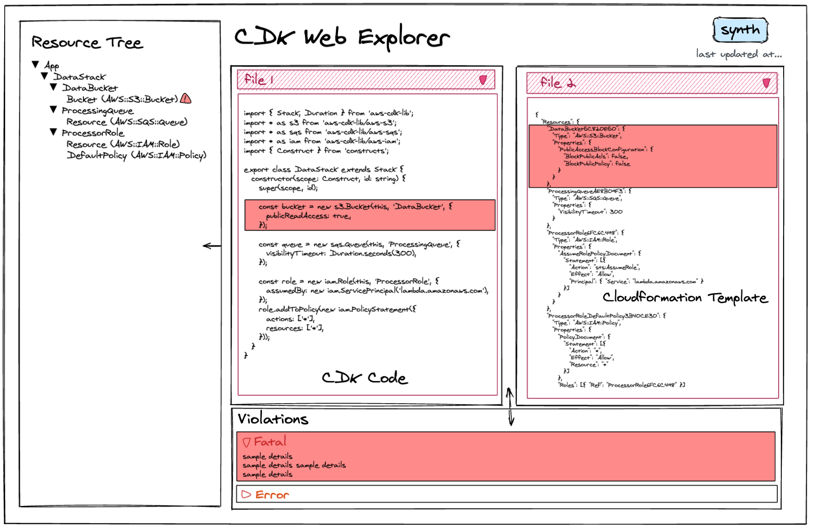

# RFC: CDK LSP and Web Interface

* **Author:** [Megha Narayanan](https://quip-amazon.com/YWB9EAizoK4)
* **Tracking Issue**: [#920](https://github.com/aws/aws-cdk-rfcs/issues/920)
* **API Bar Raiser**: @ShadowCat567

CDK developers cannot easily see what their code creates, discover deployment failures too late, and must jump between disconnected tools to debug.
Today, understanding what a single construct produces means running `cdk synth`, opening the synthesized template in `cdk.out/`, cross-referencing
`tree.json` to map constructs to resources, and often switching to the CloudFormation console to trace a deployed resource back to the line of code
that created it. The CDK LSP and Web Explorer close this gap by surfacing construct-to-resource mappings, validation diagnostics, and three-way linked
navigation directly in editors and a browser-based explorer. Three-way linked navigation connects your source code, the construct tree, and the
synthesized CloudFormation template, so that selecting an element in any one view highlights the corresponding elements in the other two.

## Working Backwards

### CHANGELOG

```
`* feat(cli): `cdk explore` command launches an interactive web explorer for CDK apps
* feat(cli): CDK LSP server for IDE and AI agent integration
* feat(toolkit-vscode): CDK construct diagnostics, CodeLens, and enhanced CDK tree view via AWS Toolkit
`
```

### README

#### CDK Explorer

CDK Explorer gives you a visual, interactive view of your CDK application — showing the relationship between your source code, the construct tree, and
the synthesized CloudFormation templates.

#### `cdk explore`

Launch the explorer from any CDK project directory:

```
$ cdk explore [--no-watch]
CDK Explorer running at http://127.0.0.1:4000
```

Use `--no-watch` to disable automatic re-synthesis on file save. Watch mode can also be toggled from within the explorer UI.

The explorer opens in your browser with three linked panels:

* Tree panel: your construct hierarchy, expandable from the app root down to individual resources
* Template panel: the synthesized CloudFormation template with syntax highlighting
* Source panel: your CDK source code

Wireframe:


Clicking any element in one panel highlights the corresponding elements in the other two. Click a
construct in the tree to see which CloudFormation resources it produces and which line of code created it. Click a resource in the template to jump to
the CDK code that generated it.

A violations sidebar shows offline validation findings grouped by severity. Clicking a violation navigates all three panels to the relevant construct.
The explorer watches your source files and re-synthesizes automatically on save.  While synthesis is running, a progress indicator appears. If
synthesis fails, the explorer shows the failure and continues displaying the last successful results. A timestamp shows when data was last refreshed;
if source files have been modified since, a staleness warning appears. Auto-synth can be toggled off via the explorer UI or initialization options
for users who find it too slow. A manual "Synth now" button is available for forced refresh or when auto-synth is disabled.

#### Limitations

* Re-synthesis on save depends on synth speed; large apps (50+ stacks) may take 10-30s to refresh
* The explorer is read-only — it does not modify source files or deploy resources

#### CDK LSP Server

The CDK LSP server provides real-time CDK intelligence to any editor or AI agent that speaks the Language Server Protocol. In VSCode, install the AWS
Toolkit extension. CDK diagnostics and CodeLens appear automatically when you open a CDK project.

What you get:

* Diagnostics — validation violations appear as warnings/errors on the line of code that created the offending construct
* CodeLens — each construct shows the CloudFormation resources it produces (e.g. "3 resources: Bucket, BucketPolicy, Key"). Clicking the lens
  navigates to the resource's definition in the synthesized template; when a construct produces multiple resources, a picker lets the user choose
  which one to open.
* Hover — hover over a construct line to see its logical ID, resource type, and template file, and call hierarchy.  When a construct produces multiple
  resources, all are listed with links to their template definitions.
* Quick fixes — suppressable violations offer a one-click fix to insert `Validations.of(construct).acknowledge(...)`. Actual fixes (e.g., adding
  encryption, scoping IAM policies) are planned as a future feature, with AI-assisted generation for complex fixes.

Note: Source-linked features (diagnostics on specific lines, CodeLens, hover) require valid stack traces, which are currently only available for
TypeScript, Java, and Python CDK apps. Apps in other source languages still receive construct-to-resource data in the web explorer.

#### AWS Toolkit for VS Code

The CDK LSP is automatically installed as part of the [CDK VS Code Plugin]. No additional setup is required, simply open a CDK project
and diagnostics appear immediately.

#### AI Agent Integration

In Claude Code, install the CDK LSP plugin:

```
claude plugins install [cdk-claude-plugin]
```

Or add manually to your `.lsp.json`:

```
{
  "cdk-lsp": {
    "command": "cdk lsp",
    "extensionToLanguage": { ".ts": "typescript", ".py": "python", ".java": "java" },
    "transport": "stdio",
    "initializationOptions": { "applicationDir": "${CLAUDE_PROJECT_DIR}" }
  }
}
```

The agent receives diagnostics automatically after every file change, with no manual invocation needed.

In any LSP-capable editor, simply point your LSP client at `cdk lsp` over stdio. The server accepts an `applicationDir` initialization option pointing
to your CDK project root.
* * *

```
`[ ] Signed-off by API Bar Raiser @xxxxx
`
```

## Public FAQ

### What are we launching today?

Two complementary tools for CDK developers: a web explorer (`cdk explore`) that visualizes the three-way relationship between CDK source code, the
construct tree, and CloudFormation templates; and an LSP server that surfaces validation diagnostics, construct-to-resource mappings, and quick fixes
directly in your editor or AI coding agent.

At launch, the CDK LSP provides two features in any LSP-capable editor:

* **Diagnostics:** validation violations from the synthesized cloud assembly, reported on the source line that created the offending construct.
* **CodeLens:** construct-to-resource mappings shown inline on construct lines, so you see what each construct produces without leaving the file.

Auto-synth on save keeps both current. Hover (logical ID, resource type, template links), Document Symbols, Inlay Hints, and Quick Fixes to
acknowledge or suppress violations follow in later milestones.

### Why should I use this feature?

If you've ever:

* Deployed a CDK app and been surprised by what resources it created
* Forgotten to run `cdk synth` and only discovered a validation error at deploy time
* Had to repeatedly run `cdk synth` to check for validation errors while iterating on code
* Struggled to trace from a CloudFormation error back to the CDK code that caused it

These tools close each of those gaps directly:

* **Surprised by what your code creates:** CodeLens shows the CloudFormation resources each construct produces right on the line that created it, and
  the explorer's tree panel lets you expand your app from the root down to individual resources. You see the IAM role a single `lambda.Function` adds
  without reading the synthesized template.
* **Validation errors found at deploy time:** the LSP surfaces validation violations as warnings and errors in your editor as you work, so
  deployment-blocking issues show up while you are still writing the code.
* **Repeatedly running `cdk synth` by hand:** the tools re-synthesize automatically on save, so diagnostics and the explorer stay current without you
  breaking flow to run a command and parse terminal output.
* **Tracing a CloudFormation error back to your code:** three-way linked navigation connects your source, the construct tree, and the synthesized
  template, so you can click a resource in the template and jump to the line of CDK that produced it.

The explorer gives you a visual map of your entire app, and the LSP gives you immediate feedback while writing code, without deploying, without
credentials, and without leaving your editor. Beyond launch, further features are planned on top of this same foundation: a construct dependency
graph view to make cross-stack and parent-child relationships easier to reason about, asset and feature-flag exploration so you can see what your
assets contain and how flags affect your constructs, and AI-assisted fixes that use the structured construct context to resolve violations directly
rather than only suppressing them.

### Do I need AWS credentials?

No. The LSP and web explorer themselves need no credentials and read the synthesized cloud assembly (`cdk.out/`) locally.  

Note: AWS credentials can be used via the Toolkit integration but are not required for any current functionality of this feature.

### Which languages are supported?

The core data model is language-agnostic: it reads the synthesized cloud assembly (`cdk.out/`), which any CDK-supported language produces. However,
source-location-linked features (diagnostics on specific lines, CodeLens on construct lines) require valid stack traces, which CDK records
reliably for TypeScript, Java, and Python apps.

For C# and Go apps, violation data and construct-to-resource mappings are surfaced in the Web Explorer (as construct tree annotations),
and are surfaced in the Problems panel, but without line level precision, since source locations cannot be resolved.

### What do I get from the CDK LSP that I can't get from my existing language server?

Your TypeScript/existing language server gives you instant type errors; the CDK LSP gives you infrastructure validation after synthesis, like policy
violations, construct-to-resource mappings, and source-linked deployment warnings. They run alongside each other and serve different feedback loops at
different timescales.

### Does this work with AI coding agents?

Yes. Any LSP-capable agent can use the CDK LSP by pointing its config at the server binary, with no custom integration needed (see [claude
docs](https://code.claude.com/docs/en/plugins-reference#lsp-servers), as an example). Once connected, the agent benefits over raw CLI invocation
because:

* Diagnostics arrive automatically after every edit with no invocation needed
* Source-linked violations let the agent jump directly to the line that needs a fix

## Internal FAQ

### Why are we doing this?

CDK apps are complex, and it is often difficult to visualize the connections between your resources, and to debug, especially customers write
high-level CDK code (L2/L3 constructs), but what actually gets created (CloudFormation resources) are hidden behind layers of abstraction and are not
clearly matched 1-to-1 with the CDK code that created them. This creates three concrete problems:

* Customers can't see what their code creates. A single line like `new lambda.Function(this, 'Fn', { runtime, handler, code })`produces two
  CloudFormation resources, including an IAM execution role the customer never explicitly defined.  Customers don't discover this until they read the
  synthesized template or deploy and inspect the stack. The construct tree hierarchy is not exposed in any interactive way.
* Validation feedback requires manual invocation. Policy violations, invalid configurations, and validation errors are surfaced by `cdk synth`, but
  only when the developer remembers to run it. There is no continuous feedback during development — developers must break their flow to explicitly
  invoke synthesis and parse terminal output..
* Debugging requires jumping between disconnected tools. When something goes wrong, customers must manually trace from their CDK source code to the
  synthesized CloudFormation template to the deployed resource in the AWS console, which is not always clear. There is no single view that shows these
  connections.

With the LSP Server and Web Explorer, a customer can:

* Open their CDK project in VSCode and immediately see inline warnings for (common) violations that would fail deployment
* Click a construct in their code and see exactly which CloudFormation resources it produces
* Launch `cdk explore` from the CLI and visually navigate the three-way relationship between their code, their construct tree, and their
  CloudFormation template
* Click a construct in the explorer and see the corresponding CloudFormation resources it produces and the source code that created it

### Why should we *not* do this?

The strongest arguments against this project are that the problem may not warrant new tooling, or that one of the two tools is sufficient on its own.

**Why do anything? Doesn't** **`cdk validate`** **already do this?** Developers already have working debug flows, and the information these
tools surface is technically available today. A developer can run `cdk synth` and read the synthesized template, run `cdk validate` for a
violation report, and inspect deployed resources in the console. Adding tools also carries adoption risk: if they are slow, noisy, or produce
stale results, developers will ignore them and the effort is wasted. However, in the current workflow, each of those steps is manual and breaks
the development flow. `cdk validate` is a fire-and-forget CLI command; it outputs a report but does not integrate into the editing experience.
The LSP improves on this because:

* It provides richer data beyond violations: construct-to-resource mappings, source locations, and property metadata that `cdk validate` does not
  expose
* It integrates into your editor; violations appear as inline warnings on the line that created the offending construct, which is a cleaner UI for
  human developers
* It gives a persistent feedback loop rather than a point-in-time snapshot

The web explorer adds visual, navigable context that a flat JSON report cannot provide. Clicking through the construct tree to see what a line of
code produces is qualitatively different from reading a validation report.

**Why not only build the Web Explorer?** The web explorer alone gives customers all the core features of the LSP, so it is fair to ask
whether the LSP is worth implementing at all. The key drawback is that the explorer is a separate browser surface: a developer has to leave
the IDE to investigate or debug, the context switch this project set out to remove. The LSP also speaks a standard protocol, so any
LSP-capable editor or AI coding agent can consume CDK diagnostics and construct-to-resource data in real time, which a browser interface
cannot provide.

**Why not only build the LSP?** The LSP is feature-complete and provides the most natural experience for developers, with all feedback
delivered directly in the IDE, so why would users need the web explorer as well? The answer is that the LSP only reaches developers whose
editor speaks the Language Server Protocol. Anyone using an editor without LSP support (such as vim), or investigating outside an editor, for
example by running an agent in their terminal, gets nothing to help them understand relationships between their source code, resources, and
templates. The web explorer is available to all CDK CLI users, and a single CLI command (`cdk explore`) opens it in any browser.

### What is the technical solution (design) of this feature?

We are building two complementary tools; an LSP server and a web explorer, that share a core library and solve these problems from different angles.

The LSP gives customers a tight feedback loop while writing code, while the web explorer gives customers a visual map of their entire app when
investigating or debugging. Together, they close the abstraction gap explained above.

The web explorer is launchable from the CDK CLI, which is IDE-agnostic and accessible to all customers. The LSP integrates into VSCode via the AWS
Toolkit plugin, and the Toolkit's existing CDK tree view is enhanced with source-linking and violation annotations.

Functionality will be built as new packages here: https://github.com/aws/aws-cdk-cli/tree/main/packages

The system consists of four components:

* **Shared core (`@aws-cdk/cloud-assembly-api`):** a library that parses the cloud assembly and produces a typed model of the construct tree, source
  locations, and violations. It also handles file watching, synth triggering, and caching, so every tool that embeds it stays current the same way.
* **LSP server (`cdk lsp`):** a persistent process that embeds the shared core and exposes its data through the Language Server Protocol over stdio.
* **Web explorer (`cdk explore`):** a local HTTP server and browser SPA. Embeds the shared core directly to read the cloud assembly, then serves
  data to the browser via HTTP and SSE.
* **VSCode extension:** an AWS Toolkit integration that spawns `cdk lsp` and connects as a standard LSP client

The core is the single reader of the cloud assembly, and both the LSP server and the web explorer consume its typed model in-process.

**Cloud assembly as the data layer**
Both tools read from the cloud assembly (`cdk.out/`) produced by `cdk synth`, which gives them a consistent, offline data source with no credentials
or network calls required. Neither tool parses these files itself. The shared core library does the interpretation and produces the typed model, and
the LSP server and web explorer each embed it. The shared core parses four files:

* **`tree.json`** — construct tree hierarchy and construct-to-resource mappings
* **`manifest.json`** — stack enumeration, inter-stack dependencies, and asset information
* **`*.metadata.json`** — source locations (stack traces captured at construct creation time), enabling the LSP to map resources back to the exact
  line of code that created them
* **`validation-report.json`** — offline validation results (invalid configurations, deprecated runtimes, security issues, best practice
  violations) produced during synthesis with no extra setup

**Keeping the data fresh.** The data comes from `cdk synth`, not `cdk deploy`. The tools re-synthesize automatically when you save a source file and
write the result to `cdk.out/`, which the shared core then re-reads. To avoid
reimplementing file watching, we reuse the file-monitoring and synth-triggering logic from `cdk watch`, decoupled from its deploy step. Auto-synth can
be turned off for large apps where synthesis is slow; in that case the tools serve the last `cdk.out/` and show a staleness indicator when source
files have changed since the last synth.

**What happens when synth fails?** A failed synth does not crash the tools or clear the current view. The synth errors, such as TypeScript
compilation failures, are surfaced as diagnostics on the files that caused them, and the tools keep serving the last successful cloud
assembly, marked stale, until synth succeeds again.

### Is this a breaking change?

No. This introduces new packages and a new CLI command. No existing APIs or behaviors are modified.

### What alternative solutions did you consider?

We considered the following alternatives:

**Online validation as a primary data source.** We chose offline validation as the foundation because it keeps the tools credential-free, which
means the LSP works standalone in any editor without a plugin or AWS account setup. Online validation was ruled out for v1 because:

* It introduces a credential requirement that the tools otherwise don't have
* It's slower (create change set → poll → read events → delete change set)
* It can only validate against a specific AWS account/region, which may not match the user's intent during development

Offline validation runs locally against the synthesized CloudFormation template during `cdk synth` with no credentials or network calls required. It
catches the majority of actionable violations, like invalid resource types, deprecated runtimes, invalid Fargate CPU/memory combinations, security
issues, and best practice violations. Results are always available in `cdk.out/validation-report.json` with no extra configuration. Online
validation may be offered in the future.

**Using `cdk watch` as-is for re-synthesis.** `cdk watch` monitors files and re-synthesizes, but it is designed for deployment workflows — it
triggers `cdk deploy --hotswap` with no synth-only mode. Rather than reimplementing file watching from scratch, we decouple the synth-triggering and
file-monitoring logic from `cdk watch`'s deploy step and reuse it directly. The LSP gets live-reload behavior without deploying anything or requiring
credentials.

**Making the web explorer read-write.** Supporting writes would push the explorer toward being a web-based IDE, which is a large
surface to build and maintain and would compete with the editors developers already use.

#### Alternatives for the VSCode Plugin

**Embedding the web explorer as a VS Code webview panel.** We considered embedding the same three-panel web explorer directly into VS Code as a
webview, which would let VS Code users access the full explorer without opening a browser. This would maximize code reuse the same code that powers
`cdk explore` would load inside a VS Code panel. We rejected this approach for three reasons:

* **Read-only code panels inside a code editor are confusing.** The explorer's source panel and template panel display read-only, syntax-highlighted
  code. Inside VS Code, this creates a panel that *looks like* an editor but can't be edited, which is unnatural, and could be disorienting rather
  than helpful.
* **Faithful UX replication is impractical.** For the embedded explorer to not feel out of place, it would need to match VS Code's syntax highlighting
  themes (which are user-configurable), respond to font size changes, and match the editor's scrolling and selection behaviors. Achieving this parity
  is significant ongoing work, and if we support another IDE (JetBrains, Neovim), the VS Code-optimized webview would feel entirely foreign there.
* **It does not add novel value over `cdk explore`.** The browser-based explorer already provides the full three-panel experience. Embedding it inside
  VS Code saves the user a window-switch to their browser, but does not enable any interaction that wasn't already possible.

**Building a separate, native VS Code UI from scratch.** We also considered building a VS Code-native experience entirely separate from the web
explorer using native TreeViews, editor tabs, and VS Code APIs rather than web technologies. This would produce the most integrated experience but at
high cost: the three-panel linked navigation would need to be reimplemented using VS Code's constrained extension APIs, and code would not be shared
with the CLI explorer.

**Chosen approach: enhance the existing AWS Toolkit CDK tree with source linking and violations.** Instead of embedding or rebuilding the explorer, we
extend the CDK section already present in the AWS Toolkit sidebar. The existing tree view shows the construct hierarchy; we enhance it to:

* Navigate to source code when a construct is clicked (using the source location data from the shared core)
* Display validation violations as tree annotations (icons/badges) with click-to-navigate behavior
* Show construct-to-resource mappings as child nodes or tooltip metadata

This approach uses native VS Code UI (auto-themed, searchable, accessible), integrates with the user's existing editing workflow (clicking a construct
opens the real file in the editor, not a read-only copy), and avoids the webview maintenance burden. The LSP provides inline diagnostics and CodeLens
on the code itself. Together, the enhanced tree + LSP give VS Code users the same information the web explorer provides, but delivered through native
IDE patterns rather than an embedded web application.

### What are the drawbacks of this solution?

* **Synth latency as a bottleneck.** The CDK LSP's data comes from the cloud assembly, which requires running the entire CDK app. For large apps,
  synthesis can take tens of seconds. This means feedback is not instant — the CDK LSP operates on a fundamentally different timescale than a
  TypeScript or Python language server. Users with very large apps may find auto-synth too slow to be useful.
* **Auto-synth executes the application on every save.** Refreshing the data requires running the user's CDK app, which can execute arbitrary
  code with side effects such as writing files or making local calls. This also raises a trust concern: opening an unfamiliar project and saving
  a file runs that project's code, so auto-synth should be opt-in or gated by editor workspace trust before it runs an untrusted app.
* **The tools are only as fresh as the last successful synth.** All data comes from a synthesized cloud assembly, so when synth fails the tools
  cannot produce new construct, template, or violation data. They fall back to the last successful assembly, which means the freshest view is
  unavailable exactly when the app is broken and the developer most wants to inspect it.

### What is the high-level project plan?

The project is delivered in three phases:

**Phase 1: Shared core and LSP server.** Build the shared core library that parses `cdk.out/` and produces the typed data model (construct tree,
source locations, violations). Implement the LSP server on top of it with diagnostics (violations mapped to source lines) and CodeLens
(construct-to-resource mappings). Auto-synth triggering lives in the shared core. By end of Phase 1, a developer can open a CDK project in VSCode and
see inline violation warnings and resource counts on construct lines.

**Phase 2: Web explorer.** Build the `cdk explore` CLI command, HTTP server, and browser SPA. Implement the three-panel layout (tree, template,
source) with bidirectional linked navigation. The violations panel surfaces the same data the LSP shows, but in a visual, browsable form. By end of
Phase 2, a developer can run `cdk explore` and visually navigate their entire app's structure.

**Phase 3: AWS Toolkit integration.** Integrate the LSP client into the AWS Toolkit VSCode extension.  Enhance the AWS Toolkit CDK tree view with
source-linking and violation annotations. By end of Phase 3, VS Code users can click constructs to navigate to source, see violations as tree
annotations, and access construct-to-resource mappings natively.

#### Features

Milestones: M0 = prework, M1 = MVP, M2 = improvements, M3 = extensions.

1. [M0] Construct tree parsing and navigation
2. [M0] Source location resolution
3. [M1] CodeLens: construct → CloudFormation resource mapping
4. [M1] LSP Diagnostics: validation violations at source line
5. [M1] Three-panel linked navigation: tree ↔ template ↔ source
6. [M1] `cdk explore` CLI command entry point
7. [M1] Auto-synth on file save
8. [M2] Diagnostic staleness: fade to Hint on edit, restore on re-synth
9. [M2] Web explorer updates without reload
10. [M2] Staleness indicator + "Synth Now" button
11. [M2] Hover: logical ID, resource type, template file
12. [M2] Document Symbols: construct tree in editor Outline view
13. [M2] Inlay Hints: logical IDs inline
14. [M2] Quick Fix: acknowledge/suppress violations
15. [M3] VS Code extension: LSP client (spawns cdk lsp on project detection)
16. [M3] VS Code extension: Enhanced CDK tree
17. [M3] Synth progress notifications
18. [M3] Quick Fixes: (AI-powered) actual fixes (add encryption, scope IAM, etc.)
19. [M3] Error states, performance tuning

### Are there any open issues that need to be addressed later?

* **AWS Toolkit integration.** Embedding the LSP client and enhancing the existing CDK view into the AWS Toolkit VSCode extension requires
  coordination with the AWS Toolkit team. Their contribution guidelines, release cadence, and extension architecture may constrain how the integration
  is built.

## Out of Scope / Future Extensions

The following are intentionally out of scope for the initial launch but represent natural follow-up work:

* **Click-to-fix UI for violations.** If a violation has a suggested fix, the web explorer could offer a "Fix" button that applies the change
  directly.
* **Click-to-deploy from the explorer.** A "Deploy" button in the web explorer
* **Asset exploration.** Surface asset metadata (size, type, connected resources) through the LSP and web explorer.
* **Feature flags management.** Display and manage feature flag state from the web explorer.
* **Online validation.** Trigger online validation from the explorer or editor. Requires AWS credentials and surfaces account-specific findings.
* **AI-powered quick fixes.** Using an AI model to generate fixes for violations based on structured context (rule name, construct path, resource
  type, violating properties).
* **Agent configuration bundling.** Bundle CDK agent configuration with aws-agent-toolkit rather than maintaining a separate `.lsp.json`.

## Appendix

Proofs of concept:

* Web app: https://github.com/otaviomacedo/webapp-experiment
* Web App + LSP with shared core: https://github.com/ShadowCat567/webapp-lspsplit-experiment

RFC for `cdk validate` command which will be used by LSP: https://github.com/aws/aws-cdk-rfcs/pull/899

Repo for AWS Toolkit plugin into which this will be integrated: https://github.com/aws/aws-toolkit-vscode

CloudFormation LSP: https://github.com/aws-cloudformation/cloudformation-languageserver

ClaudeCode Plugins reference: https://code.claude.com/docs/en/plugins-reference#lsp-servers

Articles on LSPs and Agents:
https://medium.com/@vinodh.thiagarajan/lsp-the-protocol-your-ide-uses-every-day-and-now-your-ai-agent-does-too-19e74ca26ace
 https://tech-talk.the-experts.nl/give-your-ai-coding-agent-eyes-how-lsp-integration-transform-coding-agents-4ccae8444929
