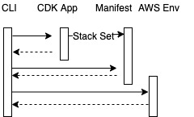
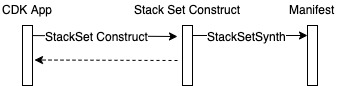
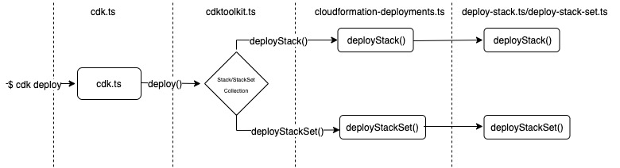
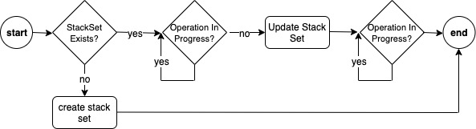
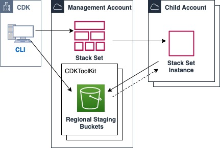

# CDK Self Managed Stack Set Support

As a CDK user, I would like to define stack set infrastructure through native CDK constructs and create/update self-managed stack sets through CDK deploy command.

* **Original Author(s):** @linsona
* **Tracking Issue**: #66
* **API Bar Raiser**: @skinny85

## Working Backwards

### CHANGELOG

* feat(assembly): add stack set artifact type and schema
* feat(core): add stack set core construct
* feat(cli): add logic for cli commands such as `cdk deploy` to collect stack set artifact types

### README

The `cdk.StackSet` construct in CDK defines AWS resources in a stack set and stack set
 configuration/deployment preferences. 
 This is different from the `cdk.CfnStackSet` construct, which requires a CloudFormation stack that then deploys a CloudFormation stack set. 
 The `cdk.StackSet` construct creates the stack set directly if it does not exist, or updates a stack set and existing stack set instances while monitoring the stack set operation.

#### Usage

To define a stack set, extend the core construct `StackSet`. 
Then define AWS resources in the same way as defining resources for stacks. 
Compared to the `Stack` construct, the `StackSet` core construct has different properties specific to StackSets. 
The properties define the configuration of the stack set and the preferences used for update operations.

**Example:**

```ts
import * as cdk from '@aws-cdk/core';
import * as iam from '@aws-cdk/aws-iam';

class PocStackSet extends cdk.StackSet {
    constructor(scope: cdk.Construct, id: string, props?: cdk.StackSetProps) {
        super(scope, id, props);

        new iam.Role(this, 'ExampleRole', {
          assumedBy: new iam.ServicePrincipal('s3.amazonaws.com')
        });
    }
}

new PocStackSet(app, 'poc-stack-set', {
  faultTolerancePercentage: 10,
  maxConcurrentPercentage: 10,
  regionConcurrencyType: cdk.StackSetRegionConcurrency.PARALLEL,
  //...
});
```

**Deployment:**

To deploy the stack set, the CLI command remains the same: `cdk deploy poc-stack-set`. 
If the stack set **does not exist**, then CDK will create the stack set directly in CloudFormation. If the stack set **does exist**, then the stack set itself will be updated as well as all **existing** stack set instances. 
Stack sets instances are added to the stack set outside of the CDK context.

## FAQ

### What are we launching today?

The core construct StackSet, which will enable users to define and deploy stack sets directly from CDK.

### Why should I use this feature?

This core constuct directly creates a CloudFormation stack set vs. provisioning a single stack that deploys a stack set. 
The deployment also updates the stack set, updates existing stack set instances, and monitors the stack set operation.

### What is supported?

* Self Manged Stack Sets
  * Create, Update, and Update Existing Stack Set Instances directly through CDK

### What is not supported?

* Service Managed Stack Sets
* Stack Set Instance Add/Remove through CDK
* Stack Set deletion
* CDK Assets (CDK File Assets/CDK Docker Assets)
  * More information on CDK assets and complexities described in the [CDK Assets Handling](#4-cdk-assets-handling) section.

## Internal FAQ

### Why are we doing this?

Today, CDK does not support the creation and updating of CloudFormation stack sets directly. This solution would also enable deploying to existing stack sets with low effort.

CDK does provide the `cdk.CfnStackSet` construct, which could accomplish similar behavior. 
The difference is that the `cdk.CfnStackSet` construct is a resource in a single CloudFormation stack with the resource type `AWS::CloudFormation::StackSet`, 
where stack provisions the actual stack set. 
This requires a 1:1 mapping of parameters and tags that need to be passed from the stack to the stack set. 
Customer can deploy to existing stack sets, but requires some migration steps for importing an existing stack set into the resource `AWS::CloudFormation::StackSet` before before being able to use `cdk.CfnStackSet`.

### Why should we _not_ do this?

We might not want to do this since CDK does provide the `cdk.CfnStackSet` construct, which could accomplish similar behavior. 
The intermdiate stack may not be ideal for some customers, and may require large migration effort for customers who manage many stacksets.

### What changes are required to enable this change?

To enable this feature, we would need to introduce:
* A StackSet construct for customers to extend
* A new assembly/artifact type for the Cloud Assembly
* A new stack set synthesizer
* Deployment code that creates/updates stack sets using AWS CloudFormation APIs.

### Is this a breaking change?

No.

### What are the drawbacks of this solution?

The handling of CDK assets is more complex than a normal stack CDK app. 
Stack set instances are deployed independently from CDK context, and exist in different accounts/regions. 
This is dicussed more in the design details.

### What alternative solutions did you consider?

An alternative is the usage of `cdk.CfnStackSet`, which is not ideal for customers with existing stack sets since there is significant migration effort.

### What is the high level implementation plan?
* Create StackSet core construct
* Create StackSet artifact type in the Cloud Assembly
* Create Bootstrapless StackSet Synthesizer
* Update CLI to collect StackSet artifact types in addition to Stacks
* Deployment code for creating/updating stack sets

### Are there any open issues that need to be addressed later?

* CDK asset handling
* Future support for service managed stack sets
* CDK Pipelines

---
# Implemenation Details

# Requirements

## In Scope Features

* Create Self-Managed Stack Set
  * This should create the stack set directly, as opposed to the [CfnStackSet](https://docs.aws.amazon.com/cdk/api/latest/docs/@aws-cdk_aws-cloudformation.CfnStackSet.html) construct which is defined in a single CloudFormation stack that deploys the stack set
* Update Self-Managed Stack Set
  * Update includes updating **all existing** stack set instances 
  * Set Operation Preference Configuration

## Out of Scope Features

* Delete Self-Managed Stack Set
* Service Managed Stack Set
* Add/Remove stack set instances through CDK
* Update to only specific stack set instances
* Stack Set Instance Level Parameter Overrides
* CDK Assets (CDK File Assets/CDK Docker Assets)
  * More information on CDK asset handling and complexities described in the [CDK Assets Handling](#4-cdk-assets-handling) section.

## Assumptions

* Parent account contains Stack Set administration role and child accounts contains Stack Set execution role for enabling stack set operations
  * https://docs.aws.amazon.com/AWSCloudFormation/latest/UserGuide/stacksets-prereqs-self-managed.html
  * The Stack Set administration role in the parent account is used by CloudFormation to assume the execution role in the child account. This role can be created manually or may be created through a CDK stack. This `role arn` is passed into the stack set CDK construct properties 
  * The Stack Set execution role in the child is the role assumed by the administration role in the parent account, and utilized to provision resources in the child account. This role should be provisioned manually, and the `role name` is passed into the stack set CDK construct properties
* Stack Set Instances
  * In this initial release, stack set instances should be added manually to stack set after it was initially created by CDK
  * Since this initial iteration does not include CDK assets support such as files/docker images, bootstrapping multiple regions is not required. Bootstrapping a single region in the parent account may be required for templates larger than 50kb. 

## Non-Functional Requirements

* Implementation does not incur breaking changes for existing users or future feature implementation
  * I.e Current CDK users should not have to convert any other CDK app implementations to accommodate for changes implemented in this design

* Implementation is extensible for future features such as:
  * Self-managed Stack Sets
  * Stack Set Instance Add/Remove
  * Additional asset handling

# Design

## Design Overview:

* [1] [CLI Integration - Stack/Stack Set Collection](#1-cli-integration---stackstack-set-collection)
  * CLI user experience and how stack/stack sets will be collected under the hood
* [2] [Construct Changes (CDK app) - Stack Set Artifact Type Synthesis](#2-construct-changes-cdk-app---stack-set-artifact-type-synthesis)
  * How stack sets will be defined and prepared for CLI consumption
    * New Stack Set core construct type and artifact type
    * New synthesizer for Stack Sets
* [3] [CLI Changes - Deployment of Stack Set](#3-cli-changes---deployment-of-stack-set)
  * How the CLI will orchestrate the deployment of stack sets
    * Primitives added for making API calls to create/update stack sets
    * Branching between deploying stacks vs stack sets
* [4] [CDK Assets Handling](#4-cdk-assets-handling)
  * CDK Asset Handling Complexities
  * How file assets can be defined
  * How bootstrapping could work with stack sets
  * How file assets could be made available to accounts “unmanaged” by CDK and in regions that the stack set deploys to

## [1] CLI Integration - Stack/Stack Set Collection

## High Level CLI/Deploy Flow


1. CLI calls list/synth/deploy
1. Subprocess invokes CDK App
1. StackSet construct generates template and artifact is added to Cloud Assembly as a new artifact type
1. CLI reads Cloud Assembly
1. CLI deploys to AWS environment

### Supported Commands:

* cdk diff
* cdk synth
* cdk deploy
* cdk list

### [1.1] Commands/flags for stack sets

At a high-level, the flow for stacks vs stack sets are nearly identical with a few different configuration parameters and end deployment logic.

Commands can be ran as the are today, and under the hood logic will be branched based on artifact type.

### [1.2] CDK Stack/Stack Set Retrieval

CLI commands retrieve stacks from the Cloud Assembly. The same logic is necessary for a new stack set artifact type, but they are typed for only for *CloudFormationStackArtifact* objects.

A new abstract class **CloudFormationArtifact** would be created which **CloudFormationStackArtifact (current)** and **CloudFormationStackSetArtifact (new)** will inherit. 
Then in the CloudAssembly convert to functions to generics based on the **CloudFormationArtifact** type.

* Example:
```ts
private selectTopLevelStacks<T extends cxapi.CloudFormationArtifact>(stacks: T[],
  topLevelStacks: T[],
  extend: ExtendedStackSelection = ExtendedStackSelection.None): StackCollection<T> {
  if (topLevelStacks.length > 0) {
    return this.extendStacks(topLevelStacks, stacks, extend);
  } else {
    throw new Error('No stack found in the main cloud assembly. Use "list" to print manifest');
  }
}
```

## [2] Construct Changes (CDK app) - Stack Set Artifact Type Synthesis

### [2.1] CDK Artifacts/Cloud Assembly

CDK CLI reads the Cloud Assembly after a CDK app is invoked or directly from a previously generated Cloud Assembly. 
Those directives in the Cloud Assembly are used to build artifact objects for deployment actions. 
The Cloud Assembly should include all assets to be deployed as well as configurations on how those assets should be deployed.
A new artifact should be created and added to the Cloud Assembly:

**CloudFormationStackSetArtifact**
* **[Type](https://github.com/aws/aws-cdk/blob/5a6fa7fa17a5dce5e429eed4ebfe2dbbac3d6d07/packages/%40aws-cdk/cloud-assembly-schema/lib/cloud-assembly/schema.ts#L17)**: “aws:cloudformation:stack-set”
    * A new artifact type classification
* **Properties**:
  * **templateFile**: File path to generated template
  * **description**: Description of stack set
  * **administrationRoleName**: Role that assumes the executionRole in the child account
  * **executionRoleName**: Role in child account that performs the changes
  * **permissionModel**: For this MVP, only self-managed will be supported
  * **operationPreferences**:
    * **faultToleranceCount/faultTolerancePercentage:** (1-n or 1-100)
      * Only one should be supplied
    * **maxConcurrentCount/maxConcurrentPercentage:** (1-n or 1-100)
      * Only one should be supplied
    * **regionConcurrencyType:** SEQUENTIAL/PARALLEL

References:
* https://github.com/aws/aws-cdk/blob/master/packages/%40aws-cdk/cx-api/lib/artifacts/cloudformation-artifact.ts
* https://github.com/aws/aws-cdk/blob/master/packages/%40aws-cdk/cloud-assembly-schema/lib/cloud-assembly/artifact-schema.ts
* https://github.com/aws/aws-cdk/blob/master/packages/%40aws-cdk/cloud-assembly-schema/schema/cloud-assembly.schema.json

### [2.2] CDK Stack Set Construct

Users should be able to to define infrastructure resources in the same way today. 
AWS infrastructure constructs and synthesis logic are tightly coupled with the “core.Stack” type, where they must be created the the scope of “core.Stack” or utilize “core.Stack” types in logic. 
Adding a new Stack Set core construct that generates templates in that same way as Stack may require a large amount of refactoring.

Create a new core.StackSet construct that extends Stack or Abstract Class that StackSet/Stack inherit from

**Example Usage:**

```ts
import * as cdk from '@aws-cdk/core';
import * as iam from '@aws-cdk/aws-iam';

class PocStackSet extends cdk.StackSet {
    constructor(scope: cdk.Construct, id: string, props?: cdk.StackSetProps) {
        super(scope, id, props);

        new iam.Role(this, 'ExampleRole', {
          assumedBy: new iam.ServicePrincipal('s3.amazonaws.com')
        });
    }
}

new PocStackSet(app, 'poc-stack-set', {
  faultTolerancePercentage: 10,
  maxConcurrentPercentage: 10,
  regionConcurrencyType: cdk.StackSetRegionConcurrency.PARALLEL,
  //...
});
```
**Synthesis Flow:**


* User extends the core StackSet construct, and defines infrastructure resources
* A new synthesizer adds the new stack set artifact type to the Cloud Assembly
* Condition should include “isStackSet” for the app to call synthesize on stack set types:
    *  https://github.com/aws/aws-cdk/blob/a760173feaf70af51f0cec4140b4c8124a2c6aed/packages/%40aws-cdk/core/lib/private/synthesis.ts#L157

## [3] CLI Changes - Deployment of Stack Set

### General Flow


* User executes cdk deploy
* Stacks and Stack Sets are collected from the Cloud Assembly
* Branch between deploying stack vs stack set
* Prepare deployment and assets
* Make API calls to deploy stack sets

### [3.1] cdk.ts Changes

This is the initial entry point for the CLI. Both stacks and stack sets will utilize this the same deploy commands without branching. 

### [3.2] cdktoolkit.ts Changes

This file is responsible for collecting the stacks and assets from the Cloud Assembly. Changes:
* The deploy command will need to include a call described in section 1.2 to also retrieve stack sets
  * const stacksSets = await this.selectStackSetsForDeploy(options.selector, options.exclusively);
* From this point, the flow will branch between stacks and stack sets.

### [3.2] cloudformation-deployments.ts Changes

This file is responsible for preparing the deployment, orchestrating asset publishing, and infrastructure deployment. Changes:

* New function for orchestrating asset deployment and infrastructure deployment for stack sets. 
More on asset deployment describe in the Lambda assets section below.

### [3.3] deploy-stack-set.ts

This will be a new file which will contain the logic and api calls for deploying stack sets. Stack sets differ not only in API calls, but also a few service caveats:
* No concept of change sets
* Stack Set Operation Management

### General Flow:


* Check if the stack set exists
  * If not, then create
* If the stack set does exist, check if there are any stack set operations in progress and wait until complete
* When the stack set is ready to accept operations, call update stack set
  * When calling update stack set API, no accounts or regions will be supplied, which will trigger an update on the stack set itself and all stack set instances
* Wait for the update stack set operation to complete

## [4] CDK Assets Handling
This iteration will not include CDK Asset handler, but this doc will describe the complexities involved and potential implementation. 
The first iteration of Stack Set support should keep this in mind for future integration.

In a normal stack deployment, artifacts are defined within specific AWS resource constructs such as lambda or just the assets construct in general. 
They are published to a single S3 bucket and referenced in the generated template by parameters (LegacyStackSynthesizer) or direct injection (DefaultStackSynthesizer). 
For Stack Sets, the same behavior is ideal, but there are a few more complexities:

* Permissions for stack set child accounts to access assets
* Assets in S3 must exist in every region the stack set deploys to
* The generated template must contain generic S3 references for account/region since the same template should be used across all child accounts (cdk-<>-assets-${AWS::AccountId}-${AWS::Region})

### High Level Architecture


* Before Deploy:
  * Deploy custom bootstrap infrastructure to all regions or regions a stack set will be deploying to in parent account
* During CDK deploy:
  * Assets are published to each region CDK Toolkit staging bucket in the parent account
  * Stack set create/update is executed in parent Account
  * Stack set instance retrieves artifacts from parent Account staging bucket

### [4.1] Bootstrapping

CDK apps that utilize assets require “Bootstrap” infrastructure for storing and publishing assets. 
This can either be done using the cdk bootstrap command which will deploy a default stack with all the required infrastructure or a customized template. 

### Permissions

Since stack set instances are deployed outside the CDK context and can be deployed to “external” accounts, child accounts need permissions to retrieving assets from the centralized staging bucket in the parent account. 
This can be achieved by adding a bucket policy to the regional staging buckets:

```json
   //...
   StagingBucket:
    Type: AWS::S3::Bucket
    Properties:
      BucketName:
        Fn::If:
          - HasCustomFileAssetsBucketName
          - Fn::Sub: "${FileAssetsBucketName}"
          - Fn::Sub: cdk-${Qualifier}-assets-${AWS::AccountId}-${AWS::Region}
      AccessControl: Private
      BucketEncryption:
        ServerSideEncryptionConfiguration:
          - ServerSideEncryptionByDefault:
              SSEAlgorithm: aws:kms
              KMSMasterKeyID:
                Fn::If:
                  - CreateNewKey
                  - Fn::Sub: "${FileAssetsBucketEncryptionKey.Arn}"
                  - Fn::If:
                    - UseAwsManagedKey
                    - Ref: AWS::NoValue
                    - Fn::Sub: "${FileAssetsBucketKmsKeyId}"
    CrossAccountStagingBucketAccess:
      Type: AWS::S3::BucketPolicy
      Properties: 
        Bucket: !Ref StagingBucket
        PolicyDocument:
          {
              "Version": "2012-10-17",
              "Statement": [
                  {
                      "Principal": "*",
                      "Action": "s3:GetObject",
                      "Resource": [
                          "arn:aws:s3:::cdk-hnb659fds-assets-00000000000/*"
                      ],
                      "Effect": "Allow",
                      "Condition": {
                          "StringEquals": {
                              "aws:PrincipalOrgID": "o-123"
                          }
                      }
                  }
              ]
          }
    //...
```
* External accounts can be added via principal array or if all the accounts are in the same organization, access can be enabled by organizational condition
  * The caveat with using principal directly is the # of accounts is limited by bucket policy size
* Since this is not a standard feature, users will need to deploy a customized bootstrap template

Ref:
* https://docs.aws.amazon.com/cdk/latest/guide/bootstrapping.html#bootstrapping-customizing

### Multi-Region Bootstrapping

When an S3 Asset such as Lambda code is referenced in CloudFormation, the S3 asset must exist in the same region the stack is being deployed to. 
This means all regions a stack set deploys to, the region in the parent account must also be bootstrapped. 
Users can either deploy these individually to each region, or create a stack set that deploys the customized template to each region.

When creating the stack construct that is passed into the stack set construct described in section 2.2, the DefaultStackSynthesizer also needs to be modified with the file asset bucket name. 
This configures file asset references in the CloudFormation template to reference non-aws account specific buckets. 
I.e. When stack set instances are deployed, they will reference buckets in the central account.

```ts
import * as cdk from '@aws-cdk/core';
import * as iam from '@aws-cdk/aws-iam';

class PocStackSet extends cdk.StackSet {
    constructor(scope: cdk.Construct, id: string, props?: cdk.StackSetProps) {
        super(scope, id, props);

        new iam.Role(this, 'ExampleRole', {
          assumedBy: new iam.ServicePrincipal('s3.amazonaws.com')
        });
    }
}

new PocStackSet(app, 'poc-stack-set', {
  synthesizer: new DefaultStackSynthesizer(
    {fileAssetsBucketName: 'cdk-${Qualifier}-assets-000000000000-${AWS::Region}'}),
  faultTolerancePercentage: 10,
  maxConcurrentPercentage: 10,
  regionConcurrencyType: cdk.StackSetRegionConcurrency.PARALLEL,
  //...
});
```

* The bucket name can be anything, the main constraint is having a generic region key (${AWS::Region}) Ex:
  * Parent account is `00000000000` with buckets in all regions
  * Stack Set Instance in `11111111111/us-east-1` will reference:
    * `cdk-hnb659fds-assets-000000000000-us-east-1`
  * Stack Set Instance in `22222222222/ap-southeast-2` will reference:
    * `cdk-hnb659fds-assets-000000000000-ap-southeast-2`

**Alternatives:**
* Create bootstrap infrastructure in every child account
  * **Pros**:
    * Cross account permission isn’t required
  * **Cons**:
    * For stack sets, the adding/removing of stack set instances may be orchestrated outside of CDK context. 
    This is especially true to service managed stack sets, where instances are added asynchronously by CloudFormation service.
    * CDK needs knowledge and access to every child account, and at that point, user should just deploy as cdk single stacks and orchestrate multiple accounts from cdk vs stack sets

### [4.2] Asset Publishing

After bootstrapping the parent account, the necessary infrastructure exists to store assets. The next step is publishing assets. 
As discussed in section 3, the “deployStackSet“ function in “cloudformation-deployments.ts“ is responsible for deploying assets. 
In a normal stack, assets are deployed to the single account and region specified in the CDK app or shell variables. 
For stack sets, they should be deployed to the account where the stack set exists, but also all regions that the stack set deploys to.

**Option 1:** Copy from local environment to all regions **(Preferred)**
In this option, assets are published from local environment to all the regions in the parent account. 

* In “cloudformation-deployments.ts” a new publisher will be added that is slightly modified:
  * First based on the fileAssetsBucketName namespace passed to the StackSetSynthesizer, all regional buckets will be discovered in the parent account to get a list of regions bootstrapped in the environment. 
  This prevents the need to store all regions within the CDK app
  * Then call publish assets iterating the regions

* **Pros**:
  * Doesn’t require user to follow bucket replication pattern
    * Adding new region is fairly straightforward, running deploy should add latest asset to new bucket
      * This must be done before adding account for new region in stack set
* **Cons**:
  * Make take more time and bandwidth to copy from local machine to each region
  * Additional logic need to be added to iterate regions

**Option 2:** Bucket replication to all regions
Instead of publishing assets directly to every regional staging bucket, assets are replicated using S3 replication from the staging bucket in the region where the stack set is deployed to all the other regional staging buckets.

* **Pros**:
  * CLI does not have to do the work of copying files locally to multiple regions
* **Cons**:
  * Potential for replication lag since it is asynchronous. Most of the time it will replicate within seconds, but has an 99.99% 15 min SLA. 
  A mitigation to this is making API calls to verify objects have been replicated before moving on.
  * New regions will need to manually copy latest artifacts over. 
  Bucket replication only works when new objects are added, and when deploy is ran, the asset will not be re-upload if it already exists


