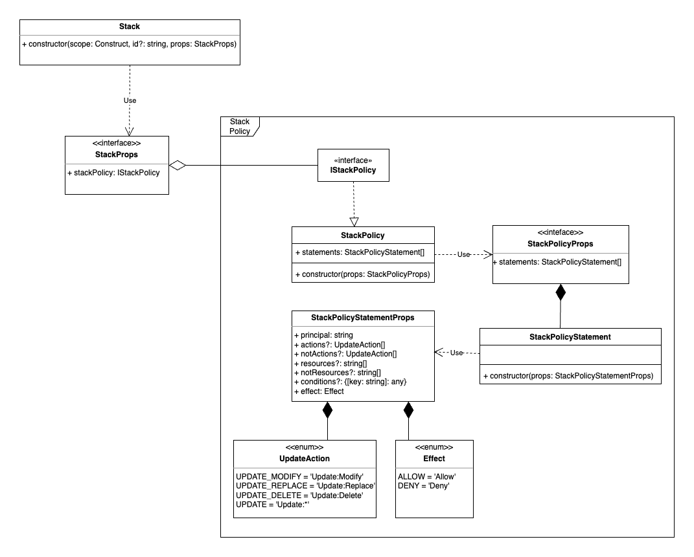

# 1Pager | Stack Policy

This one pager is a concise document designed to introduce the concept of integrating
support for **Stack Policies** within the core framework.
Its objective is to initiate an preliminary dialogue and collect
feedback before potentially advancing into a comprehensive Request for Comments (RFC).

## Context

### Update behaviors of stack resources

When you submit an update, AWS CloudFormation updates resources based on differences
between what you submit and the stack's current template. Resources that haven't changed run without disruption during the update process.
For updated resources, AWS CloudFormation uses one of the following update behaviors:

* *No interruption*: resource is updated without interruption and without changing its physical ID.
* *Some interruption*: resource is updated with some interruption.
* *Replacement*: resource is recreated during the update, and a new physical ID is generated.

The method AWS CloudFormation uses depends on which property you update for a given resource type.
Check *Update requires* field of a property to determine which method is used.

Furthermore, AWS Cloudformation supply
[UpdateReplacePolicy](https://docs.aws.amazon.com/AWSCloudFormation/latest/UserGuide/aws-attribute-updatereplacepolicy.html) attribute to retain or,
in some cases, backup the existing physical instance of a resource when it's replaced during
a stack update operation.

### Stack Policy

When you create a stack, all update actions are allowed on all resources. By default, anyone with stack update permissions
can update all of the resources in the stack. As detailed in the previous section, during an update,
some resources might require an interruption or be completely replaced, resulting in new physical IDs.
You can prevent stack resources from being unintentionally updated or deleted during a stack update
by using a stack policy. A stack policy is a JSON document that defines the update actions that can be performed on designated resources.

After you set a stack policy, all of the resources in the stack are protected by default.
You can define only one stack policy per stack, but, you can protect multiple resources within a single policy.

A stack policy applies only during stack updates. It is intended to only be used as a fail-safe mechanism
to prevent accidental updates to specific stack resources.

#### Example stack policy

The following example stack policy prevents updates to the `ProductionDatabase` resource:

```json
{
  "Statement" : [
    {
      "Effect" : "Allow",
      "Action" : "Update:*",
      "Principal": "*",
      "Resource" : "*"
    },
    {
      "Effect" : "Deny",
      "Action" : "Update:*",
      "Principal": "*",
      "Resource" : "LogicalResourceId/ProductionDatabase"
    }
  ]
}
```

Check the official
[AWS Documentation](https://docs.aws.amazon.com/AWSCloudFormation/latest/UserGuide/protect-stack-resources.html#stack-policy-samples)
for more example stack policies.

## Customer pain

Currently CDK does not offer a way to specify stack policies directly through the `Stack` construct.
Customers who are willing to leverage stack policy feature are forced to manually set a stack policy after the stack creation completion.

AWS Cloudformation offers two ways of setting a stack policy:

### AWS Console (new stack only)

In the **Create Stack** wizard, on the **Configure** stack options page, expand the **Advanced** section and then choose **Stack policy**.
Specify the stack policy:

* To write a policy directly in the console, choose **Enter** stack policy and then type the stack policy directly in the text field.
* To use a policy defined in a separate file, choose **Upload a file**, then **Choose file** to select the file containing the stack policy.

### AWS CLI

* **New stack**: use the [aws cloudformation create-stack](https://docs.aws.amazon.com/cli/latest/reference/cloudformation/create-stack.html)
command with the `--stack-policy-body` option to type in a modified policy or the `--stack-policy-url`
option to specify a file containing the policy.

* **Existing stack**: use the
[aws cloudformation set-stack-policy](https://awscli.amazonaws.com/v2/documentation/api/latest/reference/cloudformation/set-stack-policy.html)
command with the `--stack-policy-body` option to type in a modified
policy or the `--stack-policy-url` option to specify a file containing the policy.

In the context of a CDK application lifecycle, CDK is taking care of creating the desired Cloudformation stacks. For this reason,
users do not have a way to specify a stack policy upfront, and must wait for the stack creation to be completed before
invoking the `aws cloudformation set-stack-policy` through the AWS CLI.

This manual process is time-consuming and error-prone: it involves one separate call per stack, even if the stack policy is the same
for all the stacks deployed. Furthermore, the overall user experience is cumbersome, since the user needs to switch back and forth
from CDK CLI to AWS CLI commands.

Finally, if a stack policy is set on a stack deployed with CDK, and a subsquent update to a protected resource is required,
the user will be notified of the error only at deployment time, when the Cloudformation SDK is invoked.

### Updating protected resources

Once a stack policy has been defined on a set of resources, those resources cannot be updated.
Cloudormation offers a way to cirumvent the stack policy protection by allowing to specify a temporary policy that overrides
the stack policy and allows updates on those resources. This meachanism is particularly useful in case a one-time update
to a protected resources is required, e.g. deploying a hot fix to a resource in production.

Temporary override policies can be specified in this way:

* Via Console, following the same steps outlined above for creating a stack
* Via AWS CLI, leveraging `aws cloudformation update-stack` command with the `--stack-policy-during-update-body`
option to type in a modified policy or the `--stack-policy-during-update-url` option to specify a file containing the policy

As outlined before, currently CDK users need to manually set a stack policy via console or via CLI upon cluster creation.
In case an update to a protected resource is needed, the following manual steps are required:

1. Modify the stack policy to allow the protected resource to be updated
1. Trigger an update of the stack via `cdk deploy`
1. Restore the original stack policy

## Desired Customer Experience

We want to free our customers of the burden to perform actions outside the CDK application lifecycle,
i.e. invoking the AWS CLI after that the stack has been successfully created.

The process outlines as follows:

1. The user creates a new stack policy through the new `StackPolicy` class
1. The stack policy is passed to the new `policy` field of the `StackProps` object
1. User run `cdk deploy`
1. CDK takes care of generating the JSON for the created policy and pass it to Cloudformation

Here below you can find an example of a definition of  `MyStack` stack

```javascript
import * as cdk from 'aws-cdk-lib';
import { MyStack } from '../lib/my-stack';

const app = new cdk.App();
const stackPolicy = new cdk.StackPolicy({..})

new MyStack(app, 'MyStack', {policy: stackPolicy});
```

See the next section for a in-depth explanation of proposed designed and implementation details.

## High Level Design

Both `CreateStack` and `UpdateStack` Cloudformation APIs offer two ways to specify a stack policy, which are mutually exclusive:

* `StackPolicyBody - (String)`: structure containing the stack policy body
* `StackPolicyURL — (String)`: location of a file containing the stack policy. The URL must point to a policy
(maximum size: 16 KB) located in an S3 bucket in the same Region as the stack

For the time being we will focus on the former only, which implies to object modeling the stack policy concept
and generate a JSON policy object at synthesis time. The stack policy URL implementation is more trivial,
since it involves to pass a URL string referencing an S3 bucket to be used at deployment time.

In order to allow users to define a stack policy, the `Stack` class needs to be enhanced.
In particular, `StackProps` interface can be extended as follows:

```javascript
export interface StackProps {
  ...
  
  /**
   * A stack policy associated with the stack.
   *
   * @default - No stack policy.
   */
  readonly stackPolicy?: IStackPolicy;

  ...
}
```

We can take inspiration from the [iam.Policy](https://github.com/aws/aws-cdk/blob/main/packages/aws-cdk-lib/aws-iam/lib/policy.ts)
class to structure our classes and interfaces, taking into account the following considerations:

* `Principal` can only be `'*'`. According to Cloudformation documentation, `Principal` element is required,
but supports only the wild card (*), which means that the statement applies to all principals.
* `Action` can be one of the following:
  * `Update:Modify`: specifies update actions during which resources might
  experience no interruptions or some interruptions while changes are being applied. All resources maintain their physical IDs.
  * `Update:Replace`: specifies update actions during which
  resources are recreated. AWS CloudFormation creates a new resource with the specified updates
  and then deletes the old resource. Because the resource is recreated, the physical ID of the new resource might be different.
  * `Update:Delete`: specifies update actions during which resources are removed. Updates that completely remove
  resources from a stack template require this action.
  * `Update:*`: specifies all update actions.

Here follows a class diagram of the stack policy concept.



The **StackPolicy** class represents a stack policy, and has a collection of `StackPolicyStatement`.
A `StackPolicyStatement` is basically a subset of a `iam.PolicyStatement`.

### Synthesis

The synthesizer is in charge of parsing the associated stack policy (if present) and generate
a corresponding JSON `policyFile` which is referenced in the `manifest.json` file as follows:

#### manifest.json

```json
"MyStack": {
  "type": "aws:cloudformation:stack",
  "environment": "aws://012345679/us-west-2",
  "properties": {
    "templateFile": "MyStack.template.json",
    "policyFile": "MyStack.policy.json",
  ...
  }
  ...
}
```

### Deployment

At deployment time, the stack policy JSON is read from the output folder, leveraging the `policyFile` field
specified in the manifest, and passed to the Cloudformation API as follows:

#### deploy-stack.ts

```typescript
      await this.cfn.createStack({
        StackName: this.stackName,
        ...this.stackArtifact.stackPolicy ? { StackPolicyBody: this.stackArtifact.stackPolicy } : undefined,
        ...
      }).promise();
```

## Proof of concept

This one pager comes with a [proof of concept](https://github.com/aws/aws-cdk/pull/25672) which is meant
to be used as a source of inspiration for the future implementation of stack policy support in CDK.
The implementation focused on having a working prototype to cover the whole user experience, starting from the definition
of a stack policy at stack creation, to the synthesis and then deployment of the stack itself.

In particular, the following have been implemented:

* Definition of `StackPolicy` and `StackPolicyStatement` classes, as per class diagram above
* Enhanced synthesizer to generate a stack policy JSON file and reference it in the manifest
* Unit tests for `stack.ts` class to verify that, if a stack policy is provided, manifest is generated as expected
* Integ tests to close the loop and verify that the policy is attached to the stack at deployment time

Due to time constraints, the following aspects have been left out from the proof of concept:

* Unit tests for `StackPolicy` and `StackPolicyStatement` classes
* Validation and helper methods for `StackPolicy` and `StackPolicyStatement` classes
* Possibility to define the stack policy specifying a S3 url (`StackPolicyURL` parameter)

## Q&A

### Stack policies cannot be removed - what happens if the policy is removed and the stack is updated?

After you apply a stack policy, you can't remove it from the stack, but you can modify it.

First of all, we should warn the user that stack policy has been removed:

```
This deployment will make potentially sensitive changes due to the fac that the associated stack policy has been removed.
Please confirm you intend to make the following modifications:
...
...
Do you wish to deploy these changes (y/n)?
```

Then we should explicitly state that the following policy will be applied, which removes protection from all resources:

```json
{
  "Statement" : [
    {
      "Effect" : "Allow",
      "Action" : "Update:*",
      "Principal": "*",
      "Resource" : "*"
    }
  ]
}
```

### What about 'Principal'? The element is required but supports wildcard only

We have two options here:

1. Make it configurable, providing wildcard (*) as default value
1. Make it constant, not allowing the user to modify it. Following L2 constructs rationale from official documentation:
   > they offer convenient defaults and reduce the need to know all the details about the AWS resources they represent

### What if stack is deployed through changesets?

Currently the [executeChangeset](https://awscli.amazonaws.com/v2/documentation/api/latest/reference/cloudformation/execute-change-set.html)
api does offer a way to specify a stack policy body or a URL.

In this case we should add another call to CloudFormation api upon cluster creation,
invoking the [set-stack-policy](https://awscli.amazonaws.com/v2/documentation/api/latest/reference/cloudformation/set-stack-policy.html) api.
